# Diagramas Mermaid

## 1. Arquitetura geral

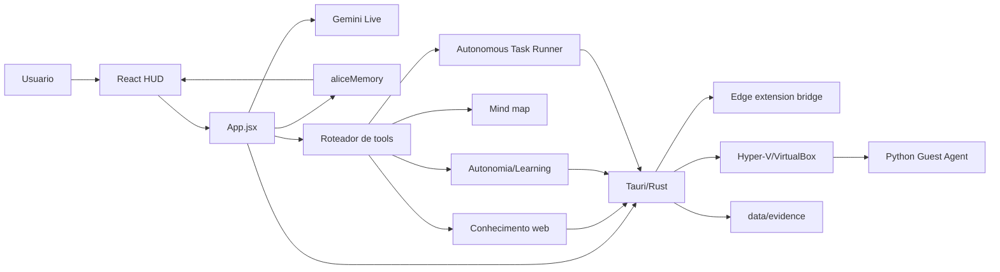

## 2. Inicializacao

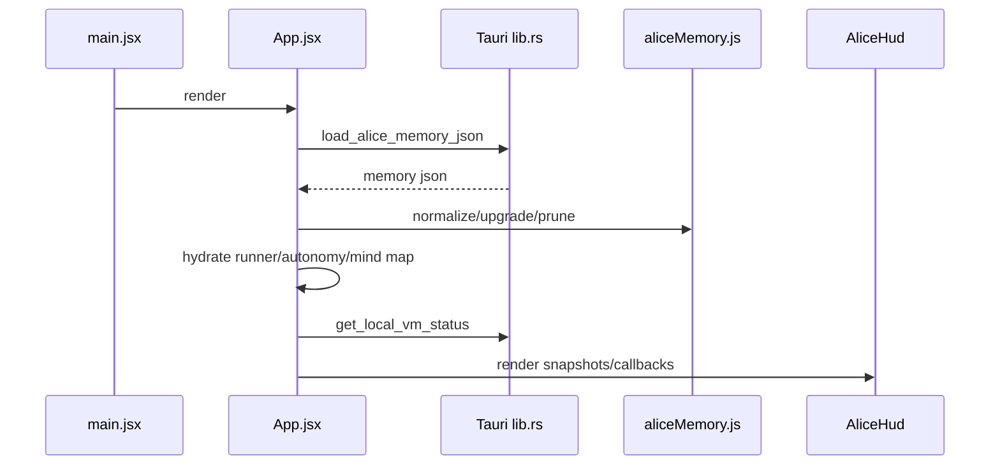

## 3. Conversa

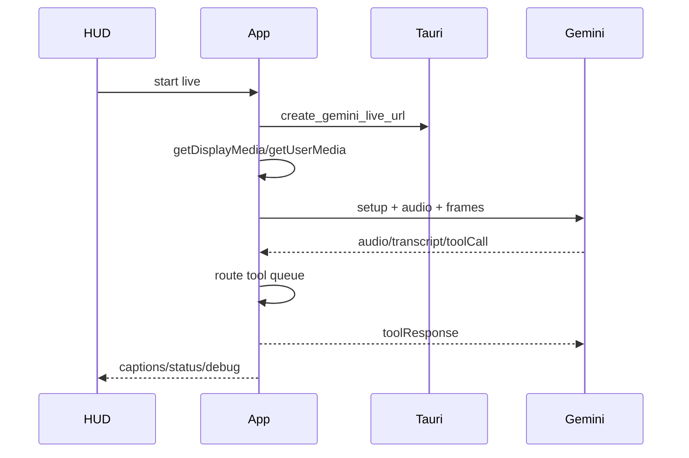

## 4. Tool call

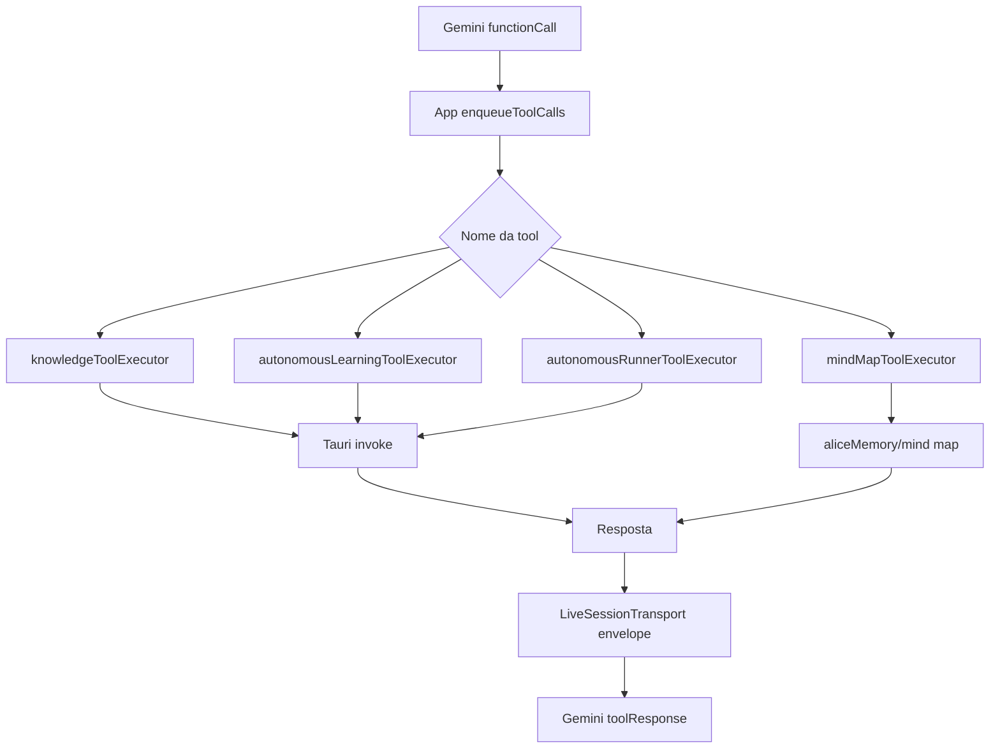

## 5. Autonomous Task Runner

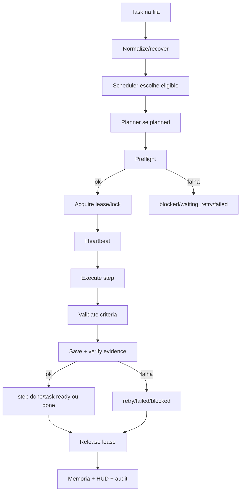

## 6. VM + guest agent

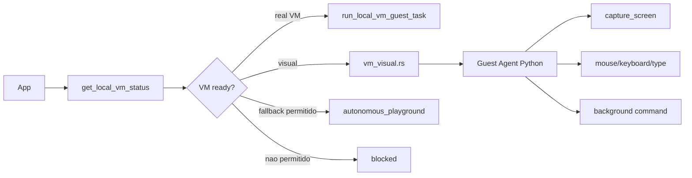

## 7. Evidencias

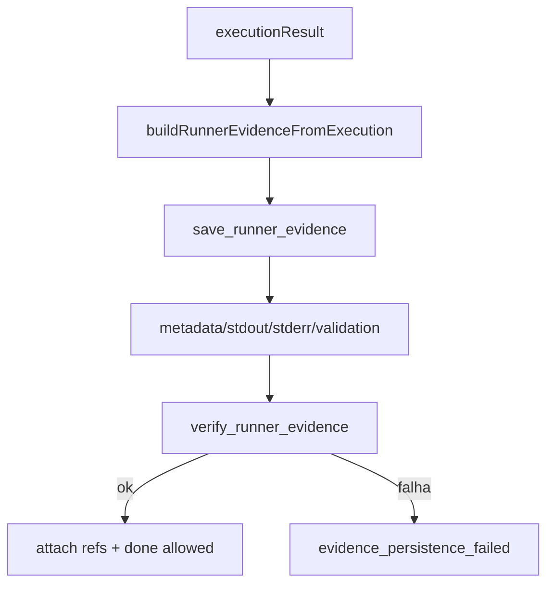

## 8. Memoria

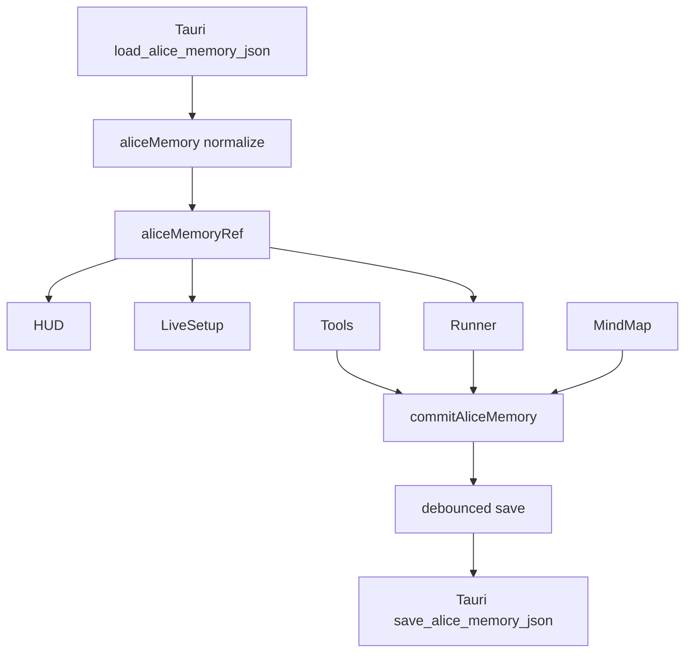

## 9. HUD

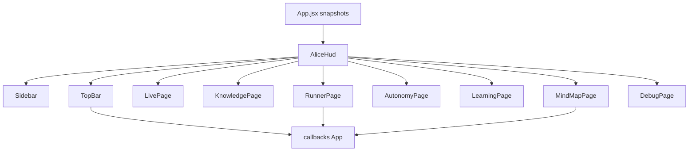

## 10. Mind map

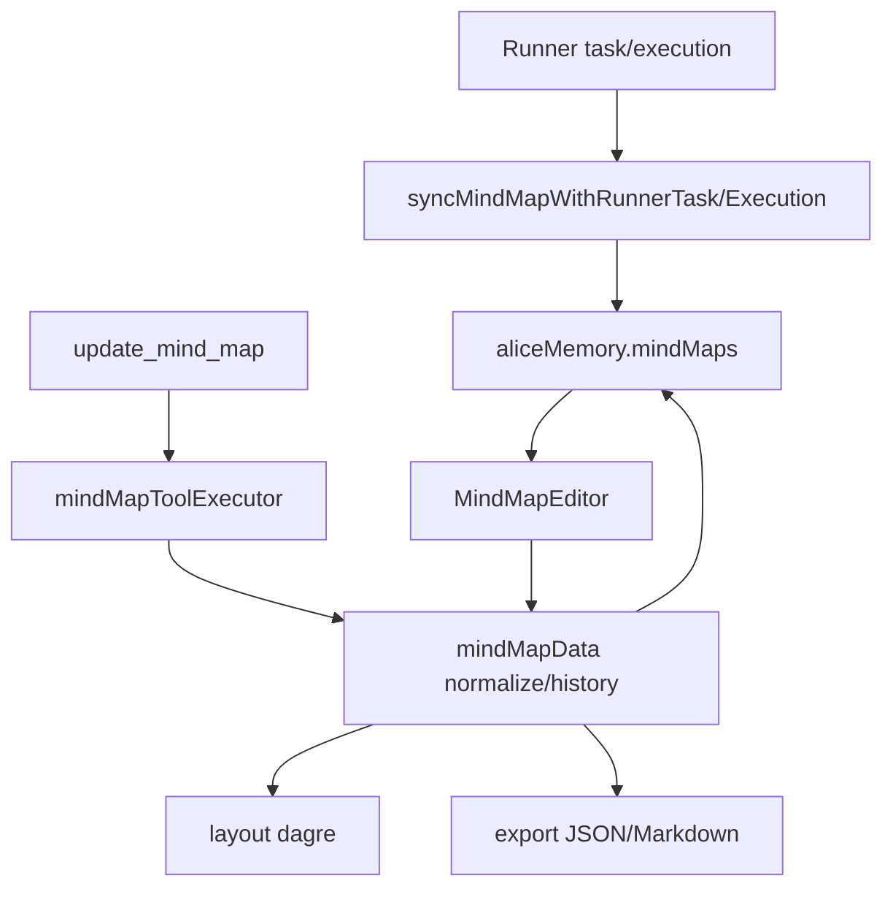

## 11. Frontend React x backend Tauri/Rust

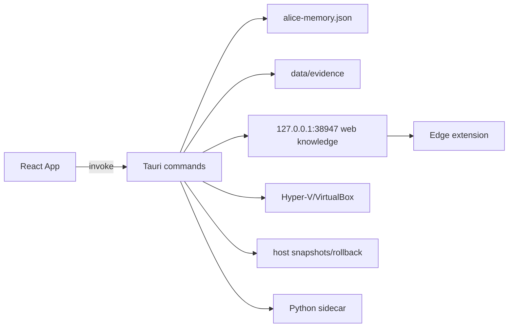

## 12. Dependencias criticas

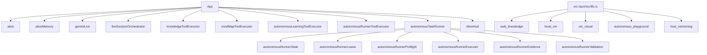
