# Mapa completo da Alice - documento unificado

Este arquivo consolida, em ordem, todos os documentos de `docs/alice-complete-map/`. Os arquivos separados foram preservados.

## Arquivos incorporados

- `00-indice.md`
- `01-visao-geral.md`
- `02-arvore-de-arquivos.md`
- `03-inventario-arquivo-por-arquivo.md`
- `03-inventario-arquivo-por-arquivo-parte-1.md`
- `03-inventario-arquivo-por-arquivo-parte-2.md`
- `03-inventario-arquivo-por-arquivo-parte-3.md`
- `04-modulos-por-dominio.md`
- `05-fluxos-principais.md`
- `06-diagramas.md`
- `07-memoria-e-estado.md`
- `08-autonomous-task-runner.md`
- `09-vm-guest-agent-e-evidencias.md`
- `10-hud-e-mind-map.md`
- `11-ferramentas-tool-executors.md`
- `12-backend-tauri-rust.md`
- `13-testes.md`
- `14-scripts-configuracao-build.md`
- `15-riscos-acoplamentos-e-pontos-fracos.md`
- `16-checklist-de-entendimento.md`

---

<!-- Arquivo de origem: 00-indice.md -->

# Mapa completo da Alice - indice

            ## Objetivo

            Esta documentacao mapeia o projeto Alice em `c:/projetos/alice-virtual`: modulos, arquivos, fluxos, responsabilidades, dependencias internas, integracoes, testes, scripts, configuracoes, riscos e pontos frageis. A analise e baseada em leitura estatica dos arquivos do projeto; quando uma conclusao depende de inferencia, isso e indicado como inferencia.

            ## Documentos criados

            1. `00-indice.md`: objetivo, escopo, ordem de leitura e dominios.
            2. `01-visao-geral.md`: arquitetura geral e resumo critico.
            3. `02-arvore-de-arquivos.md`: arvore, pastas, exclusoes e organizacao.
            4. `03-inventario-arquivo-por-arquivo.md`: indice do inventario e links para partes.
            5. `03-inventario-arquivo-por-arquivo-parte-1.md`: inventario detalhado, parte 1.
            6. `03-inventario-arquivo-por-arquivo-parte-2.md`: inventario detalhado, parte 2.
            7. `03-inventario-arquivo-por-arquivo-parte-3.md`: inventario detalhado, parte 3.
            8. `04-modulos-por-dominio.md`: dominios funcionais e arquivos.
            9. `05-fluxos-principais.md`: fluxos A-J da Alice.
            10. `06-diagramas.md`: diagramas Mermaid.
            11. `07-memoria-e-estado.md`: memoria, schema, persistencia e riscos.
            12. `08-autonomous-task-runner.md`: fila, lease, heartbeat, evidencia e recovery.
            13. `09-vm-guest-agent-e-evidencias.md`: VM, fallback, guest agent e evidencia fisica.
            14. `10-hud-e-mind-map.md`: HUD e mind map.
            15. `11-ferramentas-tool-executors.md`: tools, roteamento e executores.
            16. `12-backend-tauri-rust.md`: backend nativo e comandos Tauri.
            17. `13-testes.md`: mapa de testes e lacunas.
            18. `14-scripts-configuracao-build.md`: scripts, configs, env vars e comandos.
            19. `15-riscos-acoplamentos-e-pontos-fracos.md`: acoplamentos, legado e pontos perigosos.
            20. `16-checklist-de-entendimento.md`: checklist antes de alterar o projeto.

            ## Ordem recomendada de leitura

            Comece por `01-visao-geral.md`, depois `05-fluxos-principais.md` e `06-diagramas.md`. Em seguida leia `04-modulos-por-dominio.md`. Para trabalho em codigo, consulte o inventario `03-*` e o documento especifico do dominio. Antes de mexer em producao, leia `15-riscos-acoplamentos-e-pontos-fracos.md` e `16-checklist-de-entendimento.md`.

            ## Escopo e exclusoes

            Foram analisados 236 arquivos textuais relevantes. Foram ignorados:

            - `.git/`: metadados Git, nao faz parte da arquitetura executavel.
- `node_modules/`: dependencias instaladas, geradas por `npm install`.
- `dist/`, `build/`, `target/`: saidas de build Vite/Tauri/Rust.
- `data/`: estado real/runtime, memoria e evidencias; ignorado para nao tocar em memoria/evidencia real.
- `.harness-smoke/`: artefatos grandes de smoke/harness.
- `src-tauri/gen/`: schemas gerados pelo Tauri.
- `__pycache__/`, `*.pyc`: caches Python.
- `*.log`, `*.out`, `*.err`: saidas de execucao/log.
- imagens e binarios (`*.png`, `*.ico`, `*.icns`): assets binarios listados como ignorados, nao analisados linha a linha.

            ## Dominios principais

            - Aprendizado/autonomia: 46 arquivo(s).
- Autonomous Task Runner: 13 arquivo(s).
- Backend Tauri/Rust: 10 arquivo(s).
- Configuracao/build: 15 arquivo(s).
- Conhecimento web: 3 arquivo(s).
- Core Rust auxiliar: 1 arquivo(s).
- Documentacao: 7 arquivo(s).
- Filesystem/sanitizacao: 1 arquivo(s).
- Frontend/orquestracao: 14 arquivo(s).
- Gemini Live/audio/tela: 9 arquivo(s).
- Guest agent: 11 arquivo(s).
- HUD: 14 arquivo(s).
- Harness/dev: 3 arquivo(s).
- Learning planner: 12 arquivo(s).
- Memoria persistente: 2 arquivo(s).
- Mind map: 11 arquivo(s).
- Navegador/bridge/extensao: 3 arquivo(s).
- Outro: 1 arquivo(s).
- Scripts/dev: 3 arquivo(s).
- Sidecar Python host: 2 arquivo(s).
- Testes: 55 arquivo(s).

            ## Avisos importantes

            - Nenhum Runner real, VM, guest agent, sidecar real ou automacao de ambiente foi executado.
            - A pasta `data/` nao foi lida de proposito, porque pode conter memoria/evidencias reais.
            - Dependentes sao inferidos principalmente por imports ESM locais; chamadas Tauri por string aparecem nos fluxos e no backend, mas nem sempre como import estatico.
            - `src/App.jsx`, `src/aliceMemory.js`, `src/autonomousTaskRunner.js`, `src/autonomousRunnerState.js` e `src-tauri/src/lib.rs` sao centros criticos e devem ser lidos diretamente antes de qualquer mudanca.

---

<!-- Arquivo de origem: 01-visao-geral.md -->

# Visao geral

## Tipo de aplicacao

Alice Virtual e uma aplicacao desktop Tauri com frontend React/Vite. O frontend roda a experiencia da Alice, HUD, Gemini Live, memoria e orquestracao de ferramentas. O backend Rust/Tauri fornece a fronteira nativa: chave Gemini via ambiente, persistencia da memoria, evidencias fisicas, VM/local workspace, sidecars, bridge web e comandos permitidos.

## Tecnologias usadas

- React 19, React DOM, JSX e CSS proprio para UI/HUD.
- Vite 8 para dev/build e Vitest para testes JS/React.
- Tauri 2 e Rust para runtime desktop, comandos nativos, filesystem, HTTP local e integracao Windows.
- Gemini Live via WebSocket para conversa multimodal com audio e tela.
- `@xyflow/react`, `dagre` e `html-to-image` para mind map.
- Python para sidecar de janela no host e Guest Interaction Agent dentro da VM.
- Extensao Edge para coletar DOM/navegacao e alimentar conhecimento web.

## Arquitetura geral

`src/main.jsx` monta `src/App.jsx`. `App.jsx` e o orquestrador central: hidrata memoria, controla tela/microfone, cria a sessao Gemini Live, recebe tool calls, roteia para executores, agenda o Autonomous Task Runner, roda learning loop e renderiza `AliceHud`. O backend Tauri em `src-tauri/src/lib.rs` registra comandos para memoria, Gemini URL, evidencias, VM, guest agent, workspace fallback, snapshots e conhecimento web.

## Papel do frontend React

O frontend mantem estado operacional em refs/states, apresenta o HUD, serializa tool calls e decide qual executor JS deve tratar cada chamada. Ele tambem prepara contexto para a Gemini: memoria, rehidratacao, contexto operacional, audio e frames de tela.

## Papel do backend Tauri/Rust

O backend e a fronteira de confianca para operacoes sensiveis. Ele valida caminhos, comandos, timeouts, memoria, evidencias, VM, bridge web e sidecars. A chave Gemini fica no ambiente do processo Tauri e nao no frontend.

## Papel do HUD

O HUD e a interface operacional. Ele mostra Live, conhecimento, mind map, autonomia, aprendizado, Runner e debug. Importante: o HUD nao e a fonte de verdade; ele recebe snapshots de `App.jsx` e dispara callbacks.

## Papel da memoria persistente

`src/aliceMemory.js` define o schema persistente: fatos, contexto recente, mind maps, auditoria autonoma, Runner, aprendizado, procedures e planner. O Tauri salva fisicamente em `alice-memory.json` com escrita atomica e limite de tamanho.

## Papel do Gemini Live, audio e tela

`src/alice.js` define modelo, persona e ferramentas. `geminiLive`, `liveSessionOrchestrator`, `liveSessionTransport`, `liveAudio`, `screenGeometry` e `screenFrameStreaming` formam o canal multimodal. Audio entra como PCM16 base64; tela entra como frames JPEG; respostas retornam como audio/transcricao/tool calls.

## Papel da VM e guest agent

A VM real pode ser Hyper-V ou VirtualBox, configurada por variaveis de ambiente. `local_vm.rs` diagnostica e roda comandos guest. `vm_visual.rs` instala/aciona o guest agent Python para captura de tela, mouse, teclado, texto e comandos em background. Fallback local existe, mas e explicitamente workspace local, nao VM real.

## Papel do Autonomous Task Runner

O Runner executa tarefas longas/multistep com fila, preflight, lease, lock, heartbeat, executor, validacao, evidencia fisica, retry, recovery e HUD. Ele tenta impedir falso sucesso exigindo validacao e evidencia persistida antes de marcar `done`.

## Papel das evidencias

Evidencias do Runner sao arquivos fisicos salvos pelo Tauri: `metadata.json`, `stdout.txt`, `stderr.txt`, `validation.json`. Refs logicas so contam como prova quando `verify_runner_evidence` confirma existencia fisica.

## Papel do mind map

O mind map e uma visualizacao persistente de raciocinio, planos e execucao. Ele pode ser editado pelo HUD ou por tool call `update_mind_map`, e pode sincronizar status com Runner/execucoes.

## Papel das ferramentas/tool executors

Ferramentas sao declaradas em `src/alice.js`. `App.jsx` roteia tool calls para `knowledgeToolExecutor`, `mindMapToolExecutor`, `autonomousLearningToolExecutor` ou `autonomousRunnerToolExecutor`. Os executores atualizam memoria/estado ou chamam Tauri quando cruzam fronteira nativa.

## Resumo critico da arquitetura

Bem estruturado: ha separacao clara de varios dominios em modulos testaveis; o Runner tem invariantes fortes; o backend Rust valida operacoes perigosas; ha muitos testes unitarios; evidencia fisica e checada antes de sucesso.

Acoplado: `src/App.jsx` concentra Live, memoria, tools, Runner, learning loop, timers e HUD. `src/autonomousLearningToolExecutor.js` tambem concentra muitas responsabilidades. `src-tauri/src/lib.rs` e grande e mistura comandos centrais, memoria, validacoes e partes legadas.

Fragil: tool calls dependem de nomes string e schemas sincronizados manualmente; VM/guest dependem de ambiente externo; bridge Edge pode entregar snapshot stale; memoria cresce com logs/audits/plans; HUD pode exibir snapshot defasado se estado derivado nao for atualizado.

Critico: antes de qualquer refatoracao, entender `App.jsx`, `aliceMemory.js`, `alice.js`, `autonomousRunnerState.js`, `autonomousTaskRunner.js`, `autonomousLearningToolExecutor.js`, `src-tauri/src/lib.rs`, `local_vm.rs`, `vm_visual.rs` e `web_knowledge.rs`.

---

<!-- Arquivo de origem: 02-arvore-de-arquivos.md -->

# Arvore de arquivos

            ## Arvore relevante

            ```text
            Pastas principais:
- alice-core/
- docs/
- edge-extension/
- public/
- scripts/
- src/
- src-tauri/

Arquivos analisados:
- .gitignore
- AGENTS.MD
- README.md
- alice-core/.gitignore
- alice-core/Cargo.lock
- alice-core/Cargo.toml
- alice-core/src/lib.rs
- docs/autonomous-runner-dev-harness.md
- docs/autonomous-runner-hardening-checklist.md
- docs/handoff-2026-05-01-learning.md
- docs/learning-planner-implementation-map.md
- edge-extension/background.js
- edge-extension/captureEvents.js
- edge-extension/captureEvents.test.js
- edge-extension/manifest.json
- erros.md
- eslint.config.js
- index.html
- package-lock.json
- package.json
- public/favicon.svg
- scripts/alice-code-auditor.mjs
- scripts/alice-code-auditor.test.mjs
- scripts/learning-planner-harness.mjs
- scripts/runner-harness.mjs
- src-tauri/.gitignore
- src-tauri/Cargo.lock
- src-tauri/Cargo.toml
- src-tauri/build.rs
- src-tauri/capabilities/default.json
- src-tauri/python_sidecar/alice_window_sidecar.py
- src-tauri/python_sidecar/main.py
- src-tauri/python_sidecar/tests/test_sidecar.py
- src-tauri/src/autonomous_playground.rs
- src-tauri/src/host_versioning.rs
- src-tauri/src/legacy_desktop_commands.rs
- src-tauri/src/lib.rs
- src-tauri/src/local_vm.rs
- src-tauri/src/main.rs
- src-tauri/src/python_sidecar.rs
- src-tauri/src/vm_visual.rs
- src-tauri/src/web_knowledge.rs
- src-tauri/tauri.conf.json
- src-tauri/tests/fixtures/web_knowledge/long_article.html
- src-tauri/tests/fixtures/web_knowledge/noisy_navigation_links.html
- src-tauri/tests/fixtures/web_knowledge/selected_text_page.html
- src-tauri/tests/fixtures/web_knowledge/tables_and_lists.html
- src-tauri/tests/fixtures/web_knowledge/technical_docs.html
- src-tauri/tests/fixtures/web_knowledge/thin_landing_page.html
- src-tauri/vm/guest_agent/action_executor.py
- src-tauri/vm/guest_agent/agent.py
- src-tauri/vm/guest_agent/background_runner.py
- src-tauri/vm/guest_agent/element_recognition.py
- src-tauri/vm/guest_agent/input_controller.py
- src-tauri/vm/guest_agent/ocr.py
- src-tauri/vm/guest_agent/protocol.py
- src-tauri/vm/guest_agent/screen_capture.py
- src-tauri/vm/guest_agent/server.py
- src-tauri/vm/guest_agent/tests/test_background_actions.py
- src-tauri/vm/guest_agent/tests/test_input_controller.py
- src-tauri/vm/guest_agent/tests/test_resident_server.py
- src-tauri/vm/guest_agent/validation.py
- src-tauri/vm/guest_agent/visual_context.py
- src/App.css
- src/App.jsx
- src/App.test.js
- src/alice.js
- src/alice.test.js
- src/aliceMemory.js
- src/aliceMemory.test.js
- src/aliceMemoryPersistence.js
- src/aliceMemoryPersistence.test.js
- src/appUiState.js
- src/autonomousCapabilityScanner.js
- src/autonomousContextRepair.test.js
- src/autonomousExperimentStrategies.js
- src/autonomousFailureSignatureBuilder.js
- src/autonomousFailureSignatureBuilder.test.js
- src/autonomousLearning.test.js
- src/autonomousLearning/actionOrchestrator.js
- src/autonomousLearning/appAutomation.js
- src/autonomousLearning/auditPersistence.js
- src/autonomousLearning/behaviorContext.js
- src/autonomousLearning/behaviorContext.test.js
- src/autonomousLearning/centralOrchestrator.js
- src/autonomousLearning/contracts.js
- src/autonomousLearning/decisionEngine.js
- src/autonomousLearning/decisionEngine.test.js
- src/autonomousLearning/hooks.js
- src/autonomousLearning/index.js
- src/autonomousLearning/internalState.js
- src/autonomousLearning/learning.js
- src/autonomousLearning/localVmProviders.js
- src/autonomousLearning/localWorkspacePlayground.js
- src/autonomousLearning/policies.js
- src/autonomousLearning/projectScanner.js
- src/autonomousLearning/replayRecorder.js
- src/autonomousLearning/research.js
- src/autonomousLearning/selfImprovement.js
- src/autonomousLearning/state.js
- src/autonomousLearning/taskOrchestrator.js
- src/autonomousLearning/turnContext.js
- src/autonomousLearning/validation.js
- src/autonomousLearning/versioning.js
- src/autonomousLearning/visualLoop.js
- src/autonomousLearning/vmController.js
- src/autonomousLearning/vmOperationalTask.js
- src/autonomousLearning/vmTextInputDriver.js
- src/autonomousLearning/vmTextInputDriver.test.js
- src/autonomousLearning/vmUiModels.js
- src/autonomousLearningGoals.js
- src/autonomousLearningLoop.js
- src/autonomousLearningLoop.test.js
- src/autonomousLearningPlanner.js
- src/autonomousLearningPolicy.js
- src/autonomousLearningToolExecutor.js
- src/autonomousLearningValidator.js
- src/autonomousObservedLearning.js
- src/autonomousObservedLearning.test.js
- src/autonomousProcedureBenchmark.js
- src/autonomousProcedureComposer.js
- src/autonomousProcedureMatcher.js
- src/autonomousProcedureOptimizer.js
- src/autonomousProcedureOptimizer.test.js
- src/autonomousProcedurePromoter.js
- src/autonomousProcedureReuseEngine.js
- src/autonomousProcedureSimplifier.js
- src/autonomousProcedureVariantPlanner.js
- src/autonomousProcedureVersioning.js
- src/autonomousReuseIndex.js
- src/autonomousReusePolicy.js
- src/autonomousReuseValidator.js
- src/autonomousRunner.test.js
- src/autonomousRunnerEvidence.js
- src/autonomousRunnerExecutor.js
- src/autonomousRunnerLease.js
- src/autonomousRunnerMindMap.js
- src/autonomousRunnerPlanner.js
- src/autonomousRunnerPreflight.js
- src/autonomousRunnerRecoveryPlanner.js
- src/autonomousRunnerScheduler.js
- src/autonomousRunnerState.js
- src/autonomousRunnerTextInputDiagnostics.js
- src/autonomousRunnerToolExecutor.js
- src/autonomousRunnerValidation.js
- src/autonomousScriptSynthesizer.js
- src/autonomousTaskContext.js
- src/autonomousTaskRunner.js
- src/debugHud.js
- src/debugHud.test.js
- src/dev/autonomousRunnerHarness.js
- src/dev/autonomousRunnerHarness.test.js
- src/dev/learningPlannerHarness.js
- src/dev/learningPlannerHarness.test.js
- src/dev/runtimeHarnessBridge.js
- src/dev/runtimeHarnessBridge.test.js
- src/filesystem/filesystemNameSanitizer.js
- src/filesystem/filesystemNameSanitizer.test.js
- src/geminiLive.js
- src/geminiLive.test.js
- src/hud/AliceHud.jsx
- src/hud/AliceHud.test.jsx
- src/hud/components/DefinitionList.jsx
- src/hud/components/HudIcon.jsx
- src/hud/components/Sidebar.jsx
- src/hud/components/TopBar.jsx
- src/hud/hudViewModel.js
- src/hud/hudViewModel.test.js
- src/hud/mindMap/CustomNode.jsx
- src/hud/mindMap/CustomNode.test.jsx
- src/hud/mindMap/MindMapEditor.jsx
- src/hud/mindMap/utils/export.js
- src/hud/mindMap/utils/layout.js
- src/hud/mindMap/utils/mindMapData.js
- src/hud/mindMap/utils/storage.js
- src/hud/pages/AutonomousLearningHudPage.jsx
- src/hud/pages/AutonomousLearningHudPage.test.jsx
- src/hud/pages/AutonomousRunnerHudPage.jsx
- src/hud/pages/AutonomyHudPage.jsx
- src/hud/pages/DebugHudPage.jsx
- src/hud/pages/KnowledgeHudPage.jsx
- src/hud/pages/LiveHudPage.jsx
- src/hud/pages/MindMapHudPage.jsx
- src/hud/pages/learningPlannerHudViewModel.js
- src/hud/pages/runnerHudViewModel.js
- src/hud/pages/runnerHudViewModel.test.js
- src/index.css
- src/knowledgePipeline.js
- src/knowledgePipeline.test.js
- src/knowledgeToolExecutor.js
- src/knowledgeToolExecutor.test.js
- src/learningPlanner/fakeLearningPlannerModelClient.js
- src/learningPlanner/learningEvaluator.js
- src/learningPlanner/learningPlanSchema.js
- src/learningPlanner/learningPlanValidator.js
- src/learningPlanner/learningPlanner.test.js
- src/learningPlanner/learningPlannerClient.js
- src/learningPlanner/learningPlannerExecution.js
- src/learningPlanner/learningPlannerRepository.js
- src/learningPlanner/learningPlannerService.js
- src/learningPlanner/learningPlannerState.js
- src/learningPlanner/learningPlannerTypes.js
- src/learningPlanner/learningProcedureSynthesizer.js
- src/learningPlanner/learningTaskCompiler.js
- src/liveAudio.js
- src/liveAudio.test.js
- src/liveDiagnostics.js
- src/liveDiagnostics.test.js
- src/liveSessionOrchestrator.js
- src/liveSessionOrchestrator.test.js
- src/liveSessionRehydration.js
- src/liveSessionRehydration.test.js
- src/liveSessionTransport.js
- src/liveSessionTransport.test.js
- src/main.jsx
- src/mindMapData.test.js
- src/mindMapExecutionSync.js
- src/mindMapExecutionSync.test.js
- src/mindMapIntentInterpreter.js
- src/mindMapIntentInterpreter.test.js
- src/mindMapToolExecutor.js
- src/mindMapToolExecutor.test.js
- src/operationalContext.js
- src/operationalContext.test.js
- src/runnerAppDiagnostics.js
- src/runnerAppDiagnostics.test.js
- src/screenFrameStreaming.js
- src/screenFrameStreaming.test.js
- src/screenGeometry.js
- src/screenGeometry.test.js
- src/tauriRuntime.js
- src/tauriRuntime.test.js
- src/webKnowledge.js
- src/webKnowledge.test.js
- start-alice.ps1
- vite.config.js
            ```

            ## Pastas ignoradas e motivo

            - `.git/`: metadados Git, nao faz parte da arquitetura executavel.
- `node_modules/`: dependencias instaladas, geradas por `npm install`.
- `dist/`, `build/`, `target/`: saidas de build Vite/Tauri/Rust.
- `data/`: estado real/runtime, memoria e evidencias; ignorado para nao tocar em memoria/evidencia real.
- `.harness-smoke/`: artefatos grandes de smoke/harness.
- `src-tauri/gen/`: schemas gerados pelo Tauri.
- `__pycache__/`, `*.pyc`: caches Python.
- `*.log`, `*.out`, `*.err`: saidas de execucao/log.
- imagens e binarios (`*.png`, `*.ico`, `*.icns`): assets binarios listados como ignorados, nao analisados linha a linha.

            ## Responsabilidade das pastas principais

            - `src/`: frontend React e logica JS de dominio.
- `src/hud/`: HUD, paginas e componentes.
- `src/autonomousLearning/`: autonomia modular, politicas, VM, validacao, aprendizado e auditoria.
- `src/learningPlanner/`: planejamento estruturado de aprendizado e compilacao para Runner.
- `src/dev/`: harnesses e ponte dev runtime.
- `src/filesystem/`: sanitizacao de nomes/caminhos para tarefas.
- `src-tauri/src/`: backend Rust/Tauri.
- `src-tauri/vm/guest_agent/`: agente Python executado dentro da VM.
- `src-tauri/python_sidecar/`: sidecar Python do host para comandos de janela legados.
- `edge-extension/`: extensao Edge e bridge de captura de DOM.
- `scripts/`: auditor e harnesses CLI.
- `docs/`: documentacao tecnica.
- `alice-core/`: crate Rust auxiliar isolado.
- `public/`: assets textuais publicos analisaveis.

            ## Agrupamento por dominio

            ### Aprendizado/autonomia

- `src/autonomousLearning/actionOrchestrator.js`
- `src/autonomousLearning/appAutomation.js`
- `src/autonomousLearning/auditPersistence.js`
- `src/autonomousLearning/behaviorContext.js`
- `src/autonomousLearning/centralOrchestrator.js`
- `src/autonomousLearning/contracts.js`
- `src/autonomousLearning/decisionEngine.js`
- `src/autonomousLearning/hooks.js`
- `src/autonomousLearning/index.js`
- `src/autonomousLearning/internalState.js`
- `src/autonomousLearning/learning.js`
- `src/autonomousLearning/localVmProviders.js`
- `src/autonomousLearning/localWorkspacePlayground.js`
- `src/autonomousLearning/policies.js`
- `src/autonomousLearning/projectScanner.js`
- `src/autonomousLearning/replayRecorder.js`
- `src/autonomousLearning/research.js`
- `src/autonomousLearning/selfImprovement.js`
- `src/autonomousLearning/state.js`
- `src/autonomousLearning/taskOrchestrator.js`
- `src/autonomousLearning/turnContext.js`
- `src/autonomousLearning/validation.js`
- `src/autonomousLearning/versioning.js`
- `src/autonomousLearning/visualLoop.js`
- `src/autonomousLearning/vmController.js`
- `src/autonomousLearning/vmOperationalTask.js`
- `src/autonomousLearning/vmTextInputDriver.js`
- `src/autonomousLearning/vmUiModels.js`
- `src/autonomousLearningGoals.js`
- `src/autonomousLearningLoop.js`
- `src/autonomousLearningPlanner.js`
- `src/autonomousLearningPolicy.js`
- `src/autonomousLearningToolExecutor.js`
- `src/autonomousLearningValidator.js`
- `src/autonomousProcedureBenchmark.js`
- `src/autonomousProcedureComposer.js`
- `src/autonomousProcedureMatcher.js`
- `src/autonomousProcedureOptimizer.js`
- `src/autonomousProcedurePromoter.js`
- `src/autonomousProcedureReuseEngine.js`
- `src/autonomousProcedureSimplifier.js`
- `src/autonomousProcedureVariantPlanner.js`
- `src/autonomousProcedureVersioning.js`
- `src/autonomousReuseIndex.js`
- `src/autonomousReusePolicy.js`
- `src/autonomousReuseValidator.js`
### Autonomous Task Runner

- `src/autonomousRunnerEvidence.js`
- `src/autonomousRunnerExecutor.js`
- `src/autonomousRunnerLease.js`
- `src/autonomousRunnerPlanner.js`
- `src/autonomousRunnerPreflight.js`
- `src/autonomousRunnerRecoveryPlanner.js`
- `src/autonomousRunnerScheduler.js`
- `src/autonomousRunnerState.js`
- `src/autonomousRunnerTextInputDiagnostics.js`
- `src/autonomousRunnerToolExecutor.js`
- `src/autonomousRunnerValidation.js`
- `src/autonomousTaskRunner.js`
- `src/runnerAppDiagnostics.js`
### Backend Tauri/Rust

- `src-tauri/build.rs`
- `src-tauri/src/autonomous_playground.rs`
- `src-tauri/src/host_versioning.rs`
- `src-tauri/src/legacy_desktop_commands.rs`
- `src-tauri/src/lib.rs`
- `src-tauri/src/local_vm.rs`
- `src-tauri/src/main.rs`
- `src-tauri/src/python_sidecar.rs`
- `src-tauri/src/vm_visual.rs`
- `src-tauri/src/web_knowledge.rs`
### Configuracao/build

- `.gitignore`
- `alice-core/.gitignore`
- `alice-core/Cargo.lock`
- `alice-core/Cargo.toml`
- `eslint.config.js`
- `index.html`
- `package-lock.json`
- `package.json`
- `src-tauri/.gitignore`
- `src-tauri/Cargo.lock`
- `src-tauri/Cargo.toml`
- `src-tauri/capabilities/default.json`
- `src-tauri/tauri.conf.json`
- `start-alice.ps1`
- `vite.config.js`
### Conhecimento web

- `src/knowledgePipeline.js`
- `src/knowledgeToolExecutor.js`
- `src/webKnowledge.js`
### Core Rust auxiliar

- `alice-core/src/lib.rs`
### Documentacao

- `AGENTS.MD`
- `README.md`
- `docs/autonomous-runner-dev-harness.md`
- `docs/autonomous-runner-hardening-checklist.md`
- `docs/handoff-2026-05-01-learning.md`
- `docs/learning-planner-implementation-map.md`
- `erros.md`
### Filesystem/sanitizacao

- `src/filesystem/filesystemNameSanitizer.js`
### Frontend/orquestracao

- `src/App.css`
- `src/App.jsx`
- `src/alice.js`
- `src/appUiState.js`
- `src/autonomousCapabilityScanner.js`
- `src/autonomousExperimentStrategies.js`
- `src/autonomousFailureSignatureBuilder.js`
- `src/autonomousObservedLearning.js`
- `src/autonomousScriptSynthesizer.js`
- `src/autonomousTaskContext.js`
- `src/debugHud.js`
- `src/index.css`
- `src/main.jsx`
- `src/tauriRuntime.js`
### Gemini Live/audio/tela

- `src/geminiLive.js`
- `src/liveAudio.js`
- `src/liveDiagnostics.js`
- `src/liveSessionOrchestrator.js`
- `src/liveSessionRehydration.js`
- `src/liveSessionTransport.js`
- `src/operationalContext.js`
- `src/screenFrameStreaming.js`
- `src/screenGeometry.js`
### Guest agent

- `src-tauri/vm/guest_agent/action_executor.py`
- `src-tauri/vm/guest_agent/agent.py`
- `src-tauri/vm/guest_agent/background_runner.py`
- `src-tauri/vm/guest_agent/element_recognition.py`
- `src-tauri/vm/guest_agent/input_controller.py`
- `src-tauri/vm/guest_agent/ocr.py`
- `src-tauri/vm/guest_agent/protocol.py`
- `src-tauri/vm/guest_agent/screen_capture.py`
- `src-tauri/vm/guest_agent/server.py`
- `src-tauri/vm/guest_agent/validation.py`
- `src-tauri/vm/guest_agent/visual_context.py`
### HUD

- `src/hud/AliceHud.jsx`
- `src/hud/components/DefinitionList.jsx`
- `src/hud/components/HudIcon.jsx`
- `src/hud/components/Sidebar.jsx`
- `src/hud/components/TopBar.jsx`
- `src/hud/hudViewModel.js`
- `src/hud/pages/AutonomousLearningHudPage.jsx`
- `src/hud/pages/AutonomousRunnerHudPage.jsx`
- `src/hud/pages/AutonomyHudPage.jsx`
- `src/hud/pages/DebugHudPage.jsx`
- `src/hud/pages/KnowledgeHudPage.jsx`
- `src/hud/pages/LiveHudPage.jsx`
- `src/hud/pages/learningPlannerHudViewModel.js`
- `src/hud/pages/runnerHudViewModel.js`
### Harness/dev

- `src/dev/autonomousRunnerHarness.js`
- `src/dev/learningPlannerHarness.js`
- `src/dev/runtimeHarnessBridge.js`
### Learning planner

- `src/learningPlanner/fakeLearningPlannerModelClient.js`
- `src/learningPlanner/learningEvaluator.js`
- `src/learningPlanner/learningPlanSchema.js`
- `src/learningPlanner/learningPlanValidator.js`
- `src/learningPlanner/learningPlannerClient.js`
- `src/learningPlanner/learningPlannerExecution.js`
- `src/learningPlanner/learningPlannerRepository.js`
- `src/learningPlanner/learningPlannerService.js`
- `src/learningPlanner/learningPlannerState.js`
- `src/learningPlanner/learningPlannerTypes.js`
- `src/learningPlanner/learningProcedureSynthesizer.js`
- `src/learningPlanner/learningTaskCompiler.js`
### Memoria persistente

- `src/aliceMemory.js`
- `src/aliceMemoryPersistence.js`
### Mind map

- `src/autonomousRunnerMindMap.js`
- `src/hud/mindMap/CustomNode.jsx`
- `src/hud/mindMap/MindMapEditor.jsx`
- `src/hud/mindMap/utils/export.js`
- `src/hud/mindMap/utils/layout.js`
- `src/hud/mindMap/utils/mindMapData.js`
- `src/hud/mindMap/utils/storage.js`
- `src/hud/pages/MindMapHudPage.jsx`
- `src/mindMapExecutionSync.js`
- `src/mindMapIntentInterpreter.js`
- `src/mindMapToolExecutor.js`
### Navegador/bridge/extensao

- `edge-extension/background.js`
- `edge-extension/captureEvents.js`
- `edge-extension/manifest.json`
### Outro

- `public/favicon.svg`
### Scripts/dev

- `scripts/alice-code-auditor.mjs`
- `scripts/learning-planner-harness.mjs`
- `scripts/runner-harness.mjs`
### Sidecar Python host

- `src-tauri/python_sidecar/alice_window_sidecar.py`
- `src-tauri/python_sidecar/main.py`
### Testes

- `edge-extension/captureEvents.test.js`
- `scripts/alice-code-auditor.test.mjs`
- `src-tauri/python_sidecar/tests/test_sidecar.py`
- `src-tauri/tests/fixtures/web_knowledge/long_article.html`
- `src-tauri/tests/fixtures/web_knowledge/noisy_navigation_links.html`
- `src-tauri/tests/fixtures/web_knowledge/selected_text_page.html`
- `src-tauri/tests/fixtures/web_knowledge/tables_and_lists.html`
- `src-tauri/tests/fixtures/web_knowledge/technical_docs.html`
- `src-tauri/tests/fixtures/web_knowledge/thin_landing_page.html`
- `src-tauri/vm/guest_agent/tests/test_background_actions.py`
- `src-tauri/vm/guest_agent/tests/test_input_controller.py`
- `src-tauri/vm/guest_agent/tests/test_resident_server.py`
- `src/App.test.js`
- `src/alice.test.js`
- `src/aliceMemory.test.js`
- `src/aliceMemoryPersistence.test.js`
- `src/autonomousContextRepair.test.js`
- `src/autonomousFailureSignatureBuilder.test.js`
- `src/autonomousLearning.test.js`
- `src/autonomousLearning/behaviorContext.test.js`
- `src/autonomousLearning/decisionEngine.test.js`
- `src/autonomousLearning/vmTextInputDriver.test.js`
- `src/autonomousLearningLoop.test.js`
- `src/autonomousObservedLearning.test.js`
- `src/autonomousProcedureOptimizer.test.js`
- `src/autonomousRunner.test.js`
- `src/debugHud.test.js`
- `src/dev/autonomousRunnerHarness.test.js`
- `src/dev/learningPlannerHarness.test.js`
- `src/dev/runtimeHarnessBridge.test.js`
- `src/filesystem/filesystemNameSanitizer.test.js`
- `src/geminiLive.test.js`
- `src/hud/AliceHud.test.jsx`
- `src/hud/hudViewModel.test.js`
- `src/hud/mindMap/CustomNode.test.jsx`
- `src/hud/pages/AutonomousLearningHudPage.test.jsx`
- `src/hud/pages/runnerHudViewModel.test.js`
- `src/knowledgePipeline.test.js`
- `src/knowledgeToolExecutor.test.js`
- `src/learningPlanner/learningPlanner.test.js`
- `src/liveAudio.test.js`
- `src/liveDiagnostics.test.js`
- `src/liveSessionOrchestrator.test.js`
- `src/liveSessionRehydration.test.js`
- `src/liveSessionTransport.test.js`
- `src/mindMapData.test.js`
- `src/mindMapExecutionSync.test.js`
- `src/mindMapIntentInterpreter.test.js`
- `src/mindMapToolExecutor.test.js`
- `src/operationalContext.test.js`
- `src/runnerAppDiagnostics.test.js`
- `src/screenFrameStreaming.test.js`
- `src/screenGeometry.test.js`
- `src/tauriRuntime.test.js`
- `src/webKnowledge.test.js`

            ## Observacoes sobre organizacao

            A organizacao tem bons recortes por dominio (`hud`, `autonomousLearning`, `learningPlanner`, `src-tauri/src`, `guest_agent`), mas tambem apresenta concentracao forte em arquivos grandes: `App.jsx`, `aliceMemory.js`, `autonomousLearningToolExecutor.js`, `src-tauri/src/lib.rs` e `web_knowledge.rs`. Ha camadas de aprendizado/autonomia em mais de um conjunto de arquivos, o que exige cuidado para evitar duplicacao de responsabilidades.

---

<!-- Arquivo de origem: 03-inventario-arquivo-por-arquivo.md -->

# Inventario arquivo por arquivo

            O inventario detalhado foi dividido em partes para manter os arquivos navegaveis. Ele cobre 236 arquivos textuais relevantes e registra caminho, tipo, dominio, responsabilidade, uso, imports, dependentes, exports/simbolos, dados, efeitos colaterais, criticidade, risco e testes relacionados.

            ## Partes

            - [`03-inventario-arquivo-por-arquivo-parte-1.md`](./03-inventario-arquivo-por-arquivo-parte-1.md)
- [`03-inventario-arquivo-por-arquivo-parte-2.md`](./03-inventario-arquivo-por-arquivo-parte-2.md)
- [`03-inventario-arquivo-por-arquivo-parte-3.md`](./03-inventario-arquivo-por-arquivo-parte-3.md)

            ## Observacao metodologica

            - Imports/dependentes sao inferidos estaticamente para JS/Python/Rust quando possivel.
            - Chamadas Tauri por string (`invoke('nome')`) sao descritas nos fluxos e no backend, mas podem nao aparecer como dependencia reversa.
            - Arquivos binarios, builds, caches, memoria e evidencias reais foram excluidos conforme escopo.

---

<!-- Arquivo de origem: 03-inventario-arquivo-por-arquivo-parte-1.md -->

# Inventario arquivo por arquivo - parte 1

Este inventario foi gerado por leitura estatica de imports/exports e enriquecido por classificacao de dominio. Dependentes por `invoke(...)` podem nao aparecer como import direto.

## `.gitignore`

- Caminho relativo: `.gitignore`.
- Tipo: configuracao (.gitignore).
- Dominio funcional: Configuracao/build.
- Responsabilidade principal: Configuracao de dependencias, build, permissao, entrada ou inicializacao.
- O que faz: Configuracao de dependencias, build, permissao, entrada ou inicializacao. Manipula principalmente: Dados locais do proprio arquivo conforme imports/exports.
- Quando e usado: Durante install, dev, build, lint, teste ou inicializacao.
- Quem chama/importa: nenhum identificado estaticamente.
- Quem chama/importa internamente: nenhum identificado estaticamente.
- Principais exports: nenhum identificado estaticamente.
- Principais funcoes/classes/simbolos: nenhum identificado estaticamente.
- Principais estados/dados manipulados: Dados locais do proprio arquivo conforme imports/exports.
- Efeitos colaterais: Afeta install, build, permissao, lint, teste ou runtime quando usado.
- Nivel de criticidade: medio.
- Risco de alteracao: Alteracao tende a afetar dominio especifico; exige teste do modulo e fluxo relacionado.
- Testes relacionados: nenhum identificado estaticamente.
- Observacoes tecnicas: nenhuma observacao adicional alem do contrato local.

## `AGENTS.MD`

- Caminho relativo: `AGENTS.MD`.
- Tipo: .MD.
- Dominio funcional: Documentacao.
- Responsabilidade principal: Documento tecnico existente do projeto.
- O que faz: Documento tecnico existente do projeto. Manipula principalmente: Dados locais do proprio arquivo conforme imports/exports.
- Quando e usado: Quando importado pelo modulo dependente ou executado pelo script correspondente.
- Quem chama/importa: nenhum identificado estaticamente.
- Quem chama/importa internamente: nenhum identificado estaticamente.
- Principais exports: nenhum identificado estaticamente.
- Principais funcoes/classes/simbolos: nenhum identificado estaticamente.
- Principais estados/dados manipulados: Dados locais do proprio arquivo conforme imports/exports.
- Efeitos colaterais: Sem efeito externo evidente pela leitura estatica, ou efeito mediado pelos chamadores.
- Nivel de criticidade: baixo.
- Risco de alteracao: Risco localizado, mas ainda deve manter contrato/imports e teste relacionado.
- Testes relacionados: nenhum identificado estaticamente.
- Observacoes tecnicas: documentacao existente, nao fonte executavel.

## `README.md`

- Caminho relativo: `README.md`.
- Tipo: documentacao.
- Dominio funcional: Documentacao.
- Responsabilidade principal: Documento tecnico existente do projeto.
- O que faz: Documento tecnico existente do projeto. Manipula principalmente: Dados locais do proprio arquivo conforme imports/exports.
- Quando e usado: Quando importado pelo modulo dependente ou executado pelo script correspondente.
- Quem chama/importa: nenhum identificado estaticamente.
- Quem chama/importa internamente: nenhum identificado estaticamente.
- Principais exports: nenhum identificado estaticamente.
- Principais funcoes/classes/simbolos: nenhum identificado estaticamente.
- Principais estados/dados manipulados: Dados locais do proprio arquivo conforme imports/exports.
- Efeitos colaterais: Sem efeito externo evidente pela leitura estatica, ou efeito mediado pelos chamadores.
- Nivel de criticidade: baixo.
- Risco de alteracao: Risco localizado, mas ainda deve manter contrato/imports e teste relacionado.
- Testes relacionados: nenhum identificado estaticamente.
- Observacoes tecnicas: documentacao existente, nao fonte executavel.

## `alice-core/.gitignore`

- Caminho relativo: `alice-core/.gitignore`.
- Tipo: configuracao (.gitignore).
- Dominio funcional: Configuracao/build.
- Responsabilidade principal: Configuracao de dependencias, build, permissao, entrada ou inicializacao.
- O que faz: Configuracao de dependencias, build, permissao, entrada ou inicializacao. Manipula principalmente: Dados locais do proprio arquivo conforme imports/exports.
- Quando e usado: Durante install, dev, build, lint, teste ou inicializacao.
- Quem chama/importa: nenhum identificado estaticamente.
- Quem chama/importa internamente: nenhum identificado estaticamente.
- Principais exports: nenhum identificado estaticamente.
- Principais funcoes/classes/simbolos: nenhum identificado estaticamente.
- Principais estados/dados manipulados: Dados locais do proprio arquivo conforme imports/exports.
- Efeitos colaterais: Afeta install, build, permissao, lint, teste ou runtime quando usado.
- Nivel de criticidade: medio.
- Risco de alteracao: Alteracao tende a afetar dominio especifico; exige teste do modulo e fluxo relacionado.
- Testes relacionados: nenhum identificado estaticamente.
- Observacoes tecnicas: nenhuma observacao adicional alem do contrato local.

## `alice-core/Cargo.lock`

- Caminho relativo: `alice-core/Cargo.lock`.
- Tipo: configuracao (.lock).
- Dominio funcional: Configuracao/build.
- Responsabilidade principal: Configuracao de dependencias, build, permissao, entrada ou inicializacao.
- O que faz: Configuracao de dependencias, build, permissao, entrada ou inicializacao. Manipula principalmente: Dados locais do proprio arquivo conforme imports/exports.
- Quando e usado: Durante install, dev, build, lint, teste ou inicializacao.
- Quem chama/importa: nenhum identificado estaticamente.
- Quem chama/importa internamente: nenhum identificado estaticamente.
- Principais exports: nenhum identificado estaticamente.
- Principais funcoes/classes/simbolos: nenhum identificado estaticamente.
- Principais estados/dados manipulados: Dados locais do proprio arquivo conforme imports/exports.
- Efeitos colaterais: Afeta install, build, permissao, lint, teste ou runtime quando usado.
- Nivel de criticidade: medio.
- Risco de alteracao: Alteracao tende a afetar dominio especifico; exige teste do modulo e fluxo relacionado.
- Testes relacionados: nenhum identificado estaticamente.
- Observacoes tecnicas: nenhuma observacao adicional alem do contrato local.

## `alice-core/Cargo.toml`

- Caminho relativo: `alice-core/Cargo.toml`.
- Tipo: configuracao (.toml).
- Dominio funcional: Configuracao/build.
- Responsabilidade principal: Configuracao de dependencias, build, permissao, entrada ou inicializacao.
- O que faz: Configuracao de dependencias, build, permissao, entrada ou inicializacao. Manipula principalmente: Dados locais do proprio arquivo conforme imports/exports.
- Quando e usado: Durante install, dev, build, lint, teste ou inicializacao.
- Quem chama/importa: nenhum identificado estaticamente.
- Quem chama/importa internamente: nenhum identificado estaticamente.
- Principais exports: nenhum identificado estaticamente.
- Principais funcoes/classes/simbolos: nenhum identificado estaticamente.
- Principais estados/dados manipulados: Dados locais do proprio arquivo conforme imports/exports.
- Efeitos colaterais: Afeta install, build, permissao, lint, teste ou runtime quando usado.
- Nivel de criticidade: medio.
- Risco de alteracao: Alteracao tende a afetar dominio especifico; exige teste do modulo e fluxo relacionado.
- Testes relacionados: nenhum identificado estaticamente.
- Observacoes tecnicas: nenhuma observacao adicional alem do contrato local.

## `alice-core/src/lib.rs`

- Caminho relativo: `alice-core/src/lib.rs`.
- Tipo: Rust backend/core.
- Dominio funcional: Core Rust auxiliar.
- Responsabilidade principal: Modulo auxiliar do projeto.
- O que faz: Modulo auxiliar do projeto. Manipula principalmente: Dados locais do proprio arquivo conforme imports/exports.
- Quando e usado: Quando importado pelo modulo dependente ou executado pelo script correspondente.
- Quem chama/importa: nenhum identificado estaticamente.
- Quem chama/importa internamente: `tests {
    use super::*`.
- Principais exports: `Mood`, `AliceReply`, `detect_mood`, `compose_reply`.
- Principais funcoes/classes/simbolos: `detect_mood`, `compose_reply`, `detects_supportive_mood_for_emotional_inputs`, `detects_curious_mood_for_questions`, `composes_empty_reply_with_gentle_presence`, `composes_supportive_reply_with_follow_up`, `Mood`, `AliceReply`.
- Principais estados/dados manipulados: Dados locais do proprio arquivo conforme imports/exports.
- Efeitos colaterais: Sem efeito externo evidente pela leitura estatica, ou efeito mediado pelos chamadores.
- Nivel de criticidade: baixo.
- Risco de alteracao: Risco localizado, mas ainda deve manter contrato/imports e teste relacionado.
- Testes relacionados: nenhum identificado estaticamente.
- Observacoes tecnicas: nenhuma observacao adicional alem do contrato local.

## `docs/autonomous-runner-dev-harness.md`

- Caminho relativo: `docs/autonomous-runner-dev-harness.md`.
- Tipo: documentacao.
- Dominio funcional: Documentacao.
- Responsabilidade principal: Documento tecnico existente do projeto.
- O que faz: Documento tecnico existente do projeto. Manipula principalmente: Runner state, tasks, steps, queue, leases, audits, evidenceRefs, validation results.
- Quando e usado: Quando importado pelo modulo dependente ou executado pelo script correspondente.
- Quem chama/importa: nenhum identificado estaticamente.
- Quem chama/importa internamente: nenhum identificado estaticamente.
- Principais exports: nenhum identificado estaticamente.
- Principais funcoes/classes/simbolos: nenhum identificado estaticamente.
- Principais estados/dados manipulados: Runner state, tasks, steps, queue, leases, audits, evidenceRefs, validation results.
- Efeitos colaterais: Sem efeito externo evidente pela leitura estatica, ou efeito mediado pelos chamadores.
- Nivel de criticidade: baixo.
- Risco de alteracao: Risco localizado, mas ainda deve manter contrato/imports e teste relacionado.
- Testes relacionados: nenhum identificado estaticamente.
- Observacoes tecnicas: documentacao existente, nao fonte executavel.

## `docs/autonomous-runner-hardening-checklist.md`

- Caminho relativo: `docs/autonomous-runner-hardening-checklist.md`.
- Tipo: documentacao.
- Dominio funcional: Documentacao.
- Responsabilidade principal: Documento tecnico existente do projeto.
- O que faz: Documento tecnico existente do projeto. Manipula principalmente: Runner state, tasks, steps, queue, leases, audits, evidenceRefs, validation results.
- Quando e usado: Quando importado pelo modulo dependente ou executado pelo script correspondente.
- Quem chama/importa: nenhum identificado estaticamente.
- Quem chama/importa internamente: nenhum identificado estaticamente.
- Principais exports: nenhum identificado estaticamente.
- Principais funcoes/classes/simbolos: nenhum identificado estaticamente.
- Principais estados/dados manipulados: Runner state, tasks, steps, queue, leases, audits, evidenceRefs, validation results.
- Efeitos colaterais: Sem efeito externo evidente pela leitura estatica, ou efeito mediado pelos chamadores.
- Nivel de criticidade: baixo.
- Risco de alteracao: Risco localizado, mas ainda deve manter contrato/imports e teste relacionado.
- Testes relacionados: nenhum identificado estaticamente.
- Observacoes tecnicas: documentacao existente, nao fonte executavel.

## `docs/handoff-2026-05-01-learning.md`

- Caminho relativo: `docs/handoff-2026-05-01-learning.md`.
- Tipo: documentacao.
- Dominio funcional: Documentacao.
- Responsabilidade principal: Documento tecnico existente do projeto.
- O que faz: Documento tecnico existente do projeto. Manipula principalmente: Goals, gaps, tasks de treino, candidates, procedures, policies, logs, audits e VM status.
- Quando e usado: Quando importado pelo modulo dependente ou executado pelo script correspondente.
- Quem chama/importa: nenhum identificado estaticamente.
- Quem chama/importa internamente: nenhum identificado estaticamente.
- Principais exports: nenhum identificado estaticamente.
- Principais funcoes/classes/simbolos: nenhum identificado estaticamente.
- Principais estados/dados manipulados: Goals, gaps, tasks de treino, candidates, procedures, policies, logs, audits e VM status.
- Efeitos colaterais: Sem efeito externo evidente pela leitura estatica, ou efeito mediado pelos chamadores.
- Nivel de criticidade: baixo.
- Risco de alteracao: Risco localizado, mas ainda deve manter contrato/imports e teste relacionado.
- Testes relacionados: nenhum identificado estaticamente.
- Observacoes tecnicas: documentacao existente, nao fonte executavel.

## `docs/learning-planner-implementation-map.md`

- Caminho relativo: `docs/learning-planner-implementation-map.md`.
- Tipo: documentacao.
- Dominio funcional: Documentacao.
- Responsabilidade principal: Documento tecnico existente do projeto.
- O que faz: Documento tecnico existente do projeto. Manipula principalmente: Goals, gaps, tasks de treino, candidates, procedures, policies, logs, audits e VM status.
- Quando e usado: Quando importado pelo modulo dependente ou executado pelo script correspondente.
- Quem chama/importa: nenhum identificado estaticamente.
- Quem chama/importa internamente: nenhum identificado estaticamente.
- Principais exports: nenhum identificado estaticamente.
- Principais funcoes/classes/simbolos: nenhum identificado estaticamente.
- Principais estados/dados manipulados: Goals, gaps, tasks de treino, candidates, procedures, policies, logs, audits e VM status.
- Efeitos colaterais: Sem efeito externo evidente pela leitura estatica, ou efeito mediado pelos chamadores.
- Nivel de criticidade: baixo.
- Risco de alteracao: Risco localizado, mas ainda deve manter contrato/imports e teste relacionado.
- Testes relacionados: nenhum identificado estaticamente.
- Observacoes tecnicas: documentacao existente, nao fonte executavel.

## `edge-extension/background.js`

- Caminho relativo: `edge-extension/background.js`.
- Tipo: JavaScript modulo/script.
- Dominio funcional: Navegador/bridge/extensao.
- Responsabilidade principal: Extensao/bridge do Edge para enviar DOM, navegacao e capturas ao backend local.
- O que faz: Extensao/bridge do Edge para enviar DOM, navegacao e capturas ao backend local. Manipula principalmente: Dados locais do proprio arquivo conforme imports/exports.
- Quando e usado: Quando importado pelo modulo dependente ou executado pelo script correspondente.
- Quem chama/importa: nenhum identificado estaticamente.
- Quem chama/importa internamente: `edge-extension/captureEvents.js`.
- Principais exports: nenhum identificado estaticamente.
- Principais funcoes/classes/simbolos: `collectPageKnowledge`, `BRIDGE_PAGE_STATE_URL`, `BRIDGE_CAPTURE_REQUEST_URL`, `BRIDGE_CAPTURE_EVENTS_URL`, `CAPTURE_ALARM_NAME`, `CAPTURE_PERIOD_MINUTES`, `CAPTURE_REQUEST_POLL_MS`, `CAPTURE_EVENTS_RECONNECT_MS`, `recentRequestTracker`, `shouldSkipUrl`, `normalize`, `absoluteUrl`, `sections`, `pushSection`, `normalizedContent`, `normalizedHeading`, `mainRoot`, `items`, `rows`, `links` (+25).
- Principais estados/dados manipulados: Dados locais do proprio arquivo conforme imports/exports.
- Efeitos colaterais: Le DOM da aba, faz requests locais para bridge e agenda capturas.
- Nivel de criticidade: baixo.
- Risco de alteracao: Risco localizado, mas ainda deve manter contrato/imports e teste relacionado.
- Testes relacionados: `src-tauri/vm/guest_agent/tests/test_background_actions.py`.
- Observacoes tecnicas: nenhuma observacao adicional alem do contrato local.

## `edge-extension/captureEvents.js`

- Caminho relativo: `edge-extension/captureEvents.js`.
- Tipo: JavaScript modulo/script.
- Dominio funcional: Navegador/bridge/extensao.
- Responsabilidade principal: Extensao/bridge do Edge para enviar DOM, navegacao e capturas ao backend local.
- O que faz: Extensao/bridge do Edge para enviar DOM, navegacao e capturas ao backend local. Manipula principalmente: Dados locais do proprio arquivo conforme imports/exports.
- Quando e usado: Quando importado pelo modulo dependente ou executado pelo script correspondente.
- Quem chama/importa: `edge-extension/background.js`, `edge-extension/captureEvents.test.js`.
- Quem chama/importa internamente: nenhum identificado estaticamente.
- Principais exports: `parseSseMessages`, `createRecentRequestTracker`.
- Principais funcoes/classes/simbolos: `parseSseMessages`, `normalizedBuffer`, `frames`, `remainder`, `messages`, `trimmedFrame`, `dataLines`, `rawData`, `createRecentRequestTracker`, `normalizedLimit`, `inFlight`, `completedOrder`, `completedSet`, `trimCompleted`, `oldest`, `normalizedRequestId`.
- Principais estados/dados manipulados: Dados locais do proprio arquivo conforme imports/exports.
- Efeitos colaterais: Le DOM da aba, faz requests locais para bridge e agenda capturas.
- Nivel de criticidade: baixo.
- Risco de alteracao: Risco localizado, mas ainda deve manter contrato/imports e teste relacionado.
- Testes relacionados: `edge-extension/captureEvents.test.js`.
- Observacoes tecnicas: nenhuma observacao adicional alem do contrato local.

## `edge-extension/captureEvents.test.js`

- Caminho relativo: `edge-extension/captureEvents.test.js`.
- Tipo: teste/fixture (.js).
- Dominio funcional: Testes.
- Responsabilidade principal: Teste/fixture que protege comportamento do dominio Testes.
- O que faz: Teste/fixture que protege comportamento do dominio Testes. Manipula principalmente: Dados locais do proprio arquivo conforme imports/exports.
- Quando e usado: Durante execucao de testes automatizados ou como fixture.
- Quem chama/importa: nenhum identificado estaticamente.
- Quem chama/importa internamente: `vitest`, `edge-extension/captureEvents.js`.
- Principais exports: nenhum identificado estaticamente.
- Principais funcoes/classes/simbolos: `payload`, `parsed`, `tracker`.
- Principais estados/dados manipulados: Dados locais do proprio arquivo conforme imports/exports.
- Efeitos colaterais: Normalmente nenhum efeito de producao; pode criar mocks/fixtures temporarias durante teste.
- Nivel de criticidade: baixo.
- Risco de alteracao: Risco localizado, mas ainda deve manter contrato/imports e teste relacionado.
- Testes relacionados: `edge-extension/captureEvents.test.js`.
- Observacoes tecnicas: nenhuma observacao adicional alem do contrato local.

## `edge-extension/manifest.json`

- Caminho relativo: `edge-extension/manifest.json`.
- Tipo: configuracao (.json).
- Dominio funcional: Navegador/bridge/extensao.
- Responsabilidade principal: Extensao/bridge do Edge para enviar DOM, navegacao e capturas ao backend local.
- O que faz: Extensao/bridge do Edge para enviar DOM, navegacao e capturas ao backend local. Manipula principalmente: Dados locais do proprio arquivo conforme imports/exports.
- Quando e usado: Quando importado pelo modulo dependente ou executado pelo script correspondente.
- Quem chama/importa: nenhum identificado estaticamente.
- Quem chama/importa internamente: nenhum identificado estaticamente.
- Principais exports: nenhum identificado estaticamente.
- Principais funcoes/classes/simbolos: nenhum identificado estaticamente.
- Principais estados/dados manipulados: Dados locais do proprio arquivo conforme imports/exports.
- Efeitos colaterais: Le DOM da aba, faz requests locais para bridge e agenda capturas.
- Nivel de criticidade: baixo.
- Risco de alteracao: Risco localizado, mas ainda deve manter contrato/imports e teste relacionado.
- Testes relacionados: nenhum identificado estaticamente.
- Observacoes tecnicas: nenhuma observacao adicional alem do contrato local.

## `erros.md`

- Caminho relativo: `erros.md`.
- Tipo: documentacao.
- Dominio funcional: Documentacao.
- Responsabilidade principal: Documento tecnico existente do projeto.
- O que faz: Documento tecnico existente do projeto. Manipula principalmente: Dados locais do proprio arquivo conforme imports/exports.
- Quando e usado: Quando importado pelo modulo dependente ou executado pelo script correspondente.
- Quem chama/importa: nenhum identificado estaticamente.
- Quem chama/importa internamente: nenhum identificado estaticamente.
- Principais exports: nenhum identificado estaticamente.
- Principais funcoes/classes/simbolos: nenhum identificado estaticamente.
- Principais estados/dados manipulados: Dados locais do proprio arquivo conforme imports/exports.
- Efeitos colaterais: Sem efeito externo evidente pela leitura estatica, ou efeito mediado pelos chamadores.
- Nivel de criticidade: baixo.
- Risco de alteracao: Risco localizado, mas ainda deve manter contrato/imports e teste relacionado.
- Testes relacionados: nenhum identificado estaticamente.
- Observacoes tecnicas: documentacao existente, nao fonte executavel.

## `eslint.config.js`

- Caminho relativo: `eslint.config.js`.
- Tipo: JavaScript modulo/script.
- Dominio funcional: Configuracao/build.
- Responsabilidade principal: Configuracao de dependencias, build, permissao, entrada ou inicializacao.
- O que faz: Configuracao de dependencias, build, permissao, entrada ou inicializacao. Manipula principalmente: Dados locais do proprio arquivo conforme imports/exports.
- Quando e usado: Durante install, dev, build, lint, teste ou inicializacao.
- Quem chama/importa: nenhum identificado estaticamente.
- Quem chama/importa internamente: `@eslint/js`, `globals`, `eslint-plugin-react-hooks`, `eslint-plugin-react-refresh`, `eslint/config`.
- Principais exports: `default`.
- Principais funcoes/classes/simbolos: nenhum identificado estaticamente.
- Principais estados/dados manipulados: Dados locais do proprio arquivo conforme imports/exports.
- Efeitos colaterais: Afeta install, build, permissao, lint, teste ou runtime quando usado.
- Nivel de criticidade: medio.
- Risco de alteracao: Alteracao tende a afetar dominio especifico; exige teste do modulo e fluxo relacionado.
- Testes relacionados: nenhum identificado estaticamente.
- Observacoes tecnicas: nenhuma observacao adicional alem do contrato local.

## `index.html`

- Caminho relativo: `index.html`.
- Tipo: UI/asset textual (.html).
- Dominio funcional: Configuracao/build.
- Responsabilidade principal: Configuracao de dependencias, build, permissao, entrada ou inicializacao.
- O que faz: Configuracao de dependencias, build, permissao, entrada ou inicializacao. Manipula principalmente: Dados locais do proprio arquivo conforme imports/exports.
- Quando e usado: Durante install, dev, build, lint, teste ou inicializacao.
- Quem chama/importa: nenhum identificado estaticamente.
- Quem chama/importa internamente: nenhum identificado estaticamente.
- Principais exports: nenhum identificado estaticamente.
- Principais funcoes/classes/simbolos: nenhum identificado estaticamente.
- Principais estados/dados manipulados: Dados locais do proprio arquivo conforme imports/exports.
- Efeitos colaterais: Afeta install, build, permissao, lint, teste ou runtime quando usado.
- Nivel de criticidade: medio.
- Risco de alteracao: Alteracao tende a afetar dominio especifico; exige teste do modulo e fluxo relacionado.
- Testes relacionados: nenhum identificado estaticamente.
- Observacoes tecnicas: nenhuma observacao adicional alem do contrato local.

## `package-lock.json`

- Caminho relativo: `package-lock.json`.
- Tipo: configuracao (.json).
- Dominio funcional: Configuracao/build.
- Responsabilidade principal: Configuracao de dependencias, build, permissao, entrada ou inicializacao.
- O que faz: Configuracao de dependencias, build, permissao, entrada ou inicializacao. Manipula principalmente: Dados locais do proprio arquivo conforme imports/exports.
- Quando e usado: Durante install, dev, build, lint, teste ou inicializacao.
- Quem chama/importa: nenhum identificado estaticamente.
- Quem chama/importa internamente: nenhum identificado estaticamente.
- Principais exports: nenhum identificado estaticamente.
- Principais funcoes/classes/simbolos: nenhum identificado estaticamente.
- Principais estados/dados manipulados: Dados locais do proprio arquivo conforme imports/exports.
- Efeitos colaterais: Afeta install, build, permissao, lint, teste ou runtime quando usado.
- Nivel de criticidade: medio.
- Risco de alteracao: Alteracao tende a afetar dominio especifico; exige teste do modulo e fluxo relacionado.
- Testes relacionados: nenhum identificado estaticamente.
- Observacoes tecnicas: nenhuma observacao adicional alem do contrato local.

## `package.json`

- Caminho relativo: `package.json`.
- Tipo: configuracao (.json).
- Dominio funcional: Configuracao/build.
- Responsabilidade principal: Configuracao de dependencias, build, permissao, entrada ou inicializacao.
- O que faz: Configuracao de dependencias, build, permissao, entrada ou inicializacao. Manipula principalmente: Dados locais do proprio arquivo conforme imports/exports.
- Quando e usado: Durante install, dev, build, lint, teste ou inicializacao.
- Quem chama/importa: nenhum identificado estaticamente.
- Quem chama/importa internamente: nenhum identificado estaticamente.
- Principais exports: nenhum identificado estaticamente.
- Principais funcoes/classes/simbolos: nenhum identificado estaticamente.
- Principais estados/dados manipulados: Dados locais do proprio arquivo conforme imports/exports.
- Efeitos colaterais: Afeta install, build, permissao, lint, teste ou runtime quando usado.
- Nivel de criticidade: alto.
- Risco de alteracao: Alteracao pode afetar runtime, persistencia, build ou execucao sensivel; exige testes direcionados.
- Testes relacionados: nenhum identificado estaticamente.
- Observacoes tecnicas: sem teste direto inferido pelo nome.

## `public/favicon.svg`

- Caminho relativo: `public/favicon.svg`.
- Tipo: UI/asset textual (.svg).
- Dominio funcional: Outro.
- Responsabilidade principal: Modulo auxiliar do projeto.
- O que faz: Modulo auxiliar do projeto. Manipula principalmente: Dados locais do proprio arquivo conforme imports/exports.
- Quando e usado: Quando importado pelo modulo dependente ou executado pelo script correspondente.
- Quem chama/importa: nenhum identificado estaticamente.
- Quem chama/importa internamente: nenhum identificado estaticamente.
- Principais exports: nenhum identificado estaticamente.
- Principais funcoes/classes/simbolos: nenhum identificado estaticamente.
- Principais estados/dados manipulados: Dados locais do proprio arquivo conforme imports/exports.
- Efeitos colaterais: Sem efeito externo evidente pela leitura estatica, ou efeito mediado pelos chamadores.
- Nivel de criticidade: baixo.
- Risco de alteracao: Risco localizado, mas ainda deve manter contrato/imports e teste relacionado.
- Testes relacionados: nenhum identificado estaticamente.
- Observacoes tecnicas: nenhuma observacao adicional alem do contrato local.

## `scripts/alice-code-auditor.mjs`

- Caminho relativo: `scripts/alice-code-auditor.mjs`.
- Tipo: JavaScript modulo/script.
- Dominio funcional: Scripts/dev.
- Responsabilidade principal: Script de auditoria ou harness de desenvolvimento.
- O que faz: Script de auditoria ou harness de desenvolvimento. Manipula principalmente: Dados locais do proprio arquivo conforme imports/exports.
- Quando e usado: Quando importado pelo modulo dependente ou executado pelo script correspondente.
- Quem chama/importa: `scripts/alice-code-auditor.test.mjs`.
- Quem chama/importa internamente: `node:fs`, `node:fs/promises`, `node:path`, `node:process`.
- Principais exports: `updateReportContent`, `runAuditOnce`, `parseArgs`, `runAuditWatch`.
- Principais funcoes/classes/simbolos: `DEFAULT_REPORT_PATH`, `DEFAULT_INTERVAL_MS`, `normalizeText`, `toPosixPath`, `nowForReport`, `date`, `pad`, `offsetMinutes`, `sign`, `absOffset`, `readProjectFile`, `includesAll`, `extractSections`, `regex`, `sections`, `matches`, `nextMatch`, `start`, `end`, `raw` (+57).
- Principais estados/dados manipulados: Dados locais do proprio arquivo conforme imports/exports.
- Efeitos colaterais: Pode ler arquivos e iniciar harness/dev server quando executado manualmente.
- Nivel de criticidade: baixo.
- Risco de alteracao: Risco localizado, mas ainda deve manter contrato/imports e teste relacionado.
- Testes relacionados: `scripts/alice-code-auditor.test.mjs`.
- Observacoes tecnicas: nenhuma observacao adicional alem do contrato local.

## `scripts/alice-code-auditor.test.mjs`

- Caminho relativo: `scripts/alice-code-auditor.test.mjs`.
- Tipo: teste/fixture (.mjs).
- Dominio funcional: Testes.
- Responsabilidade principal: Teste/fixture que protege comportamento do dominio Testes.
- O que faz: Teste/fixture que protege comportamento do dominio Testes. Manipula principalmente: Dados locais do proprio arquivo conforme imports/exports.
- Quando e usado: Durante execucao de testes automatizados ou como fixture.
- Quem chama/importa: nenhum identificado estaticamente.
- Quem chama/importa internamente: `vitest`, `scripts/alice-code-auditor.mjs`.
- Principais exports: nenhum identificado estaticamente.
- Principais funcoes/classes/simbolos: `detectedError`, `detectedImprovement`, `result`, `first`, `second`.
- Principais estados/dados manipulados: Dados locais do proprio arquivo conforme imports/exports.
- Efeitos colaterais: Normalmente nenhum efeito de producao; pode criar mocks/fixtures temporarias durante teste.
- Nivel de criticidade: baixo.
- Risco de alteracao: Risco localizado, mas ainda deve manter contrato/imports e teste relacionado.
- Testes relacionados: `scripts/alice-code-auditor.test.mjs`.
- Observacoes tecnicas: nenhuma observacao adicional alem do contrato local.

## `scripts/learning-planner-harness.mjs`

- Caminho relativo: `scripts/learning-planner-harness.mjs`.
- Tipo: JavaScript modulo/script.
- Dominio funcional: Scripts/dev.
- Responsabilidade principal: Script de auditoria ou harness de desenvolvimento.
- O que faz: Script de auditoria ou harness de desenvolvimento. Manipula principalmente: Goals, gaps, tasks de treino, candidates, procedures, policies, logs, audits e VM status.
- Quando e usado: Quando importado pelo modulo dependente ou executado pelo script correspondente.
- Quem chama/importa: nenhum identificado estaticamente.
- Quem chama/importa internamente: `node:process`, `vite`.
- Principais exports: nenhum identificado estaticamente.
- Principais funcoes/classes/simbolos: `logger`, `logError`, `server`, `result`.
- Principais estados/dados manipulados: Goals, gaps, tasks de treino, candidates, procedures, policies, logs, audits e VM status.
- Efeitos colaterais: Pode ler arquivos e iniciar harness/dev server quando executado manualmente.
- Nivel de criticidade: baixo.
- Risco de alteracao: Risco localizado, mas ainda deve manter contrato/imports e teste relacionado.
- Testes relacionados: nenhum identificado estaticamente.
- Observacoes tecnicas: nenhuma observacao adicional alem do contrato local.

## `scripts/runner-harness.mjs`

- Caminho relativo: `scripts/runner-harness.mjs`.
- Tipo: JavaScript modulo/script.
- Dominio funcional: Scripts/dev.
- Responsabilidade principal: Script de auditoria ou harness de desenvolvimento.
- O que faz: Script de auditoria ou harness de desenvolvimento. Manipula principalmente: Runner state, tasks, steps, queue, leases, audits, evidenceRefs, validation results.
- Quando e usado: Quando importado pelo modulo dependente ou executado pelo script correspondente.
- Quem chama/importa: nenhum identificado estaticamente.
- Quem chama/importa internamente: `node:process`, `vite`.
- Principais exports: nenhum identificado estaticamente.
- Principais funcoes/classes/simbolos: `logger`, `logError`, `server`, `result`.
- Principais estados/dados manipulados: Runner state, tasks, steps, queue, leases, audits, evidenceRefs, validation results.
- Efeitos colaterais: Pode ler arquivos e iniciar harness/dev server quando executado manualmente.
- Nivel de criticidade: baixo.
- Risco de alteracao: Risco localizado, mas ainda deve manter contrato/imports e teste relacionado.
- Testes relacionados: nenhum identificado estaticamente.
- Observacoes tecnicas: nenhuma observacao adicional alem do contrato local.

## `src-tauri/.gitignore`

- Caminho relativo: `src-tauri/.gitignore`.
- Tipo: configuracao (.gitignore).
- Dominio funcional: Configuracao/build.
- Responsabilidade principal: Configuracao de dependencias, build, permissao, entrada ou inicializacao.
- O que faz: Configuracao de dependencias, build, permissao, entrada ou inicializacao. Manipula principalmente: Dados locais do proprio arquivo conforme imports/exports.
- Quando e usado: Durante install, dev, build, lint, teste ou inicializacao.
- Quem chama/importa: nenhum identificado estaticamente.
- Quem chama/importa internamente: nenhum identificado estaticamente.
- Principais exports: nenhum identificado estaticamente.
- Principais funcoes/classes/simbolos: nenhum identificado estaticamente.
- Principais estados/dados manipulados: Dados locais do proprio arquivo conforme imports/exports.
- Efeitos colaterais: Afeta install, build, permissao, lint, teste ou runtime quando usado.
- Nivel de criticidade: medio.
- Risco de alteracao: Alteracao tende a afetar dominio especifico; exige teste do modulo e fluxo relacionado.
- Testes relacionados: nenhum identificado estaticamente.
- Observacoes tecnicas: nenhuma observacao adicional alem do contrato local.

## `src-tauri/Cargo.lock`

- Caminho relativo: `src-tauri/Cargo.lock`.
- Tipo: configuracao (.lock).
- Dominio funcional: Configuracao/build.
- Responsabilidade principal: Configuracao de dependencias, build, permissao, entrada ou inicializacao.
- O que faz: Configuracao de dependencias, build, permissao, entrada ou inicializacao. Manipula principalmente: Dados locais do proprio arquivo conforme imports/exports.
- Quando e usado: Durante install, dev, build, lint, teste ou inicializacao.
- Quem chama/importa: nenhum identificado estaticamente.
- Quem chama/importa internamente: nenhum identificado estaticamente.
- Principais exports: nenhum identificado estaticamente.
- Principais funcoes/classes/simbolos: nenhum identificado estaticamente.
- Principais estados/dados manipulados: Dados locais do proprio arquivo conforme imports/exports.
- Efeitos colaterais: Afeta install, build, permissao, lint, teste ou runtime quando usado.
- Nivel de criticidade: medio.
- Risco de alteracao: Alteracao tende a afetar dominio especifico; exige teste do modulo e fluxo relacionado.
- Testes relacionados: nenhum identificado estaticamente.
- Observacoes tecnicas: nenhuma observacao adicional alem do contrato local.

## `src-tauri/Cargo.toml`

- Caminho relativo: `src-tauri/Cargo.toml`.
- Tipo: configuracao (.toml).
- Dominio funcional: Configuracao/build.
- Responsabilidade principal: Configuracao de dependencias, build, permissao, entrada ou inicializacao.
- O que faz: Configuracao de dependencias, build, permissao, entrada ou inicializacao. Manipula principalmente: Dados locais do proprio arquivo conforme imports/exports.
- Quando e usado: Durante install, dev, build, lint, teste ou inicializacao.
- Quem chama/importa: nenhum identificado estaticamente.
- Quem chama/importa internamente: nenhum identificado estaticamente.
- Principais exports: nenhum identificado estaticamente.
- Principais funcoes/classes/simbolos: nenhum identificado estaticamente.
- Principais estados/dados manipulados: Dados locais do proprio arquivo conforme imports/exports.
- Efeitos colaterais: Afeta install, build, permissao, lint, teste ou runtime quando usado.
- Nivel de criticidade: alto.
- Risco de alteracao: Alteracao pode afetar runtime, persistencia, build ou execucao sensivel; exige testes direcionados.
- Testes relacionados: nenhum identificado estaticamente.
- Observacoes tecnicas: sem teste direto inferido pelo nome.

## `src-tauri/build.rs`

- Caminho relativo: `src-tauri/build.rs`.
- Tipo: Rust backend/core.
- Dominio funcional: Backend Tauri/Rust.
- Responsabilidade principal: Componente nativo Tauri/Rust, configuracao ou comando do backend.
- O que faz: Componente nativo Tauri/Rust, configuracao ou comando do backend. Manipula principalmente: Requests Tauri, paths, comandos, evidencias fisicas, VM status, snapshots e respostas nativas.
- Quando e usado: Quando o frontend chama comandos Tauri ou quando o app desktop inicializa.
- Quem chama/importa: nenhum identificado estaticamente.
- Quem chama/importa internamente: nenhum identificado estaticamente.
- Principais exports: nenhum identificado estaticamente.
- Principais funcoes/classes/simbolos: `main`.
- Principais estados/dados manipulados: Requests Tauri, paths, comandos, evidencias fisicas, VM status, snapshots e respostas nativas.
- Efeitos colaterais: Pode acessar filesystem, rede local/web, processos, VM, sidecars, app data ou evidencias; exige cuidado.
- Nivel de criticidade: alto.
- Risco de alteracao: Alteracao pode afetar runtime, persistencia, build ou execucao sensivel; exige testes direcionados.
- Testes relacionados: `src/autonomousFailureSignatureBuilder.test.js`.
- Observacoes tecnicas: nenhuma observacao adicional alem do contrato local.

## `src-tauri/capabilities/default.json`

- Caminho relativo: `src-tauri/capabilities/default.json`.
- Tipo: configuracao (.json).
- Dominio funcional: Configuracao/build.
- Responsabilidade principal: Configuracao de dependencias, build, permissao, entrada ou inicializacao.
- O que faz: Configuracao de dependencias, build, permissao, entrada ou inicializacao. Manipula principalmente: Dados locais do proprio arquivo conforme imports/exports.
- Quando e usado: Durante install, dev, build, lint, teste ou inicializacao.
- Quem chama/importa: nenhum identificado estaticamente.
- Quem chama/importa internamente: nenhum identificado estaticamente.
- Principais exports: nenhum identificado estaticamente.
- Principais funcoes/classes/simbolos: nenhum identificado estaticamente.
- Principais estados/dados manipulados: Dados locais do proprio arquivo conforme imports/exports.
- Efeitos colaterais: Afeta install, build, permissao, lint, teste ou runtime quando usado.
- Nivel de criticidade: medio.
- Risco de alteracao: Alteracao tende a afetar dominio especifico; exige teste do modulo e fluxo relacionado.
- Testes relacionados: nenhum identificado estaticamente.
- Observacoes tecnicas: nenhuma observacao adicional alem do contrato local.

## `src-tauri/python_sidecar/alice_window_sidecar.py`

- Caminho relativo: `src-tauri/python_sidecar/alice_window_sidecar.py`.
- Tipo: Python sidecar/guest.
- Dominio funcional: Sidecar Python host.
- Responsabilidade principal: Modulo auxiliar do projeto.
- O que faz: Modulo auxiliar do projeto. Manipula principalmente: Dados locais do proprio arquivo conforme imports/exports.
- Quando e usado: Quando importado pelo modulo dependente ou executado pelo script correspondente.
- Quem chama/importa: nenhum identificado estaticamente.
- Quem chama/importa internamente: `__future__`, `ctypes`, `json`, `os`, `subprocess`, `sys`, `dataclasses`, `pathlib`, `typing`.
- Principais exports: nenhum identificado estaticamente.
- Principais funcoes/classes/simbolos: `SidecarError`, `__init__`, `ForegroundContext`, `to_artifacts`, `_is_windows`, `normalize_app_alias`, `wildcard_patterns`, `run_powershell`, `ensure_success`, `_get_user32`, `get_process_name`, `get_foreground_context`, `list_windows`, `focus_window`, `resolve_target`, `click_target`, `build_response`, `handle_request`, `iter_requests`, `sidecar_main` (+1).
- Principais estados/dados manipulados: Dados locais do proprio arquivo conforme imports/exports.
- Efeitos colaterais: Sem efeito externo evidente pela leitura estatica, ou efeito mediado pelos chamadores.
- Nivel de criticidade: baixo.
- Risco de alteracao: Risco localizado, mas ainda deve manter contrato/imports e teste relacionado.
- Testes relacionados: nenhum identificado estaticamente.
- Observacoes tecnicas: nenhuma observacao adicional alem do contrato local.

## `src-tauri/python_sidecar/main.py`

- Caminho relativo: `src-tauri/python_sidecar/main.py`.
- Tipo: Python sidecar/guest.
- Dominio funcional: Sidecar Python host.
- Responsabilidade principal: Modulo auxiliar do projeto.
- O que faz: Modulo auxiliar do projeto. Manipula principalmente: Dados locais do proprio arquivo conforme imports/exports.
- Quando e usado: Quando importado pelo modulo dependente ou executado pelo script correspondente.
- Quem chama/importa: nenhum identificado estaticamente.
- Quem chama/importa internamente: `alice_window_sidecar`.
- Principais exports: nenhum identificado estaticamente.
- Principais funcoes/classes/simbolos: nenhum identificado estaticamente.
- Principais estados/dados manipulados: Dados locais do proprio arquivo conforme imports/exports.
- Efeitos colaterais: Sem efeito externo evidente pela leitura estatica, ou efeito mediado pelos chamadores.
- Nivel de criticidade: baixo.
- Risco de alteracao: Risco localizado, mas ainda deve manter contrato/imports e teste relacionado.
- Testes relacionados: nenhum identificado estaticamente.
- Observacoes tecnicas: nenhuma observacao adicional alem do contrato local.

## `src-tauri/python_sidecar/tests/test_sidecar.py`

- Caminho relativo: `src-tauri/python_sidecar/tests/test_sidecar.py`.
- Tipo: teste/fixture (.py).
- Dominio funcional: Testes.
- Responsabilidade principal: Teste/fixture que protege comportamento do dominio Testes.
- O que faz: Teste/fixture que protege comportamento do dominio Testes. Manipula principalmente: Dados locais do proprio arquivo conforme imports/exports.
- Quando e usado: Durante execucao de testes automatizados ou como fixture.
- Quem chama/importa: nenhum identificado estaticamente.
- Quem chama/importa internamente: `__future__`, `io`, `json`, `sys`, `unittest`, `pathlib`, `unittest.mock`, `alice_window_sidecar`.
- Principais exports: nenhum identificado estaticamente.
- Principais funcoes/classes/simbolos: `NormalizeAliasTests`, `test_normalizes_browser_alias`, `test_normalizes_file_explorer_alias`, `test_returns_none_for_unknown_alias`, `ProtocolTests`, `test_handle_request_returns_foreground_context`, `test_handle_request_normalizes_sidecar_error`, `test_sidecar_main_processes_jsonl_requests`, `ResolveTargetTests`, `test_resolve_target_interprets_json_payload`, `test_resolve_target_raises_for_not_found`.
- Principais estados/dados manipulados: Dados locais do proprio arquivo conforme imports/exports.
- Efeitos colaterais: Normalmente nenhum efeito de producao; pode criar mocks/fixtures temporarias durante teste.
- Nivel de criticidade: baixo.
- Risco de alteracao: Risco localizado, mas ainda deve manter contrato/imports e teste relacionado.
- Testes relacionados: `src-tauri/python_sidecar/tests/test_sidecar.py`.
- Observacoes tecnicas: nenhuma observacao adicional alem do contrato local.

## `src-tauri/src/autonomous_playground.rs`

- Caminho relativo: `src-tauri/src/autonomous_playground.rs`.
- Tipo: Rust backend/core.
- Dominio funcional: Backend Tauri/Rust.
- Responsabilidade principal: Workspace local fallback controlado para tasks permitidas.
- O que faz: Workspace local fallback controlado para tasks permitidas. Manipula principalmente: Requests Tauri, paths, comandos, evidencias fisicas, VM status, snapshots e respostas nativas.
- Quando e usado: Quando o frontend chama comandos Tauri ou quando o app desktop inicializa.
- Quem chama/importa: nenhum identificado estaticamente.
- Quem chama/importa internamente: `serde::Deserialize`, `serde_json::json`, `std::collections::HashMap`, `std::fs`, `std::io::Write`, `std::path::{Component, Path, PathBuf}`, `std::process::{Command, Stdio}`, `std::sync::{LazyLock, Mutex}`, `std::time::{Duration, Instant}`, `tauri::Manager`, `super::{
    alice_project_folder, truncate_shell_output, validate_path_string, NativeCommandResult,
    MAX_SHELL_TIMEOUT_MS,
}`, `tests {
    use super::*`.
- Principais exports: `WorkspaceSourceFile`, `WorkspaceCommandRequest`, `cancel_autonomous_task`, `run_local_workspace_playground_task`.
- Principais funcoes/classes/simbolos: `sanitize_path_segment`, `is_safe_relative_path`, `relative_path_string`, `collect_files_recursive`, `collect_workspace_files`, `source_display_name`, `resolve_source_path`, `copy_or_write_source_file`, `validate_playground_command`, `validate_playground_args`, `workspace_root_for`, `cancel_autonomous_task`, `task_cancel_reason`, `clear_task_cancel_request`, `run_local_workspace_playground_task_blocking`, `run_local_workspace_playground_task`, `validate_playground_command_rejects_shells_and_paths`, `safe_relative_path_rejects_parent_components`, `collect_workspace_files_includes_root_and_dir_relative_paths`, `cancel_registry_records_task_cancel_request` (+2).
- Comandos Tauri expostos: `cancel_autonomous_task`, `run_local_workspace_playground_task`.
- Principais estados/dados manipulados: Requests Tauri, paths, comandos, evidencias fisicas, VM status, snapshots e respostas nativas.
- Efeitos colaterais: Pode acessar filesystem, rede local/web, processos, VM, sidecars, app data ou evidencias; exige cuidado.
- Nivel de criticidade: critico.
- Risco de alteracao: Alteracao pode quebrar fluxo central ou seguranca; revisar dependentes, testes e efeitos colaterais antes.
- Testes relacionados: nenhum identificado estaticamente.
- Observacoes tecnicas: arquivo central; ler fluxo completo antes de alterar, alto fan-in de dependencias importadas, sem teste direto inferido pelo nome.

## `src-tauri/src/host_versioning.rs`

- Caminho relativo: `src-tauri/src/host_versioning.rs`.
- Tipo: Rust backend/core.
- Dominio funcional: Backend Tauri/Rust.
- Responsabilidade principal: Snapshots, diffs, checkpoints e rollback fisico de arquivos do host.
- O que faz: Snapshots, diffs, checkpoints e rollback fisico de arquivos do host. Manipula principalmente: Requests Tauri, paths, comandos, evidencias fisicas, VM status, snapshots e respostas nativas.
- Quando e usado: Quando o frontend chama comandos Tauri ou quando o app desktop inicializa.
- Quem chama/importa: nenhum identificado estaticamente.
- Quem chama/importa internamente: `serde::{Deserialize, Serialize}`, `serde_json::json`, `std::fs`, `std::io::Read`, `std::path::{Path, PathBuf}`, `tauri::Manager`, `super::{alice_project_folder, validate_path_string, NativeCommandResult}`, `tests {
    use super::*`.
- Principais exports: `HostSnapshotRequest`, `HostRollbackRequest`, `HostCheckpointRequest`, `create_host_file_snapshot`, `diff_host_file_snapshot`, `record_host_file_checkpoint`, `restore_host_file_snapshot`.
- Principais funcoes/classes/simbolos: `now_ms`, `sanitize_path_segment`, `hash_file`, `modified_ms`, `snapshot_root`, `manifest_path`, `resolve_host_target_path`, `read_manifest`, `write_manifest`, `classify_snapshot_change`, `capture_file_checkpoint`, `find_planned_operation`, `latest_checkpoint`, `classify_rollback_divergence`, `divergence_needs_conflict_backup`, `copy_dir_recursive`, `preserve_conflict_backup`, `create_host_file_snapshot`, `diff_host_file_snapshot`, `record_host_file_checkpoint` (+13).
- Comandos Tauri expostos: `create_host_file_snapshot`, `diff_host_file_snapshot`, `record_host_file_checkpoint`, `restore_host_file_snapshot`.
- Principais estados/dados manipulados: Requests Tauri, paths, comandos, evidencias fisicas, VM status, snapshots e respostas nativas.
- Efeitos colaterais: Pode acessar filesystem, rede local/web, processos, VM, sidecars, app data ou evidencias; exige cuidado.
- Nivel de criticidade: critico.
- Risco de alteracao: Alteracao pode quebrar fluxo central ou seguranca; revisar dependentes, testes e efeitos colaterais antes.
- Testes relacionados: nenhum identificado estaticamente.
- Observacoes tecnicas: arquivo central; ler fluxo completo antes de alterar, sem teste direto inferido pelo nome.

## `src-tauri/src/legacy_desktop_commands.rs`

- Caminho relativo: `src-tauri/src/legacy_desktop_commands.rs`.
- Tipo: Rust backend/core.
- Dominio funcional: Backend Tauri/Rust.
- Responsabilidade principal: Componente nativo Tauri/Rust, configuracao ou comando do backend.
- O que faz: Componente nativo Tauri/Rust, configuracao ou comando do backend. Manipula principalmente: Requests Tauri, paths, comandos, evidencias fisicas, VM status, snapshots e respostas nativas.
- Quando e usado: Quando o frontend chama comandos Tauri ou quando o app desktop inicializa.
- Quem chama/importa: nenhum identificado estaticamente.
- Quem chama/importa internamente: `crate::python_sidecar`, `crate::{
    normalize_python_sidecar_error, perform_desktop_action, perform_local_action,
    validate_desktop_action, validate_local_action, DesktopAction, DesktopActionResult,
    LocalAction, NativeCommandResult,
}`.
- Principais exports: `execute_desktop_action`, `execute_local_action`, `get_foreground_context`.
- Principais funcoes/classes/simbolos: `execute_desktop_action`, `execute_local_action`, `get_foreground_context`.
- Principais estados/dados manipulados: Requests Tauri, paths, comandos, evidencias fisicas, VM status, snapshots e respostas nativas.
- Efeitos colaterais: Pode acessar filesystem, rede local/web, processos, VM, sidecars, app data ou evidencias; exige cuidado.
- Nivel de criticidade: alto.
- Risco de alteracao: Alteracao pode afetar runtime, persistencia, build ou execucao sensivel; exige testes direcionados.
- Testes relacionados: nenhum identificado estaticamente.
- Observacoes tecnicas: sem teste direto inferido pelo nome.

## `src-tauri/src/lib.rs`

- Caminho relativo: `src-tauri/src/lib.rs`.
- Tipo: Rust backend/core.
- Dominio funcional: Backend Tauri/Rust.
- Responsabilidade principal: Inicializacao Tauri, comandos principais, memoria, Gemini URL, evidencias e validacoes nativas.
- O que faz: Inicializacao Tauri, comandos principais, memoria, Gemini URL, evidencias e validacoes nativas. Manipula principalmente: Requests Tauri, paths, comandos, evidencias fisicas, VM status, snapshots e respostas nativas.
- Quando e usado: Quando o frontend chama comandos Tauri ou quando o app desktop inicializa.
- Quem chama/importa: nenhum identificado estaticamente.
- Quem chama/importa internamente: `serde::{Deserialize, Serialize}`, `serde_json::{json, Value}`, `std::collections::HashMap`, `std::fs::{self, File}`, `std::io::Write`, `std::path::{Path, PathBuf}`, `std::process::{Command, Stdio}`, `std::time::Duration`, `tauri::Manager`, `wait_timeout::ChildExt`, `autonomous_playground`, `host_versioning`, `legacy_desktop_commands`, `local_vm`, `python_sidecar`, `vm_visual` (+11).
- Principais exports: `GeminiLiveAccess`, `DesktopAction`, `DesktopActionResult`, `NativeCommandResult`, `LocalAction`, `WindowUiAction`, `AppsProcessAction`, `FilesystemAction`, `ShellAction`, `validate_desktop_action`, `UI_AUTOMATION_LOOKUP_SCRIPT`, `UiAutomationLookupResult`, `parse_ui_automation_lookup_result`, `resolve_target`, `move_mouse`, `click_mouse`, `click_target`, `type_text` (+9).
- Principais funcoes/classes/simbolos: `gemini_api_key_from_env`, `validate_memory_json_payload`, `resolve_alice_memory_path`, `read_memory_json`, `write_memory_json_atomic`, `build_gemini_live_url`, `validate_app`, `validate_folder`, `validate_hotkey`, `validate_mouse_button`, `validate_click_target_text`, `validate_type_text`, `validate_coordinate`, `normalized_coordinate_to_pixel`, `validate_capture_extent`, `choose_target_screen`, `normalized_point_to_screen_pixel`, `validate_desktop_action`, `user_folder`, `alice_project_folder` (+122).
- Comandos Tauri expostos: `create_gemini_live_url`, `load_alice_memory_json`, `save_alice_memory_json`, `load_dev_runtime_requests`, `clear_dev_runtime_request`, `save_runner_evidence`, `verify_runner_evidence`.
- Principais estados/dados manipulados: Requests Tauri, paths, comandos, evidencias fisicas, VM status, snapshots e respostas nativas.
- Efeitos colaterais: Pode acessar filesystem, rede local/web, processos, VM, sidecars, app data ou evidencias; exige cuidado.
- Nivel de criticidade: critico.
- Risco de alteracao: Alteracao pode quebrar fluxo central ou seguranca; revisar dependentes, testes e efeitos colaterais antes.
- Testes relacionados: nenhum identificado estaticamente.
- Observacoes tecnicas: arquivo central; ler fluxo completo antes de alterar, alto fan-in de dependencias importadas, sem teste direto inferido pelo nome.

## `src-tauri/src/local_vm.rs`

- Caminho relativo: `src-tauri/src/local_vm.rs`.
- Tipo: Rust backend/core.
- Dominio funcional: Backend Tauri/Rust.
- Responsabilidade principal: Diagnostico e execucao de comandos em Hyper-V/VirtualBox.
- O que faz: Diagnostico e execucao de comandos em Hyper-V/VirtualBox. Manipula principalmente: Requests Tauri, paths, comandos, evidencias fisicas, VM status, snapshots e respostas nativas.
- Quando e usado: Quando o frontend chama comandos Tauri ou quando o app desktop inicializa.
- Quem chama/importa: nenhum identificado estaticamente.
- Quem chama/importa internamente: `serde::Deserialize`, `serde_json::json`, `std::process::{Command, Stdio}`, `std::time::Duration`, `wait_timeout::ChildExt`, `super::{truncate_shell_output, NativeCommandResult, MAX_SHELL_TIMEOUT_MS}`, `tests {
    use super::*`.
- Principais exports: `LocalVmGuestCommandRequest`, `LocalVmSmokeTestRequest`, `diagnose_local_vm_setup`, `get_local_vm_status`, `run_local_vm_guest_task`, `run_local_vm_smoke_test`.
- Principais funcoes/classes/simbolos: `command_available`, `resolve_vboxmanage_path`, `run_command_capture`, `env_value`, `env_value_any`, `now_ms`, `provider_capabilities`, `provider_missing_requirements`, `provider_operational_status`, `recommended_fix_for`, `workspace_fallback_capabilities`, `validate_guest_command`, `validate_guest_args`, `read_provider_state`, `provider_json`, `active_provider`, `powershell_check`, `virtualbox_check`, `build_hyper_v_diagnostic`, `build_virtualbox_diagnostic` (+20).
- Comandos Tauri expostos: `diagnose_local_vm_setup`, `get_local_vm_status`, `run_local_vm_guest_task`, `run_local_vm_smoke_test`.
- Principais estados/dados manipulados: Requests Tauri, paths, comandos, evidencias fisicas, VM status, snapshots e respostas nativas.
- Efeitos colaterais: Pode acessar filesystem, rede local/web, processos, VM, sidecars, app data ou evidencias; exige cuidado.
- Nivel de criticidade: critico.
- Risco de alteracao: Alteracao pode quebrar fluxo central ou seguranca; revisar dependentes, testes e efeitos colaterais antes.
- Testes relacionados: nenhum identificado estaticamente.
- Observacoes tecnicas: arquivo central; ler fluxo completo antes de alterar, sem teste direto inferido pelo nome.

## `src-tauri/src/main.rs`

- Caminho relativo: `src-tauri/src/main.rs`.
- Tipo: Rust backend/core.
- Dominio funcional: Backend Tauri/Rust.
- Responsabilidade principal: Componente nativo Tauri/Rust, configuracao ou comando do backend.
- O que faz: Componente nativo Tauri/Rust, configuracao ou comando do backend. Manipula principalmente: Requests Tauri, paths, comandos, evidencias fisicas, VM status, snapshots e respostas nativas.
- Quando e usado: Quando o frontend chama comandos Tauri ou quando o app desktop inicializa.
- Quem chama/importa: nenhum identificado estaticamente.
- Quem chama/importa internamente: nenhum identificado estaticamente.
- Principais exports: nenhum identificado estaticamente.
- Principais funcoes/classes/simbolos: `main`.
- Principais estados/dados manipulados: Requests Tauri, paths, comandos, evidencias fisicas, VM status, snapshots e respostas nativas.
- Efeitos colaterais: Pode acessar filesystem, rede local/web, processos, VM, sidecars, app data ou evidencias; exige cuidado.
- Nivel de criticidade: alto.
- Risco de alteracao: Alteracao pode afetar runtime, persistencia, build ou execucao sensivel; exige testes direcionados.
- Testes relacionados: nenhum identificado estaticamente.
- Observacoes tecnicas: sem teste direto inferido pelo nome.

## `src-tauri/src/python_sidecar.rs`

- Caminho relativo: `src-tauri/src/python_sidecar.rs`.
- Tipo: Rust backend/core.
- Dominio funcional: Backend Tauri/Rust.
- Responsabilidade principal: Componente nativo Tauri/Rust, configuracao ou comando do backend.
- O que faz: Componente nativo Tauri/Rust, configuracao ou comando do backend. Manipula principalmente: Requests Tauri, paths, comandos, evidencias fisicas, VM status, snapshots e respostas nativas.
- Quando e usado: Quando o frontend chama comandos Tauri ou quando o app desktop inicializa.
- Quem chama/importa: nenhum identificado estaticamente.
- Quem chama/importa internamente: `serde::{Deserialize, Serialize}`, `serde_json::{json, Value}`, `std::env`, `std::io::{BufRead, BufReader, Write}`, `std::path::Path`, `std::process::{Child, ChildStdin, ChildStdout, Command, Stdio}`, `std::sync::{Mutex, OnceLock}`, `std::time::Duration`, `tests {
    use super::*`, `std::fs`, `std::path::PathBuf`, `std::time::{SystemTime, UNIX_EPOCH}`.
- Principais exports: `PythonSidecarResponse`, `invoke_window_ui`, `get_foreground_context`, `reset_for_tests`, `test_env_lock`.
- Principais funcoes/classes/simbolos: `invoke`, `next_request_id`, `ensure_process`, `restart`, `stop`, `spawn`, `send_request`, `spawn_process`, `resolve_launch_specs`, `launch_specs_for_path`, `sidecar_python_launchers`, `dedupe_launch_specs`, `dedupe_launcher_programs`, `manager`, `invoke_window_ui`, `get_foreground_context`, `reset_for_tests`, `test_env_lock`, `write_fake_sidecar`, `launch_specs_include_custom_sidecar_path` (+9).
- Principais estados/dados manipulados: Requests Tauri, paths, comandos, evidencias fisicas, VM status, snapshots e respostas nativas.
- Efeitos colaterais: Pode acessar filesystem, rede local/web, processos, VM, sidecars, app data ou evidencias; exige cuidado.
- Nivel de criticidade: alto.
- Risco de alteracao: Alteracao pode afetar runtime, persistencia, build ou execucao sensivel; exige testes direcionados.
- Testes relacionados: `src-tauri/python_sidecar/tests/test_sidecar.py`.
- Observacoes tecnicas: alto fan-in de dependencias importadas.

## `src-tauri/src/vm_visual.rs`

- Caminho relativo: `src-tauri/src/vm_visual.rs`.
- Tipo: Rust backend/core.
- Dominio funcional: Backend Tauri/Rust.
- Responsabilidade principal: Instalacao, diagnostico, captura e acoes do Guest Interaction Agent visual.
- O que faz: Instalacao, diagnostico, captura e acoes do Guest Interaction Agent visual. Manipula principalmente: Requests Tauri, paths, comandos, evidencias fisicas, VM status, snapshots e respostas nativas.
- Quando e usado: Quando o frontend chama comandos Tauri ou quando o app desktop inicializa.
- Quem chama/importa: nenhum identificado estaticamente.
- Quem chama/importa internamente: `base64::Engine`, `serde::Deserialize`, `serde_json::{json, Value}`, `std::fs`, `std::path::{Path, PathBuf}`, `std::process::{Command, Stdio}`, `std::time::Duration`, `wait_timeout::ChildExt`, `super::{truncate_shell_output, NativeCommandResult, MAX_SHELL_TIMEOUT_MS}`, `tests {
    use super::*`.
- Principais exports: `VmGuestAgentActionRequest`, `VmVisualSmokeTestRequest`, `VmVisualTimeoutRequest`, `VmResidentAgentRequest`, `install_vm_guest_agent`, `diagnose_vm_guest_agent`, `start_vm_guest_agent_resident`, `run_vm_guest_agent_action`, `capture_vm_guest_screen`, `run_vm_visual_smoke_test`.
- Principais funcoes/classes/simbolos: `env_value`, `env_value_any`, `env_bool`, `env_u16`, `command_available`, `resolve_vboxmanage_path`, `read_state`, `if_empty`, `now_ms`, `run_command_capture`, `validate_ready`, `vbox_guest_run`, `vbox_guest_start`, `vbox_keyboard_put_string`, `extract_type_text_value`, `run_type_text_with_host_fallback`, `vbox_copy_to`, `vbox_copy_from`, `replay_dir`, `install_agent_files` (+30).
- Comandos Tauri expostos: `install_vm_guest_agent`, `diagnose_vm_guest_agent`, `start_vm_guest_agent_resident`, `run_vm_guest_agent_action`, `capture_vm_guest_screen`, `run_vm_visual_smoke_test`.
- Principais estados/dados manipulados: Requests Tauri, paths, comandos, evidencias fisicas, VM status, snapshots e respostas nativas.
- Efeitos colaterais: Pode acessar filesystem, rede local/web, processos, VM, sidecars, app data ou evidencias; exige cuidado.
- Nivel de criticidade: critico.
- Risco de alteracao: Alteracao pode quebrar fluxo central ou seguranca; revisar dependentes, testes e efeitos colaterais antes.
- Testes relacionados: nenhum identificado estaticamente.
- Observacoes tecnicas: arquivo central; ler fluxo completo antes de alterar, alto fan-in de dependencias importadas, sem teste direto inferido pelo nome.

## `src-tauri/src/web_knowledge.rs`

- Caminho relativo: `src-tauri/src/web_knowledge.rs`.
- Tipo: Rust backend/core.
- Dominio funcional: Backend Tauri/Rust.
- Responsabilidade principal: Bridge HTTP/SSE com extensao Edge, snapshots de pagina, busca e extracao web.
- O que faz: Bridge HTTP/SSE com extensao Edge, snapshots de pagina, busca e extracao web. Manipula principalmente: Navigation context, snapshots de pagina, secoes, links, fontes, suficiencia e timeline.
- Quando e usado: Quando o frontend chama comandos Tauri ou quando o app desktop inicializa.
- Quem chama/importa: nenhum identificado estaticamente.
- Quem chama/importa internamente: `crate::NativeCommandResult`, `reqwest::blocking::Client`, `scraper::{Html, Selector}`, `serde::{Deserialize, Serialize}`, `serde_json::{json, Value}`, `std::collections::HashSet`, `std::io::{Cursor, Read}`, `std::sync::{mpsc, Arc, Mutex}`, `std::thread`, `std::time::{Duration, SystemTime, UNIX_EPOCH}`, `tauri::State`, `tiny_http::{Header, Method, Response, Server, StatusCode}`, `url::Url`, `tests {
    use super::*`.
- Principais exports: `KnowledgeSufficiency`, `NavigationContext`, `PageLink`, `PageSection`, `PageSnapshot`, `SearchResult`, `WebKnowledgeState`, `start_browser_knowledge_bridge`, `refresh_current_page_snapshot`, `get_navigation_context`, `inspect_current_page`, `search_same_domain`, `search_web`, `fetch_web_page`.
- Principais funcoes/classes/simbolos: `new`, `new_with_heartbeat`, `read`, `normalize_pending_capture`, `fresh_snapshot`, `pending_capture_request`, `subscribe_capture_events`, `begin_capture_request`, `apply_page_state`, `broadcast_capture_event`, `has_completed_capture_request`, `content_type_header`, `cors_header`, `sse_content_type_header`, `no_cache_header`, `connection_keep_alive_header`, `build_sse_event`, `build_capture_request_event`, `json_response`, `sse_response` (+69).
- Comandos Tauri expostos: `refresh_current_page_snapshot`, `get_navigation_context`, `inspect_current_page`, `search_same_domain`, `search_web`, `fetch_web_page`.
- Principais estados/dados manipulados: Navigation context, snapshots de pagina, secoes, links, fontes, suficiencia e timeline.
- Efeitos colaterais: Pode acessar filesystem, rede local/web, processos, VM, sidecars, app data ou evidencias; exige cuidado.
- Nivel de criticidade: critico.
- Risco de alteracao: Alteracao pode quebrar fluxo central ou seguranca; revisar dependentes, testes e efeitos colaterais antes.
- Testes relacionados: `src-tauri/tests/fixtures/web_knowledge/long_article.html`, `src-tauri/tests/fixtures/web_knowledge/noisy_navigation_links.html`, `src-tauri/tests/fixtures/web_knowledge/selected_text_page.html`, `src-tauri/tests/fixtures/web_knowledge/tables_and_lists.html`, `src-tauri/tests/fixtures/web_knowledge/technical_docs.html`, `src-tauri/tests/fixtures/web_knowledge/thin_landing_page.html`.
- Observacoes tecnicas: arquivo central; ler fluxo completo antes de alterar, alto fan-in de dependencias importadas.

## `src-tauri/tauri.conf.json`

- Caminho relativo: `src-tauri/tauri.conf.json`.
- Tipo: configuracao (.json).
- Dominio funcional: Configuracao/build.
- Responsabilidade principal: Configuracao de dependencias, build, permissao, entrada ou inicializacao.
- O que faz: Configuracao de dependencias, build, permissao, entrada ou inicializacao. Manipula principalmente: Dados locais do proprio arquivo conforme imports/exports.
- Quando e usado: Durante install, dev, build, lint, teste ou inicializacao.
- Quem chama/importa: nenhum identificado estaticamente.
- Quem chama/importa internamente: nenhum identificado estaticamente.
- Principais exports: nenhum identificado estaticamente.
- Principais funcoes/classes/simbolos: nenhum identificado estaticamente.
- Principais estados/dados manipulados: Dados locais do proprio arquivo conforme imports/exports.
- Efeitos colaterais: Afeta install, build, permissao, lint, teste ou runtime quando usado.
- Nivel de criticidade: alto.
- Risco de alteracao: Alteracao pode afetar runtime, persistencia, build ou execucao sensivel; exige testes direcionados.
- Testes relacionados: nenhum identificado estaticamente.
- Observacoes tecnicas: sem teste direto inferido pelo nome.

## `src-tauri/tests/fixtures/web_knowledge/long_article.html`

- Caminho relativo: `src-tauri/tests/fixtures/web_knowledge/long_article.html`.
- Tipo: teste/fixture (.html).
- Dominio funcional: Testes.
- Responsabilidade principal: Teste/fixture que protege comportamento do dominio Testes.
- O que faz: Teste/fixture que protege comportamento do dominio Testes. Manipula principalmente: Navigation context, snapshots de pagina, secoes, links, fontes, suficiencia e timeline.
- Quando e usado: Durante execucao de testes automatizados ou como fixture.
- Quem chama/importa: nenhum identificado estaticamente.
- Quem chama/importa internamente: nenhum identificado estaticamente.
- Principais exports: nenhum identificado estaticamente.
- Principais funcoes/classes/simbolos: nenhum identificado estaticamente.
- Principais estados/dados manipulados: Navigation context, snapshots de pagina, secoes, links, fontes, suficiencia e timeline.
- Efeitos colaterais: Normalmente nenhum efeito de producao; pode criar mocks/fixtures temporarias durante teste.
- Nivel de criticidade: baixo.
- Risco de alteracao: Risco localizado, mas ainda deve manter contrato/imports e teste relacionado.
- Testes relacionados: `src-tauri/tests/fixtures/web_knowledge/long_article.html`.
- Observacoes tecnicas: nenhuma observacao adicional alem do contrato local.

## `src-tauri/tests/fixtures/web_knowledge/noisy_navigation_links.html`

- Caminho relativo: `src-tauri/tests/fixtures/web_knowledge/noisy_navigation_links.html`.
- Tipo: teste/fixture (.html).
- Dominio funcional: Testes.
- Responsabilidade principal: Teste/fixture que protege comportamento do dominio Testes.
- O que faz: Teste/fixture que protege comportamento do dominio Testes. Manipula principalmente: Navigation context, snapshots de pagina, secoes, links, fontes, suficiencia e timeline.
- Quando e usado: Durante execucao de testes automatizados ou como fixture.
- Quem chama/importa: nenhum identificado estaticamente.
- Quem chama/importa internamente: nenhum identificado estaticamente.
- Principais exports: nenhum identificado estaticamente.
- Principais funcoes/classes/simbolos: nenhum identificado estaticamente.
- Principais estados/dados manipulados: Navigation context, snapshots de pagina, secoes, links, fontes, suficiencia e timeline.
- Efeitos colaterais: Normalmente nenhum efeito de producao; pode criar mocks/fixtures temporarias durante teste.
- Nivel de criticidade: baixo.
- Risco de alteracao: Risco localizado, mas ainda deve manter contrato/imports e teste relacionado.
- Testes relacionados: `src-tauri/tests/fixtures/web_knowledge/noisy_navigation_links.html`.
- Observacoes tecnicas: nenhuma observacao adicional alem do contrato local.

## `src-tauri/tests/fixtures/web_knowledge/selected_text_page.html`

- Caminho relativo: `src-tauri/tests/fixtures/web_knowledge/selected_text_page.html`.
- Tipo: teste/fixture (.html).
- Dominio funcional: Testes.
- Responsabilidade principal: Teste/fixture que protege comportamento do dominio Testes.
- O que faz: Teste/fixture que protege comportamento do dominio Testes. Manipula principalmente: Navigation context, snapshots de pagina, secoes, links, fontes, suficiencia e timeline.
- Quando e usado: Durante execucao de testes automatizados ou como fixture.
- Quem chama/importa: nenhum identificado estaticamente.
- Quem chama/importa internamente: nenhum identificado estaticamente.
- Principais exports: nenhum identificado estaticamente.
- Principais funcoes/classes/simbolos: nenhum identificado estaticamente.
- Principais estados/dados manipulados: Navigation context, snapshots de pagina, secoes, links, fontes, suficiencia e timeline.
- Efeitos colaterais: Normalmente nenhum efeito de producao; pode criar mocks/fixtures temporarias durante teste.
- Nivel de criticidade: baixo.
- Risco de alteracao: Risco localizado, mas ainda deve manter contrato/imports e teste relacionado.
- Testes relacionados: `src-tauri/tests/fixtures/web_knowledge/selected_text_page.html`.
- Observacoes tecnicas: nenhuma observacao adicional alem do contrato local.

## `src-tauri/tests/fixtures/web_knowledge/tables_and_lists.html`

- Caminho relativo: `src-tauri/tests/fixtures/web_knowledge/tables_and_lists.html`.
- Tipo: teste/fixture (.html).
- Dominio funcional: Testes.
- Responsabilidade principal: Teste/fixture que protege comportamento do dominio Testes.
- O que faz: Teste/fixture que protege comportamento do dominio Testes. Manipula principalmente: Navigation context, snapshots de pagina, secoes, links, fontes, suficiencia e timeline.
- Quando e usado: Durante execucao de testes automatizados ou como fixture.
- Quem chama/importa: nenhum identificado estaticamente.
- Quem chama/importa internamente: nenhum identificado estaticamente.
- Principais exports: nenhum identificado estaticamente.
- Principais funcoes/classes/simbolos: nenhum identificado estaticamente.
- Principais estados/dados manipulados: Navigation context, snapshots de pagina, secoes, links, fontes, suficiencia e timeline.
- Efeitos colaterais: Normalmente nenhum efeito de producao; pode criar mocks/fixtures temporarias durante teste.
- Nivel de criticidade: baixo.
- Risco de alteracao: Risco localizado, mas ainda deve manter contrato/imports e teste relacionado.
- Testes relacionados: `src-tauri/tests/fixtures/web_knowledge/tables_and_lists.html`.
- Observacoes tecnicas: nenhuma observacao adicional alem do contrato local.

## `src-tauri/tests/fixtures/web_knowledge/technical_docs.html`

- Caminho relativo: `src-tauri/tests/fixtures/web_knowledge/technical_docs.html`.
- Tipo: teste/fixture (.html).
- Dominio funcional: Testes.
- Responsabilidade principal: Teste/fixture que protege comportamento do dominio Testes.
- O que faz: Teste/fixture que protege comportamento do dominio Testes. Manipula principalmente: Navigation context, snapshots de pagina, secoes, links, fontes, suficiencia e timeline.
- Quando e usado: Durante execucao de testes automatizados ou como fixture.
- Quem chama/importa: nenhum identificado estaticamente.
- Quem chama/importa internamente: nenhum identificado estaticamente.
- Principais exports: nenhum identificado estaticamente.
- Principais funcoes/classes/simbolos: nenhum identificado estaticamente.
- Principais estados/dados manipulados: Navigation context, snapshots de pagina, secoes, links, fontes, suficiencia e timeline.
- Efeitos colaterais: Normalmente nenhum efeito de producao; pode criar mocks/fixtures temporarias durante teste.
- Nivel de criticidade: baixo.
- Risco de alteracao: Risco localizado, mas ainda deve manter contrato/imports e teste relacionado.
- Testes relacionados: `src-tauri/tests/fixtures/web_knowledge/technical_docs.html`.
- Observacoes tecnicas: nenhuma observacao adicional alem do contrato local.

## `src-tauri/tests/fixtures/web_knowledge/thin_landing_page.html`

- Caminho relativo: `src-tauri/tests/fixtures/web_knowledge/thin_landing_page.html`.
- Tipo: teste/fixture (.html).
- Dominio funcional: Testes.
- Responsabilidade principal: Teste/fixture que protege comportamento do dominio Testes.
- O que faz: Teste/fixture que protege comportamento do dominio Testes. Manipula principalmente: Navigation context, snapshots de pagina, secoes, links, fontes, suficiencia e timeline.
- Quando e usado: Durante execucao de testes automatizados ou como fixture.
- Quem chama/importa: nenhum identificado estaticamente.
- Quem chama/importa internamente: nenhum identificado estaticamente.
- Principais exports: nenhum identificado estaticamente.
- Principais funcoes/classes/simbolos: nenhum identificado estaticamente.
- Principais estados/dados manipulados: Navigation context, snapshots de pagina, secoes, links, fontes, suficiencia e timeline.
- Efeitos colaterais: Normalmente nenhum efeito de producao; pode criar mocks/fixtures temporarias durante teste.
- Nivel de criticidade: baixo.
- Risco de alteracao: Risco localizado, mas ainda deve manter contrato/imports e teste relacionado.
- Testes relacionados: `src-tauri/tests/fixtures/web_knowledge/thin_landing_page.html`.
- Observacoes tecnicas: nenhuma observacao adicional alem do contrato local.

## `src-tauri/vm/guest_agent/action_executor.py`

- Caminho relativo: `src-tauri/vm/guest_agent/action_executor.py`.
- Tipo: Python sidecar/guest.
- Dominio funcional: Guest agent.
- Responsabilidade principal: Componente Python que roda dentro da VM guest para automacao visual/operacional.
- O que faz: Componente Python que roda dentro da VM guest para automacao visual/operacional. Manipula principalmente: Requests de acao, screenshots, contexto visual, stdout/stderr/status de background task.
- Quando e usado: Quando a VM real usa a camada visual/operacional do Guest Interaction Agent.
- Quem chama/importa: nenhum identificado estaticamente.
- Quem chama/importa internamente: `subprocess`, `json`, `os`, `sys`, `time`, `uuid`, `ctypes`, `input_controller`, `screen_capture`, `visual_context`.
- Principais exports: nenhum identificado estaticamente.
- Principais funcoes/classes/simbolos: `_tasks_root`, `_tail`, `_is_elevated`, `_status_path`, `_cleanup_background_runner`, `_spawn_background_runner`, `start_background_command`, `get_background_command_status`, `cancel_background_command`, `execute_action`.
- Principais estados/dados manipulados: Requests de acao, screenshots, contexto visual, stdout/stderr/status de background task.
- Efeitos colaterais: Pode controlar mouse/teclado/tela/processos dentro da VM guest.
- Nivel de criticidade: alto.
- Risco de alteracao: Alteracao pode afetar runtime, persistencia, build ou execucao sensivel; exige testes direcionados.
- Testes relacionados: nenhum identificado estaticamente.
- Observacoes tecnicas: alto fan-in de dependencias importadas, sem teste direto inferido pelo nome.

## `src-tauri/vm/guest_agent/agent.py`

- Caminho relativo: `src-tauri/vm/guest_agent/agent.py`.
- Tipo: Python sidecar/guest.
- Dominio funcional: Guest agent.
- Responsabilidade principal: Componente Python que roda dentro da VM guest para automacao visual/operacional.
- O que faz: Componente Python que roda dentro da VM guest para automacao visual/operacional. Manipula principalmente: Requests de acao, screenshots, contexto visual, stdout/stderr/status de background task.
- Quando e usado: Quando a VM real usa a camada visual/operacional do Guest Interaction Agent.
- Quem chama/importa: nenhum identificado estaticamente.
- Quem chama/importa internamente: `argparse`, `sys`, `action_executor`, `protocol`, `validation`.
- Principais exports: nenhum identificado estaticamente.
- Principais funcoes/classes/simbolos: `main`.
- Principais estados/dados manipulados: Requests de acao, screenshots, contexto visual, stdout/stderr/status de background task.
- Efeitos colaterais: Pode controlar mouse/teclado/tela/processos dentro da VM guest.
- Nivel de criticidade: alto.
- Risco de alteracao: Alteracao pode afetar runtime, persistencia, build ou execucao sensivel; exige testes direcionados.
- Testes relacionados: `src-tauri/vm/guest_agent/tests/test_background_actions.py`, `src-tauri/vm/guest_agent/tests/test_input_controller.py`, `src-tauri/vm/guest_agent/tests/test_resident_server.py`.
- Observacoes tecnicas: nenhuma observacao adicional alem do contrato local.

## `src-tauri/vm/guest_agent/background_runner.py`

- Caminho relativo: `src-tauri/vm/guest_agent/background_runner.py`.
- Tipo: Python sidecar/guest.
- Dominio funcional: Guest agent.
- Responsabilidade principal: Componente Python que roda dentro da VM guest para automacao visual/operacional.
- O que faz: Componente Python que roda dentro da VM guest para automacao visual/operacional. Manipula principalmente: Runner state, tasks, steps, queue, leases, audits, evidenceRefs, validation results.
- Quando e usado: Quando a VM real usa a camada visual/operacional do Guest Interaction Agent.
- Quem chama/importa: nenhum identificado estaticamente.
- Quem chama/importa internamente: `json`, `os`, `subprocess`, `sys`, `time`.
- Principais exports: nenhum identificado estaticamente.
- Principais funcoes/classes/simbolos: `now_ms`, `write_status`, `main`.
- Principais estados/dados manipulados: Runner state, tasks, steps, queue, leases, audits, evidenceRefs, validation results.
- Efeitos colaterais: Pode controlar mouse/teclado/tela/processos dentro da VM guest.
- Nivel de criticidade: alto.
- Risco de alteracao: Alteracao pode afetar runtime, persistencia, build ou execucao sensivel; exige testes direcionados.
- Testes relacionados: nenhum identificado estaticamente.
- Observacoes tecnicas: sem teste direto inferido pelo nome.

## `src-tauri/vm/guest_agent/element_recognition.py`

- Caminho relativo: `src-tauri/vm/guest_agent/element_recognition.py`.
- Tipo: Python sidecar/guest.
- Dominio funcional: Guest agent.
- Responsabilidade principal: Componente Python que roda dentro da VM guest para automacao visual/operacional.
- O que faz: Componente Python que roda dentro da VM guest para automacao visual/operacional. Manipula principalmente: Requests de acao, screenshots, contexto visual, stdout/stderr/status de background task.
- Quando e usado: Quando a VM real usa a camada visual/operacional do Guest Interaction Agent.
- Quem chama/importa: nenhum identificado estaticamente.
- Quem chama/importa internamente: nenhum identificado estaticamente.
- Principais exports: nenhum identificado estaticamente.
- Principais funcoes/classes/simbolos: `elements_from_ocr`.
- Principais estados/dados manipulados: Requests de acao, screenshots, contexto visual, stdout/stderr/status de background task.
- Efeitos colaterais: Pode controlar mouse/teclado/tela/processos dentro da VM guest.
- Nivel de criticidade: alto.
- Risco de alteracao: Alteracao pode afetar runtime, persistencia, build ou execucao sensivel; exige testes direcionados.
- Testes relacionados: nenhum identificado estaticamente.
- Observacoes tecnicas: sem teste direto inferido pelo nome.

## `src-tauri/vm/guest_agent/input_controller.py`

- Caminho relativo: `src-tauri/vm/guest_agent/input_controller.py`.
- Tipo: Python sidecar/guest.
- Dominio funcional: Guest agent.
- Responsabilidade principal: Componente Python que roda dentro da VM guest para automacao visual/operacional.
- O que faz: Componente Python que roda dentro da VM guest para automacao visual/operacional. Manipula principalmente: Requests de acao, screenshots, contexto visual, stdout/stderr/status de background task.
- Quando e usado: Quando a VM real usa a camada visual/operacional do Guest Interaction Agent.
- Quem chama/importa: nenhum identificado estaticamente.
- Quem chama/importa internamente: `ctypes`, `ctypes.wintypes`, `time`, `subprocess`.
- Principais exports: nenhum identificado estaticamente.
- Principais funcoes/classes/simbolos: `KEYBDINPUT`, `INPUTUNION`, `INPUT`, `foreground_window_title`, `mouse_position`, `move_mouse`, `click`, `_vk_for`, `press_key`, `hotkey`, `_clipboard_paste`, `_utf16_code_units`, `_send_unicode_unit`, `_type_unicode`, `type_text`.
- Principais estados/dados manipulados: Requests de acao, screenshots, contexto visual, stdout/stderr/status de background task.
- Efeitos colaterais: Pode controlar mouse/teclado/tela/processos dentro da VM guest.
- Nivel de criticidade: alto.
- Risco de alteracao: Alteracao pode afetar runtime, persistencia, build ou execucao sensivel; exige testes direcionados.
- Testes relacionados: `src-tauri/vm/guest_agent/tests/test_input_controller.py`.
- Observacoes tecnicas: nenhuma observacao adicional alem do contrato local.

## `src-tauri/vm/guest_agent/ocr.py`

- Caminho relativo: `src-tauri/vm/guest_agent/ocr.py`.
- Tipo: Python sidecar/guest.
- Dominio funcional: Guest agent.
- Responsabilidade principal: Componente Python que roda dentro da VM guest para automacao visual/operacional.
- O que faz: Componente Python que roda dentro da VM guest para automacao visual/operacional. Manipula principalmente: Requests de acao, screenshots, contexto visual, stdout/stderr/status de background task.
- Quando e usado: Quando a VM real usa a camada visual/operacional do Guest Interaction Agent.
- Quem chama/importa: nenhum identificado estaticamente.
- Quem chama/importa internamente: `pytesseract`, `PIL`.
- Principais exports: nenhum identificado estaticamente.
- Principais funcoes/classes/simbolos: `NullOCRProvider`, `extract_text`, `TesseractOCRProvider`, `__init__`, `create_ocr_provider`.
- Principais estados/dados manipulados: Requests de acao, screenshots, contexto visual, stdout/stderr/status de background task.
- Efeitos colaterais: Pode controlar mouse/teclado/tela/processos dentro da VM guest.
- Nivel de criticidade: alto.
- Risco de alteracao: Alteracao pode afetar runtime, persistencia, build ou execucao sensivel; exige testes direcionados.
- Testes relacionados: nenhum identificado estaticamente.
- Observacoes tecnicas: sem teste direto inferido pelo nome.

## `src-tauri/vm/guest_agent/protocol.py`

- Caminho relativo: `src-tauri/vm/guest_agent/protocol.py`.
- Tipo: Python sidecar/guest.
- Dominio funcional: Guest agent.
- Responsabilidade principal: Componente Python que roda dentro da VM guest para automacao visual/operacional.
- O que faz: Componente Python que roda dentro da VM guest para automacao visual/operacional. Manipula principalmente: Requests de acao, screenshots, contexto visual, stdout/stderr/status de background task.
- Quando e usado: Quando a VM real usa a camada visual/operacional do Guest Interaction Agent.
- Quem chama/importa: nenhum identificado estaticamente.
- Quem chama/importa internamente: `base64`, `json`, `time`, `uuid`.
- Principais exports: nenhum identificado estaticamente.
- Principais funcoes/classes/simbolos: `now_ms`, `make_response`, `decode_request`, `print_response`.
- Principais estados/dados manipulados: Requests de acao, screenshots, contexto visual, stdout/stderr/status de background task.
- Efeitos colaterais: Pode controlar mouse/teclado/tela/processos dentro da VM guest.
- Nivel de criticidade: alto.
- Risco de alteracao: Alteracao pode afetar runtime, persistencia, build ou execucao sensivel; exige testes direcionados.
- Testes relacionados: nenhum identificado estaticamente.
- Observacoes tecnicas: sem teste direto inferido pelo nome.

## `src-tauri/vm/guest_agent/screen_capture.py`

- Caminho relativo: `src-tauri/vm/guest_agent/screen_capture.py`.
- Tipo: Python sidecar/guest.
- Dominio funcional: Guest agent.
- Responsabilidade principal: Componente Python que roda dentro da VM guest para automacao visual/operacional.
- O que faz: Componente Python que roda dentro da VM guest para automacao visual/operacional. Manipula principalmente: Requests de acao, screenshots, contexto visual, stdout/stderr/status de background task.
- Quando e usado: Quando a VM real usa a camada visual/operacional do Guest Interaction Agent.
- Quem chama/importa: nenhum identificado estaticamente.
- Quem chama/importa internamente: `os`, `time`, `uuid`, `PIL`.
- Principais exports: nenhum identificado estaticamente.
- Principais funcoes/classes/simbolos: `screenshot_root`, `capture_screen`.
- Principais estados/dados manipulados: Requests de acao, screenshots, contexto visual, stdout/stderr/status de background task.
- Efeitos colaterais: Pode controlar mouse/teclado/tela/processos dentro da VM guest.
- Nivel de criticidade: alto.
- Risco de alteracao: Alteracao pode afetar runtime, persistencia, build ou execucao sensivel; exige testes direcionados.
- Testes relacionados: nenhum identificado estaticamente.
- Observacoes tecnicas: sem teste direto inferido pelo nome.

## `src-tauri/vm/guest_agent/server.py`

- Caminho relativo: `src-tauri/vm/guest_agent/server.py`.
- Tipo: Python sidecar/guest.
- Dominio funcional: Guest agent.
- Responsabilidade principal: Componente Python que roda dentro da VM guest para automacao visual/operacional.
- O que faz: Componente Python que roda dentro da VM guest para automacao visual/operacional. Manipula principalmente: Requests de acao, screenshots, contexto visual, stdout/stderr/status de background task.
- Quando e usado: Quando a VM real usa a camada visual/operacional do Guest Interaction Agent.
- Quem chama/importa: nenhum identificado estaticamente.
- Quem chama/importa internamente: `argparse`, `json`, `sys`, `time`, `http.server`, `action_executor`, `protocol`, `validation`.
- Principais exports: nenhum identificado estaticamente.
- Principais funcoes/classes/simbolos: `AgentServer`, `__init__`, `AgentRequestHandler`, `log_message`, `_send_json`, `_authorized`, `do_GET`, `do_POST`, `main`.
- Principais estados/dados manipulados: Requests de acao, screenshots, contexto visual, stdout/stderr/status de background task.
- Efeitos colaterais: Pode controlar mouse/teclado/tela/processos dentro da VM guest.
- Nivel de criticidade: alto.
- Risco de alteracao: Alteracao pode afetar runtime, persistencia, build ou execucao sensivel; exige testes direcionados.
- Testes relacionados: `src-tauri/vm/guest_agent/tests/test_resident_server.py`.
- Observacoes tecnicas: nenhuma observacao adicional alem do contrato local.

## `src-tauri/vm/guest_agent/tests/test_background_actions.py`

- Caminho relativo: `src-tauri/vm/guest_agent/tests/test_background_actions.py`.
- Tipo: teste/fixture (.py).
- Dominio funcional: Testes.
- Responsabilidade principal: Teste/fixture que protege comportamento do dominio Testes.
- O que faz: Teste/fixture que protege comportamento do dominio Testes. Manipula principalmente: Dados locais do proprio arquivo conforme imports/exports.
- Quando e usado: Durante execucao de testes automatizados ou como fixture.
- Quem chama/importa: nenhum identificado estaticamente.
- Quem chama/importa internamente: `json`, `os`, `sys`, `tempfile`, `time`, `unittest`, `action_executor`.
- Principais exports: nenhum identificado estaticamente.
- Principais funcoes/classes/simbolos: `BackgroundActionTests`, `test_background_command_lifecycle`, `test_background_status_requires_known_task`, `test_status_reports_elevation_capability`.
- Principais estados/dados manipulados: Dados locais do proprio arquivo conforme imports/exports.
- Efeitos colaterais: Normalmente nenhum efeito de producao; pode criar mocks/fixtures temporarias durante teste.
- Nivel de criticidade: baixo.
- Risco de alteracao: Risco localizado, mas ainda deve manter contrato/imports e teste relacionado.
- Testes relacionados: `src-tauri/vm/guest_agent/tests/test_background_actions.py`.
- Observacoes tecnicas: nenhuma observacao adicional alem do contrato local.

## `src-tauri/vm/guest_agent/tests/test_input_controller.py`

- Caminho relativo: `src-tauri/vm/guest_agent/tests/test_input_controller.py`.
- Tipo: teste/fixture (.py).
- Dominio funcional: Testes.
- Responsabilidade principal: Teste/fixture que protege comportamento do dominio Testes.
- O que faz: Teste/fixture que protege comportamento do dominio Testes. Manipula principalmente: Dados locais do proprio arquivo conforme imports/exports.
- Quando e usado: Durante execucao de testes automatizados ou como fixture.
- Quem chama/importa: nenhum identificado estaticamente.
- Quem chama/importa internamente: `os`, `sys`, `unittest`, `input_controller`.
- Principais exports: nenhum identificado estaticamente.
- Principais funcoes/classes/simbolos: `InputControllerTests`, `test_utf16_code_units_preserve_non_ascii_text`, `test_type_text_uses_unicode_sendinput_by_default`, `test_type_text_auto_falls_back_to_clipboard_when_unicode_fails`.
- Principais estados/dados manipulados: Dados locais do proprio arquivo conforme imports/exports.
- Efeitos colaterais: Normalmente nenhum efeito de producao; pode criar mocks/fixtures temporarias durante teste.
- Nivel de criticidade: baixo.
- Risco de alteracao: Risco localizado, mas ainda deve manter contrato/imports e teste relacionado.
- Testes relacionados: `src-tauri/vm/guest_agent/tests/test_input_controller.py`.
- Observacoes tecnicas: nenhuma observacao adicional alem do contrato local.

## `src-tauri/vm/guest_agent/tests/test_resident_server.py`

- Caminho relativo: `src-tauri/vm/guest_agent/tests/test_resident_server.py`.
- Tipo: teste/fixture (.py).
- Dominio funcional: Testes.
- Responsabilidade principal: Teste/fixture que protege comportamento do dominio Testes.
- O que faz: Teste/fixture que protege comportamento do dominio Testes. Manipula principalmente: Dados locais do proprio arquivo conforme imports/exports.
- Quando e usado: Durante execucao de testes automatizados ou como fixture.
- Quem chama/importa: nenhum identificado estaticamente.
- Quem chama/importa internamente: `json`, `os`, `sys`, `threading`, `time`, `unittest`, `http.client`, `pathlib`, `server`.
- Principais exports: nenhum identificado estaticamente.
- Principais funcoes/classes/simbolos: `ResidentServerTests`, `setUp`, `tearDown`, `request`, `test_health_requires_token_and_reports_online`, `test_action_uses_existing_protocol_shape`, `test_action_error_is_json_not_connection_failure`.
- Principais estados/dados manipulados: Dados locais do proprio arquivo conforme imports/exports.
- Efeitos colaterais: Normalmente nenhum efeito de producao; pode criar mocks/fixtures temporarias durante teste.
- Nivel de criticidade: baixo.
- Risco de alteracao: Risco localizado, mas ainda deve manter contrato/imports e teste relacionado.
- Testes relacionados: `src-tauri/vm/guest_agent/tests/test_resident_server.py`.
- Observacoes tecnicas: nenhuma observacao adicional alem do contrato local.

## `src-tauri/vm/guest_agent/validation.py`

- Caminho relativo: `src-tauri/vm/guest_agent/validation.py`.
- Tipo: Python sidecar/guest.
- Dominio funcional: Guest agent.
- Responsabilidade principal: Componente Python que roda dentro da VM guest para automacao visual/operacional.
- O que faz: Componente Python que roda dentro da VM guest para automacao visual/operacional. Manipula principalmente: Requests de acao, screenshots, contexto visual, stdout/stderr/status de background task.
- Quando e usado: Quando a VM real usa a camada visual/operacional do Guest Interaction Agent.
- Quem chama/importa: nenhum identificado estaticamente.
- Quem chama/importa internamente: nenhum identificado estaticamente.
- Principais exports: nenhum identificado estaticamente.
- Principais funcoes/classes/simbolos: `validate_action_request`.
- Principais estados/dados manipulados: Requests de acao, screenshots, contexto visual, stdout/stderr/status de background task.
- Efeitos colaterais: Pode controlar mouse/teclado/tela/processos dentro da VM guest.
- Nivel de criticidade: alto.
- Risco de alteracao: Alteracao pode afetar runtime, persistencia, build ou execucao sensivel; exige testes direcionados.
- Testes relacionados: nenhum identificado estaticamente.
- Observacoes tecnicas: sem teste direto inferido pelo nome.

## `src-tauri/vm/guest_agent/visual_context.py`

- Caminho relativo: `src-tauri/vm/guest_agent/visual_context.py`.
- Tipo: Python sidecar/guest.
- Dominio funcional: Guest agent.
- Responsabilidade principal: Componente Python que roda dentro da VM guest para automacao visual/operacional.
- O que faz: Componente Python que roda dentro da VM guest para automacao visual/operacional. Manipula principalmente: Requests de acao, screenshots, contexto visual, stdout/stderr/status de background task.
- Quando e usado: Quando a VM real usa a camada visual/operacional do Guest Interaction Agent.
- Quem chama/importa: nenhum identificado estaticamente.
- Quem chama/importa internamente: `ctypes`, `ctypes.wintypes`, `time`, `element_recognition`, `input_controller`, `ocr`.
- Principais exports: nenhum identificado estaticamente.
- Principais funcoes/classes/simbolos: `active_window_title`, `build_visual_context`.
- Principais estados/dados manipulados: Requests de acao, screenshots, contexto visual, stdout/stderr/status de background task.
- Efeitos colaterais: Pode controlar mouse/teclado/tela/processos dentro da VM guest.
- Nivel de criticidade: alto.
- Risco de alteracao: Alteracao pode afetar runtime, persistencia, build ou execucao sensivel; exige testes direcionados.
- Testes relacionados: nenhum identificado estaticamente.
- Observacoes tecnicas: sem teste direto inferido pelo nome.

## `src/App.css`

- Caminho relativo: `src/App.css`.
- Tipo: UI/asset textual (.css).
- Dominio funcional: Frontend/orquestracao.
- Responsabilidade principal: Modulo auxiliar do projeto.
- O que faz: Modulo auxiliar do projeto. Manipula principalmente: Dados locais do proprio arquivo conforme imports/exports.
- Quando e usado: Quando importado pelo modulo dependente ou executado pelo script correspondente.
- Quem chama/importa: `src/App.jsx`.
- Quem chama/importa internamente: nenhum identificado estaticamente.
- Principais exports: nenhum identificado estaticamente.
- Principais funcoes/classes/simbolos: nenhum identificado estaticamente.
- Principais estados/dados manipulados: Dados locais do proprio arquivo conforme imports/exports.
- Efeitos colaterais: Sem efeito externo evidente pela leitura estatica, ou efeito mediado pelos chamadores.
- Nivel de criticidade: baixo.
- Risco de alteracao: Risco localizado, mas ainda deve manter contrato/imports e teste relacionado.
- Testes relacionados: `src/App.test.js`, `src/runnerAppDiagnostics.test.js`.
- Observacoes tecnicas: nenhuma observacao adicional alem do contrato local.

## `src/App.jsx`

- Caminho relativo: `src/App.jsx`.
- Tipo: UI/asset textual (.jsx).
- Dominio funcional: Frontend/orquestracao.
- Responsabilidade principal: Orquestrador central do frontend: Live, midia, memoria, tools, Runner, learning loop, HUD e Tauri.
- O que faz: Orquestrador central do frontend: Live, midia, memoria, tools, Runner, learning loop, HUD e Tauri. Manipula principalmente: Dados locais do proprio arquivo conforme imports/exports.
- Quando e usado: Durante todo o ciclo de vida do app React.
- Quem chama/importa: `src/main.jsx`.
- Quem chama/importa internamente: `@tauri-apps/api/core`, `react`, `src/alice.js`, `src/aliceMemory.js`, `src/appUiState.js`, `src/geminiLive.js`, `src/liveAudio.js`, `src/liveSessionOrchestrator.js`, `src/liveSessionRehydration.js`, `src/liveSessionTransport.js`, `src/operationalContext.js`, `src/screenGeometry.js`, `src/screenFrameStreaming.js`, `src/debugHud.js`, `src/webKnowledge.js`, `src/knowledgeToolExecutor.js` (+18).
- Principais exports: `default`.
- Principais funcoes/classes/simbolos: `App`, `stopStream`, `createPcmOutputPlayer`, `ensureContext`, `context`, `samples`, `buffer`, `source`, `startAt`, `readyCheckPrompt`, `ALICE_MEMORY_SAVE_DELAY_MS`, `TRUSTED_UTTERANCE_WINDOW_MS`, `MAX_DEBUG_INTERACTIONS`, `createDebugInteractionId`, `summarizeDebugPayload`, `classifyToolDebugStatus`, `backgroundState`, `appendTrustedUtterance`, `normalizedText`, `now` (+139).
- Principais estados/dados manipulados: Dados locais do proprio arquivo conforme imports/exports.
- Efeitos colaterais: Captura tela/microfone, abre WebSocket, toca audio, agenda timers, chama Tauri e salva memoria.
- Nivel de criticidade: critico.
- Risco de alteracao: Alteracao pode quebrar fluxo central ou seguranca; revisar dependentes, testes e efeitos colaterais antes.
- Testes relacionados: `src/App.test.js`, `src/hud/AliceHud.test.jsx`, `src/runnerAppDiagnostics.test.js`.
- Observacoes tecnicas: arquivo central; ler fluxo completo antes de alterar, alto fan-in de dependencias importadas.

## `src/App.test.js`

- Caminho relativo: `src/App.test.js`.
- Tipo: teste/fixture (.js).
- Dominio funcional: Testes.
- Responsabilidade principal: Teste/fixture que protege comportamento do dominio Testes.
- O que faz: Teste/fixture que protege comportamento do dominio Testes. Manipula principalmente: Dados locais do proprio arquivo conforme imports/exports.
- Quando e usado: Durante execucao de testes automatizados ou como fixture.
- Quem chama/importa: nenhum identificado estaticamente.
- Quem chama/importa internamente: `vitest`, `src/liveDiagnostics.js`, `src/appUiState.js`.
- Principais exports: nenhum identificado estaticamente.
- Principais funcoes/classes/simbolos: `buildLiveUiState`, `currentState`, `nextState`, `reconnectingState`.
- Principais estados/dados manipulados: Dados locais do proprio arquivo conforme imports/exports.
- Efeitos colaterais: Normalmente nenhum efeito de producao; pode criar mocks/fixtures temporarias durante teste.
- Nivel de criticidade: baixo.
- Risco de alteracao: Risco localizado, mas ainda deve manter contrato/imports e teste relacionado.
- Testes relacionados: `src/App.test.js`.
- Observacoes tecnicas: nenhuma observacao adicional alem do contrato local.

## `src/alice.js`

- Caminho relativo: `src/alice.js`.
- Tipo: JavaScript modulo/script.
- Dominio funcional: Frontend/orquestracao.
- Responsabilidade principal: Persona, modelo Gemini Live e declaracao das ferramentas disponiveis para o modelo.
- O que faz: Persona, modelo Gemini Live e declaracao das ferramentas disponiveis para o modelo. Manipula principalmente: Dados locais do proprio arquivo conforme imports/exports.
- Quando e usado: Quando importado pelo modulo dependente ou executado pelo script correspondente.
- Quem chama/importa: `src/App.jsx`, `src/alice.test.js`.
- Quem chama/importa internamente: nenhum identificado estaticamente.
- Principais exports: `ALICE_LIVE_MODEL`, `ALICE_SYSTEM_INSTRUCTION`, `ALICE_LIVE_TOOLS`, `createAliceLiveSetup`.
- Principais funcoes/classes/simbolos: `ALICE_LIVE_MODEL`, `ALICE_SYSTEM_INSTRUCTION`, `ALICE_LIVE_TOOLS`, `createAliceLiveSetup`, `normalizedOptions`, `model`, `tools`, `systemInstruction`, `resumptionHandle`, `memoryPrefixTurns`, `setup`.
- Principais estados/dados manipulados: Dados locais do proprio arquivo conforme imports/exports.
- Efeitos colaterais: Sem efeito externo evidente pela leitura estatica, ou efeito mediado pelos chamadores.
- Nivel de criticidade: critico.
- Risco de alteracao: Alteracao pode quebrar fluxo central ou seguranca; revisar dependentes, testes e efeitos colaterais antes.
- Testes relacionados: `scripts/alice-code-auditor.test.mjs`, `src/alice.test.js`, `src/aliceMemory.test.js`, `src/aliceMemoryPersistence.test.js`, `src/hud/AliceHud.test.jsx`.
- Observacoes tecnicas: arquivo central; ler fluxo completo antes de alterar.

## `src/alice.test.js`

- Caminho relativo: `src/alice.test.js`.
- Tipo: teste/fixture (.js).
- Dominio funcional: Testes.
- Responsabilidade principal: Teste/fixture que protege comportamento do dominio Testes.
- O que faz: Teste/fixture que protege comportamento do dominio Testes. Manipula principalmente: Dados locais do proprio arquivo conforme imports/exports.
- Quando e usado: Durante execucao de testes automatizados ou como fixture.
- Quem chama/importa: nenhum identificado estaticamente.
- Quem chama/importa internamente: `vitest`, `src/alice.js`.
- Principais exports: nenhum identificado estaticamente.
- Principais funcoes/classes/simbolos: `setup`, `memoryPrefixTurns`, `setupFromString`, `customSetup`.
- Principais estados/dados manipulados: Dados locais do proprio arquivo conforme imports/exports.
- Efeitos colaterais: Normalmente nenhum efeito de producao; pode criar mocks/fixtures temporarias durante teste.
- Nivel de criticidade: baixo.
- Risco de alteracao: Risco localizado, mas ainda deve manter contrato/imports e teste relacionado.
- Testes relacionados: `src/alice.test.js`.
- Observacoes tecnicas: nenhuma observacao adicional alem do contrato local.

## `src/aliceMemory.js`

- Caminho relativo: `src/aliceMemory.js`.
- Tipo: JavaScript modulo/script.
- Dominio funcional: Memoria persistente.
- Responsabilidade principal: Schema, normalizacao, upgrade, prune e manipulacao da memoria persistente.
- O que faz: Schema, normalizacao, upgrade, prune e manipulacao da memoria persistente. Manipula principalmente: JSON de memoria, schemaVersion, fatos, contexto recente, mind maps, autonomia, Runner e planner.
- Quando e usado: Quando importado pelo modulo dependente ou executado pelo script correspondente.
- Quem chama/importa: `src/App.jsx`, `src/aliceMemory.test.js`, `src/aliceMemoryPersistence.js`, `src/aliceMemoryPersistence.test.js`, `src/autonomousContextRepair.test.js`, `src/autonomousLearning.test.js`, `src/autonomousLearningLoop.js`, `src/autonomousLearningLoop.test.js`, `src/autonomousObservedLearning.js`, `src/autonomousObservedLearning.test.js`, `src/autonomousRunner.test.js`, `src/autonomousRunnerToolExecutor.js`, `src/mindMapToolExecutor.js`, `src/runnerAppDiagnostics.js`, `src/runnerAppDiagnostics.test.js`.
- Quem chama/importa internamente: `@tauri-apps/api/core`, `src/autonomousLearning/auditPersistence.js`, `src/hud/mindMap/utils/mindMapData.js`, `src/autonomousRunnerState.js`, `src/autonomousLearningPolicy.js`, `src/autonomousLearningGoals.js`, `src/autonomousReuseIndex.js`.
- Principais exports: `ALICE_MEMORY_SCHEMA_VERSION`, `ALICE_MEMORY_FILE_NAME`, `ALICE_MEMORY_MAX_JSON_BYTES`, `ALICE_MEMORY_NEAR_LIMIT_RATIO`, `MAX_ACTIVE_PROJECTS`, `MAX_ACTIVE_TASKS`, `MAX_TOOL_FACTS`, `MAX_PROCEDURES`, `MAX_AUTONOMOUS_LEARNING_GOALS`, `MAX_AUTONOMOUS_LEARNING_GAPS`, `MAX_AUTONOMOUS_LEARNING_EXPERIMENTS`, `MAX_AUTONOMOUS_LEARNING_AUDITS`, `estimateAliceMemoryJsonBytes`, `createAliceMemoryPersistenceSnapshot`, `createEmptyAutonomousLearningMemoryState`, `normalizeAutonomousLearningMemoryState`, `createEmptyAutonomousOptimizationMemoryState`, `normalizeAutonomousOptimizationMemoryState` (+36).
- Principais funcoes/classes/simbolos: `ALICE_MEMORY_SCHEMA_VERSION`, `ALICE_MEMORY_FILE_NAME`, `ALICE_MEMORY_MAX_JSON_BYTES`, `ALICE_MEMORY_NEAR_LIMIT_RATIO`, `MAX_ACTIVE_PROJECTS`, `MAX_ACTIVE_TASKS`, `MAX_TOOL_FACTS`, `MAX_PROCEDURES`, `MAX_AUTONOMOUS_LEARNING_GOALS`, `MAX_AUTONOMOUS_LEARNING_GAPS`, `MAX_AUTONOMOUS_LEARNING_EXPERIMENTS`, `MAX_AUTONOMOUS_LEARNING_AUDITS`, `DEFAULT_ASSISTANT_NAME`, `DEFAULT_PERSONA_STYLE`, `DEFAULT_TRAITS`, `normalizeText`, `estimateAliceMemoryJsonBytes`, `json`, `createAliceMemoryPersistenceSnapshot`, `sizeBytes` (+116).
- Principais estados/dados manipulados: JSON de memoria, schemaVersion, fatos, contexto recente, mind maps, autonomia, Runner e planner.
- Efeitos colaterais: Sem efeito externo evidente pela leitura estatica, ou efeito mediado pelos chamadores.
- Nivel de criticidade: critico.
- Risco de alteracao: Alteracao pode quebrar fluxo central ou seguranca; revisar dependentes, testes e efeitos colaterais antes.
- Testes relacionados: `src/aliceMemory.test.js`, `src/aliceMemoryPersistence.test.js`.
- Observacoes tecnicas: arquivo central; ler fluxo completo antes de alterar, muitos dependentes estaticos.

## `src/aliceMemory.test.js`

- Caminho relativo: `src/aliceMemory.test.js`.
- Tipo: teste/fixture (.js).
- Dominio funcional: Testes.
- Responsabilidade principal: Teste/fixture que protege comportamento do dominio Testes.
- O que faz: Teste/fixture que protege comportamento do dominio Testes. Manipula principalmente: JSON de memoria, schemaVersion, fatos, contexto recente, mind maps, autonomia, Runner e planner.
- Quando e usado: Durante execucao de testes automatizados ou como fixture.
- Quem chama/importa: nenhum identificado estaticamente.
- Quem chama/importa internamente: `vitest`, `src/aliceMemory.js`, `src/hud/mindMap/utils/mindMapData.js`.
- Principais exports: nenhum identificado estaticamente.
- Principais funcoes/classes/simbolos: `memory`, `small`, `large`, `facts`, `baseMemory`, `merged`, `oversizedMemory`, `pruned`, `activeMindMap`, `firstMemory`, `secondMemory`, `activated`, `deleted`, `updated`, `rolledBack`, `activeBefore`, `goalMap`, `turns`, `legacyMemory`, `saveJson` (+1).
- Principais estados/dados manipulados: JSON de memoria, schemaVersion, fatos, contexto recente, mind maps, autonomia, Runner e planner.
- Efeitos colaterais: Normalmente nenhum efeito de producao; pode criar mocks/fixtures temporarias durante teste.
- Nivel de criticidade: baixo.
- Risco de alteracao: Risco localizado, mas ainda deve manter contrato/imports e teste relacionado.
- Testes relacionados: `src/aliceMemory.test.js`.
- Observacoes tecnicas: nenhuma observacao adicional alem do contrato local.

## `src/aliceMemoryPersistence.js`

- Caminho relativo: `src/aliceMemoryPersistence.js`.
- Tipo: JavaScript modulo/script.
- Dominio funcional: Memoria persistente.
- Responsabilidade principal: Modulo auxiliar do projeto.
- O que faz: Modulo auxiliar do projeto. Manipula principalmente: JSON de memoria, schemaVersion, fatos, contexto recente, mind maps, autonomia, Runner e planner.
- Quando e usado: Quando importado pelo modulo dependente ou executado pelo script correspondente.
- Quem chama/importa: `src/App.jsx`, `src/aliceMemoryPersistence.test.js`.
- Quem chama/importa internamente: `src/aliceMemory.js`.
- Principais exports: `loadAliceMemoryFromRuntime`, `flushAliceMemoryToRuntime`.
- Principais funcoes/classes/simbolos: `loadAliceMemoryFromRuntime`, `json`, `flushAliceMemoryToRuntime`, `savedMemory`.
- Principais estados/dados manipulados: JSON de memoria, schemaVersion, fatos, contexto recente, mind maps, autonomia, Runner e planner.
- Efeitos colaterais: Sem efeito externo evidente pela leitura estatica, ou efeito mediado pelos chamadores.
- Nivel de criticidade: alto.
- Risco de alteracao: Alteracao pode afetar runtime, persistencia, build ou execucao sensivel; exige testes direcionados.
- Testes relacionados: `src/aliceMemoryPersistence.test.js`.
- Observacoes tecnicas: nenhuma observacao adicional alem do contrato local.

## `src/aliceMemoryPersistence.test.js`

- Caminho relativo: `src/aliceMemoryPersistence.test.js`.
- Tipo: teste/fixture (.js).
- Dominio funcional: Testes.
- Responsabilidade principal: Teste/fixture que protege comportamento do dominio Testes.
- O que faz: Teste/fixture que protege comportamento do dominio Testes. Manipula principalmente: JSON de memoria, schemaVersion, fatos, contexto recente, mind maps, autonomia, Runner e planner.
- Quando e usado: Durante execucao de testes automatizados ou como fixture.
- Quem chama/importa: nenhum identificado estaticamente.
- Quem chama/importa internamente: `vitest`, `src/aliceMemory.js`, `src/aliceMemoryPersistence.js`.
- Principais exports: nenhum identificado estaticamente.
- Principais funcoes/classes/simbolos: `memory`, `readError`, `onSkipped`, `saveMemory`, `flushed`, `onSaved`, `savedMemory`.
- Principais estados/dados manipulados: JSON de memoria, schemaVersion, fatos, contexto recente, mind maps, autonomia, Runner e planner.
- Efeitos colaterais: Normalmente nenhum efeito de producao; pode criar mocks/fixtures temporarias durante teste.
- Nivel de criticidade: baixo.
- Risco de alteracao: Risco localizado, mas ainda deve manter contrato/imports e teste relacionado.
- Testes relacionados: `src/aliceMemoryPersistence.test.js`.
- Observacoes tecnicas: nenhuma observacao adicional alem do contrato local.

## `src/appUiState.js`

- Caminho relativo: `src/appUiState.js`.
- Tipo: JavaScript modulo/script.
- Dominio funcional: Frontend/orquestracao.
- Responsabilidade principal: Modulo auxiliar do projeto.
- O que faz: Modulo auxiliar do projeto. Manipula principalmente: Dados locais do proprio arquivo conforme imports/exports.
- Quando e usado: Quando importado pelo modulo dependente ou executado pelo script correspondente.
- Quem chama/importa: `src/App.jsx`, `src/App.test.js`.
- Quem chama/importa internamente: `src/liveDiagnostics.js`.
- Principais exports: `statusCopy`, `defaultCaption`, `stoppedCaption`, `readyCaption`, `createInitialAppUiState`, `reduceAppUiState`.
- Principais funcoes/classes/simbolos: `statusCopy`, `defaultCaption`, `stoppedCaption`, `readyCaption`, `getReconnectNotice`, `getReconnectSuccessNotice`, `createInitialAppUiState`, `reduceAppUiState`.
- Principais estados/dados manipulados: Dados locais do proprio arquivo conforme imports/exports.
- Efeitos colaterais: Sem efeito externo evidente pela leitura estatica, ou efeito mediado pelos chamadores.
- Nivel de criticidade: baixo.
- Risco de alteracao: Risco localizado, mas ainda deve manter contrato/imports e teste relacionado.
- Testes relacionados: nenhum identificado estaticamente.
- Observacoes tecnicas: nenhuma observacao adicional alem do contrato local.

## `src/autonomousCapabilityScanner.js`

- Caminho relativo: `src/autonomousCapabilityScanner.js`.
- Tipo: JavaScript modulo/script.
- Dominio funcional: Frontend/orquestracao.
- Responsabilidade principal: Modulo auxiliar do projeto.
- O que faz: Modulo auxiliar do projeto. Manipula principalmente: Dados locais do proprio arquivo conforme imports/exports.
- Quando e usado: Quando importado pelo modulo dependente ou executado pelo script correspondente.
- Quem chama/importa: `src/autonomousContextRepair.test.js`, `src/autonomousLearningLoop.js`, `src/autonomousLearningLoop.test.js`.
- Quem chama/importa internamente: `src/autonomousExperimentStrategies.js`, `src/autonomousLearningGoals.js`, `src/autonomousLearningPolicy.js`, `src/autonomousTaskContext.js`.
- Principais exports: `scanAutonomousCapabilityGaps`.
- Principais funcoes/classes/simbolos: `normalizeText`, `normalizeLower`, `normalizeArray`, `HUMAN_REVIEW_STATUS`, `RUNTIME_ENVIRONMENT_FAILURE_REASONS`, `FOUNDATION_CAPABILITY_GAPS`, `procedureSupportsPolicyEnvironment`, `normalizedPolicy`, `environments`, `isAutonomousLearnedProcedure`, `procedureHasSubstantiveValidation`, `procedureCanSuppressGap`, `hasTrustedProcedureForCapability`, `haystack`, `recentRunnerFailures`, `existingGapIds`, `knownGapForRepair`, `runnerAlreadyHasTaskForGap`, `runnerAlreadyHasRepairForSignature`, `metadata` (+15).
- Principais estados/dados manipulados: Dados locais do proprio arquivo conforme imports/exports.
- Efeitos colaterais: Sem efeito externo evidente pela leitura estatica, ou efeito mediado pelos chamadores.
- Nivel de criticidade: baixo.
- Risco de alteracao: Risco localizado, mas ainda deve manter contrato/imports e teste relacionado.
- Testes relacionados: nenhum identificado estaticamente.
- Observacoes tecnicas: nenhuma observacao adicional alem do contrato local.

## `src/autonomousContextRepair.test.js`

- Caminho relativo: `src/autonomousContextRepair.test.js`.
- Tipo: teste/fixture (.js).
- Dominio funcional: Testes.
- Responsabilidade principal: Teste/fixture que protege comportamento do dominio Testes.
- O que faz: Teste/fixture que protege comportamento do dominio Testes. Manipula principalmente: Dados locais do proprio arquivo conforme imports/exports.
- Quando e usado: Durante execucao de testes automatizados ou como fixture.
- Quem chama/importa: nenhum identificado estaticamente.
- Quem chama/importa internamente: `vitest`, `src/aliceMemory.js`, `src/autonomousCapabilityScanner.js`.
- Principais exports: nenhum identificado estaticamente.
- Principais funcoes/classes/simbolos: `scan`, `memory`, `result`, `reviewGap`.
- Principais estados/dados manipulados: Dados locais do proprio arquivo conforme imports/exports.
- Efeitos colaterais: Normalmente nenhum efeito de producao; pode criar mocks/fixtures temporarias durante teste.
- Nivel de criticidade: baixo.
- Risco de alteracao: Risco localizado, mas ainda deve manter contrato/imports e teste relacionado.
- Testes relacionados: `src/autonomousContextRepair.test.js`.
- Observacoes tecnicas: nenhuma observacao adicional alem do contrato local.

## `src/autonomousExperimentStrategies.js`

- Caminho relativo: `src/autonomousExperimentStrategies.js`.
- Tipo: JavaScript modulo/script.
- Dominio funcional: Frontend/orquestracao.
- Responsabilidade principal: Modulo auxiliar do projeto.
- O que faz: Modulo auxiliar do projeto. Manipula principalmente: Dados locais do proprio arquivo conforme imports/exports.
- Quando e usado: Quando importado pelo modulo dependente ou executado pelo script correspondente.
- Quem chama/importa: `src/autonomousCapabilityScanner.js`, `src/autonomousLearningGoals.js`, `src/autonomousLearningPlanner.js`.
- Quem chama/importa internamente: `src/autonomousLearningPolicy.js`.
- Principais exports: `BROWSER_SEARCH_STRATEGIES`, `STRATEGIES_BY_GAP_TYPE`, `getExperimentStrategiesForGap`, `summarizeExperimentStrategy`.
- Principais funcoes/classes/simbolos: `normalizeText`, `BROWSER_SEARCH_STRATEGIES`, `STRATEGIES_BY_GAP_TYPE`, `getExperimentStrategiesForGap`, `normalizedPolicy`, `gapType`, `strategies`, `summarizeExperimentStrategy`.
- Principais estados/dados manipulados: Dados locais do proprio arquivo conforme imports/exports.
- Efeitos colaterais: Sem efeito externo evidente pela leitura estatica, ou efeito mediado pelos chamadores.
- Nivel de criticidade: baixo.
- Risco de alteracao: Risco localizado, mas ainda deve manter contrato/imports e teste relacionado.
- Testes relacionados: nenhum identificado estaticamente.
- Observacoes tecnicas: nenhuma observacao adicional alem do contrato local.

## `src/autonomousFailureSignatureBuilder.js`

- Caminho relativo: `src/autonomousFailureSignatureBuilder.js`.
- Tipo: JavaScript modulo/script.
- Dominio funcional: Frontend/orquestracao.
- Responsabilidade principal: Modulo auxiliar do projeto.
- O que faz: Modulo auxiliar do projeto. Manipula principalmente: Dados locais do proprio arquivo conforme imports/exports.
- Quando e usado: Quando importado pelo modulo dependente ou executado pelo script correspondente.
- Quem chama/importa: `src/autonomousFailureSignatureBuilder.test.js`, `src/autonomousTaskContext.js`.
- Quem chama/importa internamente: nenhum identificado estaticamente.
- Principais exports: `buildFailureSignature`, `buildTaskFailureSignature`.
- Principais funcoes/classes/simbolos: `normalizeText`, `normalizeArray`, `toSignaturePart`, `latestFailedStep`, `latestFailedExecution`, `executionText`, `operationalErrorText`, `extractKnownErrorCode`, `text`, `known`, `thrown`, `resolveSkillOrGap`, `metadata`, `resolveValidationError`, `resolveErrorCode`, `fromFields`, `resolveToolOrMethod`, `action`, `actionMetadata`, `explicitMethod` (+9).
- Principais estados/dados manipulados: Dados locais do proprio arquivo conforme imports/exports.
- Efeitos colaterais: Sem efeito externo evidente pela leitura estatica, ou efeito mediado pelos chamadores.
- Nivel de criticidade: baixo.
- Risco de alteracao: Risco localizado, mas ainda deve manter contrato/imports e teste relacionado.
- Testes relacionados: `src/autonomousFailureSignatureBuilder.test.js`.
- Observacoes tecnicas: nenhuma observacao adicional alem do contrato local.

## `src/autonomousFailureSignatureBuilder.test.js`

- Caminho relativo: `src/autonomousFailureSignatureBuilder.test.js`.
- Tipo: teste/fixture (.js).
- Dominio funcional: Testes.
- Responsabilidade principal: Teste/fixture que protege comportamento do dominio Testes.
- O que faz: Teste/fixture que protege comportamento do dominio Testes. Manipula principalmente: Dados locais do proprio arquivo conforme imports/exports.
- Quando e usado: Durante execucao de testes automatizados ou como fixture.
- Quem chama/importa: nenhum identificado estaticamente.
- Quem chama/importa internamente: `vitest`, `src/autonomousFailureSignatureBuilder.js`.
- Principais exports: nenhum identificado estaticamente.
- Principais funcoes/classes/simbolos: `signature`, `baseTask`, `first`, `second`.
- Principais estados/dados manipulados: Dados locais do proprio arquivo conforme imports/exports.
- Efeitos colaterais: Normalmente nenhum efeito de producao; pode criar mocks/fixtures temporarias durante teste.
- Nivel de criticidade: baixo.
- Risco de alteracao: Risco localizado, mas ainda deve manter contrato/imports e teste relacionado.
- Testes relacionados: `src/autonomousFailureSignatureBuilder.test.js`.
- Observacoes tecnicas: nenhuma observacao adicional alem do contrato local.

## `src/autonomousLearning.test.js`

- Caminho relativo: `src/autonomousLearning.test.js`.
- Tipo: teste/fixture (.js).
- Dominio funcional: Testes.
- Responsabilidade principal: Teste/fixture que protege comportamento do dominio Testes.
- O que faz: Teste/fixture que protege comportamento do dominio Testes. Manipula principalmente: Goals, gaps, tasks de treino, candidates, procedures, policies, logs, audits e VM status.
- Quando e usado: Durante execucao de testes automatizados ou como fixture.
- Quem chama/importa: nenhum identificado estaticamente.
- Quem chama/importa internamente: `vitest`, `src/autonomousLearning/index.js`, `src/debugHud.js`, `src/aliceMemory.js`, `src/autonomousLearningToolExecutor.js`.
- Principais exports: nenhum identificado estaticamente.
- Principais funcoes/classes/simbolos: `initialState`, `cancelCalls`, `result`, `decision`, `app`, `plan`, `explicitCommandPlan`, `summary`, `blocked`, `allowed`, `previousSteps`, `startDecision`, `pollDecision`, `replay`, `agent`, `directPlan`, `largePlan`, `vmStatus`, `selection`, `snapshot` (+26).
- Principais estados/dados manipulados: Goals, gaps, tasks de treino, candidates, procedures, policies, logs, audits e VM status.
- Efeitos colaterais: Normalmente nenhum efeito de producao; pode criar mocks/fixtures temporarias durante teste.
- Nivel de criticidade: baixo.
- Risco de alteracao: Risco localizado, mas ainda deve manter contrato/imports e teste relacionado.
- Testes relacionados: `src/autonomousLearning.test.js`.
- Observacoes tecnicas: nenhuma observacao adicional alem do contrato local.

## `src/autonomousLearning/actionOrchestrator.js`

- Caminho relativo: `src/autonomousLearning/actionOrchestrator.js`.
- Tipo: JavaScript modulo/script.
- Dominio funcional: Aprendizado/autonomia.
- Responsabilidade principal: Parte da camada de autonomia/aprendizado governado, politicas, validacao, VM ou procedures.
- O que faz: Parte da camada de autonomia/aprendizado governado, politicas, validacao, VM ou procedures. Manipula principalmente: Goals, gaps, tasks de treino, candidates, procedures, policies, logs, audits e VM status.
- Quando e usado: Quando importado pelo modulo dependente ou executado pelo script correspondente.
- Quem chama/importa: nenhum identificado estaticamente.
- Quem chama/importa internamente: `src/autonomousLearning/contracts.js`, `src/autonomousLearning/state.js`, `src/autonomousLearning/localWorkspacePlayground.js`, `src/autonomousLearning/vmController.js`.
- Principais exports: `preparePlaygroundExecution`.
- Principais funcoes/classes/simbolos: `preparePlaygroundExecution`, `selection`, `vmSession`, `workspacePlan`.
- Principais estados/dados manipulados: Goals, gaps, tasks de treino, candidates, procedures, policies, logs, audits e VM status.
- Efeitos colaterais: Sem efeito externo evidente pela leitura estatica, ou efeito mediado pelos chamadores.
- Nivel de criticidade: medio.
- Risco de alteracao: Alteracao tende a afetar dominio especifico; exige teste do modulo e fluxo relacionado.
- Testes relacionados: nenhum identificado estaticamente.
- Observacoes tecnicas: nenhuma observacao adicional alem do contrato local.

---

<!-- Arquivo de origem: 03-inventario-arquivo-por-arquivo-parte-2.md -->

# Inventario arquivo por arquivo - parte 2

Este inventario foi gerado por leitura estatica de imports/exports e enriquecido por classificacao de dominio. Dependentes por `invoke(...)` podem nao aparecer como import direto.

## `src/autonomousLearning/appAutomation.js`

- Caminho relativo: `src/autonomousLearning/appAutomation.js`.
- Tipo: JavaScript modulo/script.
- Dominio funcional: Aprendizado/autonomia.
- Responsabilidade principal: Parte da camada de autonomia/aprendizado governado, politicas, validacao, VM ou procedures.
- O que faz: Parte da camada de autonomia/aprendizado governado, politicas, validacao, VM ou procedures. Manipula principalmente: Goals, gaps, tasks de treino, candidates, procedures, policies, logs, audits e VM status.
- Quando e usado: Quando importado pelo modulo dependente ou executado pelo script correspondente.
- Quem chama/importa: nenhum identificado estaticamente.
- Quem chama/importa internamente: `src/autonomousLearning/contracts.js`.
- Principais exports: `AUTOMATION_TARGET_ORDER`, `createAppAutomationStrategy`, `createUiActionRecord`, `planInterfaceRelearning`.
- Principais funcoes/classes/simbolos: `AUTOMATION_TARGET_ORDER`, `createAppAutomationStrategy`, `signalSet`, `selectedMode`, `createUiActionRecord`, `selectedStrategy`, `planInterfaceRelearning`.
- Principais estados/dados manipulados: Goals, gaps, tasks de treino, candidates, procedures, policies, logs, audits e VM status.
- Efeitos colaterais: Sem efeito externo evidente pela leitura estatica, ou efeito mediado pelos chamadores.
- Nivel de criticidade: medio.
- Risco de alteracao: Alteracao tende a afetar dominio especifico; exige teste do modulo e fluxo relacionado.
- Testes relacionados: nenhum identificado estaticamente.
- Observacoes tecnicas: nenhuma observacao adicional alem do contrato local.

## `src/autonomousLearning/auditPersistence.js`

- Caminho relativo: `src/autonomousLearning/auditPersistence.js`.
- Tipo: JavaScript modulo/script.
- Dominio funcional: Aprendizado/autonomia.
- Responsabilidade principal: Parte da camada de autonomia/aprendizado governado, politicas, validacao, VM ou procedures.
- O que faz: Parte da camada de autonomia/aprendizado governado, politicas, validacao, VM ou procedures. Manipula principalmente: Goals, gaps, tasks de treino, candidates, procedures, policies, logs, audits e VM status.
- Quando e usado: Quando importado pelo modulo dependente ou executado pelo script correspondente.
- Quem chama/importa: `src/aliceMemory.js`.
- Quem chama/importa internamente: `src/autonomousLearning/contracts.js`, `src/autonomousLearning/state.js`.
- Principais exports: `createEmptyAutonomousAudit`, `serializeAutonomousStateForAudit`, `hydrateAutonomousStateFromAudit`.
- Principais funcoes/classes/simbolos: `bounded`, `createEmptyAutonomousAudit`, `serializeAutonomousStateForAudit`, `hydrateAutonomousStateFromAudit`, `base`, `latestVm`.
- Principais estados/dados manipulados: Goals, gaps, tasks de treino, candidates, procedures, policies, logs, audits e VM status.
- Efeitos colaterais: Sem efeito externo evidente pela leitura estatica, ou efeito mediado pelos chamadores.
- Nivel de criticidade: medio.
- Risco de alteracao: Alteracao tende a afetar dominio especifico; exige teste do modulo e fluxo relacionado.
- Testes relacionados: nenhum identificado estaticamente.
- Observacoes tecnicas: nenhuma observacao adicional alem do contrato local.

## `src/autonomousLearning/behaviorContext.js`

- Caminho relativo: `src/autonomousLearning/behaviorContext.js`.
- Tipo: JavaScript modulo/script.
- Dominio funcional: Aprendizado/autonomia.
- Responsabilidade principal: Parte da camada de autonomia/aprendizado governado, politicas, validacao, VM ou procedures.
- O que faz: Parte da camada de autonomia/aprendizado governado, politicas, validacao, VM ou procedures. Manipula principalmente: Goals, gaps, tasks de treino, candidates, procedures, policies, logs, audits e VM status.
- Quando e usado: Quando importado pelo modulo dependente ou executado pelo script correspondente.
- Quem chama/importa: `src/autonomousLearning/behaviorContext.test.js`.
- Quem chama/importa internamente: `src/autonomousLearning/contracts.js`, `src/autonomousLearning/vmController.js`, `src/autonomousLearning/../hud/mindMap/utils/mindMapData`.
- Principais exports: `createBehaviorContext`.
- Principais funcoes/classes/simbolos: `createEmptyMindMapSummary`, `createEmptyAutonomousRunnerSummary`, `createBehaviorContext`, `normalizedVmStatus`, `activeParallelTasks`, `pendingImprovementProposals`, `resolvedMindMapSummary`.
- Principais estados/dados manipulados: Goals, gaps, tasks de treino, candidates, procedures, policies, logs, audits e VM status.
- Efeitos colaterais: Sem efeito externo evidente pela leitura estatica, ou efeito mediado pelos chamadores.
- Nivel de criticidade: medio.
- Risco de alteracao: Alteracao tende a afetar dominio especifico; exige teste do modulo e fluxo relacionado.
- Testes relacionados: `src/autonomousLearning/behaviorContext.test.js`.
- Observacoes tecnicas: nenhuma observacao adicional alem do contrato local.

## `src/autonomousLearning/behaviorContext.test.js`

- Caminho relativo: `src/autonomousLearning/behaviorContext.test.js`.
- Tipo: teste/fixture (.js).
- Dominio funcional: Testes.
- Responsabilidade principal: Teste/fixture que protege comportamento do dominio Testes.
- O que faz: Teste/fixture que protege comportamento do dominio Testes. Manipula principalmente: Goals, gaps, tasks de treino, candidates, procedures, policies, logs, audits e VM status.
- Quando e usado: Durante execucao de testes automatizados ou como fixture.
- Quem chama/importa: nenhum identificado estaticamente.
- Quem chama/importa internamente: `vitest`, `src/autonomousLearning/behaviorContext.js`, `src/autonomousLearning/state.js`, `src/autonomousLearning/../hud/mindMap/utils/mindMapData`.
- Principais exports: nenhum identificado estaticamente.
- Principais funcoes/classes/simbolos: `context`.
- Principais estados/dados manipulados: Goals, gaps, tasks de treino, candidates, procedures, policies, logs, audits e VM status.
- Efeitos colaterais: Normalmente nenhum efeito de producao; pode criar mocks/fixtures temporarias durante teste.
- Nivel de criticidade: baixo.
- Risco de alteracao: Risco localizado, mas ainda deve manter contrato/imports e teste relacionado.
- Testes relacionados: `src/autonomousLearning/behaviorContext.test.js`.
- Observacoes tecnicas: nenhuma observacao adicional alem do contrato local.

## `src/autonomousLearning/centralOrchestrator.js`

- Caminho relativo: `src/autonomousLearning/centralOrchestrator.js`.
- Tipo: JavaScript modulo/script.
- Dominio funcional: Aprendizado/autonomia.
- Responsabilidade principal: Parte da camada de autonomia/aprendizado governado, politicas, validacao, VM ou procedures.
- O que faz: Parte da camada de autonomia/aprendizado governado, politicas, validacao, VM ou procedures. Manipula principalmente: Goals, gaps, tasks de treino, candidates, procedures, policies, logs, audits e VM status.
- Quando e usado: Quando importado pelo modulo dependente ou executado pelo script correspondente.
- Quem chama/importa: nenhum identificado estaticamente.
- Quem chama/importa internamente: `src/autonomousLearning/state.js`, `src/autonomousLearning/taskOrchestrator.js`.
- Principais exports: `routeAutonomousTask`.
- Principais funcoes/classes/simbolos: `routeAutonomousTask`, `queued`, `runnable`, `nextState`.
- Principais estados/dados manipulados: Goals, gaps, tasks de treino, candidates, procedures, policies, logs, audits e VM status.
- Efeitos colaterais: Sem efeito externo evidente pela leitura estatica, ou efeito mediado pelos chamadores.
- Nivel de criticidade: medio.
- Risco de alteracao: Alteracao tende a afetar dominio especifico; exige teste do modulo e fluxo relacionado.
- Testes relacionados: nenhum identificado estaticamente.
- Observacoes tecnicas: nenhuma observacao adicional alem do contrato local.

## `src/autonomousLearning/contracts.js`

- Caminho relativo: `src/autonomousLearning/contracts.js`.
- Tipo: JavaScript modulo/script.
- Dominio funcional: Aprendizado/autonomia.
- Responsabilidade principal: Parte da camada de autonomia/aprendizado governado, politicas, validacao, VM ou procedures.
- O que faz: Parte da camada de autonomia/aprendizado governado, politicas, validacao, VM ou procedures. Manipula principalmente: Goals, gaps, tasks de treino, candidates, procedures, policies, logs, audits e VM status.
- Quando e usado: Quando importado pelo modulo dependente ou executado pelo script correspondente.
- Quem chama/importa: `src/autonomousLearning/actionOrchestrator.js`, `src/autonomousLearning/appAutomation.js`, `src/autonomousLearning/auditPersistence.js`, `src/autonomousLearning/behaviorContext.js`, `src/autonomousLearning/decisionEngine.js`, `src/autonomousLearning/learning.js`, `src/autonomousLearning/localVmProviders.js`, `src/autonomousLearning/localWorkspacePlayground.js`, `src/autonomousLearning/policies.js`, `src/autonomousLearning/projectScanner.js`, `src/autonomousLearning/replayRecorder.js`, `src/autonomousLearning/research.js`, `src/autonomousLearning/selfImprovement.js`, `src/autonomousLearning/state.js`, `src/autonomousLearning/taskOrchestrator.js`, `src/autonomousLearning/turnContext.js` (+6).
- Quem chama/importa internamente: nenhum identificado estaticamente.
- Principais exports: `ENVIRONMENT_TYPES`, `PLAYGROUND_EXECUTION_MODES`, `VM_RESOURCE_MODES`, `VM_PROVIDERS`, `AUTONOMY_LEVELS`, `RISK_LEVELS`, `TASK_PRIORITIES`, `EXECUTION_MODES`, `TASK_STATUSES`, `TASK_TYPES`, `VM_VISUAL_ACTIONS`, `VM_VISUAL_ACTION_SOURCES`, `LEARNING_STATES`, `AUTONOMOUS_LIMITS`, `getPriorityRank`, `isUserPriority`, `isBackgroundPriority`, `isHighRisk` (+5).
- Principais funcoes/classes/simbolos: `ENVIRONMENT_TYPES`, `PLAYGROUND_EXECUTION_MODES`, `VM_RESOURCE_MODES`, `VM_PROVIDERS`, `AUTONOMY_LEVELS`, `RISK_LEVELS`, `TASK_PRIORITIES`, `EXECUTION_MODES`, `TASK_STATUSES`, `TASK_TYPES`, `VM_VISUAL_ACTIONS`, `VM_VISUAL_ACTION_SOURCES`, `LEARNING_STATES`, `AUTONOMOUS_LIMITS`, `ORDERED_PRIORITIES`, `getPriorityRank`, `index`, `isUserPriority`, `isBackgroundPriority`, `isHighRisk` (+5).
- Principais estados/dados manipulados: Goals, gaps, tasks de treino, candidates, procedures, policies, logs, audits e VM status.
- Efeitos colaterais: Sem efeito externo evidente pela leitura estatica, ou efeito mediado pelos chamadores.
- Nivel de criticidade: medio.
- Risco de alteracao: Alteracao tende a afetar dominio especifico; exige teste do modulo e fluxo relacionado.
- Testes relacionados: nenhum identificado estaticamente.
- Observacoes tecnicas: muitos dependentes estaticos.

## `src/autonomousLearning/decisionEngine.js`

- Caminho relativo: `src/autonomousLearning/decisionEngine.js`.
- Tipo: JavaScript modulo/script.
- Dominio funcional: Aprendizado/autonomia.
- Responsabilidade principal: Parte da camada de autonomia/aprendizado governado, politicas, validacao, VM ou procedures.
- O que faz: Parte da camada de autonomia/aprendizado governado, politicas, validacao, VM ou procedures. Manipula principalmente: Goals, gaps, tasks de treino, candidates, procedures, policies, logs, audits e VM status.
- Quando e usado: Quando importado pelo modulo dependente ou executado pelo script correspondente.
- Quem chama/importa: `src/autonomousLearning/decisionEngine.test.js`.
- Quem chama/importa internamente: `src/autonomousLearning/policies.js`, `src/autonomousLearning/contracts.js`.
- Principais exports: `createDecisionEngineInput`.
- Principais funcoes/classes/simbolos: `createDecisionEngineInput`, `request`, `basePolicyDecision`, `mindMapSummary`, `runnerSummary`, `mindMapPolicyFlags`, `runnerPolicyFlags`, `policyDecision`.
- Principais estados/dados manipulados: Goals, gaps, tasks de treino, candidates, procedures, policies, logs, audits e VM status.
- Efeitos colaterais: Sem efeito externo evidente pela leitura estatica, ou efeito mediado pelos chamadores.
- Nivel de criticidade: medio.
- Risco de alteracao: Alteracao tende a afetar dominio especifico; exige teste do modulo e fluxo relacionado.
- Testes relacionados: `src/autonomousLearning/decisionEngine.test.js`.
- Observacoes tecnicas: nenhuma observacao adicional alem do contrato local.

## `src/autonomousLearning/decisionEngine.test.js`

- Caminho relativo: `src/autonomousLearning/decisionEngine.test.js`.
- Tipo: teste/fixture (.js).
- Dominio funcional: Testes.
- Responsabilidade principal: Teste/fixture que protege comportamento do dominio Testes.
- O que faz: Teste/fixture que protege comportamento do dominio Testes. Manipula principalmente: Goals, gaps, tasks de treino, candidates, procedures, policies, logs, audits e VM status.
- Quando e usado: Durante execucao de testes automatizados ou como fixture.
- Quem chama/importa: nenhum identificado estaticamente.
- Quem chama/importa internamente: `vitest`, `src/autonomousLearning/decisionEngine.js`.
- Principais exports: nenhum identificado estaticamente.
- Principais funcoes/classes/simbolos: `decision`.
- Principais estados/dados manipulados: Goals, gaps, tasks de treino, candidates, procedures, policies, logs, audits e VM status.
- Efeitos colaterais: Normalmente nenhum efeito de producao; pode criar mocks/fixtures temporarias durante teste.
- Nivel de criticidade: baixo.
- Risco de alteracao: Risco localizado, mas ainda deve manter contrato/imports e teste relacionado.
- Testes relacionados: `src/autonomousLearning/decisionEngine.test.js`.
- Observacoes tecnicas: nenhuma observacao adicional alem do contrato local.

## `src/autonomousLearning/hooks.js`

- Caminho relativo: `src/autonomousLearning/hooks.js`.
- Tipo: JavaScript modulo/script.
- Dominio funcional: Aprendizado/autonomia.
- Responsabilidade principal: Parte da camada de autonomia/aprendizado governado, politicas, validacao, VM ou procedures.
- O que faz: Parte da camada de autonomia/aprendizado governado, politicas, validacao, VM ou procedures. Manipula principalmente: Goals, gaps, tasks de treino, candidates, procedures, policies, logs, audits e VM status.
- Quando e usado: Quando importado pelo modulo dependente ou executado pelo script correspondente.
- Quem chama/importa: nenhum identificado estaticamente.
- Quem chama/importa internamente: `src/autonomousLearning/taskOrchestrator.js`, `src/autonomousLearning/state.js`.
- Principais exports: `runUserPriorityHooks`.
- Principais funcoes/classes/simbolos: `runUserPriorityHooks`, `paused`, `cancelRequests`.
- Principais estados/dados manipulados: Goals, gaps, tasks de treino, candidates, procedures, policies, logs, audits e VM status.
- Efeitos colaterais: Sem efeito externo evidente pela leitura estatica, ou efeito mediado pelos chamadores.
- Nivel de criticidade: medio.
- Risco de alteracao: Alteracao tende a afetar dominio especifico; exige teste do modulo e fluxo relacionado.
- Testes relacionados: nenhum identificado estaticamente.
- Observacoes tecnicas: nenhuma observacao adicional alem do contrato local.

## `src/autonomousLearning/index.js`

- Caminho relativo: `src/autonomousLearning/index.js`.
- Tipo: JavaScript modulo/script.
- Dominio funcional: Aprendizado/autonomia.
- Responsabilidade principal: Parte da camada de autonomia/aprendizado governado, politicas, validacao, VM ou procedures.
- O que faz: Parte da camada de autonomia/aprendizado governado, politicas, validacao, VM ou procedures. Manipula principalmente: Goals, gaps, tasks de treino, candidates, procedures, policies, logs, audits e VM status.
- Quando e usado: Quando importado pelo modulo dependente ou executado pelo script correspondente.
- Quem chama/importa: `src/App.jsx`, `src/autonomousLearning.test.js`, `src/autonomousLearningToolExecutor.js`, `src/autonomousRunnerPreflight.js`, `src/autonomousTaskRunner.js`.
- Quem chama/importa internamente: nenhum identificado estaticamente.
- Principais exports: nenhum identificado estaticamente.
- Principais funcoes/classes/simbolos: nenhum identificado estaticamente.
- Principais estados/dados manipulados: Goals, gaps, tasks de treino, candidates, procedures, policies, logs, audits e VM status.
- Efeitos colaterais: Sem efeito externo evidente pela leitura estatica, ou efeito mediado pelos chamadores.
- Nivel de criticidade: medio.
- Risco de alteracao: Alteracao tende a afetar dominio especifico; exige teste do modulo e fluxo relacionado.
- Testes relacionados: nenhum identificado estaticamente.
- Observacoes tecnicas: muitos dependentes estaticos.

## `src/autonomousLearning/internalState.js`

- Caminho relativo: `src/autonomousLearning/internalState.js`.
- Tipo: JavaScript modulo/script.
- Dominio funcional: Aprendizado/autonomia.
- Responsabilidade principal: Parte da camada de autonomia/aprendizado governado, politicas, validacao, VM ou procedures.
- O que faz: Parte da camada de autonomia/aprendizado governado, politicas, validacao, VM ou procedures. Manipula principalmente: Goals, gaps, tasks de treino, candidates, procedures, policies, logs, audits e VM status.
- Quando e usado: Quando importado pelo modulo dependente ou executado pelo script correspondente.
- Quem chama/importa: nenhum identificado estaticamente.
- Quem chama/importa internamente: `src/autonomousLearning/state.js`.
- Principais exports: `createInternalStateSnapshot`, `attachInternalStateSnapshot`.
- Principais funcoes/classes/simbolos: `createInternalStateSnapshot`, `attachInternalStateSnapshot`.
- Principais estados/dados manipulados: Goals, gaps, tasks de treino, candidates, procedures, policies, logs, audits e VM status.
- Efeitos colaterais: Sem efeito externo evidente pela leitura estatica, ou efeito mediado pelos chamadores.
- Nivel de criticidade: medio.
- Risco de alteracao: Alteracao tende a afetar dominio especifico; exige teste do modulo e fluxo relacionado.
- Testes relacionados: nenhum identificado estaticamente.
- Observacoes tecnicas: nenhuma observacao adicional alem do contrato local.

## `src/autonomousLearning/learning.js`

- Caminho relativo: `src/autonomousLearning/learning.js`.
- Tipo: JavaScript modulo/script.
- Dominio funcional: Aprendizado/autonomia.
- Responsabilidade principal: Parte da camada de autonomia/aprendizado governado, politicas, validacao, VM ou procedures.
- O que faz: Parte da camada de autonomia/aprendizado governado, politicas, validacao, VM ou procedures. Manipula principalmente: Goals, gaps, tasks de treino, candidates, procedures, policies, logs, audits e VM status.
- Quando e usado: Quando importado pelo modulo dependente ou executado pelo script correspondente.
- Quem chama/importa: nenhum identificado estaticamente.
- Quem chama/importa internamente: `src/autonomousLearning/contracts.js`, `src/autonomousLearning/validation.js`.
- Principais exports: `createProcedureCandidate`, `advanceLearningState`, `promoteValidatedProcedure`, `degradeProcedure`, `archiveDeprecatedProcedures`, `pruneOperationalLearning`.
- Principais funcoes/classes/simbolos: `createProcedureCandidate`, `advanceLearningState`, `currentStatus`, `failureCount`, `successCount`, `nextConfidence`, `nextStatus`, `promoteValidatedProcedure`, `degradeProcedure`, `archiveDeprecatedProcedures`, `pruneOperationalLearning`, `originallyDeprecatedProcedureIds`, `degradedProcedures`, `retainedCandidates`.
- Principais estados/dados manipulados: Goals, gaps, tasks de treino, candidates, procedures, policies, logs, audits e VM status.
- Efeitos colaterais: Sem efeito externo evidente pela leitura estatica, ou efeito mediado pelos chamadores.
- Nivel de criticidade: medio.
- Risco de alteracao: Alteracao tende a afetar dominio especifico; exige teste do modulo e fluxo relacionado.
- Testes relacionados: `src/autonomousLearning.test.js`, `src/autonomousLearning/behaviorContext.test.js`, `src/autonomousLearning/decisionEngine.test.js`, `src/autonomousLearning/vmTextInputDriver.test.js`, `src/autonomousLearningLoop.test.js`, `src/autonomousObservedLearning.test.js`, `src/dev/learningPlannerHarness.test.js`, `src/hud/pages/AutonomousLearningHudPage.test.jsx`, `src/learningPlanner/learningPlanner.test.js`.
- Observacoes tecnicas: nenhuma observacao adicional alem do contrato local.

## `src/autonomousLearning/localVmProviders.js`

- Caminho relativo: `src/autonomousLearning/localVmProviders.js`.
- Tipo: JavaScript modulo/script.
- Dominio funcional: Aprendizado/autonomia.
- Responsabilidade principal: Parte da camada de autonomia/aprendizado governado, politicas, validacao, VM ou procedures.
- O que faz: Parte da camada de autonomia/aprendizado governado, politicas, validacao, VM ou procedures. Manipula principalmente: Goals, gaps, tasks de treino, candidates, procedures, policies, logs, audits e VM status.
- Quando e usado: Quando importado pelo modulo dependente ou executado pelo script correspondente.
- Quem chama/importa: `src/autonomousLearning/vmController.js`.
- Quem chama/importa internamente: `src/autonomousLearning/contracts.js`.
- Principais exports: `VM_CAPABILITY_KEYS`, `VM_PROVIDER_STATUSES`, `LOCAL_VM_PROVIDER_TEMPLATES`, `normalizeProviderCapabilities`, `providerCanExecuteGuestCommand`.
- Principais funcoes/classes/simbolos: `VM_CAPABILITY_KEYS`, `VM_PROVIDER_STATUSES`, `createCapabilities`, `LOCAL_VM_PROVIDER_TEMPLATES`, `normalizeProviderCapabilities`, `provider`, `template`, `capabilities`, `providerCanExecuteGuestCommand`.
- Principais estados/dados manipulados: Goals, gaps, tasks de treino, candidates, procedures, policies, logs, audits e VM status.
- Efeitos colaterais: Sem efeito externo evidente pela leitura estatica, ou efeito mediado pelos chamadores.
- Nivel de criticidade: medio.
- Risco de alteracao: Alteracao tende a afetar dominio especifico; exige teste do modulo e fluxo relacionado.
- Testes relacionados: nenhum identificado estaticamente.
- Observacoes tecnicas: nenhuma observacao adicional alem do contrato local.

## `src/autonomousLearning/localWorkspacePlayground.js`

- Caminho relativo: `src/autonomousLearning/localWorkspacePlayground.js`.
- Tipo: JavaScript modulo/script.
- Dominio funcional: Aprendizado/autonomia.
- Responsabilidade principal: Parte da camada de autonomia/aprendizado governado, politicas, validacao, VM ou procedures.
- O que faz: Parte da camada de autonomia/aprendizado governado, politicas, validacao, VM ou procedures. Manipula principalmente: Goals, gaps, tasks de treino, candidates, procedures, policies, logs, audits e VM status.
- Quando e usado: Quando importado pelo modulo dependente ou executado pelo script correspondente.
- Quem chama/importa: `src/autonomousLearning/actionOrchestrator.js`.
- Quem chama/importa internamente: `src/autonomousLearning/contracts.js`.
- Principais exports: `evaluateLocalWorkspaceResourcePolicy`, `createLocalWorkspacePlan`, `buildWorkspaceSessionState`.
- Principais funcoes/classes/simbolos: `DEFAULT_RESOURCE_POLICY`, `sanitizePathSegment`, `basename`, `parts`, `isSafeRelativeTargetPath`, `text`, `evaluateLocalWorkspaceResourcePolicy`, `requested`, `host`, `caps`, `violations`, `createLocalWorkspacePlan`, `normalizedTaskId`, `directAccessFiles`, `resourceDecision`, `workspacePath`, `copyManifest`, `sourcePath`, `targetPath`, `targetName` (+2).
- Principais estados/dados manipulados: Goals, gaps, tasks de treino, candidates, procedures, policies, logs, audits e VM status.
- Efeitos colaterais: Sem efeito externo evidente pela leitura estatica, ou efeito mediado pelos chamadores.
- Nivel de criticidade: medio.
- Risco de alteracao: Alteracao tende a afetar dominio especifico; exige teste do modulo e fluxo relacionado.
- Testes relacionados: nenhum identificado estaticamente.
- Observacoes tecnicas: nenhuma observacao adicional alem do contrato local.

## `src/autonomousLearning/policies.js`

- Caminho relativo: `src/autonomousLearning/policies.js`.
- Tipo: JavaScript modulo/script.
- Dominio funcional: Aprendizado/autonomia.
- Responsabilidade principal: Parte da camada de autonomia/aprendizado governado, politicas, validacao, VM ou procedures.
- O que faz: Parte da camada de autonomia/aprendizado governado, politicas, validacao, VM ou procedures. Manipula principalmente: Goals, gaps, tasks de treino, candidates, procedures, policies, logs, audits e VM status.
- Quando e usado: Quando importado pelo modulo dependente ou executado pelo script correspondente.
- Quem chama/importa: `src/autonomousLearning/decisionEngine.js`, `src/autonomousLearning/taskOrchestrator.js`.
- Quem chama/importa internamente: `src/autonomousLearning/contracts.js`.
- Principais exports: `evaluateAutonomousPolicy`, `shouldTaskYieldToUserRequest`.
- Principais funcoes/classes/simbolos: `IMPORTANT_REAL_PC_ACTIONS`, `evaluateAutonomousPolicy`, `request`, `flags`, `shouldPauseBackground`, `touchesFiles`, `importantAction`, `riskNeedsGuard`, `requiresConfirmation`, `shouldTaskYieldToUserRequest`.
- Principais estados/dados manipulados: Goals, gaps, tasks de treino, candidates, procedures, policies, logs, audits e VM status.
- Efeitos colaterais: Sem efeito externo evidente pela leitura estatica, ou efeito mediado pelos chamadores.
- Nivel de criticidade: medio.
- Risco de alteracao: Alteracao tende a afetar dominio especifico; exige teste do modulo e fluxo relacionado.
- Testes relacionados: nenhum identificado estaticamente.
- Observacoes tecnicas: nenhuma observacao adicional alem do contrato local.

## `src/autonomousLearning/projectScanner.js`

- Caminho relativo: `src/autonomousLearning/projectScanner.js`.
- Tipo: JavaScript modulo/script.
- Dominio funcional: Aprendizado/autonomia.
- Responsabilidade principal: Parte da camada de autonomia/aprendizado governado, politicas, validacao, VM ou procedures.
- O que faz: Parte da camada de autonomia/aprendizado governado, politicas, validacao, VM ou procedures. Manipula principalmente: Goals, gaps, tasks de treino, candidates, procedures, policies, logs, audits e VM status.
- Quando e usado: Quando importado pelo modulo dependente ou executado pelo script correspondente.
- Quem chama/importa: nenhum identificado estaticamente.
- Quem chama/importa internamente: `src/autonomousLearning/contracts.js`.
- Principais exports: `classifyFileRisk`, `detectProjectCommands`, `buildProjectContext`, `selectFilesForPlayground`.
- Principais funcoes/classes/simbolos: `SENSITIVE_PATTERNS`, `GENERATED_PATTERNS`, `extensionLanguage`, `lower`, `classifyFileRisk`, `normalizedPath`, `detectProjectCommands`, `commands`, `detectFrameworks`, `deps`, `frameworks`, `buildProjectContext`, `normalizedFiles`, `path`, `risk`, `fileSet`, `has`, `languages`, `selectFilesForPlayground`.
- Principais estados/dados manipulados: Goals, gaps, tasks de treino, candidates, procedures, policies, logs, audits e VM status.
- Efeitos colaterais: Sem efeito externo evidente pela leitura estatica, ou efeito mediado pelos chamadores.
- Nivel de criticidade: medio.
- Risco de alteracao: Alteracao tende a afetar dominio especifico; exige teste do modulo e fluxo relacionado.
- Testes relacionados: nenhum identificado estaticamente.
- Observacoes tecnicas: nenhuma observacao adicional alem do contrato local.

## `src/autonomousLearning/replayRecorder.js`

- Caminho relativo: `src/autonomousLearning/replayRecorder.js`.
- Tipo: JavaScript modulo/script.
- Dominio funcional: Aprendizado/autonomia.
- Responsabilidade principal: Parte da camada de autonomia/aprendizado governado, politicas, validacao, VM ou procedures.
- O que faz: Parte da camada de autonomia/aprendizado governado, politicas, validacao, VM ou procedures. Manipula principalmente: Goals, gaps, tasks de treino, candidates, procedures, policies, logs, audits e VM status.
- Quando e usado: Quando importado pelo modulo dependente ou executado pelo script correspondente.
- Quem chama/importa: `src/autonomousLearning/visualLoop.js`.
- Quem chama/importa internamente: `src/autonomousLearning/contracts.js`, `src/autonomousLearning/vmUiModels.js`.
- Principais exports: `createVmVisualReplay`, `appendVmVisualReplayStep`, `finishVmVisualReplay`.
- Principais funcoes/classes/simbolos: `createVmVisualReplay`, `appendVmVisualReplayStep`, `current`, `normalizedStep`, `finishVmVisualReplay`.
- Principais estados/dados manipulados: Goals, gaps, tasks de treino, candidates, procedures, policies, logs, audits e VM status.
- Efeitos colaterais: Sem efeito externo evidente pela leitura estatica, ou efeito mediado pelos chamadores.
- Nivel de criticidade: medio.
- Risco de alteracao: Alteracao tende a afetar dominio especifico; exige teste do modulo e fluxo relacionado.
- Testes relacionados: nenhum identificado estaticamente.
- Observacoes tecnicas: nenhuma observacao adicional alem do contrato local.

## `src/autonomousLearning/research.js`

- Caminho relativo: `src/autonomousLearning/research.js`.
- Tipo: JavaScript modulo/script.
- Dominio funcional: Aprendizado/autonomia.
- Responsabilidade principal: Parte da camada de autonomia/aprendizado governado, politicas, validacao, VM ou procedures.
- O que faz: Parte da camada de autonomia/aprendizado governado, politicas, validacao, VM ou procedures. Manipula principalmente: Goals, gaps, tasks de treino, candidates, procedures, policies, logs, audits e VM status.
- Quando e usado: Quando importado pelo modulo dependente ou executado pelo script correspondente.
- Quem chama/importa: nenhum identificado estaticamente.
- Quem chama/importa internamente: `src/autonomousLearning/contracts.js`.
- Principais exports: `createResearchPlan`, `shouldStopResearch`, `recordResearchFinding`, `createActionableResearchCycle`.
- Principais funcoes/classes/simbolos: `createResearchPlan`, `limitedCycles`, `limitedSources`, `shouldStopResearch`, `cycleLimit`, `sourceLimit`, `recordResearchFinding`, `createActionableResearchCycle`, `researchPlan`, `findingRecord`, `limitedAlternatives`, `limitedRisks`, `limitedTestPlan`, `actionable`.
- Principais estados/dados manipulados: Goals, gaps, tasks de treino, candidates, procedures, policies, logs, audits e VM status.
- Efeitos colaterais: Sem efeito externo evidente pela leitura estatica, ou efeito mediado pelos chamadores.
- Nivel de criticidade: medio.
- Risco de alteracao: Alteracao tende a afetar dominio especifico; exige teste do modulo e fluxo relacionado.
- Testes relacionados: nenhum identificado estaticamente.
- Observacoes tecnicas: nenhuma observacao adicional alem do contrato local.

## `src/autonomousLearning/selfImprovement.js`

- Caminho relativo: `src/autonomousLearning/selfImprovement.js`.
- Tipo: JavaScript modulo/script.
- Dominio funcional: Aprendizado/autonomia.
- Responsabilidade principal: Parte da camada de autonomia/aprendizado governado, politicas, validacao, VM ou procedures.
- O que faz: Parte da camada de autonomia/aprendizado governado, politicas, validacao, VM ou procedures. Manipula principalmente: Goals, gaps, tasks de treino, candidates, procedures, policies, logs, audits e VM status.
- Quando e usado: Quando importado pelo modulo dependente ou executado pelo script correspondente.
- Quem chama/importa: nenhum identificado estaticamente.
- Quem chama/importa internamente: `src/autonomousLearning/contracts.js`.
- Principais exports: `createImprovementProposal`, `policyAllowsProposalApplication`, `approveImprovementProposal`.
- Principais funcoes/classes/simbolos: `createImprovementProposal`, `policyAllowsProposalApplication`, `approveImprovementProposal`, `policy`.
- Principais estados/dados manipulados: Goals, gaps, tasks de treino, candidates, procedures, policies, logs, audits e VM status.
- Efeitos colaterais: Sem efeito externo evidente pela leitura estatica, ou efeito mediado pelos chamadores.
- Nivel de criticidade: medio.
- Risco de alteracao: Alteracao tende a afetar dominio especifico; exige teste do modulo e fluxo relacionado.
- Testes relacionados: nenhum identificado estaticamente.
- Observacoes tecnicas: nenhuma observacao adicional alem do contrato local.

## `src/autonomousLearning/state.js`

- Caminho relativo: `src/autonomousLearning/state.js`.
- Tipo: JavaScript modulo/script.
- Dominio funcional: Aprendizado/autonomia.
- Responsabilidade principal: Parte da camada de autonomia/aprendizado governado, politicas, validacao, VM ou procedures.
- O que faz: Parte da camada de autonomia/aprendizado governado, politicas, validacao, VM ou procedures. Manipula principalmente: Goals, gaps, tasks de treino, candidates, procedures, policies, logs, audits e VM status.
- Quando e usado: Quando importado pelo modulo dependente ou executado pelo script correspondente.
- Quem chama/importa: `src/autonomousLearning/actionOrchestrator.js`, `src/autonomousLearning/auditPersistence.js`, `src/autonomousLearning/behaviorContext.test.js`, `src/autonomousLearning/centralOrchestrator.js`, `src/autonomousLearning/hooks.js`, `src/autonomousLearning/internalState.js`, `src/autonomousLearning/taskOrchestrator.js`, `src/autonomousLearning/versioning.js`.
- Quem chama/importa internamente: `src/autonomousLearning/contracts.js`.
- Principais exports: `createEmptyAutonomousLearningState`, `appendAutonomousLog`, `mergeAutonomousLearningState`, `summarizeAutonomousState`.
- Principais funcoes/classes/simbolos: `bounded`, `createEmptyAutonomousLearningState`, `appendAutonomousLog`, `mergeAutonomousLearningState`, `summarizeAutonomousState`, `runningTasks`, `pausedTasks`, `queuedTasks`, `latestRisk`, `latestRollback`.
- Principais estados/dados manipulados: Goals, gaps, tasks de treino, candidates, procedures, policies, logs, audits e VM status.
- Efeitos colaterais: Sem efeito externo evidente pela leitura estatica, ou efeito mediado pelos chamadores.
- Nivel de criticidade: medio.
- Risco de alteracao: Alteracao tende a afetar dominio especifico; exige teste do modulo e fluxo relacionado.
- Testes relacionados: nenhum identificado estaticamente.
- Observacoes tecnicas: muitos dependentes estaticos.

## `src/autonomousLearning/taskOrchestrator.js`

- Caminho relativo: `src/autonomousLearning/taskOrchestrator.js`.
- Tipo: JavaScript modulo/script.
- Dominio funcional: Aprendizado/autonomia.
- Responsabilidade principal: Parte da camada de autonomia/aprendizado governado, politicas, validacao, VM ou procedures.
- O que faz: Parte da camada de autonomia/aprendizado governado, politicas, validacao, VM ou procedures. Manipula principalmente: Goals, gaps, tasks de treino, candidates, procedures, policies, logs, audits e VM status.
- Quando e usado: Quando importado pelo modulo dependente ou executado pelo script correspondente.
- Quem chama/importa: `src/autonomousLearning/centralOrchestrator.js`, `src/autonomousLearning/hooks.js`.
- Quem chama/importa internamente: `src/autonomousLearning/contracts.js`, `src/autonomousLearning/policies.js`, `src/autonomousLearning/state.js`.
- Principais exports: `enqueueAutonomousTask`, `startRunnableTasks`, `pauseBackgroundForUserRequest`, `completeAutonomousTask`, `resumePausedBackgroundTasks`.
- Principais funcoes/classes/simbolos: `createTaskId`, `countRunningBy`, `hasCapacityForTask`, `enqueueAutonomousTask`, `taskType`, `actionRequest`, `policyDecision`, `task`, `startRunnableTasks`, `sortedTasks`, `nextTasks`, `startedTaskIds`, `currentTask`, `pauseBackgroundForUserRequest`, `pausedTaskIds`, `completeAutonomousTask`, `resumePausedBackgroundTasks`, `resumedTaskIds`.
- Principais estados/dados manipulados: Goals, gaps, tasks de treino, candidates, procedures, policies, logs, audits e VM status.
- Efeitos colaterais: Sem efeito externo evidente pela leitura estatica, ou efeito mediado pelos chamadores.
- Nivel de criticidade: medio.
- Risco de alteracao: Alteracao tende a afetar dominio especifico; exige teste do modulo e fluxo relacionado.
- Testes relacionados: nenhum identificado estaticamente.
- Observacoes tecnicas: nenhuma observacao adicional alem do contrato local.

## `src/autonomousLearning/turnContext.js`

- Caminho relativo: `src/autonomousLearning/turnContext.js`.
- Tipo: JavaScript modulo/script.
- Dominio funcional: Aprendizado/autonomia.
- Responsabilidade principal: Parte da camada de autonomia/aprendizado governado, politicas, validacao, VM ou procedures.
- O que faz: Parte da camada de autonomia/aprendizado governado, politicas, validacao, VM ou procedures. Manipula principalmente: Goals, gaps, tasks de treino, candidates, procedures, policies, logs, audits e VM status.
- Quando e usado: Quando importado pelo modulo dependente ou executado pelo script correspondente.
- Quem chama/importa: nenhum identificado estaticamente.
- Quem chama/importa internamente: `src/autonomousLearning/contracts.js`.
- Principais exports: `createTurnContext`.
- Principais funcoes/classes/simbolos: `createTurnContext`.
- Principais estados/dados manipulados: Goals, gaps, tasks de treino, candidates, procedures, policies, logs, audits e VM status.
- Efeitos colaterais: Sem efeito externo evidente pela leitura estatica, ou efeito mediado pelos chamadores.
- Nivel de criticidade: medio.
- Risco de alteracao: Alteracao tende a afetar dominio especifico; exige teste do modulo e fluxo relacionado.
- Testes relacionados: nenhum identificado estaticamente.
- Observacoes tecnicas: nenhuma observacao adicional alem do contrato local.

## `src/autonomousLearning/validation.js`

- Caminho relativo: `src/autonomousLearning/validation.js`.
- Tipo: JavaScript modulo/script.
- Dominio funcional: Aprendizado/autonomia.
- Responsabilidade principal: Parte da camada de autonomia/aprendizado governado, politicas, validacao, VM ou procedures.
- O que faz: Parte da camada de autonomia/aprendizado governado, politicas, validacao, VM ou procedures. Manipula principalmente: Goals, gaps, tasks de treino, candidates, procedures, policies, logs, audits e VM status.
- Quando e usado: Quando importado pelo modulo dependente ou executado pelo script correspondente.
- Quem chama/importa: `src/autonomousLearning/learning.js`.
- Quem chama/importa internamente: `src/autonomousLearning/contracts.js`.
- Principais exports: `VALIDATION_CHECK_TYPES`, `createValidationCheck`, `evaluateValidationReport`, `validationAllowsLearningPromotion`, `ResultChecker`, `ImpactChecker`, `RegressionChecker`, `PerformanceChecker`, `QualityChecker`, `EnvironmentCompatibilityChecker`, `calculateSolutionScore`, `evaluateValidationPipeline`, `ValidationReport`, `ValidationPipeline`, `SolutionScore`.
- Principais funcoes/classes/simbolos: `SUBSTANTIVE_CHECK_TYPES`, `VALIDATION_CHECK_TYPES`, `createValidationCheck`, `evaluateValidationReport`, `normalizedChecks`, `substantiveChecks`, `failedChecks`, `hasOnlyNoErrorSignal`, `missingEvidence`, `passed`, `validationAllowsLearningPromotion`, `countPassed`, `buildChecker`, `scopedChecks`, `ResultChecker`, `ImpactChecker`, `RegressionChecker`, `PerformanceChecker`, `QualityChecker`, `EnvironmentCompatibilityChecker` (+16).
- Principais estados/dados manipulados: Goals, gaps, tasks de treino, candidates, procedures, policies, logs, audits e VM status.
- Efeitos colaterais: Sem efeito externo evidente pela leitura estatica, ou efeito mediado pelos chamadores.
- Nivel de criticidade: medio.
- Risco de alteracao: Alteracao tende a afetar dominio especifico; exige teste do modulo e fluxo relacionado.
- Testes relacionados: nenhum identificado estaticamente.
- Observacoes tecnicas: nenhuma observacao adicional alem do contrato local.

## `src/autonomousLearning/versioning.js`

- Caminho relativo: `src/autonomousLearning/versioning.js`.
- Tipo: JavaScript modulo/script.
- Dominio funcional: Aprendizado/autonomia.
- Responsabilidade principal: Parte da camada de autonomia/aprendizado governado, politicas, validacao, VM ou procedures.
- O que faz: Parte da camada de autonomia/aprendizado governado, politicas, validacao, VM ou procedures. Manipula principalmente: Goals, gaps, tasks de treino, candidates, procedures, policies, logs, audits e VM status.
- Quando e usado: Quando importado pelo modulo dependente ou executado pelo script correspondente.
- Quem chama/importa: nenhum identificado estaticamente.
- Quem chama/importa internamente: `src/autonomousLearning/contracts.js`, `src/autonomousLearning/state.js`.
- Principais exports: `createChangeSnapshot`, `buildDiffSummary`, `createRollbackPlan`, `applyRollbackPlan`, `recordUnexpectedRiskAndRollback`.
- Principais funcoes/classes/simbolos: `hashText`, `text`, `normalizeFiles`, `createChangeSnapshot`, `normalizedFiles`, `snapshotId`, `buildDiffSummary`, `before`, `after`, `paths`, `beforeFile`, `afterFile`, `createRollbackPlan`, `applyRollbackPlan`, `restoredFiles`, `diffBeforeRollback`, `recordUnexpectedRiskAndRollback`, `rollback`, `riskEvent`, `nextState`.
- Principais estados/dados manipulados: Goals, gaps, tasks de treino, candidates, procedures, policies, logs, audits e VM status.
- Efeitos colaterais: Sem efeito externo evidente pela leitura estatica, ou efeito mediado pelos chamadores.
- Nivel de criticidade: medio.
- Risco de alteracao: Alteracao tende a afetar dominio especifico; exige teste do modulo e fluxo relacionado.
- Testes relacionados: nenhum identificado estaticamente.
- Observacoes tecnicas: nenhuma observacao adicional alem do contrato local.

## `src/autonomousLearning/visualLoop.js`

- Caminho relativo: `src/autonomousLearning/visualLoop.js`.
- Tipo: JavaScript modulo/script.
- Dominio funcional: Aprendizado/autonomia.
- Responsabilidade principal: Parte da camada de autonomia/aprendizado governado, politicas, validacao, VM ou procedures.
- O que faz: Parte da camada de autonomia/aprendizado governado, politicas, validacao, VM ou procedures. Manipula principalmente: Goals, gaps, tasks de treino, candidates, procedures, policies, logs, audits e VM status.
- Quando e usado: Quando importado pelo modulo dependente ou executado pelo script correspondente.
- Quem chama/importa: nenhum identificado estaticamente.
- Quem chama/importa internamente: `src/autonomousLearning/contracts.js`, `src/autonomousLearning/replayRecorder.js`, `src/autonomousLearning/vmUiModels.js`.
- Principais exports: `runVmVisualLoop`.
- Principais funcoes/classes/simbolos: `DEFAULT_MAX_STEPS`, `DEFAULT_TOTAL_TIMEOUT_MS`, `runVmVisualLoop`, `startedAt`, `proposedAction`, `decisionResult`, `actionStartedAt`, `actionResult`, `visualContextAfter`, `validationResult`.
- Principais estados/dados manipulados: Goals, gaps, tasks de treino, candidates, procedures, policies, logs, audits e VM status.
- Efeitos colaterais: Sem efeito externo evidente pela leitura estatica, ou efeito mediado pelos chamadores.
- Nivel de criticidade: medio.
- Risco de alteracao: Alteracao tende a afetar dominio especifico; exige teste do modulo e fluxo relacionado.
- Testes relacionados: nenhum identificado estaticamente.
- Observacoes tecnicas: nenhuma observacao adicional alem do contrato local.

## `src/autonomousLearning/vmController.js`

- Caminho relativo: `src/autonomousLearning/vmController.js`.
- Tipo: JavaScript modulo/script.
- Dominio funcional: Aprendizado/autonomia.
- Responsabilidade principal: Parte da camada de autonomia/aprendizado governado, politicas, validacao, VM ou procedures.
- O que faz: Parte da camada de autonomia/aprendizado governado, politicas, validacao, VM ou procedures. Manipula principalmente: Goals, gaps, tasks de treino, candidates, procedures, policies, logs, audits e VM status.
- Quando e usado: Quando importado pelo modulo dependente ou executado pelo script correspondente.
- Quem chama/importa: `src/autonomousLearning/actionOrchestrator.js`, `src/autonomousLearning/behaviorContext.js`.
- Quem chama/importa internamente: `src/autonomousLearning/contracts.js`, `src/autonomousLearning/localVmProviders.js`.
- Principais exports: `createEmptyVmStatus`, `normalizeVmStatus`, `buildRealVmSessionState`, `selectPlaygroundExecution`.
- Principais funcoes/classes/simbolos: `createEmptyVmStatus`, `normalizeVmStatus`, `providers`, `configuredProvider`, `readyProvider`, `providerName`, `realVmAvailable`, `guestCommandReady`, `buildRealVmSessionState`, `normalizedStatus`, `selectPlaygroundExecution`.
- Principais estados/dados manipulados: Goals, gaps, tasks de treino, candidates, procedures, policies, logs, audits e VM status.
- Efeitos colaterais: Sem efeito externo evidente pela leitura estatica, ou efeito mediado pelos chamadores.
- Nivel de criticidade: medio.
- Risco de alteracao: Alteracao tende a afetar dominio especifico; exige teste do modulo e fluxo relacionado.
- Testes relacionados: nenhum identificado estaticamente.
- Observacoes tecnicas: nenhuma observacao adicional alem do contrato local.

## `src/autonomousLearning/vmOperationalTask.js`

- Caminho relativo: `src/autonomousLearning/vmOperationalTask.js`.
- Tipo: JavaScript modulo/script.
- Dominio funcional: Aprendizado/autonomia.
- Responsabilidade principal: Parte da camada de autonomia/aprendizado governado, politicas, validacao, VM ou procedures.
- O que faz: Parte da camada de autonomia/aprendizado governado, politicas, validacao, VM ou procedures. Manipula principalmente: Goals, gaps, tasks de treino, candidates, procedures, policies, logs, audits e VM status.
- Quando e usado: Quando importado pelo modulo dependente ou executado pelo script correspondente.
- Quem chama/importa: nenhum identificado estaticamente.
- Quem chama/importa internamente: `src/autonomousLearning/contracts.js`.
- Principais exports: `extractVmTextToType`, `resolveVmApp`, `requiresElevatedVmInstall`, `inferVmOperationalTaskKind`, `createVmOperationalTaskPlan`.
- Principais funcoes/classes/simbolos: `APP_CATALOG`, `INSTALL_WORDS`, `OPEN_WORDS`, `ELEVATION_WORDS`, `ELEVATED_WINGET_IDS`, `slug`, `includesAny`, `requiresElevatedVmAction`, `text`, `cleanTextToType`, `extractVmTextToType`, `providedText`, `match`, `resolveVmApp`, `requiresElevatedVmInstall`, `inferVmOperationalTaskKind`, `normalizedKind`, `createVmOperationalTaskPlan`, `normalizedObjective`, `kind` (+8).
- Principais estados/dados manipulados: Goals, gaps, tasks de treino, candidates, procedures, policies, logs, audits e VM status.
- Efeitos colaterais: Sem efeito externo evidente pela leitura estatica, ou efeito mediado pelos chamadores.
- Nivel de criticidade: medio.
- Risco de alteracao: Alteracao tende a afetar dominio especifico; exige teste do modulo e fluxo relacionado.
- Testes relacionados: nenhum identificado estaticamente.
- Observacoes tecnicas: nenhuma observacao adicional alem do contrato local.

## `src/autonomousLearning/vmTextInputDriver.js`

- Caminho relativo: `src/autonomousLearning/vmTextInputDriver.js`.
- Tipo: JavaScript modulo/script.
- Dominio funcional: Aprendizado/autonomia.
- Responsabilidade principal: Parte da camada de autonomia/aprendizado governado, politicas, validacao, VM ou procedures.
- O que faz: Parte da camada de autonomia/aprendizado governado, politicas, validacao, VM ou procedures. Manipula principalmente: Goals, gaps, tasks de treino, candidates, procedures, policies, logs, audits e VM status.
- Quando e usado: Quando importado pelo modulo dependente ou executado pelo script correspondente.
- Quem chama/importa: `src/autonomousLearning/vmTextInputDriver.test.js`, `src/autonomousLearningPlanner.js`.
- Quem chama/importa internamente: nenhum identificado estaticamente.
- Principais exports: `buildNotepadControlledTextInputScript`.
- Principais funcoes/classes/simbolos: `quotePowerShellString`, `normalizeText`, `buildNotepadControlledTextInputScript`, `safeFileName`, `AliceVmWindow`.
- Principais estados/dados manipulados: Goals, gaps, tasks de treino, candidates, procedures, policies, logs, audits e VM status.
- Efeitos colaterais: Sem efeito externo evidente pela leitura estatica, ou efeito mediado pelos chamadores.
- Nivel de criticidade: medio.
- Risco de alteracao: Alteracao tende a afetar dominio especifico; exige teste do modulo e fluxo relacionado.
- Testes relacionados: `src/autonomousLearning/vmTextInputDriver.test.js`.
- Observacoes tecnicas: nenhuma observacao adicional alem do contrato local.

## `src/autonomousLearning/vmTextInputDriver.test.js`

- Caminho relativo: `src/autonomousLearning/vmTextInputDriver.test.js`.
- Tipo: teste/fixture (.js).
- Dominio funcional: Testes.
- Responsabilidade principal: Teste/fixture que protege comportamento do dominio Testes.
- O que faz: Teste/fixture que protege comportamento do dominio Testes. Manipula principalmente: Goals, gaps, tasks de treino, candidates, procedures, policies, logs, audits e VM status.
- Quando e usado: Durante execucao de testes automatizados ou como fixture.
- Quem chama/importa: nenhum identificado estaticamente.
- Quem chama/importa internamente: `vitest`, `src/autonomousLearning/../autonomousRunnerTextInputDiagnostics`, `src/autonomousLearning/../autonomousRunnerValidation`, `src/autonomousLearning/vmTextInputDriver.js`.
- Principais exports: nenhum identificado estaticamente.
- Principais funcoes/classes/simbolos: `script`, `expectedText`, `diagnostics`, `validation`.
- Principais estados/dados manipulados: Goals, gaps, tasks de treino, candidates, procedures, policies, logs, audits e VM status.
- Efeitos colaterais: Normalmente nenhum efeito de producao; pode criar mocks/fixtures temporarias durante teste.
- Nivel de criticidade: baixo.
- Risco de alteracao: Risco localizado, mas ainda deve manter contrato/imports e teste relacionado.
- Testes relacionados: `src/autonomousLearning/vmTextInputDriver.test.js`.
- Observacoes tecnicas: nenhuma observacao adicional alem do contrato local.

## `src/autonomousLearning/vmUiModels.js`

- Caminho relativo: `src/autonomousLearning/vmUiModels.js`.
- Tipo: JavaScript modulo/script.
- Dominio funcional: Aprendizado/autonomia.
- Responsabilidade principal: Parte da camada de autonomia/aprendizado governado, politicas, validacao, VM ou procedures.
- O que faz: Parte da camada de autonomia/aprendizado governado, politicas, validacao, VM ou procedures. Manipula principalmente: Goals, gaps, tasks de treino, candidates, procedures, policies, logs, audits e VM status.
- Quando e usado: Quando importado pelo modulo dependente ou executado pelo script correspondente.
- Quem chama/importa: `src/autonomousLearning/replayRecorder.js`, `src/autonomousLearning/visualLoop.js`.
- Quem chama/importa internamente: `src/autonomousLearning/contracts.js`.
- Principais exports: `createDetectedElement`, `createVisualContext`, `createVmVisualAction`, `validateVmVisualActionProposal`.
- Principais funcoes/classes/simbolos: `DEFAULT_BOUNDS`, `createDetectedElement`, `createVisualContext`, `createVmVisualAction`, `validateVmVisualActionProposal`, `action`, `allowedActions`, `hasCoordinates`, `repeatedCount`.
- Principais estados/dados manipulados: Goals, gaps, tasks de treino, candidates, procedures, policies, logs, audits e VM status.
- Efeitos colaterais: Sem efeito externo evidente pela leitura estatica, ou efeito mediado pelos chamadores.
- Nivel de criticidade: medio.
- Risco de alteracao: Alteracao tende a afetar dominio especifico; exige teste do modulo e fluxo relacionado.
- Testes relacionados: nenhum identificado estaticamente.
- Observacoes tecnicas: nenhuma observacao adicional alem do contrato local.

## `src/autonomousLearningGoals.js`

- Caminho relativo: `src/autonomousLearningGoals.js`.
- Tipo: JavaScript modulo/script.
- Dominio funcional: Aprendizado/autonomia.
- Responsabilidade principal: Parte da camada de autonomia/aprendizado governado, politicas, validacao, VM ou procedures.
- O que faz: Parte da camada de autonomia/aprendizado governado, politicas, validacao, VM ou procedures. Manipula principalmente: Goals, gaps, tasks de treino, candidates, procedures, policies, logs, audits e VM status.
- Quando e usado: Quando importado pelo modulo dependente ou executado pelo script correspondente.
- Quem chama/importa: `src/App.jsx`, `src/aliceMemory.js`, `src/autonomousCapabilityScanner.js`, `src/autonomousLearningLoop.test.js`, `src/autonomousObservedLearning.js`.
- Quem chama/importa internamente: `src/autonomousExperimentStrategies.js`.
- Principais exports: `createAutonomousLearningGoalFromText`, `normalizeAutonomousLearningGoal`, `createGapsFromLearningGoals`, `upsertAutonomousLearningGoal`.
- Principais funcoes/classes/simbolos: `normalizeText`, `stripDiacritics`, `normalizeLower`, `normalizeArray`, `MAX_LEARNING_GOALS`, `toSafeIdPart`, `stageTemplates`, `defaultStageOrder`, `broadComputerStageOrder`, `addUnique`, `buildObservedTargetContext`, `label`, `kind`, `stageOrderForGoal`, `lower`, `stages`, `mentionsComputerCurriculum`, `mentionsWebsite`, `mentionsComplexOperation`, `mentionsInputFlow` (+25).
- Principais estados/dados manipulados: Goals, gaps, tasks de treino, candidates, procedures, policies, logs, audits e VM status.
- Efeitos colaterais: Sem efeito externo evidente pela leitura estatica, ou efeito mediado pelos chamadores.
- Nivel de criticidade: medio.
- Risco de alteracao: Alteracao tende a afetar dominio especifico; exige teste do modulo e fluxo relacionado.
- Testes relacionados: nenhum identificado estaticamente.
- Observacoes tecnicas: muitos dependentes estaticos.

## `src/autonomousLearningLoop.js`

- Caminho relativo: `src/autonomousLearningLoop.js`.
- Tipo: JavaScript modulo/script.
- Dominio funcional: Aprendizado/autonomia.
- Responsabilidade principal: Parte da camada de autonomia/aprendizado governado, politicas, validacao, VM ou procedures.
- O que faz: Parte da camada de autonomia/aprendizado governado, politicas, validacao, VM ou procedures. Manipula principalmente: Goals, gaps, tasks de treino, candidates, procedures, policies, logs, audits e VM status.
- Quando e usado: Quando importado pelo modulo dependente ou executado pelo script correspondente.
- Quem chama/importa: `src/App.jsx`, `src/autonomousLearningLoop.test.js`.
- Quem chama/importa internamente: `src/aliceMemory.js`, `src/autonomousCapabilityScanner.js`, `src/autonomousLearningPolicy.js`, `src/autonomousLearningPlanner.js`, `src/autonomousLearningValidator.js`, `src/autonomousProcedurePromoter.js`, `src/autonomousProcedureReuseEngine.js`, `src/autonomousProcedureOptimizer.js`, `src/autonomousProcedureVersioning.js`, `src/autonomousReuseIndex.js`, `src/autonomousRunnerState.js`.
- Principais exports: `isRunnerSafeForAutonomousLearning`, `shouldRunAutonomousLearningAfterRunnerTick`, `runAutonomousLearningLoop`, `clearAutonomousLearningTestData`, `clearAutonomousLearnedData`.
- Principais funcoes/classes/simbolos: `TERMINAL_TASK_STATUSES`, `normalizeArray`, `normalizeText`, `createdBySet`, `learnedSourceSet`, `isLearnedProcedure`, `procedureId`, `source`, `isRunnerSafeForAutonomousLearning`, `normalizedRunner`, `issues`, `appendLearningAudit`, `activeLoopTasks`, `isTerminalExperimentRecord`, `terminalUnprocessedTasksByCreatedBy`, `processed`, `terminalUnprocessedLearningTasks`, `terminalUnprocessedReuseTasks`, `terminalUnprocessedOptimizationTasks`, `recentlyRejectedGapIds` (+64).
- Principais estados/dados manipulados: Goals, gaps, tasks de treino, candidates, procedures, policies, logs, audits e VM status.
- Efeitos colaterais: Sem efeito externo evidente pela leitura estatica, ou efeito mediado pelos chamadores.
- Nivel de criticidade: medio.
- Risco de alteracao: Alteracao tende a afetar dominio especifico; exige teste do modulo e fluxo relacionado.
- Testes relacionados: `src/autonomousLearningLoop.test.js`.
- Observacoes tecnicas: alto fan-in de dependencias importadas.

## `src/autonomousLearningLoop.test.js`

- Caminho relativo: `src/autonomousLearningLoop.test.js`.
- Tipo: teste/fixture (.js).
- Dominio funcional: Testes.
- Responsabilidade principal: Teste/fixture que protege comportamento do dominio Testes.
- O que faz: Teste/fixture que protege comportamento do dominio Testes. Manipula principalmente: Goals, gaps, tasks de treino, candidates, procedures, policies, logs, audits e VM status.
- Quando e usado: Durante execucao de testes automatizados ou como fixture.
- Quem chama/importa: nenhum identificado estaticamente.
- Quem chama/importa internamente: `vitest`, `src/aliceMemory.js`, `src/autonomousCapabilityScanner.js`, `src/autonomousLearningGoals.js`, `src/autonomousLearningPlanner.js`, `src/autonomousLearningLoop.js`, `src/autonomousLearningValidator.js`, `src/autonomousProcedurePromoter.js`, `src/autonomousScriptSynthesizer.js`, `src/autonomousLearningPolicy.js`, `src/autonomousProcedureReuseEngine.js`, `src/autonomousProcedureVersioning.js`, `src/autonomousRunnerLease.js`, `src/autonomousRunnerState.js`.
- Principais exports: nenhum identificado estaticamente.
- Principais funcoes/classes/simbolos: `browserGap`, `appLaunchGap`, `fileManagementGap`, `appInstallGap`, `fieldInteractionGap`, `pageValidationGap`, `completeEvidenceRef`, `result`, `planned`, `runner`, `task`, `lease`, `scan`, `memory`, `goalResult`, `goalGaps`, `legacyGoal`, `stageGap`, `taskId`, `gap` (+52).
- Principais estados/dados manipulados: Goals, gaps, tasks de treino, candidates, procedures, policies, logs, audits e VM status.
- Efeitos colaterais: Normalmente nenhum efeito de producao; pode criar mocks/fixtures temporarias durante teste.
- Nivel de criticidade: baixo.
- Risco de alteracao: Risco localizado, mas ainda deve manter contrato/imports e teste relacionado.
- Testes relacionados: `src/autonomousLearningLoop.test.js`.
- Observacoes tecnicas: alto fan-in de dependencias importadas.

## `src/autonomousLearningPlanner.js`

- Caminho relativo: `src/autonomousLearningPlanner.js`.
- Tipo: JavaScript modulo/script.
- Dominio funcional: Aprendizado/autonomia.
- Responsabilidade principal: Parte da camada de autonomia/aprendizado governado, politicas, validacao, VM ou procedures.
- O que faz: Parte da camada de autonomia/aprendizado governado, politicas, validacao, VM ou procedures. Manipula principalmente: Goals, gaps, tasks de treino, candidates, procedures, policies, logs, audits e VM status.
- Quando e usado: Quando importado pelo modulo dependente ou executado pelo script correspondente.
- Quem chama/importa: `src/autonomousLearningLoop.js`, `src/autonomousLearningLoop.test.js`, `src/autonomousProcedureOptimizer.js`, `src/autonomousProcedureReuseEngine.js`.
- Quem chama/importa internamente: `src/autonomousExperimentStrategies.js`, `src/autonomousLearningPolicy.js`, `src/autonomousScriptSynthesizer.js`, `src/autonomousLearning/vmTextInputDriver.js`.
- Principais exports: `createControlledLearningText`, `createAutonomousLearningTaskForGap`, `createAutonomousReuseTask`, `createAutonomousOptimizationTask`.
- Principais funcoes/classes/simbolos: `COMPLETE_EVIDENCE`, `normalizeText`, `toSafeIdPart`, `taskAttemptBudgetForSteps`, `CONTROLLED_BROWSER_QUERY`, `CONTROLLED_BROWSER_URL`, `VM_POWERSHELL_EXE`, `LEARNING_VM_MARKERS`, `CONTROLLED_UI_TARGETS`, `quotePowerShellString`, `collectGapTargetText`, `context`, `observedTargets`, `resolveControlledUiTarget`, `text`, `summarizeControlledUiTarget`, `stableHash`, `createControlledLearningText`, `token`, `fillControlledTextTemplate` (+59).
- Principais estados/dados manipulados: Goals, gaps, tasks de treino, candidates, procedures, policies, logs, audits e VM status.
- Efeitos colaterais: Sem efeito externo evidente pela leitura estatica, ou efeito mediado pelos chamadores.
- Nivel de criticidade: medio.
- Risco de alteracao: Alteracao tende a afetar dominio especifico; exige teste do modulo e fluxo relacionado.
- Testes relacionados: nenhum identificado estaticamente.
- Observacoes tecnicas: nenhuma observacao adicional alem do contrato local.

## `src/autonomousLearningPolicy.js`

- Caminho relativo: `src/autonomousLearningPolicy.js`.
- Tipo: JavaScript modulo/script.
- Dominio funcional: Aprendizado/autonomia.
- Responsabilidade principal: Parte da camada de autonomia/aprendizado governado, politicas, validacao, VM ou procedures.
- O que faz: Parte da camada de autonomia/aprendizado governado, politicas, validacao, VM ou procedures. Manipula principalmente: Goals, gaps, tasks de treino, candidates, procedures, policies, logs, audits e VM status.
- Quando e usado: Quando importado pelo modulo dependente ou executado pelo script correspondente.
- Quem chama/importa: `src/aliceMemory.js`, `src/autonomousCapabilityScanner.js`, `src/autonomousExperimentStrategies.js`, `src/autonomousLearningLoop.js`, `src/autonomousLearningLoop.test.js`, `src/autonomousLearningPlanner.js`, `src/autonomousLearningValidator.js`, `src/autonomousProcedureOptimizer.js`, `src/autonomousProcedureReuseEngine.js`, `src/autonomousReusePolicy.js`, `src/autonomousRunnerMindMap.js`, `src/autonomousScriptSynthesizer.js`.
- Quem chama/importa internamente: nenhum identificado estaticamente.
- Principais exports: `AUTONOMOUS_LEARNING_CREATED_BY`, `AUTONOMOUS_REUSE_CREATED_BY`, `AUTONOMOUS_OPTIMIZER_CREATED_BY`, `DEFAULT_AUTONOMOUS_LEARNING_POLICY`, `normalizeAutonomousLearningPolicy`, `riskWithinThreshold`, `commandOrScriptLooksDestructive`, `actionViolatesAutonomousLearningPolicy`, `countRecentLearningExperiments`, `canStartAutonomousLearningCycle`.
- Principais funcoes/classes/simbolos: `AUTONOMOUS_LEARNING_CREATED_BY`, `AUTONOMOUS_REUSE_CREATED_BY`, `AUTONOMOUS_OPTIMIZER_CREATED_BY`, `DEFAULT_AUTONOMOUS_LEARNING_POLICY`, `RISK_ORDER`, `normalizeText`, `normalizeArray`, `normalizePositiveInteger`, `number`, `normalizeStringArray`, `seen`, `normalizeAutonomousLearningPolicy`, `source`, `defaults`, `riskRank`, `rank`, `riskWithinThreshold`, `commandOrScriptLooksDestructive`, `actionViolatesAutonomousLearningPolicy`, `normalizedPolicy` (+10).
- Principais estados/dados manipulados: Goals, gaps, tasks de treino, candidates, procedures, policies, logs, audits e VM status.
- Efeitos colaterais: Sem efeito externo evidente pela leitura estatica, ou efeito mediado pelos chamadores.
- Nivel de criticidade: medio.
- Risco de alteracao: Alteracao tende a afetar dominio especifico; exige teste do modulo e fluxo relacionado.
- Testes relacionados: nenhum identificado estaticamente.
- Observacoes tecnicas: muitos dependentes estaticos.

## `src/autonomousLearningToolExecutor.js`

- Caminho relativo: `src/autonomousLearningToolExecutor.js`.
- Tipo: JavaScript modulo/script.
- Dominio funcional: Aprendizado/autonomia.
- Responsabilidade principal: Executor das tools de autonomia, VM, snapshots, propostas e aprendizado.
- O que faz: Executor das tools de autonomia, VM, snapshots, propostas e aprendizado. Manipula principalmente: Goals, gaps, tasks de treino, candidates, procedures, policies, logs, audits e VM status.
- Quando e usado: Quando importado pelo modulo dependente ou executado pelo script correspondente.
- Quem chama/importa: `src/App.jsx`, `src/autonomousLearning.test.js`, `src/autonomousRunner.test.js`.
- Quem chama/importa internamente: `src/autonomousLearning/index.js`.
- Principais exports: `AUTONOMOUS_LEARNING_TOOL_NAMES`, `isAutonomousLearningToolName`, `summarizeBackgroundTaskResult`, `executeAutonomousLearningFunctionCall`, `prioritizeUserRequestInAutonomy`.
- Principais funcoes/classes/simbolos: `AUTONOMOUS_LEARNING_TOOL_NAMES`, `isAutonomousLearningToolName`, `normalizeToolString`, `getRuntimeVmStatus`, `status`, `buildDefaultValidationChecks`, `BACKGROUND_FAILURE_STATUSES`, `BACKGROUND_ACTIVE_STATUSES`, `extractBackgroundAgentResult`, `summarizeBackgroundTaskResult`, `agentResult`, `exitCodeValue`, `exitCode`, `exitCodeKnown`, `backgroundTaskId`, `ok`, `vmOperationalLogType`, `isVmGuestAgentElevated`, `artifacts`, `capabilities` (+45).
- Principais estados/dados manipulados: Goals, gaps, tasks de treino, candidates, procedures, policies, logs, audits e VM status.
- Efeitos colaterais: Pode atualizar memoria/estado e chamar Tauri via invoke conforme tool.
- Nivel de criticidade: critico.
- Risco de alteracao: Alteracao pode quebrar fluxo central ou seguranca; revisar dependentes, testes e efeitos colaterais antes.
- Testes relacionados: nenhum identificado estaticamente.
- Observacoes tecnicas: arquivo central; ler fluxo completo antes de alterar, sem teste direto inferido pelo nome.

## `src/autonomousLearningValidator.js`

- Caminho relativo: `src/autonomousLearningValidator.js`.
- Tipo: JavaScript modulo/script.
- Dominio funcional: Aprendizado/autonomia.
- Responsabilidade principal: Parte da camada de autonomia/aprendizado governado, politicas, validacao, VM ou procedures.
- O que faz: Parte da camada de autonomia/aprendizado governado, politicas, validacao, VM ou procedures. Manipula principalmente: Goals, gaps, tasks de treino, candidates, procedures, policies, logs, audits e VM status.
- Quando e usado: Quando importado pelo modulo dependente ou executado pelo script correspondente.
- Quem chama/importa: `src/autonomousLearningLoop.js`, `src/autonomousLearningLoop.test.js`, `src/autonomousReuseValidator.js`.
- Quem chama/importa internamente: `src/autonomousRunnerState.js`, `src/autonomousLearningPolicy.js`.
- Principais exports: `filesFromRunnerEvidenceRefs`, `verifyLearningEvidenceRefs`, `validateLearningExperimentTask`.
- Principais funcoes/classes/simbolos: `normalizeText`, `normalizeArray`, `allowedEvidenceFile`, `fileName`, `filesFromRunnerEvidenceRefs`, `prefix`, `physicalStatusOk`, `status`, `stepValidationPassed`, `isProcedureReuseTask`, `hasSubstantiveReuseValidation`, `isAutonomousLearningTask`, `hasSubstantiveLearningValidation`, `groupRefsByExecutionId`, `executionId`, `verifyLearningEvidenceRefs`, `groups`, `verifications`, `files`, `result` (+9).
- Principais estados/dados manipulados: Goals, gaps, tasks de treino, candidates, procedures, policies, logs, audits e VM status.
- Efeitos colaterais: Sem efeito externo evidente pela leitura estatica, ou efeito mediado pelos chamadores.
- Nivel de criticidade: medio.
- Risco de alteracao: Alteracao tende a afetar dominio especifico; exige teste do modulo e fluxo relacionado.
- Testes relacionados: nenhum identificado estaticamente.
- Observacoes tecnicas: nenhuma observacao adicional alem do contrato local.

## `src/autonomousObservedLearning.js`

- Caminho relativo: `src/autonomousObservedLearning.js`.
- Tipo: JavaScript modulo/script.
- Dominio funcional: Frontend/orquestracao.
- Responsabilidade principal: Modulo auxiliar do projeto.
- O que faz: Modulo auxiliar do projeto. Manipula principalmente: Goals, gaps, tasks de treino, candidates, procedures, policies, logs, audits e VM status.
- Quando e usado: Quando importado pelo modulo dependente ou executado pelo script correspondente.
- Quem chama/importa: `src/App.jsx`, `src/autonomousObservedLearning.test.js`.
- Quem chama/importa internamente: `src/aliceMemory.js`, `src/autonomousLearningGoals.js`.
- Principais exports: `isValidObservedLearningLabel`, `clearInvalidObservedLearningTargets`, `detectObservedLearningTargets`, `createObservedLearningGoalText`, `registerObservedLearningTargets`.
- Principais funcoes/classes/simbolos: `normalizeText`, `stripDiacritics`, `normalizeLower`, `normalizeArray`, `OBSERVED_TARGET_REFRESH_INTERVAL_MS`, `toSafeIdPart`, `GENERIC_SCREEN_LABELS`, `hasMeaningfulLetters`, `isValidObservedLearningLabel`, `normalized`, `lower`, `cleanScreenLabel`, `inferApplicationLabelFromWindowTitle`, `cleaned`, `parts`, `inferred`, `normalizeDomain`, `raw`, `schemeMatch`, `browserInternalSchemeMatch` (+29).
- Principais estados/dados manipulados: Goals, gaps, tasks de treino, candidates, procedures, policies, logs, audits e VM status.
- Efeitos colaterais: Sem efeito externo evidente pela leitura estatica, ou efeito mediado pelos chamadores.
- Nivel de criticidade: baixo.
- Risco de alteracao: Risco localizado, mas ainda deve manter contrato/imports e teste relacionado.
- Testes relacionados: `src/autonomousObservedLearning.test.js`.
- Observacoes tecnicas: nenhuma observacao adicional alem do contrato local.

## `src/autonomousObservedLearning.test.js`

- Caminho relativo: `src/autonomousObservedLearning.test.js`.
- Tipo: teste/fixture (.js).
- Dominio funcional: Testes.
- Responsabilidade principal: Teste/fixture que protege comportamento do dominio Testes.
- O que faz: Teste/fixture que protege comportamento do dominio Testes. Manipula principalmente: Goals, gaps, tasks de treino, candidates, procedures, policies, logs, audits e VM status.
- Quando e usado: Durante execucao de testes automatizados ou como fixture.
- Quem chama/importa: nenhum identificado estaticamente.
- Quem chama/importa internamente: `vitest`, `src/aliceMemory.js`, `src/autonomousObservedLearning.js`.
- Principais exports: nenhum identificado estaticamente.
- Principais funcoes/classes/simbolos: `targets`, `now`, `first`, `second`, `learning`, `text`, `memory`, `result`.
- Principais estados/dados manipulados: Goals, gaps, tasks de treino, candidates, procedures, policies, logs, audits e VM status.
- Efeitos colaterais: Normalmente nenhum efeito de producao; pode criar mocks/fixtures temporarias durante teste.
- Nivel de criticidade: baixo.
- Risco de alteracao: Risco localizado, mas ainda deve manter contrato/imports e teste relacionado.
- Testes relacionados: `src/autonomousObservedLearning.test.js`.
- Observacoes tecnicas: nenhuma observacao adicional alem do contrato local.

## `src/autonomousProcedureBenchmark.js`

- Caminho relativo: `src/autonomousProcedureBenchmark.js`.
- Tipo: JavaScript modulo/script.
- Dominio funcional: Aprendizado/autonomia.
- Responsabilidade principal: Parte da camada de autonomia/aprendizado governado, politicas, validacao, VM ou procedures.
- O que faz: Parte da camada de autonomia/aprendizado governado, politicas, validacao, VM ou procedures. Manipula principalmente: Goals, gaps, tasks de treino, candidates, procedures, policies, logs, audits e VM status.
- Quando e usado: Quando importado pelo modulo dependente ou executado pelo script correspondente.
- Quem chama/importa: `src/autonomousProcedureOptimizer.js`.
- Quem chama/importa internamente: nenhum identificado estaticamente.
- Principais exports: `benchmarkProcedureVariant`.
- Principais funcoes/classes/simbolos: `benchmarkProcedureVariant`, `baselineSteps`, `variantSteps`, `baselineSuccess`, `variantSuccess`.
- Principais estados/dados manipulados: Goals, gaps, tasks de treino, candidates, procedures, policies, logs, audits e VM status.
- Efeitos colaterais: Sem efeito externo evidente pela leitura estatica, ou efeito mediado pelos chamadores.
- Nivel de criticidade: medio.
- Risco de alteracao: Alteracao tende a afetar dominio especifico; exige teste do modulo e fluxo relacionado.
- Testes relacionados: nenhum identificado estaticamente.
- Observacoes tecnicas: nenhuma observacao adicional alem do contrato local.

## `src/autonomousProcedureComposer.js`

- Caminho relativo: `src/autonomousProcedureComposer.js`.
- Tipo: JavaScript modulo/script.
- Dominio funcional: Aprendizado/autonomia.
- Responsabilidade principal: Parte da camada de autonomia/aprendizado governado, politicas, validacao, VM ou procedures.
- O que faz: Parte da camada de autonomia/aprendizado governado, politicas, validacao, VM ou procedures. Manipula principalmente: Goals, gaps, tasks de treino, candidates, procedures, policies, logs, audits e VM status.
- Quando e usado: Quando importado pelo modulo dependente ou executado pelo script correspondente.
- Quem chama/importa: nenhum identificado estaticamente.
- Quem chama/importa internamente: `src/autonomousProcedureMatcher.js`.
- Principais exports: `composeProceduresForNeed`.
- Principais funcoes/classes/simbolos: `normalizeText`, `composeProceduresForNeed`, `text`, `requiredCapabilities`, `parts`.
- Principais estados/dados manipulados: Goals, gaps, tasks de treino, candidates, procedures, policies, logs, audits e VM status.
- Efeitos colaterais: Sem efeito externo evidente pela leitura estatica, ou efeito mediado pelos chamadores.
- Nivel de criticidade: medio.
- Risco de alteracao: Alteracao tende a afetar dominio especifico; exige teste do modulo e fluxo relacionado.
- Testes relacionados: nenhum identificado estaticamente.
- Observacoes tecnicas: nenhuma observacao adicional alem do contrato local.

## `src/autonomousProcedureMatcher.js`

- Caminho relativo: `src/autonomousProcedureMatcher.js`.
- Tipo: JavaScript modulo/script.
- Dominio funcional: Aprendizado/autonomia.
- Responsabilidade principal: Parte da camada de autonomia/aprendizado governado, politicas, validacao, VM ou procedures.
- O que faz: Parte da camada de autonomia/aprendizado governado, politicas, validacao, VM ou procedures. Manipula principalmente: Goals, gaps, tasks de treino, candidates, procedures, policies, logs, audits e VM status.
- Quando e usado: Quando importado pelo modulo dependente ou executado pelo script correspondente.
- Quem chama/importa: `src/autonomousProcedureComposer.js`, `src/autonomousProcedureReuseEngine.js`.
- Quem chama/importa internamente: `src/autonomousReuseIndex.js`.
- Principais exports: `scoreProcedureMatch`, `matchProceduresForNeed`.
- Principais funcoes/classes/simbolos: `normalizeText`, `normalizeLower`, `normalizeArray`, `capabilityFromNeed`, `text`, `statusScore`, `scoreProcedureMatch`, `neededCapability`, `capabilities`, `reasons`, `confidence`, `matchProceduresForNeed`.
- Principais estados/dados manipulados: Goals, gaps, tasks de treino, candidates, procedures, policies, logs, audits e VM status.
- Efeitos colaterais: Sem efeito externo evidente pela leitura estatica, ou efeito mediado pelos chamadores.
- Nivel de criticidade: medio.
- Risco de alteracao: Alteracao tende a afetar dominio especifico; exige teste do modulo e fluxo relacionado.
- Testes relacionados: nenhum identificado estaticamente.
- Observacoes tecnicas: nenhuma observacao adicional alem do contrato local.

## `src/autonomousProcedureOptimizer.js`

- Caminho relativo: `src/autonomousProcedureOptimizer.js`.
- Tipo: JavaScript modulo/script.
- Dominio funcional: Aprendizado/autonomia.
- Responsabilidade principal: Parte da camada de autonomia/aprendizado governado, politicas, validacao, VM ou procedures.
- O que faz: Parte da camada de autonomia/aprendizado governado, politicas, validacao, VM ou procedures. Manipula principalmente: Goals, gaps, tasks de treino, candidates, procedures, policies, logs, audits e VM status.
- Quando e usado: Quando importado pelo modulo dependente ou executado pelo script correspondente.
- Quem chama/importa: `src/autonomousLearningLoop.js`, `src/autonomousProcedureOptimizer.test.js`.
- Quem chama/importa internamente: `src/autonomousLearningPlanner.js`, `src/autonomousProcedureBenchmark.js`, `src/autonomousProcedureVariantPlanner.js`, `src/autonomousLearningPolicy.js`.
- Principais exports: `findProcedureOptimizationCandidates`, `planProcedureOptimizationTasks`.
- Principais funcoes/classes/simbolos: `normalizeArray`, `normalizeText`, `TERMINAL_TASK_STATUSES`, `optimizationKey`, `buildExistingOptimizationKeys`, `keys`, `findProcedureOptimizationCandidates`, `planProcedureOptimizationTasks`, `existingKeys`.
- Principais estados/dados manipulados: Goals, gaps, tasks de treino, candidates, procedures, policies, logs, audits e VM status.
- Efeitos colaterais: Sem efeito externo evidente pela leitura estatica, ou efeito mediado pelos chamadores.
- Nivel de criticidade: medio.
- Risco de alteracao: Alteracao tende a afetar dominio especifico; exige teste do modulo e fluxo relacionado.
- Testes relacionados: `src/autonomousProcedureOptimizer.test.js`.
- Observacoes tecnicas: nenhuma observacao adicional alem do contrato local.

## `src/autonomousProcedureOptimizer.test.js`

- Caminho relativo: `src/autonomousProcedureOptimizer.test.js`.
- Tipo: teste/fixture (.js).
- Dominio funcional: Testes.
- Responsabilidade principal: Teste/fixture que protege comportamento do dominio Testes.
- O que faz: Teste/fixture que protege comportamento do dominio Testes. Manipula principalmente: Dados locais do proprio arquivo conforme imports/exports.
- Quando e usado: Durante execucao de testes automatizados ou como fixture.
- Quem chama/importa: nenhum identificado estaticamente.
- Quem chama/importa internamente: `vitest`, `src/autonomousProcedureOptimizer.js`.
- Principais exports: nenhum identificado estaticamente.
- Principais funcoes/classes/simbolos: `procedure`, `firstPlan`, `duplicatePlan`.
- Principais estados/dados manipulados: Dados locais do proprio arquivo conforme imports/exports.
- Efeitos colaterais: Normalmente nenhum efeito de producao; pode criar mocks/fixtures temporarias durante teste.
- Nivel de criticidade: baixo.
- Risco de alteracao: Risco localizado, mas ainda deve manter contrato/imports e teste relacionado.
- Testes relacionados: `src/autonomousProcedureOptimizer.test.js`.
- Observacoes tecnicas: nenhuma observacao adicional alem do contrato local.

## `src/autonomousProcedurePromoter.js`

- Caminho relativo: `src/autonomousProcedurePromoter.js`.
- Tipo: JavaScript modulo/script.
- Dominio funcional: Aprendizado/autonomia.
- Responsabilidade principal: Parte da camada de autonomia/aprendizado governado, politicas, validacao, VM ou procedures.
- O que faz: Parte da camada de autonomia/aprendizado governado, politicas, validacao, VM ou procedures. Manipula principalmente: Goals, gaps, tasks de treino, candidates, procedures, policies, logs, audits e VM status.
- Quando e usado: Quando importado pelo modulo dependente ou executado pelo script correspondente.
- Quem chama/importa: `src/autonomousLearningLoop.js`, `src/autonomousLearningLoop.test.js`.
- Quem chama/importa internamente: nenhum identificado estaticamente.
- Principais exports: `createProcedureCandidateFromValidation`, `promoteLearningValidation`.
- Principais funcoes/classes/simbolos: `normalizeText`, `normalizeArray`, `toProcedureId`, `base`, `procedureMatches`, `inferTaskEnvironments`, `environments`, `validationIsSubstantive`, `createProcedureCandidateFromValidation`, `capability`, `procedureId`, `primaryEnvironment`, `evidenceRefs`, `promoteLearningValidation`, `existingProcedures`, `duplicate`, `nextProcedure`, `nextProcedures`, `previousLearning`, `previousCandidates` (+1).
- Principais estados/dados manipulados: Goals, gaps, tasks de treino, candidates, procedures, policies, logs, audits e VM status.
- Efeitos colaterais: Sem efeito externo evidente pela leitura estatica, ou efeito mediado pelos chamadores.
- Nivel de criticidade: medio.
- Risco de alteracao: Alteracao tende a afetar dominio especifico; exige teste do modulo e fluxo relacionado.
- Testes relacionados: nenhum identificado estaticamente.
- Observacoes tecnicas: nenhuma observacao adicional alem do contrato local.

## `src/autonomousProcedureReuseEngine.js`

- Caminho relativo: `src/autonomousProcedureReuseEngine.js`.
- Tipo: JavaScript modulo/script.
- Dominio funcional: Aprendizado/autonomia.
- Responsabilidade principal: Parte da camada de autonomia/aprendizado governado, politicas, validacao, VM ou procedures.
- O que faz: Parte da camada de autonomia/aprendizado governado, politicas, validacao, VM ou procedures. Manipula principalmente: Goals, gaps, tasks de treino, candidates, procedures, policies, logs, audits e VM status.
- Quando e usado: Quando importado pelo modulo dependente ou executado pelo script correspondente.
- Quem chama/importa: `src/autonomousLearningLoop.js`, `src/autonomousLearningLoop.test.js`.
- Quem chama/importa internamente: `src/autonomousLearningPlanner.js`, `src/autonomousLearningPolicy.js`, `src/autonomousProcedureMatcher.js`, `src/autonomousReusePolicy.js`.
- Principais exports: `procedureHasSubstantiveReuseValidation`, `resolveProcedureReuseForGap`.
- Principais funcoes/classes/simbolos: `normalizeArray`, `normalizeText`, `procedureHasSubstantiveReuseValidation`, `reuseAlreadyAttempted`, `gapId`, `targetProcedureId`, `resolveProcedureReuseForGap`, `normalizedPolicy`, `procedures`, `candidates`, `matches`, `policyAllowedMatches`, `reusable`.
- Principais estados/dados manipulados: Goals, gaps, tasks de treino, candidates, procedures, policies, logs, audits e VM status.
- Efeitos colaterais: Sem efeito externo evidente pela leitura estatica, ou efeito mediado pelos chamadores.
- Nivel de criticidade: medio.
- Risco de alteracao: Alteracao tende a afetar dominio especifico; exige teste do modulo e fluxo relacionado.
- Testes relacionados: nenhum identificado estaticamente.
- Observacoes tecnicas: nenhuma observacao adicional alem do contrato local.

## `src/autonomousProcedureSimplifier.js`

- Caminho relativo: `src/autonomousProcedureSimplifier.js`.
- Tipo: JavaScript modulo/script.
- Dominio funcional: Aprendizado/autonomia.
- Responsabilidade principal: Parte da camada de autonomia/aprendizado governado, politicas, validacao, VM ou procedures.
- O que faz: Parte da camada de autonomia/aprendizado governado, politicas, validacao, VM ou procedures. Manipula principalmente: Goals, gaps, tasks de treino, candidates, procedures, policies, logs, audits e VM status.
- Quando e usado: Quando importado pelo modulo dependente ou executado pelo script correspondente.
- Quem chama/importa: `src/autonomousProcedureVariantPlanner.js`.
- Quem chama/importa internamente: nenhum identificado estaticamente.
- Principais exports: `simplifyProcedureSteps`.
- Principais funcoes/classes/simbolos: `normalizeText`, `simplifyProcedureSteps`, `seen`, `key`.
- Principais estados/dados manipulados: Goals, gaps, tasks de treino, candidates, procedures, policies, logs, audits e VM status.
- Efeitos colaterais: Sem efeito externo evidente pela leitura estatica, ou efeito mediado pelos chamadores.
- Nivel de criticidade: medio.
- Risco de alteracao: Alteracao tende a afetar dominio especifico; exige teste do modulo e fluxo relacionado.
- Testes relacionados: nenhum identificado estaticamente.
- Observacoes tecnicas: nenhuma observacao adicional alem do contrato local.

## `src/autonomousProcedureVariantPlanner.js`

- Caminho relativo: `src/autonomousProcedureVariantPlanner.js`.
- Tipo: JavaScript modulo/script.
- Dominio funcional: Aprendizado/autonomia.
- Responsabilidade principal: Parte da camada de autonomia/aprendizado governado, politicas, validacao, VM ou procedures.
- O que faz: Parte da camada de autonomia/aprendizado governado, politicas, validacao, VM ou procedures. Manipula principalmente: Goals, gaps, tasks de treino, candidates, procedures, policies, logs, audits e VM status.
- Quando e usado: Quando importado pelo modulo dependente ou executado pelo script correspondente.
- Quem chama/importa: `src/autonomousProcedureOptimizer.js`.
- Quem chama/importa internamente: `src/autonomousProcedureSimplifier.js`.
- Principais exports: `planProcedureOptimizationVariants`.
- Principais funcoes/classes/simbolos: `normalizeText`, `toSafeIdPart`, `planProcedureOptimizationVariants`, `steps`, `text`, `variants`, `simplified`.
- Principais estados/dados manipulados: Goals, gaps, tasks de treino, candidates, procedures, policies, logs, audits e VM status.
- Efeitos colaterais: Sem efeito externo evidente pela leitura estatica, ou efeito mediado pelos chamadores.
- Nivel de criticidade: medio.
- Risco de alteracao: Alteracao tende a afetar dominio especifico; exige teste do modulo e fluxo relacionado.
- Testes relacionados: nenhum identificado estaticamente.
- Observacoes tecnicas: nenhuma observacao adicional alem do contrato local.

## `src/autonomousProcedureVersioning.js`

- Caminho relativo: `src/autonomousProcedureVersioning.js`.
- Tipo: JavaScript modulo/script.
- Dominio funcional: Aprendizado/autonomia.
- Responsabilidade principal: Parte da camada de autonomia/aprendizado governado, politicas, validacao, VM ou procedures.
- O que faz: Parte da camada de autonomia/aprendizado governado, politicas, validacao, VM ou procedures. Manipula principalmente: Goals, gaps, tasks de treino, candidates, procedures, policies, logs, audits e VM status.
- Quando e usado: Quando importado pelo modulo dependente ou executado pelo script correspondente.
- Quem chama/importa: `src/autonomousLearningLoop.js`, `src/autonomousLearningLoop.test.js`.
- Quem chama/importa internamente: nenhum identificado estaticamente.
- Principais exports: `createProcedureVariantVersion`.
- Principais funcoes/classes/simbolos: `normalizeText`, `createProcedureVariantVersion`, `currentVersion`, `nextVersion`.
- Principais estados/dados manipulados: Goals, gaps, tasks de treino, candidates, procedures, policies, logs, audits e VM status.
- Efeitos colaterais: Sem efeito externo evidente pela leitura estatica, ou efeito mediado pelos chamadores.
- Nivel de criticidade: medio.
- Risco de alteracao: Alteracao tende a afetar dominio especifico; exige teste do modulo e fluxo relacionado.
- Testes relacionados: nenhum identificado estaticamente.
- Observacoes tecnicas: nenhuma observacao adicional alem do contrato local.

## `src/autonomousReuseIndex.js`

- Caminho relativo: `src/autonomousReuseIndex.js`.
- Tipo: JavaScript modulo/script.
- Dominio funcional: Aprendizado/autonomia.
- Responsabilidade principal: Parte da camada de autonomia/aprendizado governado, politicas, validacao, VM ou procedures.
- O que faz: Parte da camada de autonomia/aprendizado governado, politicas, validacao, VM ou procedures. Manipula principalmente: Goals, gaps, tasks de treino, candidates, procedures, policies, logs, audits e VM status.
- Quando e usado: Quando importado pelo modulo dependente ou executado pelo script correspondente.
- Quem chama/importa: `src/aliceMemory.js`, `src/autonomousLearningLoop.js`, `src/autonomousProcedureMatcher.js`.
- Quem chama/importa internamente: nenhum identificado estaticamente.
- Principais exports: `inferProcedureCapabilities`, `rebuildProcedureReuseIndex`, `normalizeProcedureReuseIndex`.
- Principais funcoes/classes/simbolos: `normalizeText`, `normalizeLower`, `normalizeArray`, `inferProcedureCapabilities`, `explicit`, `haystack`, `capabilities`, `addToIndex`, `normalizedKey`, `rebuildProcedureReuseIndex`, `index`, `procedureId`, `text`, `normalizeProcedureReuseIndex`.
- Principais estados/dados manipulados: Goals, gaps, tasks de treino, candidates, procedures, policies, logs, audits e VM status.
- Efeitos colaterais: Sem efeito externo evidente pela leitura estatica, ou efeito mediado pelos chamadores.
- Nivel de criticidade: medio.
- Risco de alteracao: Alteracao tende a afetar dominio especifico; exige teste do modulo e fluxo relacionado.
- Testes relacionados: nenhum identificado estaticamente.
- Observacoes tecnicas: nenhuma observacao adicional alem do contrato local.

## `src/autonomousReusePolicy.js`

- Caminho relativo: `src/autonomousReusePolicy.js`.
- Tipo: JavaScript modulo/script.
- Dominio funcional: Aprendizado/autonomia.
- Responsabilidade principal: Parte da camada de autonomia/aprendizado governado, politicas, validacao, VM ou procedures.
- O que faz: Parte da camada de autonomia/aprendizado governado, politicas, validacao, VM ou procedures. Manipula principalmente: Goals, gaps, tasks de treino, candidates, procedures, policies, logs, audits e VM status.
- Quando e usado: Quando importado pelo modulo dependente ou executado pelo script correspondente.
- Quem chama/importa: `src/autonomousProcedureReuseEngine.js`.
- Quem chama/importa internamente: `src/autonomousLearningPolicy.js`.
- Principais exports: `canReuseProcedureAutomatically`.
- Principais funcoes/classes/simbolos: `sensitiveNeed`, `canReuseProcedureAutomatically`, `normalizedPolicy`, `procedure`.
- Principais estados/dados manipulados: Goals, gaps, tasks de treino, candidates, procedures, policies, logs, audits e VM status.
- Efeitos colaterais: Sem efeito externo evidente pela leitura estatica, ou efeito mediado pelos chamadores.
- Nivel de criticidade: medio.
- Risco de alteracao: Alteracao tende a afetar dominio especifico; exige teste do modulo e fluxo relacionado.
- Testes relacionados: nenhum identificado estaticamente.
- Observacoes tecnicas: nenhuma observacao adicional alem do contrato local.

## `src/autonomousReuseValidator.js`

- Caminho relativo: `src/autonomousReuseValidator.js`.
- Tipo: JavaScript modulo/script.
- Dominio funcional: Aprendizado/autonomia.
- Responsabilidade principal: Parte da camada de autonomia/aprendizado governado, politicas, validacao, VM ou procedures.
- O que faz: Parte da camada de autonomia/aprendizado governado, politicas, validacao, VM ou procedures. Manipula principalmente: Goals, gaps, tasks de treino, candidates, procedures, policies, logs, audits e VM status.
- Quando e usado: Quando importado pelo modulo dependente ou executado pelo script correspondente.
- Quem chama/importa: nenhum identificado estaticamente.
- Quem chama/importa internamente: `src/autonomousLearningValidator.js`.
- Principais exports: `validateProcedureReuseResult`, `applyProcedureReuseOutcome`.
- Principais funcoes/classes/simbolos: `validateProcedureReuseResult`, `verification`, `applyProcedureReuseOutcome`.
- Principais estados/dados manipulados: Goals, gaps, tasks de treino, candidates, procedures, policies, logs, audits e VM status.
- Efeitos colaterais: Sem efeito externo evidente pela leitura estatica, ou efeito mediado pelos chamadores.
- Nivel de criticidade: medio.
- Risco de alteracao: Alteracao tende a afetar dominio especifico; exige teste do modulo e fluxo relacionado.
- Testes relacionados: nenhum identificado estaticamente.
- Observacoes tecnicas: nenhuma observacao adicional alem do contrato local.

## `src/autonomousRunner.test.js`

- Caminho relativo: `src/autonomousRunner.test.js`.
- Tipo: teste/fixture (.js).
- Dominio funcional: Testes.
- Responsabilidade principal: Teste/fixture que protege comportamento do dominio Testes.
- O que faz: Teste/fixture que protege comportamento do dominio Testes. Manipula principalmente: Runner state, tasks, steps, queue, leases, audits, evidenceRefs, validation results.
- Quando e usado: Durante execucao de testes automatizados ou como fixture.
- Quem chama/importa: nenhum identificado estaticamente.
- Quem chama/importa internamente: `vitest`, `src/aliceMemory.js`, `src/autonomousRunnerState.js`, `src/autonomousRunnerLease.js`, `src/autonomousRunnerScheduler.js`, `src/autonomousRunnerPreflight.js`, `src/autonomousTaskRunner.js`, `src/autonomousRunnerPlanner.js`, `src/autonomousRunnerRecoveryPlanner.js`, `src/autonomousRunnerMindMap.js`, `src/hud/mindMap/utils/mindMapData.js`, `src/autonomousRunnerToolExecutor.js`, `src/autonomousLearningToolExecutor.js`, `src/autonomousRunnerEvidence.js`, `src/autonomousRunnerValidation.js`.
- Principais exports: nenhum identificado estaticamente.
- Principais funcoes/classes/simbolos: `executableStep`, `createReadyTask`, `createSuccessfulRunnerInvoke`, `task`, `longExecutionId`, `runner`, `malformedCommand`, `repairedCommand`, `staleCommand`, `result`, `taskResult`, `stepResult`, `lease`, `heartbeat`, `recovered`, `preflight`, `calls`, `smokeStep`, `verifyCall`, `step` (+35).
- Principais estados/dados manipulados: Runner state, tasks, steps, queue, leases, audits, evidenceRefs, validation results.
- Efeitos colaterais: Normalmente nenhum efeito de producao; pode criar mocks/fixtures temporarias durante teste.
- Nivel de criticidade: baixo.
- Risco de alteracao: Risco localizado, mas ainda deve manter contrato/imports e teste relacionado.
- Testes relacionados: `src/autonomousRunner.test.js`.
- Observacoes tecnicas: alto fan-in de dependencias importadas.

## `src/autonomousRunnerEvidence.js`

- Caminho relativo: `src/autonomousRunnerEvidence.js`.
- Tipo: JavaScript modulo/script.
- Dominio funcional: Autonomous Task Runner.
- Responsabilidade principal: Modulo auxiliar do Runner para planejamento, preflight, execucao, evidencia, recovery, HUD ou diagnostico.
- O que faz: Modulo auxiliar do Runner para planejamento, preflight, execucao, evidencia, recovery, HUD ou diagnostico. Manipula principalmente: Runner state, tasks, steps, queue, leases, audits, evidenceRefs, validation results.
- Quando e usado: Quando tasks sao enfileiradas, exibidas ou executadas pelo timer/harness/tool.
- Quem chama/importa: `src/autonomousRunner.test.js`, `src/autonomousTaskRunner.js`.
- Quem chama/importa internamente: `uuid`, `src/autonomousRunnerState.js`, `src/autonomousRunnerTextInputDiagnostics.js`.
- Principais exports: `RUNNER_PHYSICAL_EVIDENCE_STATUS`, `createRunnerExecutionId`, `createRunnerEvidenceRef`, `buildRunnerEvidenceFromExecution`, `applyRunnerEvidencePersistenceMetadata`, `summarizeRunnerEvidencePhysicalStatus`, `attachRunnerEvidenceRefs`, `applyRunnerEvidenceRetention`.
- Principais funcoes/classes/simbolos: `normalizeText`, `truncatePreview`, `hashText`, `safeEvidenceSegment`, `normalized`, `suffix`, `requiredEvidenceIncludes`, `parseFolderEvidenceFromOutput`, `lines`, `parsed`, `getEvidenceOutput`, `agentResult`, `RUNNER_PHYSICAL_EVIDENCE_STATUS`, `createRunnerExecutionId`, `createRunnerEvidenceRef`, `buildRunnerEvidenceFromExecution`, `artifacts`, `basePath`, `kind`, `refs` (+24).
- Principais estados/dados manipulados: Runner state, tasks, steps, queue, leases, audits, evidenceRefs, validation results.
- Efeitos colaterais: Sem efeito externo evidente pela leitura estatica, ou efeito mediado pelos chamadores.
- Nivel de criticidade: alto.
- Risco de alteracao: Alteracao pode afetar runtime, persistencia, build ou execucao sensivel; exige testes direcionados.
- Testes relacionados: nenhum identificado estaticamente.
- Observacoes tecnicas: sem teste direto inferido pelo nome.

## `src/autonomousRunnerExecutor.js`

- Caminho relativo: `src/autonomousRunnerExecutor.js`.
- Tipo: JavaScript modulo/script.
- Dominio funcional: Autonomous Task Runner.
- Responsabilidade principal: Modulo auxiliar do Runner para planejamento, preflight, execucao, evidencia, recovery, HUD ou diagnostico.
- O que faz: Modulo auxiliar do Runner para planejamento, preflight, execucao, evidencia, recovery, HUD ou diagnostico. Manipula principalmente: Runner state, tasks, steps, queue, leases, audits, evidenceRefs, validation results.
- Quando e usado: Quando tasks sao enfileiradas, exibidas ou executadas pelo timer/harness/tool.
- Quem chama/importa: `src/autonomousTaskRunner.js`.
- Quem chama/importa internamente: `src/autonomousRunnerState.js`.
- Principais exports: `executeAutonomousRunnerStep`.
- Principais funcoes/classes/simbolos: `normalizeText`, `buildCommandRequest`, `executeAutonomousRunnerStep`, `timeoutMs`, `startedAt`, `nativeResult`.
- Principais estados/dados manipulados: Runner state, tasks, steps, queue, leases, audits, evidenceRefs, validation results.
- Efeitos colaterais: Pode atualizar memoria/estado e chamar Tauri via invoke conforme tool.
- Nivel de criticidade: alto.
- Risco de alteracao: Alteracao pode afetar runtime, persistencia, build ou execucao sensivel; exige testes direcionados.
- Testes relacionados: nenhum identificado estaticamente.
- Observacoes tecnicas: sem teste direto inferido pelo nome.

## `src/autonomousRunnerLease.js`

- Caminho relativo: `src/autonomousRunnerLease.js`.
- Tipo: JavaScript modulo/script.
- Dominio funcional: Autonomous Task Runner.
- Responsabilidade principal: Modulo auxiliar do Runner para planejamento, preflight, execucao, evidencia, recovery, HUD ou diagnostico.
- O que faz: Modulo auxiliar do Runner para planejamento, preflight, execucao, evidencia, recovery, HUD ou diagnostico. Manipula principalmente: Runner state, tasks, steps, queue, leases, audits, evidenceRefs, validation results.
- Quando e usado: Quando tasks sao enfileiradas, exibidas ou executadas pelo timer/harness/tool.
- Quem chama/importa: `src/App.jsx`, `src/autonomousLearningLoop.test.js`, `src/autonomousRunner.test.js`, `src/autonomousRunnerPreflight.js`, `src/autonomousRunnerScheduler.js`, `src/autonomousTaskRunner.js`.
- Quem chama/importa internamente: `uuid`, `src/autonomousRunnerState.js`.
- Principais exports: `createRunnerLeaseId`, `isRunnerHeartbeatStale`, `hasActiveRunnerLock`, `acquireRunnerLease`, `heartbeatRunnerLease`, `releaseRunnerLease`, `recoverAutonomousTasksOnStartup`.
- Principais funcoes/classes/simbolos: `normalizeText`, `toMs`, `parsed`, `createRunnerLeaseId`, `isRunnerHeartbeatStale`, `heartbeatAt`, `staleTimeoutMs`, `hasActiveRunnerLock`, `normalizedRunner`, `lock`, `task`, `acquireRunnerLease`, `step`, `leaseId`, `taskTransition`, `stepTransition`, `heartbeatRunnerLease`, `nextRunner`, `releaseRunnerLease`, `releasedTaskRunner` (+7).
- Principais estados/dados manipulados: Runner state, tasks, steps, queue, leases, audits, evidenceRefs, validation results.
- Efeitos colaterais: Sem efeito externo evidente pela leitura estatica, ou efeito mediado pelos chamadores.
- Nivel de criticidade: alto.
- Risco de alteracao: Alteracao pode afetar runtime, persistencia, build ou execucao sensivel; exige testes direcionados.
- Testes relacionados: nenhum identificado estaticamente.
- Observacoes tecnicas: muitos dependentes estaticos, sem teste direto inferido pelo nome.

## `src/autonomousRunnerMindMap.js`

- Caminho relativo: `src/autonomousRunnerMindMap.js`.
- Tipo: JavaScript modulo/script.
- Dominio funcional: Mind map.
- Responsabilidade principal: Modelo, executor, editor ou utilitario do mapa mental persistente.
- O que faz: Modelo, executor, editor ou utilitario do mapa mental persistente. Manipula principalmente: Runner state, tasks, steps, queue, leases, audits, evidenceRefs, validation results.
- Quando e usado: Quando importado pelo modulo dependente ou executado pelo script correspondente.
- Quem chama/importa: `src/App.jsx`, `src/autonomousRunner.test.js`.
- Quem chama/importa internamente: `src/hud/mindMap/utils/mindMapData.js`, `src/autonomousLearningPolicy.js`.
- Principais exports: `syncMindMapWithRunnerTask`.
- Principais funcoes/classes/simbolos: `normalizeText`, `normalizeSlug`, `COMPACT_AUTONOMOUS_CREATED_BY`, `taskNodeId`, `stepNodeId`, `dependencyEdgeId`, `compactTaskNodeId`, `createdBy`, `scope`, `primaryMapRootNodeId`, `shouldCompactTask`, `mapTaskStatus`, `mapStepStatus`, `upsertNode`, `index`, `upsertEdge`, `removeDetailedTaskNodes`, `rootId`, `stepPrefix`, `removedNodeIds` (+13).
- Principais estados/dados manipulados: Runner state, tasks, steps, queue, leases, audits, evidenceRefs, validation results.
- Efeitos colaterais: Efeito direto limitado a UI/callbacks; persistencia ocorre quando App/memoria aplica mudanca.
- Nivel de criticidade: medio.
- Risco de alteracao: Alteracao tende a afetar dominio especifico; exige teste do modulo e fluxo relacionado.
- Testes relacionados: nenhum identificado estaticamente.
- Observacoes tecnicas: nenhuma observacao adicional alem do contrato local.

## `src/autonomousRunnerPlanner.js`

- Caminho relativo: `src/autonomousRunnerPlanner.js`.
- Tipo: JavaScript modulo/script.
- Dominio funcional: Autonomous Task Runner.
- Responsabilidade principal: Modulo auxiliar do Runner para planejamento, preflight, execucao, evidencia, recovery, HUD ou diagnostico.
- O que faz: Modulo auxiliar do Runner para planejamento, preflight, execucao, evidencia, recovery, HUD ou diagnostico. Manipula principalmente: Runner state, tasks, steps, queue, leases, audits, evidenceRefs, validation results.
- Quando e usado: Quando tasks sao enfileiradas, exibidas ou executadas pelo timer/harness/tool.
- Quem chama/importa: `src/autonomousRunner.test.js`, `src/autonomousTaskRunner.js`.
- Quem chama/importa internamente: `src/autonomousRunnerState.js`.
- Principais exports: `generateOperationalPlanForTask`, `autoPlanAutonomousRunnerTask`.
- Principais funcoes/classes/simbolos: `normalizeText`, `inferStepType`, `text`, `inferCompletionType`, `generateOperationalPlanForTask`, `command`, `stepType`, `completionType`, `step`, `executable`, `autoPlanAutonomousRunnerTask`, `normalizedRunner`, `task`, `planResult`, `nextRunner`.
- Principais estados/dados manipulados: Runner state, tasks, steps, queue, leases, audits, evidenceRefs, validation results.
- Efeitos colaterais: Sem efeito externo evidente pela leitura estatica, ou efeito mediado pelos chamadores.
- Nivel de criticidade: alto.
- Risco de alteracao: Alteracao pode afetar runtime, persistencia, build ou execucao sensivel; exige testes direcionados.
- Testes relacionados: nenhum identificado estaticamente.
- Observacoes tecnicas: sem teste direto inferido pelo nome.

## `src/autonomousRunnerPreflight.js`

- Caminho relativo: `src/autonomousRunnerPreflight.js`.
- Tipo: JavaScript modulo/script.
- Dominio funcional: Autonomous Task Runner.
- Responsabilidade principal: Modulo auxiliar do Runner para planejamento, preflight, execucao, evidencia, recovery, HUD ou diagnostico.
- O que faz: Modulo auxiliar do Runner para planejamento, preflight, execucao, evidencia, recovery, HUD ou diagnostico. Manipula principalmente: Runner state, tasks, steps, queue, leases, audits, evidenceRefs, validation results.
- Quando e usado: Quando tasks sao enfileiradas, exibidas ou executadas pelo timer/harness/tool.
- Quem chama/importa: `src/autonomousRunner.test.js`, `src/autonomousTaskRunner.js`.
- Quem chama/importa internamente: `src/autonomousRunnerState.js`, `src/autonomousRunnerLease.js`, `src/autonomousRunnerScheduler.js`, `src/autonomousLearning/index.js`, `src/filesystem/filesystemNameSanitizer.js`.
- Principais exports: `checkRunnerPolicy`, `checkDependencies`, `checkTaskExecutable`, `checkVmAvailability`, `checkWorkspaceReady`, `runAutonomousRunnerPreflight`.
- Principais funcoes/classes/simbolos: `commandLooksUnsafe`, `checkRunnerPolicy`, `normalizedRunner`, `checkDependencies`, `dependencyState`, `checkTaskExecutable`, `step`, `folderValidation`, `checkVmAvailability`, `normalizedVm`, `requestsWorkspaceFallback`, `requiresRealVm`, `checkWorkspaceReady`, `runAutonomousRunnerPreflight`, `policy`, `dependencies`, `executable`, `vm`, `workspace`.
- Principais estados/dados manipulados: Runner state, tasks, steps, queue, leases, audits, evidenceRefs, validation results.
- Efeitos colaterais: Sem efeito externo evidente pela leitura estatica, ou efeito mediado pelos chamadores.
- Nivel de criticidade: alto.
- Risco de alteracao: Alteracao pode afetar runtime, persistencia, build ou execucao sensivel; exige testes direcionados.
- Testes relacionados: nenhum identificado estaticamente.
- Observacoes tecnicas: sem teste direto inferido pelo nome.

## `src/autonomousRunnerRecoveryPlanner.js`

- Caminho relativo: `src/autonomousRunnerRecoveryPlanner.js`.
- Tipo: JavaScript modulo/script.
- Dominio funcional: Autonomous Task Runner.
- Responsabilidade principal: Modulo auxiliar do Runner para planejamento, preflight, execucao, evidencia, recovery, HUD ou diagnostico.
- O que faz: Modulo auxiliar do Runner para planejamento, preflight, execucao, evidencia, recovery, HUD ou diagnostico. Manipula principalmente: Runner state, tasks, steps, queue, leases, audits, evidenceRefs, validation results.
- Quando e usado: Quando tasks sao enfileiradas, exibidas ou executadas pelo timer/harness/tool.
- Quem chama/importa: `src/autonomousRunner.test.js`, `src/autonomousTaskRunner.js`.
- Quem chama/importa internamente: `src/autonomousRunnerState.js`.
- Principais exports: `detectRecoveryLoop`, `createRecoveryTaskForDependencyFailure`, `applyRecoveryLoopGuard`.
- Principais funcoes/classes/simbolos: `normalizeText`, `latestFailureSignature`, `history`, `latest`, `command`, `reason`, `stderr`, `detectRecoveryLoop`, `latestSignature`, `repeated`, `signature`, `createRecoveryTaskForDependencyFailure`, `normalizedRunner`, `failedDependency`, `recoveryInput`, `withRecovery`, `recoveryTask`, `applyRecoveryLoopGuard`, `task`.
- Principais estados/dados manipulados: Runner state, tasks, steps, queue, leases, audits, evidenceRefs, validation results.
- Efeitos colaterais: Sem efeito externo evidente pela leitura estatica, ou efeito mediado pelos chamadores.
- Nivel de criticidade: alto.
- Risco de alteracao: Alteracao pode afetar runtime, persistencia, build ou execucao sensivel; exige testes direcionados.
- Testes relacionados: nenhum identificado estaticamente.
- Observacoes tecnicas: sem teste direto inferido pelo nome.

## `src/autonomousRunnerScheduler.js`

- Caminho relativo: `src/autonomousRunnerScheduler.js`.
- Tipo: JavaScript modulo/script.
- Dominio funcional: Autonomous Task Runner.
- Responsabilidade principal: Modulo auxiliar do Runner para planejamento, preflight, execucao, evidencia, recovery, HUD ou diagnostico.
- O que faz: Modulo auxiliar do Runner para planejamento, preflight, execucao, evidencia, recovery, HUD ou diagnostico. Manipula principalmente: Runner state, tasks, steps, queue, leases, audits, evidenceRefs, validation results.
- Quando e usado: Quando tasks sao enfileiradas, exibidas ou executadas pelo timer/harness/tool.
- Quem chama/importa: `src/autonomousRunner.test.js`, `src/autonomousRunnerPreflight.js`, `src/autonomousTaskRunner.js`.
- Quem chama/importa internamente: `src/autonomousRunnerState.js`, `src/autonomousRunnerLease.js`.
- Principais exports: `isRetryDue`, `resolveRunnerDependencies`, `isTaskEligibleByStatus`, `getEligibleRunnerTasks`, `selectNextEligibleTask`, `computeNextRunnerIntervalMs`.
- Principais funcoes/classes/simbolos: `PRIORITY_RANK`, `toMs`, `parsed`, `isRetryDue`, `resolveRunnerDependencies`, `unresolved`, `failed`, `requiredTask`, `isTaskEligibleByStatus`, `getEligibleRunnerTasks`, `normalizedRunner`, `tasks`, `skipped`, `eligible`, `dependencyState`, `selectNextEligibleTask`, `result`, `selected`, `computeNextRunnerIntervalMs`, `intervals` (+1).
- Principais estados/dados manipulados: Runner state, tasks, steps, queue, leases, audits, evidenceRefs, validation results.
- Efeitos colaterais: Sem efeito externo evidente pela leitura estatica, ou efeito mediado pelos chamadores.
- Nivel de criticidade: alto.
- Risco de alteracao: Alteracao pode afetar runtime, persistencia, build ou execucao sensivel; exige testes direcionados.
- Testes relacionados: nenhum identificado estaticamente.
- Observacoes tecnicas: sem teste direto inferido pelo nome.

## `src/autonomousRunnerState.js`

- Caminho relativo: `src/autonomousRunnerState.js`.
- Tipo: JavaScript modulo/script.
- Dominio funcional: Autonomous Task Runner.
- Responsabilidade principal: Contrato de estado, tasks, steps, transicoes, auditoria e resumo do Runner.
- O que faz: Contrato de estado, tasks, steps, transicoes, auditoria e resumo do Runner. Manipula principalmente: Runner state, tasks, steps, queue, leases, audits, evidenceRefs, validation results.
- Quando e usado: Quando tasks sao enfileiradas, exibidas ou executadas pelo timer/harness/tool.
- Quem chama/importa: `src/aliceMemory.js`, `src/autonomousLearningLoop.js`, `src/autonomousLearningLoop.test.js`, `src/autonomousLearningValidator.js`, `src/autonomousRunner.test.js`, `src/autonomousRunnerEvidence.js`, `src/autonomousRunnerExecutor.js`, `src/autonomousRunnerLease.js`, `src/autonomousRunnerPlanner.js`, `src/autonomousRunnerPreflight.js`, `src/autonomousRunnerRecoveryPlanner.js`, `src/autonomousRunnerScheduler.js`, `src/autonomousRunnerValidation.js`, `src/autonomousTaskRunner.js`, `src/runnerAppDiagnostics.js`.
- Quem chama/importa internamente: `uuid`.
- Principais exports: `AUTONOMOUS_RUNNER_SCHEMA_VERSION`, `MAX_RUNNER_QUEUE`, `MAX_RUNNER_TASKS`, `MAX_RUNNER_AUDIT_EVENTS`, `MAX_RUNNER_EVIDENCE_REFS`, `DEFAULT_RUNNER_STALE_TIMEOUT_MS`, `RUNNER_STATES`, `RUNNER_TASK_STATUSES`, `RUNNER_STEP_STATUSES`, `RUNNER_REASONS`, `RUNNER_PRIORITIES`, `RUNNER_STEP_TYPES`, `RUNNER_ACTION_KINDS`, `RUNNER_COMPLETION_TYPES`, `RUNNER_EVIDENCE_KINDS`, `createEmptyAutonomousRunnerState`, `resolveStepTimeout`, `normalizeAutonomousRunnerStep` (+25).
- Principais funcoes/classes/simbolos: `AUTONOMOUS_RUNNER_SCHEMA_VERSION`, `MAX_RUNNER_QUEUE`, `MAX_RUNNER_TASKS`, `MAX_RUNNER_AUDIT_EVENTS`, `MAX_RUNNER_EVIDENCE_REFS`, `DEFAULT_RUNNER_STALE_TIMEOUT_MS`, `RUNNER_STATES`, `RUNNER_TASK_STATUSES`, `RUNNER_STEP_STATUSES`, `RUNNER_REASONS`, `RUNNER_PRIORITIES`, `RUNNER_STEP_TYPES`, `RUNNER_ACTION_KINDS`, `RUNNER_COMPLETION_TYPES`, `RUNNER_EVIDENCE_KINDS`, `TASK_STATUS_VALUES`, `STEP_STATUS_VALUES`, `RUNNER_STATE_VALUES`, `TASK_TRANSITIONS`, `STEP_TRANSITIONS` (+121).
- Principais estados/dados manipulados: Runner state, tasks, steps, queue, leases, audits, evidenceRefs, validation results.
- Efeitos colaterais: Sem efeito externo evidente pela leitura estatica, ou efeito mediado pelos chamadores.
- Nivel de criticidade: critico.
- Risco de alteracao: Alteracao pode quebrar fluxo central ou seguranca; revisar dependentes, testes e efeitos colaterais antes.
- Testes relacionados: nenhum identificado estaticamente.
- Observacoes tecnicas: arquivo central; ler fluxo completo antes de alterar, muitos dependentes estaticos, sem teste direto inferido pelo nome.

## `src/autonomousRunnerTextInputDiagnostics.js`

- Caminho relativo: `src/autonomousRunnerTextInputDiagnostics.js`.
- Tipo: JavaScript modulo/script.
- Dominio funcional: Autonomous Task Runner.
- Responsabilidade principal: Modulo auxiliar do Runner para planejamento, preflight, execucao, evidencia, recovery, HUD ou diagnostico.
- O que faz: Modulo auxiliar do Runner para planejamento, preflight, execucao, evidencia, recovery, HUD ou diagnostico. Manipula principalmente: Runner state, tasks, steps, queue, leases, audits, evidenceRefs, validation results.
- Quando e usado: Quando tasks sao enfileiradas, exibidas ou executadas pelo timer/harness/tool.
- Quem chama/importa: `src/autonomousRunnerEvidence.js`, `src/autonomousRunnerValidation.js`.
- Quem chama/importa internamente: nenhum identificado estaticamente.
- Principais exports: `normalizeTextInputDiagnostics`, `parseTextInputDiagnosticsOutput`.
- Principais funcoes/classes/simbolos: `normalizeString`, `normalizeBoolean`, `normalizeNumber`, `number`, `normalizeTextInputDiagnostics`, `parseDiagnosticsPayload`, `jsonEnd`, `jsonText`, `parsed`, `createParseFailureDiagnostics`, `extractStringField`, `jsonMatch`, `lineMatch`, `extractBooleanField`, `match`, `extractNumberField`, `parseTruncatedDiagnosticsOutput`, `text`, `diagnostics`, `parseTextInputDiagnosticsOutput` (+4).
- Principais estados/dados manipulados: Runner state, tasks, steps, queue, leases, audits, evidenceRefs, validation results.
- Efeitos colaterais: Sem efeito externo evidente pela leitura estatica, ou efeito mediado pelos chamadores.
- Nivel de criticidade: alto.
- Risco de alteracao: Alteracao pode afetar runtime, persistencia, build ou execucao sensivel; exige testes direcionados.
- Testes relacionados: nenhum identificado estaticamente.
- Observacoes tecnicas: sem teste direto inferido pelo nome.

## `src/autonomousRunnerToolExecutor.js`

- Caminho relativo: `src/autonomousRunnerToolExecutor.js`.
- Tipo: JavaScript modulo/script.
- Dominio funcional: Autonomous Task Runner.
- Responsabilidade principal: Modulo auxiliar do Runner para planejamento, preflight, execucao, evidencia, recovery, HUD ou diagnostico.
- O que faz: Modulo auxiliar do Runner para planejamento, preflight, execucao, evidencia, recovery, HUD ou diagnostico. Manipula principalmente: Runner state, tasks, steps, queue, leases, audits, evidenceRefs, validation results.
- Quando e usado: Quando tasks sao enfileiradas, exibidas ou executadas pelo timer/harness/tool.
- Quem chama/importa: `src/App.jsx`, `src/autonomousRunner.test.js`.
- Quem chama/importa internamente: `src/aliceMemory.js`.
- Principais exports: `AUTONOMOUS_RUNNER_TOOL_NAMES`, `isAutonomousRunnerToolName`, `executeAutonomousRunnerFunctionCall`.
- Principais funcoes/classes/simbolos: `AUTONOMOUS_RUNNER_TOOL_NAMES`, `isAutonomousRunnerToolName`, `normalizeText`, `buildRunnerResponse`, `executeAutonomousRunnerFunctionCall`, `toolName`, `args`, `operation`, `taskInput`.
- Principais estados/dados manipulados: Runner state, tasks, steps, queue, leases, audits, evidenceRefs, validation results.
- Efeitos colaterais: Pode atualizar memoria/estado e chamar Tauri via invoke conforme tool.
- Nivel de criticidade: alto.
- Risco de alteracao: Alteracao pode afetar runtime, persistencia, build ou execucao sensivel; exige testes direcionados.
- Testes relacionados: nenhum identificado estaticamente.
- Observacoes tecnicas: sem teste direto inferido pelo nome.

## `src/autonomousRunnerValidation.js`

- Caminho relativo: `src/autonomousRunnerValidation.js`.
- Tipo: JavaScript modulo/script.
- Dominio funcional: Autonomous Task Runner.
- Responsabilidade principal: Modulo auxiliar do Runner para planejamento, preflight, execucao, evidencia, recovery, HUD ou diagnostico.
- O que faz: Modulo auxiliar do Runner para planejamento, preflight, execucao, evidencia, recovery, HUD ou diagnostico. Manipula principalmente: Runner state, tasks, steps, queue, leases, audits, evidenceRefs, validation results.
- Quando e usado: Quando tasks sao enfileiradas, exibidas ou executadas pelo timer/harness/tool.
- Quem chama/importa: `src/autonomousRunner.test.js`, `src/autonomousTaskRunner.js`.
- Quem chama/importa internamente: `src/autonomousRunnerState.js`, `src/autonomousRunnerTextInputDiagnostics.js`.
- Principais exports: `validateRunnerCompletionCriteria`.
- Principais funcoes/classes/simbolos: `normalizeText`, `normalizeEvidenceToken`, `getExitCode`, `artifacts`, `agentResponse`, `agentResult`, `agentSuccessExitCode`, `code`, `getExecutionOutput`, `getExecutionDiagnosticOutput`, `parseFolderValidationOutput`, `lines`, `parsed`, `hasRequiredEvidence`, `required`, `token`, `acceptedTokens`, `metadata`, `haystack`, `validateRunnerCompletionCriteria` (+10).
- Principais estados/dados manipulados: Runner state, tasks, steps, queue, leases, audits, evidenceRefs, validation results.
- Efeitos colaterais: Sem efeito externo evidente pela leitura estatica, ou efeito mediado pelos chamadores.
- Nivel de criticidade: alto.
- Risco de alteracao: Alteracao pode afetar runtime, persistencia, build ou execucao sensivel; exige testes direcionados.
- Testes relacionados: nenhum identificado estaticamente.
- Observacoes tecnicas: sem teste direto inferido pelo nome.

## `src/autonomousScriptSynthesizer.js`

- Caminho relativo: `src/autonomousScriptSynthesizer.js`.
- Tipo: JavaScript modulo/script.
- Dominio funcional: Frontend/orquestracao.
- Responsabilidade principal: Modulo auxiliar do projeto.
- O que faz: Modulo auxiliar do projeto. Manipula principalmente: Dados locais do proprio arquivo conforme imports/exports.
- Quando e usado: Quando importado pelo modulo dependente ou executado pelo script correspondente.
- Quem chama/importa: `src/autonomousLearningLoop.test.js`, `src/autonomousLearningPlanner.js`.
- Quem chama/importa internamente: `src/autonomousLearningPolicy.js`.
- Principais exports: `CONTROLLED_LEARNING_SCRIPT_DIR`, `validateSynthesizedScript`, `synthesizeScriptForGap`, `createScriptWriteStep`.
- Principais funcoes/classes/simbolos: `CONTROLLED_LEARNING_SCRIPT_DIR`, `normalizeText`, `toSafeIdPart`, `normalizeScriptType`, `normalized`, `validateSynthesizedScript`, `normalizedType`, `source`, `synthesizeScriptForGap`, `gapId`, `strategyId`, `fileBase`, `reportPath`, `report`, `content`, `fs`, `validation`, `createScriptWriteStep`, `serializedPath`, `serializedContent` (+1).
- Principais estados/dados manipulados: Dados locais do proprio arquivo conforme imports/exports.
- Efeitos colaterais: Sem efeito externo evidente pela leitura estatica, ou efeito mediado pelos chamadores.
- Nivel de criticidade: baixo.
- Risco de alteracao: Risco localizado, mas ainda deve manter contrato/imports e teste relacionado.
- Testes relacionados: nenhum identificado estaticamente.
- Observacoes tecnicas: nenhuma observacao adicional alem do contrato local.

## `src/autonomousTaskContext.js`

- Caminho relativo: `src/autonomousTaskContext.js`.
- Tipo: JavaScript modulo/script.
- Dominio funcional: Frontend/orquestracao.
- Responsabilidade principal: Modulo auxiliar do projeto.
- O que faz: Modulo auxiliar do projeto. Manipula principalmente: Dados locais do proprio arquivo conforme imports/exports.
- Quando e usado: Quando importado pelo modulo dependente ou executado pelo script correspondente.
- Quem chama/importa: `src/autonomousCapabilityScanner.js`.
- Quem chama/importa internamente: `src/autonomousFailureSignatureBuilder.js`.
- Principais exports: `getTaskRepairMetadata`, `extractAutonomousTaskContext`, `createContextualLearningGapForTask`.
- Principais funcoes/classes/simbolos: `normalizeText`, `normalizeLower`, `normalizeArray`, `toSafeIdPart`, `terminalFailureStatuses`, `HUMAN_REVIEW_STATUS`, `inferGapTypeFromCapability`, `text`, `collectStepSignals`, `normalizeRepairDepth`, `depth`, `isContextRepairTask`, `metadata`, `getTaskRepairMetadata`, `currentDepth`, `originalFailedTaskId`, `parentFailureSignature`, `repairFamily`, `tokenizeForAffinity`, `hasObservedTargetAffinity` (+18).
- Principais estados/dados manipulados: Dados locais do proprio arquivo conforme imports/exports.
- Efeitos colaterais: Sem efeito externo evidente pela leitura estatica, ou efeito mediado pelos chamadores.
- Nivel de criticidade: baixo.
- Risco de alteracao: Risco localizado, mas ainda deve manter contrato/imports e teste relacionado.
- Testes relacionados: nenhum identificado estaticamente.
- Observacoes tecnicas: nenhuma observacao adicional alem do contrato local.

## `src/autonomousTaskRunner.js`

- Caminho relativo: `src/autonomousTaskRunner.js`.
- Tipo: JavaScript modulo/script.
- Dominio funcional: Autonomous Task Runner.
- Responsabilidade principal: Tick principal do Autonomous Task Runner.
- O que faz: Tick principal do Autonomous Task Runner. Manipula principalmente: Runner state, tasks, steps, queue, leases, audits, evidenceRefs, validation results.
- Quando e usado: Quando tasks sao enfileiradas, exibidas ou executadas pelo timer/harness/tool.
- Quem chama/importa: `src/App.jsx`, `src/autonomousRunner.test.js`.
- Quem chama/importa internamente: `src/autonomousRunnerState.js`, `src/autonomousRunnerLease.js`, `src/autonomousRunnerScheduler.js`, `src/autonomousRunnerPlanner.js`, `src/autonomousRunnerPreflight.js`, `src/autonomousRunnerExecutor.js`, `src/autonomousRunnerEvidence.js`, `src/autonomousRunnerValidation.js`, `src/autonomousRunnerRecoveryPlanner.js`, `src/autonomousLearning/index.js`.
- Principais exports: `runAutonomousTaskRunnerTick`.
- Principais funcoes/classes/simbolos: `retryDelayMsForAttempt`, `toIso`, `getLatestTask`, `getLatestStep`, `resolveEffectiveVmStatus`, `createLearningCandidateForRunnerResult`, `normalizeErrorMessage`, `normalizeText`, `createEvidencePersistenceResult`, `runnerEvidenceFilesFromRefs`, `prefix`, `allowedFiles`, `files`, `path`, `fileName`, `formatPersistenceFiles`, `withEvidencePersistenceCheck`, `persistenceOk`, `persistenceCheck`, `isRuntimeUnavailableReason` (+43).
- Principais estados/dados manipulados: Runner state, tasks, steps, queue, leases, audits, evidenceRefs, validation results.
- Efeitos colaterais: Sem efeito externo evidente pela leitura estatica, ou efeito mediado pelos chamadores.
- Nivel de criticidade: critico.
- Risco de alteracao: Alteracao pode quebrar fluxo central ou seguranca; revisar dependentes, testes e efeitos colaterais antes.
- Testes relacionados: nenhum identificado estaticamente.
- Observacoes tecnicas: arquivo central; ler fluxo completo antes de alterar, alto fan-in de dependencias importadas, sem teste direto inferido pelo nome.

## `src/debugHud.js`

- Caminho relativo: `src/debugHud.js`.
- Tipo: JavaScript modulo/script.
- Dominio funcional: Frontend/orquestracao.
- Responsabilidade principal: Modulo auxiliar do projeto.
- O que faz: Modulo auxiliar do projeto. Manipula principalmente: Dados locais do proprio arquivo conforme imports/exports.
- Quando e usado: Quando importado pelo modulo dependente ou executado pelo script correspondente.
- Quem chama/importa: `src/App.jsx`, `src/autonomousLearning.test.js`, `src/debugHud.test.js`.
- Quem chama/importa internamente: `src/learningPlanner/learningPlannerService.js`.
- Principais exports: `formatDebugValue`, `humanizeDebugToken`, `buildDebugHudSnapshot`.
- Principais funcoes/classes/simbolos: `formatDebugValue`, `KNOWLEDGE_DISPLAY_LABELS`, `humanizeDebugToken`, `normalized`, `formatAgeMs`, `ageMs`, `formatTraceEvent`, `details`, `buildKnowledgeDisplay`, `expansionSteps`, `formatAutonomousList`, `normalizedLimit`, `omitted`, `visibleItems`, `lines`, `buildAutonomousDisplay`, `formatTime`, `value`, `normalizeInteraction`, `buildDebugHudSnapshot` (+11).
- Principais estados/dados manipulados: Dados locais do proprio arquivo conforme imports/exports.
- Efeitos colaterais: Sem efeito externo evidente pela leitura estatica, ou efeito mediado pelos chamadores.
- Nivel de criticidade: baixo.
- Risco de alteracao: Risco localizado, mas ainda deve manter contrato/imports e teste relacionado.
- Testes relacionados: `src/debugHud.test.js`.
- Observacoes tecnicas: nenhuma observacao adicional alem do contrato local.

## `src/debugHud.test.js`

- Caminho relativo: `src/debugHud.test.js`.
- Tipo: teste/fixture (.js).
- Dominio funcional: Testes.
- Responsabilidade principal: Teste/fixture que protege comportamento do dominio Testes.
- O que faz: Teste/fixture que protege comportamento do dominio Testes. Manipula principalmente: Dados locais do proprio arquivo conforme imports/exports.
- Quando e usado: Durante execucao de testes automatizados ou como fixture.
- Quem chama/importa: nenhum identificado estaticamente.
- Quem chama/importa internamente: `vitest`, `src/debugHud.js`.
- Principais exports: nenhum identificado estaticamente.
- Principais funcoes/classes/simbolos: `snapshot`, `tasksById`.
- Principais estados/dados manipulados: Dados locais do proprio arquivo conforme imports/exports.
- Efeitos colaterais: Normalmente nenhum efeito de producao; pode criar mocks/fixtures temporarias durante teste.
- Nivel de criticidade: baixo.
- Risco de alteracao: Risco localizado, mas ainda deve manter contrato/imports e teste relacionado.
- Testes relacionados: `src/debugHud.test.js`.
- Observacoes tecnicas: nenhuma observacao adicional alem do contrato local.

## `src/dev/autonomousRunnerHarness.js`

- Caminho relativo: `src/dev/autonomousRunnerHarness.js`.
- Tipo: JavaScript modulo/script.
- Dominio funcional: Harness/dev.
- Responsabilidade principal: Modulo auxiliar do projeto.
- O que faz: Modulo auxiliar do projeto. Manipula principalmente: Runner state, tasks, steps, queue, leases, audits, evidenceRefs, validation results.
- Quando e usado: Quando importado pelo modulo dependente ou executado pelo script correspondente.
- Quem chama/importa: `src/dev/autonomousRunnerHarness.test.js`, `src/dev/learningPlannerHarness.js`, `src/dev/learningPlannerHarness.test.js`.
- Quem chama/importa internamente: `node:fs`, `node:os`, `node:path`, `node:process`, `src/dev/../aliceMemory`, `src/dev/../autonomousRunnerState`, `src/dev/../autonomousRunnerLease`, `src/dev/../autonomousTaskRunner`, `src/dev/../autonomousRunnerScheduler`, `src/dev/../autonomousLearning/learning`, `src/dev/../autonomousCapabilityScanner`, `src/dev/../autonomousLearningGoals`, `src/dev/../autonomousLearningLoop`, `src/dev/../autonomousObservedLearning`, `src/dev/../autonomousLearningPlanner`, `src/dev/../autonomousProcedureReuseEngine` (+3).
- Principais exports: `HARNESS_CREATED_BY`, `HARNESS_APP_ID`, `HARNESS_MEMORY_FILE`, `resolveMemoryPath`, `resolveRuntimeRequestDir`, `requestRuntimeTextInputSmoke`, `requestRuntimeTextInputNegativeSmoke`, `loadHarnessMemory`, `saveHarnessMemory`, `createHarnessBackup`, `isHarnessTask`, `assertSafeForHarnessMutation`, `seedSmokeTask`, `seedTextInputSmokeTask`, `seedFailureTask`, `seedLargeTask`, `seedVmUnavailableScenario`, `seedStaleRunningTask` (+24).
- Principais funcoes/classes/simbolos: `HARNESS_CREATED_BY`, `HARNESS_APP_ID`, `HARNESS_MEMORY_FILE`, `READ_ONLY_COMMANDS`, `RUNTIME_REQUEST_COMMANDS`, `AUTONOMOUS_LEARNING_READ_ONLY`, `AUTONOMOUS_REUSE_READ_ONLY`, `SEED_COMMANDS`, `COMPACTION_COMMANDS`, `RUNNER_ACTIVE_STATUSES`, `RUNNER_TERMINAL_STATUSES`, `DEFAULT_COMPACTION_KEEP_AUDITS`, `DEFAULT_COMPACTION_KEEP_EVIDENCE_REFS`, `DEFAULT_COMPACTION_KEEP_TERMINAL_TASKS`, `COMPLETE_EVIDENCE`, `normalizeText`, `toIso`, `normalizePositiveInteger`, `number`, `parseNonNegativeIntegerFlag` (+156).
- Principais estados/dados manipulados: Runner state, tasks, steps, queue, leases, audits, evidenceRefs, validation results.
- Efeitos colaterais: Sem efeito externo evidente pela leitura estatica, ou efeito mediado pelos chamadores.
- Nivel de criticidade: baixo.
- Risco de alteracao: Risco localizado, mas ainda deve manter contrato/imports e teste relacionado.
- Testes relacionados: `src/dev/autonomousRunnerHarness.test.js`.
- Observacoes tecnicas: alto fan-in de dependencias importadas.

## `src/dev/autonomousRunnerHarness.test.js`

- Caminho relativo: `src/dev/autonomousRunnerHarness.test.js`.
- Tipo: teste/fixture (.js).
- Dominio funcional: Testes.
- Responsabilidade principal: Teste/fixture que protege comportamento do dominio Testes.
- O que faz: Teste/fixture que protege comportamento do dominio Testes. Manipula principalmente: Runner state, tasks, steps, queue, leases, audits, evidenceRefs, validation results.
- Quando e usado: Durante execucao de testes automatizados ou como fixture.
- Quem chama/importa: nenhum identificado estaticamente.
- Quem chama/importa internamente: `node:fs`, `node:os`, `node:path`, `vitest`, `src/dev/../aliceMemory`, `src/dev/../autonomousRunnerState`, `src/dev/autonomousRunnerHarness.js`.
- Principais exports: nenhum identificado estaticamente.
- Principais funcoes/classes/simbolos: `realTask`, `runner`, `task`, `seeded`, `recovered`, `recoveredTask`, `withRealRunner`, `withRealMemory`, `cleared`, `noisyRunner`, `memory`, `compacted`, `compactedRunner`, `safeState`, `snapshot`, `memoryPath`, `result`, `backupPath`, `seed`, `loadedAfterSeed` (+11).
- Principais estados/dados manipulados: Runner state, tasks, steps, queue, leases, audits, evidenceRefs, validation results.
- Efeitos colaterais: Normalmente nenhum efeito de producao; pode criar mocks/fixtures temporarias durante teste.
- Nivel de criticidade: baixo.
- Risco de alteracao: Risco localizado, mas ainda deve manter contrato/imports e teste relacionado.
- Testes relacionados: `src/dev/autonomousRunnerHarness.test.js`.
- Observacoes tecnicas: nenhuma observacao adicional alem do contrato local.

## `src/dev/learningPlannerHarness.js`

- Caminho relativo: `src/dev/learningPlannerHarness.js`.
- Tipo: JavaScript modulo/script.
- Dominio funcional: Harness/dev.
- Responsabilidade principal: Modulo auxiliar do projeto.
- O que faz: Modulo auxiliar do projeto. Manipula principalmente: Goals, gaps, tasks de treino, candidates, procedures, policies, logs, audits e VM status.
- Quando e usado: Quando importado pelo modulo dependente ou executado pelo script correspondente.
- Quem chama/importa: `src/dev/learningPlannerHarness.test.js`.
- Quem chama/importa internamente: `node:process`, `src/dev/../aliceMemory`, `src/dev/../autonomousRunnerState`, `src/dev/../learningPlanner/learningPlannerExecution`, `src/dev/../learningPlanner/learningTaskCompiler`, `src/dev/../learningPlanner/learningPlanSchema`, `src/dev/../learningPlanner/learningPlanValidator`, `src/dev/../learningPlanner/learningPlannerTypes`, `src/dev/../learningPlanner/learningPlannerRepository`, `src/dev/autonomousRunnerHarness.js`.
- Principais exports: `LEARNING_HARNESS_CREATED_BY`, `LEARNING_HARNESS_SCENARIO`, `parseLearningHarnessArgs`, `createHarnessLearningRequest`, `createHarnessLearningPlan`, `printLearningState`, `verifyLearningSafeState`, `clearLearningHarnessTestData`, `applyLearningHarnessCommand`, `runLearningHarnessCommand`, `createFreshLearningHarnessMemory`.
- Principais funcoes/classes/simbolos: `LEARNING_HARNESS_CREATED_BY`, `LEARNING_HARNESS_SCENARIO`, `READ_ONLY_COMMANDS`, `toIso`, `toSafeIdPart`, `parseLearningHarnessArgs`, `positional`, `flags`, `token`, `key`, `next`, `getLearningRequests`, `upsertLearningRequest`, `learningRequests`, `findLearningRequest`, `requests`, `normalizedId`, `findLearningPlan`, `state`, `createHarnessLearningRequest` (+47).
- Principais estados/dados manipulados: Goals, gaps, tasks de treino, candidates, procedures, policies, logs, audits e VM status.
- Efeitos colaterais: Sem efeito externo evidente pela leitura estatica, ou efeito mediado pelos chamadores.
- Nivel de criticidade: baixo.
- Risco de alteracao: Risco localizado, mas ainda deve manter contrato/imports e teste relacionado.
- Testes relacionados: `src/dev/learningPlannerHarness.test.js`.
- Observacoes tecnicas: alto fan-in de dependencias importadas.

## `src/dev/learningPlannerHarness.test.js`

- Caminho relativo: `src/dev/learningPlannerHarness.test.js`.
- Tipo: teste/fixture (.js).
- Dominio funcional: Testes.
- Responsabilidade principal: Teste/fixture que protege comportamento do dominio Testes.
- O que faz: Teste/fixture que protege comportamento do dominio Testes. Manipula principalmente: Goals, gaps, tasks de treino, candidates, procedures, policies, logs, audits e VM status.
- Quando e usado: Durante execucao de testes automatizados ou como fixture.
- Quem chama/importa: nenhum identificado estaticamente.
- Quem chama/importa internamente: `node:fs`, `node:os`, `node:path`, `vitest`, `src/dev/../aliceMemory`, `src/dev/learningPlannerHarness.js`, `src/dev/autonomousRunnerHarness.js`.
- Principais exports: nenhum identificado estaticamente.
- Principais funcoes/classes/simbolos: `runSeedAndPlan`, `seeded`, `generated`, `result`, `state`, `validation`, `compiled`, `runner`, `memoryPath`, `seed`, `requestId`, `planId`, `safeState`, `enqueued`, `realRequest`, `withRealPlan`, `cleared`, `learning`.
- Principais estados/dados manipulados: Goals, gaps, tasks de treino, candidates, procedures, policies, logs, audits e VM status.
- Efeitos colaterais: Normalmente nenhum efeito de producao; pode criar mocks/fixtures temporarias durante teste.
- Nivel de criticidade: baixo.
- Risco de alteracao: Risco localizado, mas ainda deve manter contrato/imports e teste relacionado.
- Testes relacionados: `src/dev/learningPlannerHarness.test.js`.
- Observacoes tecnicas: nenhuma observacao adicional alem do contrato local.

## `src/dev/runtimeHarnessBridge.js`

- Caminho relativo: `src/dev/runtimeHarnessBridge.js`.
- Tipo: JavaScript modulo/script.
- Dominio funcional: Harness/dev.
- Responsabilidade principal: Modulo auxiliar do projeto.
- O que faz: Modulo auxiliar do projeto. Manipula principalmente: Dados locais do proprio arquivo conforme imports/exports.
- Quando e usado: Quando importado pelo modulo dependente ou executado pelo script correspondente.
- Quem chama/importa: `src/App.jsx`, `src/dev/autonomousRunnerHarness.js`, `src/dev/runtimeHarnessBridge.test.js`.
- Quem chama/importa internamente: `src/dev/../aliceMemory`, `src/dev/../autonomousLearning/vmTextInputDriver`, `src/dev/../autonomousRunnerState`.
- Principais exports: `RUNTIME_HARNESS_CREATED_BY`, `RUNTIME_TEXT_INPUT_SMOKE_SCENARIO`, `RUNTIME_TEXT_INPUT_SMOKE_REQUEST`, `RUNTIME_TEXT_INPUT_NEGATIVE_SMOKE_SCENARIO`, `RUNTIME_TEXT_INPUT_NEGATIVE_SMOKE_REQUEST`, `createRuntimeTextInputSmokeRequest`, `createRuntimeTextInputSmokeTask`, `createRuntimeTextInputNegativeSmokeRequest`, `createRuntimeTextInputNegativeSmokeTask`, `applyRuntimeHarnessRequests`.
- Principais funcoes/classes/simbolos: `RUNTIME_HARNESS_CREATED_BY`, `RUNTIME_TEXT_INPUT_SMOKE_SCENARIO`, `RUNTIME_TEXT_INPUT_SMOKE_REQUEST`, `RUNTIME_TEXT_INPUT_NEGATIVE_SMOKE_SCENARIO`, `RUNTIME_TEXT_INPUT_NEGATIVE_SMOKE_REQUEST`, `VM_POWERSHELL_EXE`, `FIELD_INTERACTED_MARKER`, `COMPLETE_EVIDENCE`, `normalizeText`, `toSafeIdPart`, `timestampId`, `parsed`, `quotePowerShellString`, `powerShellArgs`, `createRuntimeTextInputSmokeRequest`, `safeRequestId`, `createRuntimeTextInputSmokeTask`, `expectedText`, `script`, `createRuntimeTextInputNegativeSmokeRequest` (+11).
- Principais estados/dados manipulados: Dados locais do proprio arquivo conforme imports/exports.
- Efeitos colaterais: Sem efeito externo evidente pela leitura estatica, ou efeito mediado pelos chamadores.
- Nivel de criticidade: baixo.
- Risco de alteracao: Risco localizado, mas ainda deve manter contrato/imports e teste relacionado.
- Testes relacionados: `src/dev/runtimeHarnessBridge.test.js`.
- Observacoes tecnicas: nenhuma observacao adicional alem do contrato local.

## `src/dev/runtimeHarnessBridge.test.js`

- Caminho relativo: `src/dev/runtimeHarnessBridge.test.js`.
- Tipo: teste/fixture (.js).
- Dominio funcional: Testes.
- Responsabilidade principal: Teste/fixture que protege comportamento do dominio Testes.
- O que faz: Teste/fixture que protege comportamento do dominio Testes. Manipula principalmente: Dados locais do proprio arquivo conforme imports/exports.
- Quando e usado: Durante execucao de testes automatizados ou como fixture.
- Quem chama/importa: nenhum identificado estaticamente.
- Quem chama/importa internamente: `vitest`, `src/dev/../aliceMemory`, `src/dev/runtimeHarnessBridge.js`.
- Principais exports: nenhum identificado estaticamente.
- Principais funcoes/classes/simbolos: `task`, `script`, `result`, `runner`, `request`, `first`, `second`.
- Principais estados/dados manipulados: Dados locais do proprio arquivo conforme imports/exports.
- Efeitos colaterais: Normalmente nenhum efeito de producao; pode criar mocks/fixtures temporarias durante teste.
- Nivel de criticidade: baixo.
- Risco de alteracao: Risco localizado, mas ainda deve manter contrato/imports e teste relacionado.
- Testes relacionados: `src/dev/runtimeHarnessBridge.test.js`.
- Observacoes tecnicas: nenhuma observacao adicional alem do contrato local.

## `src/filesystem/filesystemNameSanitizer.js`

- Caminho relativo: `src/filesystem/filesystemNameSanitizer.js`.
- Tipo: JavaScript modulo/script.
- Dominio funcional: Filesystem/sanitizacao.
- Responsabilidade principal: Modulo auxiliar do projeto.
- O que faz: Modulo auxiliar do projeto. Manipula principalmente: Dados locais do proprio arquivo conforme imports/exports.
- Quando e usado: Quando importado pelo modulo dependente ou executado pelo script correspondente.
- Quem chama/importa: `src/autonomousRunnerPreflight.js`, `src/filesystem/filesystemNameSanitizer.test.js`.
- Quem chama/importa internamente: nenhum identificado estaticamente.
- Principais exports: `isReservedWindowsFolderName`, `hasInvalidWindowsFolderNameCharacters`, `sanitizeFolderName`, `isSafeWorkspaceRelativePath`, `validateResolvedFolderTarget`.
- Principais funcoes/classes/simbolos: `WINDOWS_INVALID_FOLDER_CHARS`, `WINDOWS_INVALID_FOLDER_CHAR_TEST`, `RESERVED_WINDOWS_NAMES`, `normalizeText`, `hasControlCharacter`, `replaceControlCharacters`, `uniqueWarnings`, `isReservedWindowsFolderName`, `baseName`, `hasInvalidWindowsFolderNameCharacters`, `sanitizeFolderName`, `originalName`, `warnings`, `safeFallback`, `boundedMaxLength`, `trimmed`, `withoutTrailingDotsOrSpaces`, `finalReserved`, `finalInvalidChars`, `ok` (+7).
- Principais estados/dados manipulados: Dados locais do proprio arquivo conforme imports/exports.
- Efeitos colaterais: Sem efeito externo evidente pela leitura estatica, ou efeito mediado pelos chamadores.
- Nivel de criticidade: baixo.
- Risco de alteracao: Risco localizado, mas ainda deve manter contrato/imports e teste relacionado.
- Testes relacionados: `src/filesystem/filesystemNameSanitizer.test.js`.
- Observacoes tecnicas: nenhuma observacao adicional alem do contrato local.

## `src/filesystem/filesystemNameSanitizer.test.js`

- Caminho relativo: `src/filesystem/filesystemNameSanitizer.test.js`.
- Tipo: teste/fixture (.js).
- Dominio funcional: Testes.
- Responsabilidade principal: Teste/fixture que protege comportamento do dominio Testes.
- O que faz: Teste/fixture que protege comportamento do dominio Testes. Manipula principalmente: Dados locais do proprio arquivo conforme imports/exports.
- Quando e usado: Durante execucao de testes automatizados ou como fixture.
- Quem chama/importa: nenhum identificado estaticamente.
- Quem chama/importa internamente: `vitest`, `src/filesystem/filesystemNameSanitizer.js`.
- Principais exports: nenhum identificado estaticamente.
- Principais funcoes/classes/simbolos: `result`.
- Principais estados/dados manipulados: Dados locais do proprio arquivo conforme imports/exports.
- Efeitos colaterais: Normalmente nenhum efeito de producao; pode criar mocks/fixtures temporarias durante teste.
- Nivel de criticidade: baixo.
- Risco de alteracao: Risco localizado, mas ainda deve manter contrato/imports e teste relacionado.
- Testes relacionados: `src/filesystem/filesystemNameSanitizer.test.js`.
- Observacoes tecnicas: nenhuma observacao adicional alem do contrato local.

## `src/geminiLive.js`

- Caminho relativo: `src/geminiLive.js`.
- Tipo: JavaScript modulo/script.
- Dominio funcional: Gemini Live/audio/tela.
- Responsabilidade principal: Modulo de conversa multimodal, audio PCM, tela, sessao Live ou contexto operacional.
- O que faz: Modulo de conversa multimodal, audio PCM, tela, sessao Live ou contexto operacional. Manipula principalmente: Audio PCM/base64, frames JPEG, WebSocket messages, transcripts, setup e session resumption.
- Quando e usado: Durante start/stop/reconexao da sessao Live e streaming multimodal.
- Quem chama/importa: `src/App.jsx`, `src/geminiLive.test.js`, `src/liveSessionOrchestrator.js`, `src/liveSessionOrchestrator.test.js`.
- Quem chama/importa internamente: nenhum identificado estaticamente.
- Principais exports: `GEMINI_LIVE_WS_URL`, `LIVE_CLOSE_REASONS`, `buildGeminiLiveUrl`, `buildSetupMessage`, `buildClientContentMessage`, `buildClientTextMessage`, `buildToolResponseMessage`, `buildRealtimeAudioMessage`, `buildRealtimeVideoMessage`, `parseLiveMessageData`, `getLiveErrorMessage`, `extractLiveMessage`, `classifyLiveCloseReason`, `GeminiLiveSession`.
- Principais funcoes/classes/simbolos: `GEMINI_LIVE_WS_URL`, `LIVE_CLOSE_REASONS`, `buildGeminiLiveUrl`, `buildSetupMessage`, `buildClientContentMessage`, `buildClientTextMessage`, `buildToolResponseMessage`, `buildRealtimeAudioMessage`, `buildRealtimeVideoMessage`, `parseLiveMessageData`, `getLiveErrorMessage`, `normalizeGoAway`, `normalizeSessionResumptionUpdate`, `extractLiveMessage`, `serverContent`, `parts`, `classifyLiveCloseReason`, `normalizedReason`, `createLiveSessionError`, `error` (+7).
- Principais estados/dados manipulados: Audio PCM/base64, frames JPEG, WebSocket messages, transcripts, setup e session resumption.
- Efeitos colaterais: Sem efeito externo evidente pela leitura estatica, ou efeito mediado pelos chamadores.
- Nivel de criticidade: critico.
- Risco de alteracao: Alteracao pode quebrar fluxo central ou seguranca; revisar dependentes, testes e efeitos colaterais antes.
- Testes relacionados: `src/geminiLive.test.js`.
- Observacoes tecnicas: arquivo central; ler fluxo completo antes de alterar.

## `src/geminiLive.test.js`

- Caminho relativo: `src/geminiLive.test.js`.
- Tipo: teste/fixture (.js).
- Dominio funcional: Testes.
- Responsabilidade principal: Teste/fixture que protege comportamento do dominio Testes.
- O que faz: Teste/fixture que protege comportamento do dominio Testes. Manipula principalmente: Dados locais do proprio arquivo conforme imports/exports.
- Quando e usado: Durante execucao de testes automatizados ou como fixture.
- Quem chama/importa: nenhum identificado estaticamente.
- Quem chama/importa internamente: `vitest`, `src/geminiLive.js`.
- Principais exports: nenhum identificado estaticamente.
- Principais funcoes/classes/simbolos: `url`, `event`, `callbackState`, `session`, `connectPromise`, `socket`, `closeReasons`, `errors`, `originalSetTimeout`, `FakeWebSocket`.
- Principais estados/dados manipulados: Dados locais do proprio arquivo conforme imports/exports.
- Efeitos colaterais: Normalmente nenhum efeito de producao; pode criar mocks/fixtures temporarias durante teste.
- Nivel de criticidade: baixo.
- Risco de alteracao: Risco localizado, mas ainda deve manter contrato/imports e teste relacionado.
- Testes relacionados: `src/geminiLive.test.js`.
- Observacoes tecnicas: nenhuma observacao adicional alem do contrato local.

---

<!-- Arquivo de origem: 03-inventario-arquivo-por-arquivo-parte-3.md -->

# Inventario arquivo por arquivo - parte 3

Este inventario foi gerado por leitura estatica de imports/exports e enriquecido por classificacao de dominio. Dependentes por `invoke(...)` podem nao aparecer como import direto.

## `src/hud/AliceHud.jsx`

- Caminho relativo: `src/hud/AliceHud.jsx`.
- Tipo: UI/asset textual (.jsx).
- Dominio funcional: HUD.
- Responsabilidade principal: Layout principal do HUD e roteamento de paginas.
- O que faz: Layout principal do HUD e roteamento de paginas. Manipula principalmente: Props/snapshots de UI, status, contadores, listas e callbacks.
- Quando e usado: Quando a pagina correspondente do HUD e renderizada.
- Quem chama/importa: `src/App.jsx`, `src/hud/AliceHud.test.jsx`.
- Quem chama/importa internamente: `react`, `src/hud/components/Sidebar.jsx`, `src/hud/components/TopBar.jsx`, `src/hud/pages/LiveHudPage.jsx`, `src/hud/hudViewModel.js`, `src/hud/pages/KnowledgeHudPage.jsx`, `src/hud/pages/MindMapHudPage.jsx`, `src/hud/pages/AutonomyHudPage.jsx`, `src/hud/pages/AutonomousLearningHudPage.jsx`, `src/hud/pages/AutonomousRunnerHudPage.jsx`, `src/hud/pages/DebugHudPage.jsx`.
- Principais exports: `AliceHud`.
- Principais funcoes/classes/simbolos: `AliceHud`, `KnowledgeHudPage`, `MindMapHudPage`, `AutonomyHudPage`, `AutonomousLearningHudPage`, `AutonomousRunnerHudPage`, `DebugHudPage`, `renderLazyHudPage`, `liveActivity`.
- Principais estados/dados manipulados: Props/snapshots de UI, status, contadores, listas e callbacks.
- Efeitos colaterais: Efeito direto limitado a UI/callbacks; persistencia ocorre quando App/memoria aplica mudanca.
- Nivel de criticidade: critico.
- Risco de alteracao: Alteracao pode quebrar fluxo central ou seguranca; revisar dependentes, testes e efeitos colaterais antes.
- Testes relacionados: `src/hud/AliceHud.test.jsx`.
- Observacoes tecnicas: arquivo central; ler fluxo completo antes de alterar, alto fan-in de dependencias importadas.

## `src/hud/AliceHud.test.jsx`

- Caminho relativo: `src/hud/AliceHud.test.jsx`.
- Tipo: teste/fixture (.jsx).
- Dominio funcional: Testes.
- Responsabilidade principal: Teste/fixture que protege comportamento do dominio Testes.
- O que faz: Teste/fixture que protege comportamento do dominio Testes. Manipula principalmente: Dados locais do proprio arquivo conforme imports/exports.
- Quando e usado: Durante execucao de testes automatizados ou como fixture.
- Quem chama/importa: nenhum identificado estaticamente.
- Quem chama/importa internamente: `react-dom/server`, `vitest`, `src/hud/AliceHud.jsx`, `src/hud/mindMap/utils/mindMapData.js`, `src/hud/pages/KnowledgeHudPage.jsx`, `src/hud/pages/MindMapHudPage.jsx`, `src/hud/pages/AutonomyHudPage.jsx`, `src/hud/pages/AutonomousLearningHudPage.jsx`, `src/hud/pages/AutonomousRunnerHudPage.jsx`, `src/hud/pages/DebugHudPage.jsx`.
- Principais exports: nenhum identificado estaticamente.
- Principais funcoes/classes/simbolos: `buildProps`, `modules`, `html`.
- Principais estados/dados manipulados: Dados locais do proprio arquivo conforme imports/exports.
- Efeitos colaterais: Normalmente nenhum efeito de producao; pode criar mocks/fixtures temporarias durante teste.
- Nivel de criticidade: baixo.
- Risco de alteracao: Risco localizado, mas ainda deve manter contrato/imports e teste relacionado.
- Testes relacionados: `src/hud/AliceHud.test.jsx`.
- Observacoes tecnicas: alto fan-in de dependencias importadas.

## `src/hud/components/DefinitionList.jsx`

- Caminho relativo: `src/hud/components/DefinitionList.jsx`.
- Tipo: UI/asset textual (.jsx).
- Dominio funcional: HUD.
- Responsabilidade principal: Componente ou view model do HUD para apresentar estado operacional e acionar callbacks.
- O que faz: Componente ou view model do HUD para apresentar estado operacional e acionar callbacks. Manipula principalmente: Props/snapshots de UI, status, contadores, listas e callbacks.
- Quando e usado: Quando a pagina correspondente do HUD e renderizada.
- Quem chama/importa: nenhum identificado estaticamente.
- Quem chama/importa internamente: nenhum identificado estaticamente.
- Principais exports: `DefinitionList`.
- Principais funcoes/classes/simbolos: `DefinitionList`.
- Principais estados/dados manipulados: Props/snapshots de UI, status, contadores, listas e callbacks.
- Efeitos colaterais: Efeito direto limitado a UI/callbacks; persistencia ocorre quando App/memoria aplica mudanca.
- Nivel de criticidade: medio.
- Risco de alteracao: Alteracao tende a afetar dominio especifico; exige teste do modulo e fluxo relacionado.
- Testes relacionados: nenhum identificado estaticamente.
- Observacoes tecnicas: nenhuma observacao adicional alem do contrato local.

## `src/hud/components/HudIcon.jsx`

- Caminho relativo: `src/hud/components/HudIcon.jsx`.
- Tipo: UI/asset textual (.jsx).
- Dominio funcional: HUD.
- Responsabilidade principal: Componente ou view model do HUD para apresentar estado operacional e acionar callbacks.
- O que faz: Componente ou view model do HUD para apresentar estado operacional e acionar callbacks. Manipula principalmente: Props/snapshots de UI, status, contadores, listas e callbacks.
- Quando e usado: Quando a pagina correspondente do HUD e renderizada.
- Quem chama/importa: `src/hud/components/Sidebar.jsx`.
- Quem chama/importa internamente: nenhum identificado estaticamente.
- Principais exports: `HudIcon`.
- Principais funcoes/classes/simbolos: `HudIcon`.
- Principais estados/dados manipulados: Props/snapshots de UI, status, contadores, listas e callbacks.
- Efeitos colaterais: Efeito direto limitado a UI/callbacks; persistencia ocorre quando App/memoria aplica mudanca.
- Nivel de criticidade: medio.
- Risco de alteracao: Alteracao tende a afetar dominio especifico; exige teste do modulo e fluxo relacionado.
- Testes relacionados: nenhum identificado estaticamente.
- Observacoes tecnicas: nenhuma observacao adicional alem do contrato local.

## `src/hud/components/Sidebar.jsx`

- Caminho relativo: `src/hud/components/Sidebar.jsx`.
- Tipo: UI/asset textual (.jsx).
- Dominio funcional: HUD.
- Responsabilidade principal: Componente ou view model do HUD para apresentar estado operacional e acionar callbacks.
- O que faz: Componente ou view model do HUD para apresentar estado operacional e acionar callbacks. Manipula principalmente: Props/snapshots de UI, status, contadores, listas e callbacks.
- Quando e usado: Quando a pagina correspondente do HUD e renderizada.
- Quem chama/importa: `src/hud/AliceHud.jsx`.
- Quem chama/importa internamente: `src/hud/components/../hudViewModel`, `src/hud/components/HudIcon.jsx`.
- Principais exports: `Sidebar`.
- Principais funcoes/classes/simbolos: `Sidebar`.
- Principais estados/dados manipulados: Props/snapshots de UI, status, contadores, listas e callbacks.
- Efeitos colaterais: Efeito direto limitado a UI/callbacks; persistencia ocorre quando App/memoria aplica mudanca.
- Nivel de criticidade: medio.
- Risco de alteracao: Alteracao tende a afetar dominio especifico; exige teste do modulo e fluxo relacionado.
- Testes relacionados: nenhum identificado estaticamente.
- Observacoes tecnicas: nenhuma observacao adicional alem do contrato local.

## `src/hud/components/TopBar.jsx`

- Caminho relativo: `src/hud/components/TopBar.jsx`.
- Tipo: UI/asset textual (.jsx).
- Dominio funcional: HUD.
- Responsabilidade principal: Componente ou view model do HUD para apresentar estado operacional e acionar callbacks.
- O que faz: Componente ou view model do HUD para apresentar estado operacional e acionar callbacks. Manipula principalmente: Props/snapshots de UI, status, contadores, listas e callbacks.
- Quando e usado: Quando a pagina correspondente do HUD e renderizada.
- Quem chama/importa: `src/hud/AliceHud.jsx`.
- Quem chama/importa internamente: nenhum identificado estaticamente.
- Principais exports: `TopBar`.
- Principais funcoes/classes/simbolos: `TopBar`, `title`.
- Principais estados/dados manipulados: Props/snapshots de UI, status, contadores, listas e callbacks.
- Efeitos colaterais: Efeito direto limitado a UI/callbacks; persistencia ocorre quando App/memoria aplica mudanca.
- Nivel de criticidade: medio.
- Risco de alteracao: Alteracao tende a afetar dominio especifico; exige teste do modulo e fluxo relacionado.
- Testes relacionados: nenhum identificado estaticamente.
- Observacoes tecnicas: nenhuma observacao adicional alem do contrato local.

## `src/hud/hudViewModel.js`

- Caminho relativo: `src/hud/hudViewModel.js`.
- Tipo: JavaScript modulo/script.
- Dominio funcional: HUD.
- Responsabilidade principal: Componente ou view model do HUD para apresentar estado operacional e acionar callbacks.
- O que faz: Componente ou view model do HUD para apresentar estado operacional e acionar callbacks. Manipula principalmente: Props/snapshots de UI, status, contadores, listas e callbacks.
- Quando e usado: Quando a pagina correspondente do HUD e renderizada.
- Quem chama/importa: `src/hud/AliceHud.jsx`, `src/hud/hudViewModel.test.js`.
- Quem chama/importa internamente: nenhum identificado estaticamente.
- Principais exports: `HUD_PAGES`, `buildLiveActivity`, `buildSignalGroups`, `buildDebugSummaryCards`, `buildAutonomySummaryCards`.
- Principais funcoes/classes/simbolos: `HUD_PAGES`, `clampMicrophonePercent`, `buildLiveActivity`, `buildSignalGroups`, `buildDebugSummaryCards`, `buildAutonomySummaryCards`.
- Principais estados/dados manipulados: Props/snapshots de UI, status, contadores, listas e callbacks.
- Efeitos colaterais: Efeito direto limitado a UI/callbacks; persistencia ocorre quando App/memoria aplica mudanca.
- Nivel de criticidade: medio.
- Risco de alteracao: Alteracao tende a afetar dominio especifico; exige teste do modulo e fluxo relacionado.
- Testes relacionados: `src/hud/hudViewModel.test.js`, `src/hud/pages/runnerHudViewModel.test.js`.
- Observacoes tecnicas: nenhuma observacao adicional alem do contrato local.

## `src/hud/hudViewModel.test.js`

- Caminho relativo: `src/hud/hudViewModel.test.js`.
- Tipo: teste/fixture (.js).
- Dominio funcional: Testes.
- Responsabilidade principal: Teste/fixture que protege comportamento do dominio Testes.
- O que faz: Teste/fixture que protege comportamento do dominio Testes. Manipula principalmente: Dados locais do proprio arquivo conforme imports/exports.
- Quando e usado: Durante execucao de testes automatizados ou como fixture.
- Quem chama/importa: nenhum identificado estaticamente.
- Quem chama/importa internamente: `vitest`, `src/hud/hudViewModel.js`.
- Principais exports: nenhum identificado estaticamente.
- Principais funcoes/classes/simbolos: `groups`, `cards`.
- Principais estados/dados manipulados: Dados locais do proprio arquivo conforme imports/exports.
- Efeitos colaterais: Normalmente nenhum efeito de producao; pode criar mocks/fixtures temporarias durante teste.
- Nivel de criticidade: baixo.
- Risco de alteracao: Risco localizado, mas ainda deve manter contrato/imports e teste relacionado.
- Testes relacionados: `src/hud/hudViewModel.test.js`, `src/hud/pages/runnerHudViewModel.test.js`.
- Observacoes tecnicas: nenhuma observacao adicional alem do contrato local.

## `src/hud/mindMap/CustomNode.jsx`

- Caminho relativo: `src/hud/mindMap/CustomNode.jsx`.
- Tipo: UI/asset textual (.jsx).
- Dominio funcional: Mind map.
- Responsabilidade principal: Modelo, executor, editor ou utilitario do mapa mental persistente.
- O que faz: Modelo, executor, editor ou utilitario do mapa mental persistente. Manipula principalmente: Mapas mentais, nodes, edges, status, historico, layout e export.
- Quando e usado: Quando importado pelo modulo dependente ou executado pelo script correspondente.
- Quem chama/importa: `src/hud/mindMap/CustomNode.test.jsx`, `src/hud/mindMap/MindMapEditor.jsx`.
- Quem chama/importa internamente: `@xyflow/react`, `react`.
- Principais exports: `default`.
- Principais funcoes/classes/simbolos: `COLORS`, `STATUS_LABELS`, `TYPE_LABELS`, `CustomNode`, `onChange`, `onFocus`, `onBlur`, `currentColor`, `status`, `nodeType`.
- Principais estados/dados manipulados: Mapas mentais, nodes, edges, status, historico, layout e export.
- Efeitos colaterais: Efeito direto limitado a UI/callbacks; persistencia ocorre quando App/memoria aplica mudanca.
- Nivel de criticidade: medio.
- Risco de alteracao: Alteracao tende a afetar dominio especifico; exige teste do modulo e fluxo relacionado.
- Testes relacionados: `src/hud/mindMap/CustomNode.test.jsx`.
- Observacoes tecnicas: nenhuma observacao adicional alem do contrato local.

## `src/hud/mindMap/CustomNode.test.jsx`

- Caminho relativo: `src/hud/mindMap/CustomNode.test.jsx`.
- Tipo: teste/fixture (.jsx).
- Dominio funcional: Testes.
- Responsabilidade principal: Teste/fixture que protege comportamento do dominio Testes.
- O que faz: Teste/fixture que protege comportamento do dominio Testes. Manipula principalmente: Mapas mentais, nodes, edges, status, historico, layout e export.
- Quando e usado: Durante execucao de testes automatizados ou como fixture.
- Quem chama/importa: nenhum identificado estaticamente.
- Quem chama/importa internamente: `react-dom/server`, `vitest`, `src/hud/mindMap/CustomNode.jsx`.
- Principais exports: nenhum identificado estaticamente.
- Principais funcoes/classes/simbolos: `html`.
- Principais estados/dados manipulados: Mapas mentais, nodes, edges, status, historico, layout e export.
- Efeitos colaterais: Normalmente nenhum efeito de producao; pode criar mocks/fixtures temporarias durante teste.
- Nivel de criticidade: baixo.
- Risco de alteracao: Risco localizado, mas ainda deve manter contrato/imports e teste relacionado.
- Testes relacionados: `src/hud/mindMap/CustomNode.test.jsx`.
- Observacoes tecnicas: nenhuma observacao adicional alem do contrato local.

## `src/hud/mindMap/MindMapEditor.jsx`

- Caminho relativo: `src/hud/mindMap/MindMapEditor.jsx`.
- Tipo: UI/asset textual (.jsx).
- Dominio funcional: Mind map.
- Responsabilidade principal: Modelo, executor, editor ou utilitario do mapa mental persistente.
- O que faz: Modelo, executor, editor ou utilitario do mapa mental persistente. Manipula principalmente: Mapas mentais, nodes, edges, status, historico, layout e export.
- Quando e usado: Quando importado pelo modulo dependente ou executado pelo script correspondente.
- Quem chama/importa: nenhum identificado estaticamente.
- Quem chama/importa internamente: `react`, `@xyflow/react`, `uuid`, `lucide-react`, `src/hud/mindMap/CustomNode.jsx`, `src/hud/mindMap/utils/storage.js`, `src/hud/mindMap/utils/export.js`, `src/hud/mindMap/utils/layout.js`, `src/hud/mindMap/utils/mindMapData.js`.
- Principais exports: `default`.
- Principais funcoes/classes/simbolos: `MindMapEditorContent`, `MindMapEditor`, `nodeTypes`, `cloneMapData`, `buildDefaultEdge`, `reactFlowWrapper`, `initialDataRef`, `onChangeRef`, `saveTimeoutRef`, `importInputRef`, `editingSnapshotRef`, `takeSnapshot`, `nds`, `eds`, `handleDeleteNode`, `handleColorChange`, `handleNodeChange`, `handleNodeEditStart`, `handleNodeEditEnd`, `handleToggleFold` (+40).
- Principais estados/dados manipulados: Mapas mentais, nodes, edges, status, historico, layout e export.
- Efeitos colaterais: Efeito direto limitado a UI/callbacks; persistencia ocorre quando App/memoria aplica mudanca.
- Nivel de criticidade: medio.
- Risco de alteracao: Alteracao tende a afetar dominio especifico; exige teste do modulo e fluxo relacionado.
- Testes relacionados: nenhum identificado estaticamente.
- Observacoes tecnicas: nenhuma observacao adicional alem do contrato local.

## `src/hud/mindMap/utils/export.js`

- Caminho relativo: `src/hud/mindMap/utils/export.js`.
- Tipo: JavaScript modulo/script.
- Dominio funcional: Mind map.
- Responsabilidade principal: Modelo, executor, editor ou utilitario do mapa mental persistente.
- O que faz: Modelo, executor, editor ou utilitario do mapa mental persistente. Manipula principalmente: Mapas mentais, nodes, edges, status, historico, layout e export.
- Quando e usado: Quando importado pelo modulo dependente ou executado pelo script correspondente.
- Quem chama/importa: `src/hud/mindMap/MindMapEditor.jsx`, `src/mindMapToolExecutor.js`.
- Quem chama/importa internamente: `html-to-image`, `src/hud/mindMap/utils/mindMapData.js`.
- Principais exports: `buildMarkdown`, `exportToImage`, `exportToMarkdown`, `exportToJson`.
- Principais funcoes/classes/simbolos: `buildMarkdown`, `childrenMap`, `isTarget`, `rootNodes`, `nodeMap`, `traverse`, `node`, `indent`, `text`, `exportToImage`, `element`, `fn`, `filter`, `exclusionClasses`, `dataUrl`, `link`, `exportToMarkdown`, `mdContent`, `blob`, `url` (+2).
- Principais estados/dados manipulados: Mapas mentais, nodes, edges, status, historico, layout e export.
- Efeitos colaterais: Efeito direto limitado a UI/callbacks; persistencia ocorre quando App/memoria aplica mudanca.
- Nivel de criticidade: medio.
- Risco de alteracao: Alteracao tende a afetar dominio especifico; exige teste do modulo e fluxo relacionado.
- Testes relacionados: nenhum identificado estaticamente.
- Observacoes tecnicas: nenhuma observacao adicional alem do contrato local.

## `src/hud/mindMap/utils/layout.js`

- Caminho relativo: `src/hud/mindMap/utils/layout.js`.
- Tipo: JavaScript modulo/script.
- Dominio funcional: Mind map.
- Responsabilidade principal: Modelo, executor, editor ou utilitario do mapa mental persistente.
- O que faz: Modelo, executor, editor ou utilitario do mapa mental persistente. Manipula principalmente: Mapas mentais, nodes, edges, status, historico, layout e export.
- Quando e usado: Quando importado pelo modulo dependente ou executado pelo script correspondente.
- Quem chama/importa: `src/hud/mindMap/MindMapEditor.jsx`, `src/mindMapToolExecutor.js`.
- Quem chama/importa internamente: `dagre`.
- Principais exports: `getLayoutedElements`.
- Principais funcoes/classes/simbolos: `getLayoutedElements`, `dagreGraph`, `width`, `height`, `newNodes`, `nodeWithPosition`.
- Principais estados/dados manipulados: Mapas mentais, nodes, edges, status, historico, layout e export.
- Efeitos colaterais: Efeito direto limitado a UI/callbacks; persistencia ocorre quando App/memoria aplica mudanca.
- Nivel de criticidade: medio.
- Risco de alteracao: Alteracao tende a afetar dominio especifico; exige teste do modulo e fluxo relacionado.
- Testes relacionados: nenhum identificado estaticamente.
- Observacoes tecnicas: nenhuma observacao adicional alem do contrato local.

## `src/hud/mindMap/utils/mindMapData.js`

- Caminho relativo: `src/hud/mindMap/utils/mindMapData.js`.
- Tipo: JavaScript modulo/script.
- Dominio funcional: Mind map.
- Responsabilidade principal: Modelo, executor, editor ou utilitario do mapa mental persistente.
- O que faz: Modelo, executor, editor ou utilitario do mapa mental persistente. Manipula principalmente: Mapas mentais, nodes, edges, status, historico, layout e export.
- Quando e usado: Quando importado pelo modulo dependente ou executado pelo script correspondente.
- Quem chama/importa: `src/aliceMemory.js`, `src/aliceMemory.test.js`, `src/autonomousRunner.test.js`, `src/autonomousRunnerMindMap.js`, `src/hud/AliceHud.test.jsx`, `src/hud/mindMap/MindMapEditor.jsx`, `src/hud/mindMap/utils/export.js`, `src/hud/mindMap/utils/storage.js`, `src/mindMapData.test.js`, `src/mindMapExecutionSync.js`, `src/mindMapExecutionSync.test.js`, `src/mindMapIntentInterpreter.js`, `src/mindMapIntentInterpreter.test.js`, `src/mindMapToolExecutor.js`, `src/mindMapToolExecutor.test.js`.
- Quem chama/importa internamente: `uuid`.
- Principais exports: `MIND_MAP_SCHEMA_VERSION`, `MAX_MIND_MAP_NODES`, `MAX_MIND_MAP_EDGES`, `MAX_MIND_MAP_HISTORY`, `MAX_MIND_MAP_EVOLUTION_CHANGES`, `MIND_MAP_NODE_TYPES`, `MIND_MAP_NODE_STATUSES`, `MIND_MAP_NODE_PRIORITIES`, `MIND_MAP_NODE_SOURCES`, `MIND_MAP_CHANGE_TYPES`, `normalizeNodeType`, `normalizeNodeStatus`, `createStarterMindMap`, `createMindMap`, `stripRuntimeNodeData`, `isValidMindMapData`, `upgradeMindMapSchema`, `normalizeMindMap` (+14).
- Principais funcoes/classes/simbolos: `MIND_MAP_SCHEMA_VERSION`, `MAX_MIND_MAP_NODES`, `MAX_MIND_MAP_EDGES`, `MAX_MIND_MAP_HISTORY`, `MAX_MIND_MAP_EVOLUTION_CHANGES`, `FALLBACK_NODE_LABEL`, `DEFAULT_NODE_COLOR`, `VALID_NODE_COLORS`, `MIND_MAP_NODE_TYPES`, `MIND_MAP_NODE_STATUSES`, `MIND_MAP_NODE_PRIORITIES`, `MIND_MAP_NODE_SOURCES`, `MIND_MAP_CHANGE_TYPES`, `RUNTIME_DATA_KEYS`, `PERSISTED_EDGE_KEYS`, `normalizeText`, `normalizeNodeId`, `id`, `makeUniqueId`, `normalizePosition` (+81).
- Principais estados/dados manipulados: Mapas mentais, nodes, edges, status, historico, layout e export.
- Efeitos colaterais: Efeito direto limitado a UI/callbacks; persistencia ocorre quando App/memoria aplica mudanca.
- Nivel de criticidade: medio.
- Risco de alteracao: Alteracao tende a afetar dominio especifico; exige teste do modulo e fluxo relacionado.
- Testes relacionados: `src/mindMapData.test.js`.
- Observacoes tecnicas: muitos dependentes estaticos.

## `src/hud/mindMap/utils/storage.js`

- Caminho relativo: `src/hud/mindMap/utils/storage.js`.
- Tipo: JavaScript modulo/script.
- Dominio funcional: Mind map.
- Responsabilidade principal: Modelo, executor, editor ou utilitario do mapa mental persistente.
- O que faz: Modelo, executor, editor ou utilitario do mapa mental persistente. Manipula principalmente: Mapas mentais, nodes, edges, status, historico, layout e export.
- Quando e usado: Quando importado pelo modulo dependente ou executado pelo script correspondente.
- Quem chama/importa: `src/hud/mindMap/MindMapEditor.jsx`.
- Quem chama/importa internamente: `src/hud/mindMap/utils/mindMapData.js`.
- Principais exports: `saveToStorage`, `loadFromStorage`.
- Principais funcoes/classes/simbolos: `STORAGE_KEY`, `saveToStorage`, `data`, `loadFromStorage`, `dataString`.
- Principais estados/dados manipulados: Mapas mentais, nodes, edges, status, historico, layout e export.
- Efeitos colaterais: Efeito direto limitado a UI/callbacks; persistencia ocorre quando App/memoria aplica mudanca.
- Nivel de criticidade: medio.
- Risco de alteracao: Alteracao tende a afetar dominio especifico; exige teste do modulo e fluxo relacionado.
- Testes relacionados: nenhum identificado estaticamente.
- Observacoes tecnicas: nenhuma observacao adicional alem do contrato local.

## `src/hud/pages/AutonomousLearningHudPage.jsx`

- Caminho relativo: `src/hud/pages/AutonomousLearningHudPage.jsx`.
- Tipo: UI/asset textual (.jsx).
- Dominio funcional: HUD.
- Responsabilidade principal: Componente ou view model do HUD para apresentar estado operacional e acionar callbacks.
- O que faz: Componente ou view model do HUD para apresentar estado operacional e acionar callbacks. Manipula principalmente: Goals, gaps, tasks de treino, candidates, procedures, policies, logs, audits e VM status.
- Quando e usado: Quando a pagina correspondente do HUD e renderizada.
- Quem chama/importa: `src/hud/AliceHud.jsx`, `src/hud/AliceHud.test.jsx`, `src/hud/pages/AutonomousLearningHudPage.test.jsx`.
- Quem chama/importa internamente: `react`, `src/hud/pages/../components/DefinitionList`, `src/hud/pages/learningPlannerHudViewModel.js`.
- Principais exports: `AutonomousLearningHudPage`, `default`.
- Principais funcoes/classes/simbolos: `AutonomousLearningHudPage`, `formatPlannerList`, `learning`, `planner`, `activePlan`, `enabled`, `submitGoal`, `request`, `cancelPlan`, `result`, `markForReview`, `approvePlan`, `rejectPlan`.
- Principais estados/dados manipulados: Goals, gaps, tasks de treino, candidates, procedures, policies, logs, audits e VM status.
- Efeitos colaterais: Efeito direto limitado a UI/callbacks; persistencia ocorre quando App/memoria aplica mudanca.
- Nivel de criticidade: medio.
- Risco de alteracao: Alteracao tende a afetar dominio especifico; exige teste do modulo e fluxo relacionado.
- Testes relacionados: `src/hud/pages/AutonomousLearningHudPage.test.jsx`.
- Observacoes tecnicas: nenhuma observacao adicional alem do contrato local.

## `src/hud/pages/AutonomousLearningHudPage.test.jsx`

- Caminho relativo: `src/hud/pages/AutonomousLearningHudPage.test.jsx`.
- Tipo: teste/fixture (.jsx).
- Dominio funcional: Testes.
- Responsabilidade principal: Teste/fixture que protege comportamento do dominio Testes.
- O que faz: Teste/fixture que protege comportamento do dominio Testes. Manipula principalmente: Goals, gaps, tasks de treino, candidates, procedures, policies, logs, audits e VM status.
- Quando e usado: Durante execucao de testes automatizados ou como fixture.
- Quem chama/importa: nenhum identificado estaticamente.
- Quem chama/importa internamente: `react-dom/server`, `vitest`, `src/hud/pages/AutonomousLearningHudPage.jsx`, `src/hud/pages/learningPlannerHudViewModel.js`.
- Principais exports: nenhum identificado estaticamente.
- Principais funcoes/classes/simbolos: `plan`, `renderPage`, `html`.
- Principais estados/dados manipulados: Goals, gaps, tasks de treino, candidates, procedures, policies, logs, audits e VM status.
- Efeitos colaterais: Normalmente nenhum efeito de producao; pode criar mocks/fixtures temporarias durante teste.
- Nivel de criticidade: baixo.
- Risco de alteracao: Risco localizado, mas ainda deve manter contrato/imports e teste relacionado.
- Testes relacionados: `src/hud/pages/AutonomousLearningHudPage.test.jsx`.
- Observacoes tecnicas: nenhuma observacao adicional alem do contrato local.

## `src/hud/pages/AutonomousRunnerHudPage.jsx`

- Caminho relativo: `src/hud/pages/AutonomousRunnerHudPage.jsx`.
- Tipo: UI/asset textual (.jsx).
- Dominio funcional: HUD.
- Responsabilidade principal: Componente ou view model do HUD para apresentar estado operacional e acionar callbacks.
- O que faz: Componente ou view model do HUD para apresentar estado operacional e acionar callbacks. Manipula principalmente: Runner state, tasks, steps, queue, leases, audits, evidenceRefs, validation results.
- Quando e usado: Quando a pagina correspondente do HUD e renderizada.
- Quem chama/importa: `src/hud/AliceHud.jsx`, `src/hud/AliceHud.test.jsx`.
- Quem chama/importa internamente: `src/hud/pages/../components/DefinitionList`, `src/hud/pages/runnerHudViewModel.js`.
- Principais exports: `AutonomousRunnerHudPage`, `default`.
- Principais funcoes/classes/simbolos: `AutonomousRunnerHudPage`, `formatTime`, `statusLabel`, `runner`, `tasks`, `activeTask`, `activeStep`, `audits`, `evidenceRefs`, `terminalTask`, `moveUp`, `moveDown`.
- Principais estados/dados manipulados: Runner state, tasks, steps, queue, leases, audits, evidenceRefs, validation results.
- Efeitos colaterais: Efeito direto limitado a UI/callbacks; persistencia ocorre quando App/memoria aplica mudanca.
- Nivel de criticidade: medio.
- Risco de alteracao: Alteracao tende a afetar dominio especifico; exige teste do modulo e fluxo relacionado.
- Testes relacionados: nenhum identificado estaticamente.
- Observacoes tecnicas: nenhuma observacao adicional alem do contrato local.

## `src/hud/pages/AutonomyHudPage.jsx`

- Caminho relativo: `src/hud/pages/AutonomyHudPage.jsx`.
- Tipo: UI/asset textual (.jsx).
- Dominio funcional: HUD.
- Responsabilidade principal: Componente ou view model do HUD para apresentar estado operacional e acionar callbacks.
- O que faz: Componente ou view model do HUD para apresentar estado operacional e acionar callbacks. Manipula principalmente: Props/snapshots de UI, status, contadores, listas e callbacks.
- Quando e usado: Quando a pagina correspondente do HUD e renderizada.
- Quem chama/importa: `src/hud/AliceHud.jsx`, `src/hud/AliceHud.test.jsx`.
- Quem chama/importa internamente: `src/hud/pages/../components/DefinitionList`, `src/hud/pages/../hudViewModel`.
- Principais exports: `AutonomyHudPage`, `default`.
- Principais funcoes/classes/simbolos: `AutonomyHudPage`, `autonomyDisplay`, `cards`, `pendingProposals`.
- Principais estados/dados manipulados: Props/snapshots de UI, status, contadores, listas e callbacks.
- Efeitos colaterais: Efeito direto limitado a UI/callbacks; persistencia ocorre quando App/memoria aplica mudanca.
- Nivel de criticidade: medio.
- Risco de alteracao: Alteracao tende a afetar dominio especifico; exige teste do modulo e fluxo relacionado.
- Testes relacionados: nenhum identificado estaticamente.
- Observacoes tecnicas: nenhuma observacao adicional alem do contrato local.

## `src/hud/pages/DebugHudPage.jsx`

- Caminho relativo: `src/hud/pages/DebugHudPage.jsx`.
- Tipo: UI/asset textual (.jsx).
- Dominio funcional: HUD.
- Responsabilidade principal: Componente ou view model do HUD para apresentar estado operacional e acionar callbacks.
- O que faz: Componente ou view model do HUD para apresentar estado operacional e acionar callbacks. Manipula principalmente: Props/snapshots de UI, status, contadores, listas e callbacks.
- Quando e usado: Quando a pagina correspondente do HUD e renderizada.
- Quem chama/importa: `src/hud/AliceHud.jsx`, `src/hud/AliceHud.test.jsx`.
- Quem chama/importa internamente: `src/hud/pages/../components/DefinitionList`, `src/hud/pages/../hudViewModel`.
- Principais exports: `DebugHudPage`, `default`.
- Principais funcoes/classes/simbolos: `DebugHudPage`, `debugSummaryCards`, `interactions`.
- Principais estados/dados manipulados: Props/snapshots de UI, status, contadores, listas e callbacks.
- Efeitos colaterais: Efeito direto limitado a UI/callbacks; persistencia ocorre quando App/memoria aplica mudanca.
- Nivel de criticidade: medio.
- Risco de alteracao: Alteracao tende a afetar dominio especifico; exige teste do modulo e fluxo relacionado.
- Testes relacionados: nenhum identificado estaticamente.
- Observacoes tecnicas: nenhuma observacao adicional alem do contrato local.

## `src/hud/pages/KnowledgeHudPage.jsx`

- Caminho relativo: `src/hud/pages/KnowledgeHudPage.jsx`.
- Tipo: UI/asset textual (.jsx).
- Dominio funcional: HUD.
- Responsabilidade principal: Componente ou view model do HUD para apresentar estado operacional e acionar callbacks.
- O que faz: Componente ou view model do HUD para apresentar estado operacional e acionar callbacks. Manipula principalmente: Navigation context, snapshots de pagina, secoes, links, fontes, suficiencia e timeline.
- Quando e usado: Quando a pagina correspondente do HUD e renderizada.
- Quem chama/importa: `src/hud/AliceHud.jsx`, `src/hud/AliceHud.test.jsx`.
- Quem chama/importa internamente: `src/hud/pages/../components/DefinitionList`.
- Principais exports: `KnowledgeHudPage`, `default`.
- Principais funcoes/classes/simbolos: `KnowledgeHudPage`, `knowledgeDisplay`, `knowledgeTimeline`.
- Principais estados/dados manipulados: Navigation context, snapshots de pagina, secoes, links, fontes, suficiencia e timeline.
- Efeitos colaterais: Efeito direto limitado a UI/callbacks; persistencia ocorre quando App/memoria aplica mudanca.
- Nivel de criticidade: medio.
- Risco de alteracao: Alteracao tende a afetar dominio especifico; exige teste do modulo e fluxo relacionado.
- Testes relacionados: nenhum identificado estaticamente.
- Observacoes tecnicas: nenhuma observacao adicional alem do contrato local.

## `src/hud/pages/LiveHudPage.jsx`

- Caminho relativo: `src/hud/pages/LiveHudPage.jsx`.
- Tipo: UI/asset textual (.jsx).
- Dominio funcional: HUD.
- Responsabilidade principal: Componente ou view model do HUD para apresentar estado operacional e acionar callbacks.
- O que faz: Componente ou view model do HUD para apresentar estado operacional e acionar callbacks. Manipula principalmente: Props/snapshots de UI, status, contadores, listas e callbacks.
- Quando e usado: Quando a pagina correspondente do HUD e renderizada.
- Quem chama/importa: `src/hud/AliceHud.jsx`.
- Quem chama/importa internamente: `src/hud/pages/../hudViewModel`.
- Principais exports: `LiveHudPage`.
- Principais funcoes/classes/simbolos: `LiveHudPage`, `signalGroups`.
- Principais estados/dados manipulados: Props/snapshots de UI, status, contadores, listas e callbacks.
- Efeitos colaterais: Efeito direto limitado a UI/callbacks; persistencia ocorre quando App/memoria aplica mudanca.
- Nivel de criticidade: medio.
- Risco de alteracao: Alteracao tende a afetar dominio especifico; exige teste do modulo e fluxo relacionado.
- Testes relacionados: nenhum identificado estaticamente.
- Observacoes tecnicas: nenhuma observacao adicional alem do contrato local.

## `src/hud/pages/MindMapHudPage.jsx`

- Caminho relativo: `src/hud/pages/MindMapHudPage.jsx`.
- Tipo: UI/asset textual (.jsx).
- Dominio funcional: Mind map.
- Responsabilidade principal: Modelo, executor, editor ou utilitario do mapa mental persistente.
- O que faz: Modelo, executor, editor ou utilitario do mapa mental persistente. Manipula principalmente: Mapas mentais, nodes, edges, status, historico, layout e export.
- Quando e usado: Quando importado pelo modulo dependente ou executado pelo script correspondente.
- Quem chama/importa: `src/hud/AliceHud.jsx`, `src/hud/AliceHud.test.jsx`.
- Quem chama/importa internamente: `src/hud/pages/../mindMap/MindMapEditor`.
- Principais exports: `MindMapHudPage`, `default`.
- Principais funcoes/classes/simbolos: `MindMapHudPage`, `nodeCount`, `edgeCount`.
- Principais estados/dados manipulados: Mapas mentais, nodes, edges, status, historico, layout e export.
- Efeitos colaterais: Efeito direto limitado a UI/callbacks; persistencia ocorre quando App/memoria aplica mudanca.
- Nivel de criticidade: medio.
- Risco de alteracao: Alteracao tende a afetar dominio especifico; exige teste do modulo e fluxo relacionado.
- Testes relacionados: nenhum identificado estaticamente.
- Observacoes tecnicas: nenhuma observacao adicional alem do contrato local.

## `src/hud/pages/learningPlannerHudViewModel.js`

- Caminho relativo: `src/hud/pages/learningPlannerHudViewModel.js`.
- Tipo: JavaScript modulo/script.
- Dominio funcional: HUD.
- Responsabilidade principal: Componente ou view model do HUD para apresentar estado operacional e acionar callbacks.
- O que faz: Componente ou view model do HUD para apresentar estado operacional e acionar callbacks. Manipula principalmente: Goals, gaps, tasks de treino, candidates, procedures, policies, logs, audits e VM status.
- Quando e usado: Quando a pagina correspondente do HUD e renderizada.
- Quem chama/importa: `src/hud/pages/AutonomousLearningHudPage.jsx`, `src/hud/pages/AutonomousLearningHudPage.test.jsx`.
- Quem chama/importa internamente: nenhum identificado estaticamente.
- Principais exports: `createLearningPlannerHudRequest`.
- Principais funcoes/classes/simbolos: `createLearningPlannerHudRequest`.
- Principais estados/dados manipulados: Goals, gaps, tasks de treino, candidates, procedures, policies, logs, audits e VM status.
- Efeitos colaterais: Efeito direto limitado a UI/callbacks; persistencia ocorre quando App/memoria aplica mudanca.
- Nivel de criticidade: medio.
- Risco de alteracao: Alteracao tende a afetar dominio especifico; exige teste do modulo e fluxo relacionado.
- Testes relacionados: nenhum identificado estaticamente.
- Observacoes tecnicas: nenhuma observacao adicional alem do contrato local.

## `src/hud/pages/runnerHudViewModel.js`

- Caminho relativo: `src/hud/pages/runnerHudViewModel.js`.
- Tipo: JavaScript modulo/script.
- Dominio funcional: HUD.
- Responsabilidade principal: Componente ou view model do HUD para apresentar estado operacional e acionar callbacks.
- O que faz: Componente ou view model do HUD para apresentar estado operacional e acionar callbacks. Manipula principalmente: Runner state, tasks, steps, queue, leases, audits, evidenceRefs, validation results.
- Quando e usado: Quando a pagina correspondente do HUD e renderizada.
- Quem chama/importa: `src/hud/pages/AutonomousRunnerHudPage.jsx`, `src/hud/pages/runnerHudViewModel.test.js`.
- Quem chama/importa internamente: nenhum identificado estaticamente.
- Principais exports: `RUNNER_PRIORITY_ORDER`, `RUNNER_ACTIVE_STATUS_ORDER`, `RUNNER_TERMINAL_STATUSES`, `RUNNER_EVIDENCE_STATUS_LABELS`, `isTerminalRunnerTask`, `sortRunnerTasksForHud`, `getRunnerQueueMove`, `getRunnerEvidencePhysicalStatus`, `formatRunnerEvidencePhysicalStatus`.
- Principais funcoes/classes/simbolos: `RUNNER_PRIORITY_ORDER`, `RUNNER_ACTIVE_STATUS_ORDER`, `RUNNER_TERMINAL_STATUSES`, `RUNNER_EVIDENCE_STATUS_LABELS`, `toMs`, `parsed`, `priorityRank`, `statusRank`, `isTerminalRunnerTask`, `sortRunnerTasksForHud`, `getRunnerQueueMove`, `currentTask`, `samePriorityTasks`, `currentIndex`, `targetIndex`, `targetTask`, `getRunnerEvidencePhysicalStatus`, `status`, `formatRunnerEvidencePhysicalStatus`.
- Principais estados/dados manipulados: Runner state, tasks, steps, queue, leases, audits, evidenceRefs, validation results.
- Efeitos colaterais: Efeito direto limitado a UI/callbacks; persistencia ocorre quando App/memoria aplica mudanca.
- Nivel de criticidade: medio.
- Risco de alteracao: Alteracao tende a afetar dominio especifico; exige teste do modulo e fluxo relacionado.
- Testes relacionados: `src/hud/pages/runnerHudViewModel.test.js`.
- Observacoes tecnicas: nenhuma observacao adicional alem do contrato local.

## `src/hud/pages/runnerHudViewModel.test.js`

- Caminho relativo: `src/hud/pages/runnerHudViewModel.test.js`.
- Tipo: teste/fixture (.js).
- Dominio funcional: Testes.
- Responsabilidade principal: Teste/fixture que protege comportamento do dominio Testes.
- O que faz: Teste/fixture que protege comportamento do dominio Testes. Manipula principalmente: Runner state, tasks, steps, queue, leases, audits, evidenceRefs, validation results.
- Quando e usado: Durante execucao de testes automatizados ou como fixture.
- Quem chama/importa: nenhum identificado estaticamente.
- Quem chama/importa internamente: `vitest`, `src/hud/pages/runnerHudViewModel.js`.
- Principais exports: nenhum identificado estaticamente.
- Principais funcoes/classes/simbolos: `task`, `sorted`, `tasks`, `doneTask`.
- Principais estados/dados manipulados: Runner state, tasks, steps, queue, leases, audits, evidenceRefs, validation results.
- Efeitos colaterais: Normalmente nenhum efeito de producao; pode criar mocks/fixtures temporarias durante teste.
- Nivel de criticidade: baixo.
- Risco de alteracao: Risco localizado, mas ainda deve manter contrato/imports e teste relacionado.
- Testes relacionados: `src/hud/pages/runnerHudViewModel.test.js`.
- Observacoes tecnicas: nenhuma observacao adicional alem do contrato local.

## `src/index.css`

- Caminho relativo: `src/index.css`.
- Tipo: UI/asset textual (.css).
- Dominio funcional: Frontend/orquestracao.
- Responsabilidade principal: Modulo auxiliar do projeto.
- O que faz: Modulo auxiliar do projeto. Manipula principalmente: Dados locais do proprio arquivo conforme imports/exports.
- Quando e usado: Quando importado pelo modulo dependente ou executado pelo script correspondente.
- Quem chama/importa: `src/main.jsx`.
- Quem chama/importa internamente: nenhum identificado estaticamente.
- Principais exports: nenhum identificado estaticamente.
- Principais funcoes/classes/simbolos: nenhum identificado estaticamente.
- Principais estados/dados manipulados: Dados locais do proprio arquivo conforme imports/exports.
- Efeitos colaterais: Sem efeito externo evidente pela leitura estatica, ou efeito mediado pelos chamadores.
- Nivel de criticidade: baixo.
- Risco de alteracao: Risco localizado, mas ainda deve manter contrato/imports e teste relacionado.
- Testes relacionados: nenhum identificado estaticamente.
- Observacoes tecnicas: nenhuma observacao adicional alem do contrato local.

## `src/knowledgePipeline.js`

- Caminho relativo: `src/knowledgePipeline.js`.
- Tipo: JavaScript modulo/script.
- Dominio funcional: Conhecimento web.
- Responsabilidade principal: Classificacao, pipeline ou executor de conhecimento web.
- O que faz: Classificacao, pipeline ou executor de conhecimento web. Manipula principalmente: Navigation context, snapshots de pagina, secoes, links, fontes, suficiencia e timeline.
- Quando e usado: Quando importado pelo modulo dependente ou executado pelo script correspondente.
- Quem chama/importa: `src/knowledgePipeline.test.js`, `src/knowledgeToolExecutor.js`.
- Quem chama/importa internamente: `src/webKnowledge.js`.
- Principais exports: `executeKnowledgeTool`.
- Principais funcoes/classes/simbolos: `DEFAULT_MAX_SECTIONS`, `DEFAULT_MAX_RESULTS`, `DEFAULT_REFRESH_TIMEOUT_MS`, `MAX_INTERNAL_LINK_FETCHES`, `MAX_SAME_DOMAIN_FETCHES`, `MAX_GLOBAL_FETCHES`, `GENERIC_NAVIGATION_TOKENS`, `normalizeComparableText`, `clampCount`, `normalized`, `canonicalizeUrl`, `url`, `getDomain`, `uniqueStrings`, `createTraceEvent`, `createToolCallTrace`, `createRefreshTrace`, `buildAnswerMode`, `buildResponseGuidance`, `buildSummaryHint` (+60).
- Principais estados/dados manipulados: Navigation context, snapshots de pagina, secoes, links, fontes, suficiencia e timeline.
- Efeitos colaterais: Sem efeito externo evidente pela leitura estatica, ou efeito mediado pelos chamadores.
- Nivel de criticidade: critico.
- Risco de alteracao: Alteracao pode quebrar fluxo central ou seguranca; revisar dependentes, testes e efeitos colaterais antes.
- Testes relacionados: `src/knowledgePipeline.test.js`.
- Observacoes tecnicas: arquivo central; ler fluxo completo antes de alterar.

## `src/knowledgePipeline.test.js`

- Caminho relativo: `src/knowledgePipeline.test.js`.
- Tipo: teste/fixture (.js).
- Dominio funcional: Testes.
- Responsabilidade principal: Teste/fixture que protege comportamento do dominio Testes.
- O que faz: Teste/fixture que protege comportamento do dominio Testes. Manipula principalmente: Navigation context, snapshots de pagina, secoes, links, fontes, suficiencia e timeline.
- Quando e usado: Durante execucao de testes automatizados ou como fixture.
- Quem chama/importa: nenhum identificado estaticamente.
- Quem chama/importa internamente: `vitest`, `src/knowledgePipeline.js`, `src/webKnowledge.js`.
- Principais exports: nenhum identificado estaticamente.
- Principais funcoes/classes/simbolos: `buildContext`, `buildPage`, `invokeTool`.
- Principais estados/dados manipulados: Navigation context, snapshots de pagina, secoes, links, fontes, suficiencia e timeline.
- Efeitos colaterais: Normalmente nenhum efeito de producao; pode criar mocks/fixtures temporarias durante teste.
- Nivel de criticidade: baixo.
- Risco de alteracao: Risco localizado, mas ainda deve manter contrato/imports e teste relacionado.
- Testes relacionados: `src/knowledgePipeline.test.js`.
- Observacoes tecnicas: nenhuma observacao adicional alem do contrato local.

## `src/knowledgeToolExecutor.js`

- Caminho relativo: `src/knowledgeToolExecutor.js`.
- Tipo: JavaScript modulo/script.
- Dominio funcional: Conhecimento web.
- Responsabilidade principal: Classificacao, pipeline ou executor de conhecimento web.
- O que faz: Classificacao, pipeline ou executor de conhecimento web. Manipula principalmente: Navigation context, snapshots de pagina, secoes, links, fontes, suficiencia e timeline.
- Quando e usado: Quando importado pelo modulo dependente ou executado pelo script correspondente.
- Quem chama/importa: `src/App.jsx`, `src/knowledgeToolExecutor.test.js`.
- Quem chama/importa internamente: `src/knowledgePipeline.js`.
- Principais exports: `KNOWLEDGE_TOOL_NAMES`, `isKnowledgeToolName`, `normalizeKnowledgeToolResponse`, `executeKnowledgeFunctionCall`.
- Principais funcoes/classes/simbolos: `KNOWLEDGE_TOOL_NAMES`, `isKnowledgeToolName`, `normalizeKnowledgeToolResponse`, `artifacts`, `executeKnowledgeFunctionCall`, `toolName`, `normalizedInvokeTool`.
- Principais estados/dados manipulados: Navigation context, snapshots de pagina, secoes, links, fontes, suficiencia e timeline.
- Efeitos colaterais: Pode atualizar memoria/estado e chamar Tauri via invoke conforme tool.
- Nivel de criticidade: critico.
- Risco de alteracao: Alteracao pode quebrar fluxo central ou seguranca; revisar dependentes, testes e efeitos colaterais antes.
- Testes relacionados: `src/knowledgeToolExecutor.test.js`.
- Observacoes tecnicas: arquivo central; ler fluxo completo antes de alterar.

## `src/knowledgeToolExecutor.test.js`

- Caminho relativo: `src/knowledgeToolExecutor.test.js`.
- Tipo: teste/fixture (.js).
- Dominio funcional: Testes.
- Responsabilidade principal: Teste/fixture que protege comportamento do dominio Testes.
- O que faz: Teste/fixture que protege comportamento do dominio Testes. Manipula principalmente: Navigation context, snapshots de pagina, secoes, links, fontes, suficiencia e timeline.
- Quando e usado: Durante execucao de testes automatizados ou como fixture.
- Quem chama/importa: nenhum identificado estaticamente.
- Quem chama/importa internamente: `vitest`, `src/knowledgeToolExecutor.js`.
- Principais exports: nenhum identificado estaticamente.
- Principais funcoes/classes/simbolos: `response`, `invokeTool`, `result`.
- Principais estados/dados manipulados: Navigation context, snapshots de pagina, secoes, links, fontes, suficiencia e timeline.
- Efeitos colaterais: Normalmente nenhum efeito de producao; pode criar mocks/fixtures temporarias durante teste.
- Nivel de criticidade: baixo.
- Risco de alteracao: Risco localizado, mas ainda deve manter contrato/imports e teste relacionado.
- Testes relacionados: `src/knowledgeToolExecutor.test.js`.
- Observacoes tecnicas: nenhuma observacao adicional alem do contrato local.

## `src/learningPlanner/fakeLearningPlannerModelClient.js`

- Caminho relativo: `src/learningPlanner/fakeLearningPlannerModelClient.js`.
- Tipo: JavaScript modulo/script.
- Dominio funcional: Learning planner.
- Responsabilidade principal: Parte do planejador de aprendizado estruturado, schema, validacao, execucao ou consolidacao.
- O que faz: Parte do planejador de aprendizado estruturado, schema, validacao, execucao ou consolidacao. Manipula principalmente: Goals, gaps, tasks de treino, candidates, procedures, policies, logs, audits e VM status.
- Quando e usado: Quando importado pelo modulo dependente ou executado pelo script correspondente.
- Quem chama/importa: `src/learningPlanner/learningPlanner.test.js`.
- Quem chama/importa internamente: nenhum identificado estaticamente.
- Principais exports: `createFakeLearningPlannerModelAdapter`.
- Principais funcoes/classes/simbolos: `createFakeLearningPlannerModelAdapter`.
- Principais estados/dados manipulados: Goals, gaps, tasks de treino, candidates, procedures, policies, logs, audits e VM status.
- Efeitos colaterais: Sem efeito externo evidente pela leitura estatica, ou efeito mediado pelos chamadores.
- Nivel de criticidade: medio.
- Risco de alteracao: Alteracao tende a afetar dominio especifico; exige teste do modulo e fluxo relacionado.
- Testes relacionados: nenhum identificado estaticamente.
- Observacoes tecnicas: nenhuma observacao adicional alem do contrato local.

## `src/learningPlanner/learningEvaluator.js`

- Caminho relativo: `src/learningPlanner/learningEvaluator.js`.
- Tipo: JavaScript modulo/script.
- Dominio funcional: Learning planner.
- Responsabilidade principal: Parte do planejador de aprendizado estruturado, schema, validacao, execucao ou consolidacao.
- O que faz: Parte do planejador de aprendizado estruturado, schema, validacao, execucao ou consolidacao. Manipula principalmente: Goals, gaps, tasks de treino, candidates, procedures, policies, logs, audits e VM status.
- Quando e usado: Quando importado pelo modulo dependente ou executado pelo script correspondente.
- Quem chama/importa: `src/learningPlanner/learningPlanner.test.js`, `src/learningPlanner/learningProcedureSynthesizer.js`.
- Quem chama/importa internamente: `src/learningPlanner/../aliceMemory`, `src/learningPlanner/../autonomousRunnerState`, `src/learningPlanner/learningPlannerRepository.js`, `src/learningPlanner/learningPlannerExecution.js`, `src/learningPlanner/learningPlannerTypes.js`.
- Principais exports: `LEARNING_SKILL_EVALUATION_STATUS`, `evaluateLearningSkill`, `evaluateLearningPlanSkills`, `evaluateLearningPlanFromMemory`.
- Principais funcoes/classes/simbolos: `LEARNING_SKILL_EVALUATION_STATUS`, `SUCCESSFUL_ATTEMPTS_FOR_CONSOLIDATION`, `FAILURES_BEFORE_REVIEW`, `evidenceIdsFromRunnerTask`, `latestValidationForAttempt`, `stepId`, `history`, `hasValidatedEvidence`, `validation`, `runnerEvidenceIds`, `attemptEvidenceIds`, `attemptFailureReason`, `attemptsForSkill`, `runnerTaskForAttempt`, `evaluateLearningSkill`, `normalizedRunner`, `skillId`, `attempts`, `validatedAttempts`, `claimedSuccessWithoutEvidence` (+10).
- Principais estados/dados manipulados: Goals, gaps, tasks de treino, candidates, procedures, policies, logs, audits e VM status.
- Efeitos colaterais: Sem efeito externo evidente pela leitura estatica, ou efeito mediado pelos chamadores.
- Nivel de criticidade: medio.
- Risco de alteracao: Alteracao tende a afetar dominio especifico; exige teste do modulo e fluxo relacionado.
- Testes relacionados: nenhum identificado estaticamente.
- Observacoes tecnicas: nenhuma observacao adicional alem do contrato local.

## `src/learningPlanner/learningPlanSchema.js`

- Caminho relativo: `src/learningPlanner/learningPlanSchema.js`.
- Tipo: JavaScript modulo/script.
- Dominio funcional: Learning planner.
- Responsabilidade principal: Parte do planejador de aprendizado estruturado, schema, validacao, execucao ou consolidacao.
- O que faz: Parte do planejador de aprendizado estruturado, schema, validacao, execucao ou consolidacao. Manipula principalmente: Goals, gaps, tasks de treino, candidates, procedures, policies, logs, audits e VM status.
- Quando e usado: Quando importado pelo modulo dependente ou executado pelo script correspondente.
- Quem chama/importa: `src/learningPlanner/learningPlanValidator.js`, `src/learningPlanner/learningPlanner.test.js`, `src/learningPlanner/learningPlannerClient.js`.
- Quem chama/importa internamente: `src/learningPlanner/learningPlannerTypes.js`.
- Principais exports: `validateLearningPlanSchema`, `assertValidLearningPlanSchema`.
- Principais funcoes/classes/simbolos: `DANGEROUS_ACTION_PATTERN`, `addIssue`, `isObject`, `includesEnum`, `validateText`, `riskRank`, `index`, `classifyActionRisk`, `normalizedKind`, `text`, `explicitDecision`, `level`, `dangerous`, `unknownAction`, `validateEvidenceRequirement`, `validateRisk`, `validateSkill`, `validateTrainingTask`, `actionKindKnown`, `riskDecisionText` (+12).
- Principais estados/dados manipulados: Goals, gaps, tasks de treino, candidates, procedures, policies, logs, audits e VM status.
- Efeitos colaterais: Sem efeito externo evidente pela leitura estatica, ou efeito mediado pelos chamadores.
- Nivel de criticidade: medio.
- Risco de alteracao: Alteracao tende a afetar dominio especifico; exige teste do modulo e fluxo relacionado.
- Testes relacionados: nenhum identificado estaticamente.
- Observacoes tecnicas: nenhuma observacao adicional alem do contrato local.

## `src/learningPlanner/learningPlanValidator.js`

- Caminho relativo: `src/learningPlanner/learningPlanValidator.js`.
- Tipo: JavaScript modulo/script.
- Dominio funcional: Learning planner.
- Responsabilidade principal: Parte do planejador de aprendizado estruturado, schema, validacao, execucao ou consolidacao.
- O que faz: Parte do planejador de aprendizado estruturado, schema, validacao, execucao ou consolidacao. Manipula principalmente: Goals, gaps, tasks de treino, candidates, procedures, policies, logs, audits e VM status.
- Quando e usado: Quando importado pelo modulo dependente ou executado pelo script correspondente.
- Quem chama/importa: `src/learningPlanner/learningPlanner.test.js`, `src/learningPlanner/learningPlannerService.js`, `src/learningPlanner/learningTaskCompiler.js`.
- Quem chama/importa internamente: `src/learningPlanner/learningPlanSchema.js`, `src/learningPlanner/learningPlannerTypes.js`.
- Principais exports: `LEARNING_PLAN_VALIDATION_DECISION`, `validateLearningPlanForExecution`.
- Principais funcoes/classes/simbolos: `LEARNING_PLAN_VALIDATION_DECISION`, `DEFAULT_AVAILABLE_TOOLS`, `destructiveFilesystemPattern`, `installPattern`, `loginPattern`, `messagePattern`, `purchasePattern`, `bypassRunnerPattern`, `learnedPattern`, `addFinding`, `planText`, `taskTexts`, `hasObjectiveValidation`, `hasExpectedEvidence`, `normalizeTool`, `reviewRequiredTools`, `available`, `requiredTools`, `unavailable`, `approvalReasonForTaskText` (+15).
- Principais estados/dados manipulados: Goals, gaps, tasks de treino, candidates, procedures, policies, logs, audits e VM status.
- Efeitos colaterais: Sem efeito externo evidente pela leitura estatica, ou efeito mediado pelos chamadores.
- Nivel de criticidade: medio.
- Risco de alteracao: Alteracao tende a afetar dominio especifico; exige teste do modulo e fluxo relacionado.
- Testes relacionados: nenhum identificado estaticamente.
- Observacoes tecnicas: nenhuma observacao adicional alem do contrato local.

## `src/learningPlanner/learningPlanner.test.js`

- Caminho relativo: `src/learningPlanner/learningPlanner.test.js`.
- Tipo: teste/fixture (.js).
- Dominio funcional: Testes.
- Responsabilidade principal: Teste/fixture que protege comportamento do dominio Testes.
- O que faz: Teste/fixture que protege comportamento do dominio Testes. Manipula principalmente: Goals, gaps, tasks de treino, candidates, procedures, policies, logs, audits e VM status.
- Quando e usado: Durante execucao de testes automatizados ou como fixture.
- Quem chama/importa: nenhum identificado estaticamente.
- Quem chama/importa internamente: `vitest`, `react`, `react-dom/server`, `src/learningPlanner/../aliceMemory`, `src/learningPlanner/../debugHud`, `src/learningPlanner/../dev/autonomousRunnerHarness`, `src/learningPlanner/../autonomousRunnerEvidence`, `src/learningPlanner/../autonomousRunnerPreflight`, `src/learningPlanner/../autonomousRunnerValidation`, `src/learningPlanner/../hud/pages/AutonomousLearningHudPage`, `src/learningPlanner/learningPlannerTypes.js`, `src/learningPlanner/learningPlanSchema.js`, `src/learningPlanner/learningPlannerClient.js`, `src/learningPlanner/fakeLearningPlannerModelClient.js`, `src/learningPlanner/learningPlannerService.js`, `src/learningPlanner/learningPlanValidator.js` (+6).
- Principais exports: nenhum identificado estaticamente.
- Principais funcoes/classes/simbolos: `validPlan`, `validModelResponse`, `validExecutablePracticePlan`, `createRunnerInvoke`, `learningAttempt`, `runnerTaskForAttempt`, `runnerForAttempts`, `memoryWithConsolidationCandidate`, `attempts`, `plan`, `withPlanner`, `result`, `memory`, `validation`, `nextMemory`, `state`, `rejected`, `client`, `timeout`, `service` (+31).
- Principais estados/dados manipulados: Goals, gaps, tasks de treino, candidates, procedures, policies, logs, audits e VM status.
- Efeitos colaterais: Normalmente nenhum efeito de producao; pode criar mocks/fixtures temporarias durante teste.
- Nivel de criticidade: baixo.
- Risco de alteracao: Risco localizado, mas ainda deve manter contrato/imports e teste relacionado.
- Testes relacionados: `src/learningPlanner/learningPlanner.test.js`.
- Observacoes tecnicas: alto fan-in de dependencias importadas.

## `src/learningPlanner/learningPlannerClient.js`

- Caminho relativo: `src/learningPlanner/learningPlannerClient.js`.
- Tipo: JavaScript modulo/script.
- Dominio funcional: Learning planner.
- Responsabilidade principal: Parte do planejador de aprendizado estruturado, schema, validacao, execucao ou consolidacao.
- O que faz: Parte do planejador de aprendizado estruturado, schema, validacao, execucao ou consolidacao. Manipula principalmente: Goals, gaps, tasks de treino, candidates, procedures, policies, logs, audits e VM status.
- Quando e usado: Quando importado pelo modulo dependente ou executado pelo script correspondente.
- Quem chama/importa: `src/learningPlanner/learningPlanner.test.js`, `src/learningPlanner/learningPlannerService.js`.
- Quem chama/importa internamente: `src/learningPlanner/learningPlannerTypes.js`, `src/learningPlanner/learningPlanSchema.js`.
- Principais exports: `LEARNING_PLANNER_MODEL_SCHEMA_NAME`, `LEARNING_PLANNER_MODEL_RESPONSE_JSON_SCHEMA`, `createLearningPlannerPrompt`, `validateLearningPlannerModelResponse`, `convertModelResponseToLearningPlan`, `LearningPlannerClient`, `createOpenAIResponsesLearningPlannerAdapter`.
- Principais funcoes/classes/simbolos: `LEARNING_PLANNER_MODEL_SCHEMA_NAME`, `LEARNING_PLANNER_MODEL_RESPONSE_JSON_SCHEMA`, `createLearningPlannerPrompt`, `normalizedRequest`, `isObject`, `issue`, `parseModelPayload`, `validateStringArray`, `validateLearningPlannerModelResponse`, `issues`, `skills`, `trainingTasks`, `planRiskFromModel`, `risks`, `approval`, `invalid`, `source`, `convertModelResponseToLearningPlan`, `resultFromFailure`, `now` (+12).
- Principais estados/dados manipulados: Goals, gaps, tasks de treino, candidates, procedures, policies, logs, audits e VM status.
- Efeitos colaterais: Sem efeito externo evidente pela leitura estatica, ou efeito mediado pelos chamadores.
- Nivel de criticidade: medio.
- Risco de alteracao: Alteracao tende a afetar dominio especifico; exige teste do modulo e fluxo relacionado.
- Testes relacionados: nenhum identificado estaticamente.
- Observacoes tecnicas: nenhuma observacao adicional alem do contrato local.

## `src/learningPlanner/learningPlannerExecution.js`

- Caminho relativo: `src/learningPlanner/learningPlannerExecution.js`.
- Tipo: JavaScript modulo/script.
- Dominio funcional: Learning planner.
- Responsabilidade principal: Parte do planejador de aprendizado estruturado, schema, validacao, execucao ou consolidacao.
- O que faz: Parte do planejador de aprendizado estruturado, schema, validacao, execucao ou consolidacao. Manipula principalmente: Goals, gaps, tasks de treino, candidates, procedures, policies, logs, audits e VM status.
- Quando e usado: Quando importado pelo modulo dependente ou executado pelo script correspondente.
- Quem chama/importa: `src/learningPlanner/learningEvaluator.js`, `src/learningPlanner/learningPlanner.test.js`.
- Quem chama/importa internamente: `src/learningPlanner/../aliceMemory`, `src/learningPlanner/../autonomousTaskRunner`, `src/learningPlanner/../autonomousRunnerState`, `src/learningPlanner/learningPlannerRepository.js`, `src/learningPlanner/learningPlannerTypes.js`, `src/learningPlanner/learningTaskCompiler.js`.
- Principais exports: `LEARNING_PRACTICE_STATUS`, `createLearningPracticeAttempt`, `normalizeLearningPracticeAttempts`, `enqueueLearningPlanPracticeTasks`, `recordLearningPracticeRunnerResult`, `runLearningPlanPracticeRunnerTick`.
- Principais funcoes/classes/simbolos: `LEARNING_PRACTICE_STATUS`, `LEARNING_PRACTICE_STATUSES`, `normalizePracticeStatus`, `normalized`, `createLearningPracticeAttempt`, `normalizeLearningPracticeAttempts`, `upsertAttempt`, `nextAttempt`, `filtered`, `evidenceRefIds`, `executionIds`, `statusFromRunnerResult`, `taskStatus`, `validationPassed`, `evidenceOk`, `auditEvent`, `practiceStatusAuditEvents`, `statuses`, `enqueueLearningPlanPracticeTasks`, `state` (+17).
- Principais estados/dados manipulados: Goals, gaps, tasks de treino, candidates, procedures, policies, logs, audits e VM status.
- Efeitos colaterais: Sem efeito externo evidente pela leitura estatica, ou efeito mediado pelos chamadores.
- Nivel de criticidade: medio.
- Risco de alteracao: Alteracao tende a afetar dominio especifico; exige teste do modulo e fluxo relacionado.
- Testes relacionados: nenhum identificado estaticamente.
- Observacoes tecnicas: nenhuma observacao adicional alem do contrato local.

## `src/learningPlanner/learningPlannerRepository.js`

- Caminho relativo: `src/learningPlanner/learningPlannerRepository.js`.
- Tipo: JavaScript modulo/script.
- Dominio funcional: Learning planner.
- Responsabilidade principal: Parte do planejador de aprendizado estruturado, schema, validacao, execucao ou consolidacao.
- O que faz: Parte do planejador de aprendizado estruturado, schema, validacao, execucao ou consolidacao. Manipula principalmente: Goals, gaps, tasks de treino, candidates, procedures, policies, logs, audits e VM status.
- Quando e usado: Quando importado pelo modulo dependente ou executado pelo script correspondente.
- Quem chama/importa: `src/learningPlanner/learningEvaluator.js`, `src/learningPlanner/learningPlanner.test.js`, `src/learningPlanner/learningPlannerExecution.js`, `src/learningPlanner/learningPlannerService.js`.
- Quem chama/importa internamente: `src/learningPlanner/learningPlannerTypes.js`, `src/learningPlanner/learningPlannerState.js`.
- Principais exports: `getLearningPlannerState`, `updateLearningPlannerState`, `saveLearningPlanRecord`, `setLearningPlanStatusInMemory`.
- Principais funcoes/classes/simbolos: `getAutonomousLearning`, `getLearningPlannerState`, `updateLearningPlannerState`, `currentState`, `nextState`, `saveLearningPlanRecord`, `plan`, `planRecord`, `planOrder`, `retained`, `plansById`, `setLearningPlanStatusInMemory`, `result`.
- Principais estados/dados manipulados: Goals, gaps, tasks de treino, candidates, procedures, policies, logs, audits e VM status.
- Efeitos colaterais: Sem efeito externo evidente pela leitura estatica, ou efeito mediado pelos chamadores.
- Nivel de criticidade: medio.
- Risco de alteracao: Alteracao tende a afetar dominio especifico; exige teste do modulo e fluxo relacionado.
- Testes relacionados: nenhum identificado estaticamente.
- Observacoes tecnicas: nenhuma observacao adicional alem do contrato local.

## `src/learningPlanner/learningPlannerService.js`

- Caminho relativo: `src/learningPlanner/learningPlannerService.js`.
- Tipo: JavaScript modulo/script.
- Dominio funcional: Learning planner.
- Responsabilidade principal: Parte do planejador de aprendizado estruturado, schema, validacao, execucao ou consolidacao.
- O que faz: Parte do planejador de aprendizado estruturado, schema, validacao, execucao ou consolidacao. Manipula principalmente: Goals, gaps, tasks de treino, candidates, procedures, policies, logs, audits e VM status.
- Quando e usado: Quando importado pelo modulo dependente ou executado pelo script correspondente.
- Quem chama/importa: `src/App.jsx`, `src/debugHud.js`, `src/learningPlanner/learningPlanner.test.js`.
- Quem chama/importa internamente: `src/learningPlanner/learningPlannerClient.js`, `src/learningPlanner/learningPlannerTypes.js`, `src/learningPlanner/learningPlannerRepository.js`, `src/learningPlanner/learningPlanValidator.js`.
- Principais exports: `createLocalLearningPlannerModelAdapter`, `createLearningPlannerService`, `summarizeLearningPlannerForHud`.
- Principais funcoes/classes/simbolos: `safeIdPart`, `createLocalLearningPlannerModelAdapter`, `objective`, `dangerous`, `risk`, `failurePlanFromResult`, `createLearningPlannerService`, `client`, `timestamp`, `result`, `planToSave`, `state`, `activePlanId`, `activePlan`, `validation`, `summarizeLearningPlannerForHud`, `plansById`.
- Principais estados/dados manipulados: Goals, gaps, tasks de treino, candidates, procedures, policies, logs, audits e VM status.
- Efeitos colaterais: Sem efeito externo evidente pela leitura estatica, ou efeito mediado pelos chamadores.
- Nivel de criticidade: medio.
- Risco de alteracao: Alteracao tende a afetar dominio especifico; exige teste do modulo e fluxo relacionado.
- Testes relacionados: nenhum identificado estaticamente.
- Observacoes tecnicas: nenhuma observacao adicional alem do contrato local.

## `src/learningPlanner/learningPlannerState.js`

- Caminho relativo: `src/learningPlanner/learningPlannerState.js`.
- Tipo: JavaScript modulo/script.
- Dominio funcional: Learning planner.
- Responsabilidade principal: Parte do planejador de aprendizado estruturado, schema, validacao, execucao ou consolidacao.
- O que faz: Parte do planejador de aprendizado estruturado, schema, validacao, execucao ou consolidacao. Manipula principalmente: Goals, gaps, tasks de treino, candidates, procedures, policies, logs, audits e VM status.
- Quando e usado: Quando importado pelo modulo dependente ou executado pelo script correspondente.
- Quem chama/importa: `src/learningPlanner/learningPlanner.test.js`, `src/learningPlanner/learningPlannerRepository.js`.
- Quem chama/importa internamente: `src/learningPlanner/learningPlannerTypes.js`.
- Principais exports: `createEmptyLearningPlannerState`, `normalizeLearningPlannerState`, `canTransitionLearningPlanStatus`, `transitionLearningPlanStatus`.
- Principais funcoes/classes/simbolos: `createEmptyLearningPlannerState`, `bounded`, `normalizePracticeAttempt`, `normalizePlanRecord`, `normalized`, `normalizeLearningPlannerState`, `base`, `source`, `plansById`, `sourcePlans`, `planOrder`, `retainedPlanIds`, `activePlanId`, `canTransitionLearningPlanStatus`, `from`, `to`, `transitions`, `transitionLearningPlanStatus`, `normalizedState`, `targetPlan` (+1).
- Principais estados/dados manipulados: Goals, gaps, tasks de treino, candidates, procedures, policies, logs, audits e VM status.
- Efeitos colaterais: Sem efeito externo evidente pela leitura estatica, ou efeito mediado pelos chamadores.
- Nivel de criticidade: medio.
- Risco de alteracao: Alteracao tende a afetar dominio especifico; exige teste do modulo e fluxo relacionado.
- Testes relacionados: nenhum identificado estaticamente.
- Observacoes tecnicas: nenhuma observacao adicional alem do contrato local.

## `src/learningPlanner/learningPlannerTypes.js`

- Caminho relativo: `src/learningPlanner/learningPlannerTypes.js`.
- Tipo: JavaScript modulo/script.
- Dominio funcional: Learning planner.
- Responsabilidade principal: Parte do planejador de aprendizado estruturado, schema, validacao, execucao ou consolidacao.
- O que faz: Parte do planejador de aprendizado estruturado, schema, validacao, execucao ou consolidacao. Manipula principalmente: Goals, gaps, tasks de treino, candidates, procedures, policies, logs, audits e VM status.
- Quando e usado: Quando importado pelo modulo dependente ou executado pelo script correspondente.
- Quem chama/importa: `src/learningPlanner/learningEvaluator.js`, `src/learningPlanner/learningPlanSchema.js`, `src/learningPlanner/learningPlanValidator.js`, `src/learningPlanner/learningPlanner.test.js`, `src/learningPlanner/learningPlannerClient.js`, `src/learningPlanner/learningPlannerExecution.js`, `src/learningPlanner/learningPlannerRepository.js`, `src/learningPlanner/learningPlannerService.js`, `src/learningPlanner/learningPlannerState.js`, `src/learningPlanner/learningProcedureSynthesizer.js`, `src/learningPlanner/learningTaskCompiler.js`.
- Quem chama/importa internamente: nenhum identificado estaticamente.
- Principais exports: `LEARNING_PLANNER_SCHEMA_VERSION`, `LEARNING_PLAN_STATUS`, `LEARNING_RISK_LEVEL`, `LEARNING_RISK_DECISION`, `LEARNING_EVIDENCE_KIND`, `LEARNING_TRAINING_ACTION_KIND`, `LEARNING_PLANNER_CREATED_BY`, `LEARNING_PLAN_STATUSES`, `LEARNING_RISK_LEVELS`, `LEARNING_RISK_DECISIONS`, `LEARNING_EVIDENCE_KINDS`, `LEARNING_TRAINING_ACTION_KINDS`, `LEARNING_PLAN_LIMITS`, `normalizeText`, `normalizeArray`, `createLearningEvidenceRequirement`, `createLearningRisk`, `createLearningTrainingTask` (+3).
- Principais funcoes/classes/simbolos: `LEARNING_PLANNER_SCHEMA_VERSION`, `LEARNING_PLAN_STATUS`, `LEARNING_RISK_LEVEL`, `LEARNING_RISK_DECISION`, `LEARNING_EVIDENCE_KIND`, `LEARNING_TRAINING_ACTION_KIND`, `LEARNING_PLANNER_CREATED_BY`, `LEARNING_PLAN_STATUSES`, `LEARNING_RISK_LEVELS`, `LEARNING_RISK_DECISIONS`, `LEARNING_EVIDENCE_KINDS`, `LEARNING_TRAINING_ACTION_KINDS`, `LEARNING_PLAN_LIMITS`, `normalizeText`, `normalizeArray`, `normalizeEnum`, `normalized`, `truncateText`, `createLearningEvidenceRequirement`, `createLearningRisk` (+4).
- Principais estados/dados manipulados: Goals, gaps, tasks de treino, candidates, procedures, policies, logs, audits e VM status.
- Efeitos colaterais: Sem efeito externo evidente pela leitura estatica, ou efeito mediado pelos chamadores.
- Nivel de criticidade: medio.
- Risco de alteracao: Alteracao tende a afetar dominio especifico; exige teste do modulo e fluxo relacionado.
- Testes relacionados: nenhum identificado estaticamente.
- Observacoes tecnicas: muitos dependentes estaticos.

## `src/learningPlanner/learningProcedureSynthesizer.js`

- Caminho relativo: `src/learningPlanner/learningProcedureSynthesizer.js`.
- Tipo: JavaScript modulo/script.
- Dominio funcional: Learning planner.
- Responsabilidade principal: Parte do planejador de aprendizado estruturado, schema, validacao, execucao ou consolidacao.
- O que faz: Parte do planejador de aprendizado estruturado, schema, validacao, execucao ou consolidacao. Manipula principalmente: Goals, gaps, tasks de treino, candidates, procedures, policies, logs, audits e VM status.
- Quando e usado: Quando importado pelo modulo dependente ou executado pelo script correspondente.
- Quem chama/importa: `src/learningPlanner/learningPlanner.test.js`.
- Quem chama/importa internamente: `src/learningPlanner/../aliceMemory`, `src/learningPlanner/../autonomousLearning/learning`, `src/learningPlanner/learningEvaluator.js`, `src/learningPlanner/learningPlannerTypes.js`.
- Principais exports: `LEARNING_PROCEDURE_STATUS`, `synthesizeProcedureCandidateFromLearningSkill`, `synthesizeProcedureCandidatesFromLearningPlan`, `synthesizeLearningProcedureCandidatesInMemory`.
- Principais funcoes/classes/simbolos: `LEARNING_PROCEDURE_STATUS`, `toSafeIdPart`, `uniqueTexts`, `seen`, `key`, `skillTrainingTasks`, `taskIds`, `tasks`, `matched`, `triggerExamplesForSkill`, `stepsForSkill`, `validationCriteriaForSkill`, `successRateForEvaluation`, `successes`, `failures`, `total`, `synthesizeProcedureCandidateFromLearningSkill`, `evidenceRefs`, `skillId`, `successRate` (+21).
- Principais estados/dados manipulados: Goals, gaps, tasks de treino, candidates, procedures, policies, logs, audits e VM status.
- Efeitos colaterais: Sem efeito externo evidente pela leitura estatica, ou efeito mediado pelos chamadores.
- Nivel de criticidade: medio.
- Risco de alteracao: Alteracao tende a afetar dominio especifico; exige teste do modulo e fluxo relacionado.
- Testes relacionados: nenhum identificado estaticamente.
- Observacoes tecnicas: nenhuma observacao adicional alem do contrato local.

## `src/learningPlanner/learningTaskCompiler.js`

- Caminho relativo: `src/learningPlanner/learningTaskCompiler.js`.
- Tipo: JavaScript modulo/script.
- Dominio funcional: Learning planner.
- Responsabilidade principal: Parte do planejador de aprendizado estruturado, schema, validacao, execucao ou consolidacao.
- O que faz: Parte do planejador de aprendizado estruturado, schema, validacao, execucao ou consolidacao. Manipula principalmente: Goals, gaps, tasks de treino, candidates, procedures, policies, logs, audits e VM status.
- Quando e usado: Quando importado pelo modulo dependente ou executado pelo script correspondente.
- Quem chama/importa: `src/learningPlanner/learningPlanner.test.js`, `src/learningPlanner/learningPlannerExecution.js`.
- Quem chama/importa internamente: `src/learningPlanner/../aliceMemory`, `src/learningPlanner/../autonomousRunnerState`, `src/learningPlanner/../filesystem/filesystemNameSanitizer`, `src/learningPlanner/learningPlannerTypes.js`, `src/learningPlanner/learningPlanValidator.js`.
- Principais exports: `LEARNING_PLANNER_CREATED_BY`, `compileLearningPlanToRunnerTasks`, `enqueueCompiledLearningPlanTasks`.
- Principais funcoes/classes/simbolos: `LEARNING_PLANNER_CREATED_BY`, `toSafeIdPart`, `runnerEvidenceKindForLearningEvidence`, `requiredEvidenceTokens`, `tokens`, `findSkillForTrainingTask`, `taskId`, `explicitSkillId`, `validationDescriptionForTask`, `compilePracticeCommandArgs`, `folderNameInputForTask`, `createFolderResolution`, `originalRequestedName`, `sanitization`, `targetPath`, `validation`, `compileCreateFolderCommandArgs`, `fs`, `path`, `resolution` (+25).
- Principais estados/dados manipulados: Goals, gaps, tasks de treino, candidates, procedures, policies, logs, audits e VM status.
- Efeitos colaterais: Sem efeito externo evidente pela leitura estatica, ou efeito mediado pelos chamadores.
- Nivel de criticidade: medio.
- Risco de alteracao: Alteracao tende a afetar dominio especifico; exige teste do modulo e fluxo relacionado.
- Testes relacionados: nenhum identificado estaticamente.
- Observacoes tecnicas: nenhuma observacao adicional alem do contrato local.

## `src/liveAudio.js`

- Caminho relativo: `src/liveAudio.js`.
- Tipo: JavaScript modulo/script.
- Dominio funcional: Gemini Live/audio/tela.
- Responsabilidade principal: Modulo de conversa multimodal, audio PCM, tela, sessao Live ou contexto operacional.
- O que faz: Modulo de conversa multimodal, audio PCM, tela, sessao Live ou contexto operacional. Manipula principalmente: Audio PCM/base64, frames JPEG, WebSocket messages, transcripts, setup e session resumption.
- Quando e usado: Durante start/stop/reconexao da sessao Live e streaming multimodal.
- Quem chama/importa: `src/App.jsx`, `src/liveAudio.test.js`.
- Quem chama/importa internamente: nenhum identificado estaticamente.
- Principais exports: `resampleFloat32`, `bytesToBase64`, `base64ToBytes`, `calculateRms`, `float32ToPcm16Bytes`, `encodePcm16Base64`, `decodePcm16Base64`.
- Principais funcoes/classes/simbolos: `PCM_MIN`, `PCM_MAX`, `resampleFloat32`, `ratio`, `outputLength`, `output`, `inputIndex`, `bytesToBase64`, `chunkSize`, `chunk`, `base64ToBytes`, `binary`, `bytes`, `calculateRms`, `squareSum`, `float32ToPcm16Bytes`, `view`, `clamped`, `pcm`, `encodePcm16Base64` (+3).
- Principais estados/dados manipulados: Audio PCM/base64, frames JPEG, WebSocket messages, transcripts, setup e session resumption.
- Efeitos colaterais: Sem efeito externo evidente pela leitura estatica, ou efeito mediado pelos chamadores.
- Nivel de criticidade: medio.
- Risco de alteracao: Alteracao tende a afetar dominio especifico; exige teste do modulo e fluxo relacionado.
- Testes relacionados: `src/liveAudio.test.js`.
- Observacoes tecnicas: nenhuma observacao adicional alem do contrato local.

## `src/liveAudio.test.js`

- Caminho relativo: `src/liveAudio.test.js`.
- Tipo: teste/fixture (.js).
- Dominio funcional: Testes.
- Responsabilidade principal: Teste/fixture que protege comportamento do dominio Testes.
- O que faz: Teste/fixture que protege comportamento do dominio Testes. Manipula principalmente: Dados locais do proprio arquivo conforme imports/exports.
- Quando e usado: Durante execucao de testes automatizados ou como fixture.
- Quem chama/importa: nenhum identificado estaticamente.
- Quem chama/importa internamente: `vitest`, `src/liveAudio.js`.
- Principais exports: nenhum identificado estaticamente.
- Principais funcoes/classes/simbolos: `samples`, `encoded`, `decoded`.
- Principais estados/dados manipulados: Dados locais do proprio arquivo conforme imports/exports.
- Efeitos colaterais: Normalmente nenhum efeito de producao; pode criar mocks/fixtures temporarias durante teste.
- Nivel de criticidade: baixo.
- Risco de alteracao: Risco localizado, mas ainda deve manter contrato/imports e teste relacionado.
- Testes relacionados: `src/liveAudio.test.js`.
- Observacoes tecnicas: nenhuma observacao adicional alem do contrato local.

## `src/liveDiagnostics.js`

- Caminho relativo: `src/liveDiagnostics.js`.
- Tipo: JavaScript modulo/script.
- Dominio funcional: Gemini Live/audio/tela.
- Responsabilidade principal: Modulo de conversa multimodal, audio PCM, tela, sessao Live ou contexto operacional.
- O que faz: Modulo de conversa multimodal, audio PCM, tela, sessao Live ou contexto operacional. Manipula principalmente: Audio PCM/base64, frames JPEG, WebSocket messages, transcripts, setup e session resumption.
- Quando e usado: Durante start/stop/reconexao da sessao Live e streaming multimodal.
- Quem chama/importa: `src/App.test.js`, `src/appUiState.js`, `src/liveDiagnostics.test.js`.
- Quem chama/importa internamente: nenhum identificado estaticamente.
- Principais exports: `createLiveDiagnostics`, `updateLiveDiagnostics`.
- Principais funcoes/classes/simbolos: `createLiveDiagnostics`, `closeReasonLabels`, `updateLiveDiagnostics`.
- Principais estados/dados manipulados: Audio PCM/base64, frames JPEG, WebSocket messages, transcripts, setup e session resumption.
- Efeitos colaterais: Sem efeito externo evidente pela leitura estatica, ou efeito mediado pelos chamadores.
- Nivel de criticidade: medio.
- Risco de alteracao: Alteracao tende a afetar dominio especifico; exige teste do modulo e fluxo relacionado.
- Testes relacionados: `src/liveDiagnostics.test.js`.
- Observacoes tecnicas: nenhuma observacao adicional alem do contrato local.

## `src/liveDiagnostics.test.js`

- Caminho relativo: `src/liveDiagnostics.test.js`.
- Tipo: teste/fixture (.js).
- Dominio funcional: Testes.
- Responsabilidade principal: Teste/fixture que protege comportamento do dominio Testes.
- O que faz: Teste/fixture que protege comportamento do dominio Testes. Manipula principalmente: Dados locais do proprio arquivo conforme imports/exports.
- Quando e usado: Durante execucao de testes automatizados ou como fixture.
- Quem chama/importa: nenhum identificado estaticamente.
- Quem chama/importa internamente: `vitest`, `src/liveDiagnostics.js`.
- Principais exports: nenhum identificado estaticamente.
- Principais funcoes/classes/simbolos: `diagnostics`.
- Principais estados/dados manipulados: Dados locais do proprio arquivo conforme imports/exports.
- Efeitos colaterais: Normalmente nenhum efeito de producao; pode criar mocks/fixtures temporarias durante teste.
- Nivel de criticidade: baixo.
- Risco de alteracao: Risco localizado, mas ainda deve manter contrato/imports e teste relacionado.
- Testes relacionados: `src/liveDiagnostics.test.js`.
- Observacoes tecnicas: nenhuma observacao adicional alem do contrato local.

## `src/liveSessionOrchestrator.js`

- Caminho relativo: `src/liveSessionOrchestrator.js`.
- Tipo: JavaScript modulo/script.
- Dominio funcional: Gemini Live/audio/tela.
- Responsabilidade principal: Modulo de conversa multimodal, audio PCM, tela, sessao Live ou contexto operacional.
- O que faz: Modulo de conversa multimodal, audio PCM, tela, sessao Live ou contexto operacional. Manipula principalmente: Audio PCM/base64, frames JPEG, WebSocket messages, transcripts, setup e session resumption.
- Quando e usado: Durante start/stop/reconexao da sessao Live e streaming multimodal.
- Quem chama/importa: `src/App.jsx`, `src/liveSessionOrchestrator.test.js`.
- Quem chama/importa internamente: `src/geminiLive.js`.
- Principais exports: `GO_AWAY_RENEW_BUFFER_MS`, `MAX_SETUP_TIMEOUT_RETRIES`, `parseDurationToMs`, `LiveSessionOrchestrator`.
- Principais funcoes/classes/simbolos: `GO_AWAY_RENEW_BUFFER_MS`, `MAX_SETUP_TIMEOUT_RETRIES`, `timerHost`, `parseDurationToMs`, `match`, `delayMs`, `session`, `reconnectToken`, `nextGeneration`, `initialHistoryTurns`, `setup`, `previousSession`, `LiveSessionOrchestrator`.
- Principais estados/dados manipulados: Audio PCM/base64, frames JPEG, WebSocket messages, transcripts, setup e session resumption.
- Efeitos colaterais: Sem efeito externo evidente pela leitura estatica, ou efeito mediado pelos chamadores.
- Nivel de criticidade: critico.
- Risco de alteracao: Alteracao pode quebrar fluxo central ou seguranca; revisar dependentes, testes e efeitos colaterais antes.
- Testes relacionados: `src/liveSessionOrchestrator.test.js`.
- Observacoes tecnicas: arquivo central; ler fluxo completo antes de alterar.

## `src/liveSessionOrchestrator.test.js`

- Caminho relativo: `src/liveSessionOrchestrator.test.js`.
- Tipo: teste/fixture (.js).
- Dominio funcional: Testes.
- Responsabilidade principal: Teste/fixture que protege comportamento do dominio Testes.
- O que faz: Teste/fixture que protege comportamento do dominio Testes. Manipula principalmente: Dados locais do proprio arquivo conforme imports/exports.
- Quando e usado: Durante execucao de testes automatizados ou como fixture.
- Quem chama/importa: nenhum identificado estaticamente.
- Quem chama/importa internamente: `vitest`, `src/geminiLive.js`, `src/liveSessionOrchestrator.js`.
- Principais exports: nenhum identificado estaticamente.
- Principais funcoes/classes/simbolos: `buildSetupStub`, `setup`, `buildConnectError`, `error`, `createSessionFactory`, `sessions`, `createSession`, `behavior`, `session`, `sessionReady`, `orchestrator`, `reconnectGate`, `firstReconnect`, `secondReconnect`, `statusUpdates`, `memoryPrefixTurns`, `closeReasons`.
- Principais estados/dados manipulados: Dados locais do proprio arquivo conforme imports/exports.
- Efeitos colaterais: Normalmente nenhum efeito de producao; pode criar mocks/fixtures temporarias durante teste.
- Nivel de criticidade: baixo.
- Risco de alteracao: Risco localizado, mas ainda deve manter contrato/imports e teste relacionado.
- Testes relacionados: `src/liveSessionOrchestrator.test.js`.
- Observacoes tecnicas: nenhuma observacao adicional alem do contrato local.

## `src/liveSessionRehydration.js`

- Caminho relativo: `src/liveSessionRehydration.js`.
- Tipo: JavaScript modulo/script.
- Dominio funcional: Gemini Live/audio/tela.
- Responsabilidade principal: Modulo de conversa multimodal, audio PCM, tela, sessao Live ou contexto operacional.
- O que faz: Modulo de conversa multimodal, audio PCM, tela, sessao Live ou contexto operacional. Manipula principalmente: Audio PCM/base64, frames JPEG, WebSocket messages, transcripts, setup e session resumption.
- Quando e usado: Durante start/stop/reconexao da sessao Live e streaming multimodal.
- Quem chama/importa: `src/App.jsx`, `src/liveSessionRehydration.test.js`.
- Quem chama/importa internamente: nenhum identificado estaticamente.
- Principais exports: `trimRehydrationSnippet`, `buildSessionRehydrationTurns`.
- Principais funcoes/classes/simbolos: `REHYDRATION_TEXT_LIMIT`, `trimRehydrationSnippet`, `normalized`, `buildSessionRehydrationTurns`, `lines`, `inputText`, `outputText`.
- Principais estados/dados manipulados: Audio PCM/base64, frames JPEG, WebSocket messages, transcripts, setup e session resumption.
- Efeitos colaterais: Sem efeito externo evidente pela leitura estatica, ou efeito mediado pelos chamadores.
- Nivel de criticidade: medio.
- Risco de alteracao: Alteracao tende a afetar dominio especifico; exige teste do modulo e fluxo relacionado.
- Testes relacionados: `src/liveSessionRehydration.test.js`.
- Observacoes tecnicas: nenhuma observacao adicional alem do contrato local.

## `src/liveSessionRehydration.test.js`

- Caminho relativo: `src/liveSessionRehydration.test.js`.
- Tipo: teste/fixture (.js).
- Dominio funcional: Testes.
- Responsabilidade principal: Teste/fixture que protege comportamento do dominio Testes.
- O que faz: Teste/fixture que protege comportamento do dominio Testes. Manipula principalmente: Dados locais do proprio arquivo conforme imports/exports.
- Quando e usado: Durante execucao de testes automatizados ou como fixture.
- Quem chama/importa: nenhum identificado estaticamente.
- Quem chama/importa internamente: `vitest`, `src/liveSessionRehydration.js`.
- Principais exports: nenhum identificado estaticamente.
- Principais funcoes/classes/simbolos: `trimmed`, `turns`.
- Principais estados/dados manipulados: Dados locais do proprio arquivo conforme imports/exports.
- Efeitos colaterais: Normalmente nenhum efeito de producao; pode criar mocks/fixtures temporarias durante teste.
- Nivel de criticidade: baixo.
- Risco de alteracao: Risco localizado, mas ainda deve manter contrato/imports e teste relacionado.
- Testes relacionados: `src/liveSessionRehydration.test.js`.
- Observacoes tecnicas: nenhuma observacao adicional alem do contrato local.

## `src/liveSessionTransport.js`

- Caminho relativo: `src/liveSessionTransport.js`.
- Tipo: JavaScript modulo/script.
- Dominio funcional: Gemini Live/audio/tela.
- Responsabilidade principal: Modulo de conversa multimodal, audio PCM, tela, sessao Live ou contexto operacional.
- O que faz: Modulo de conversa multimodal, audio PCM, tela, sessao Live ou contexto operacional. Manipula principalmente: Audio PCM/base64, frames JPEG, WebSocket messages, transcripts, setup e session resumption.
- Quando e usado: Durante start/stop/reconexao da sessao Live e streaming multimodal.
- Quem chama/importa: `src/App.jsx`, `src/liveSessionTransport.test.js`.
- Quem chama/importa internamente: nenhum identificado estaticamente.
- Principais exports: `createFunctionResponseEnvelope`, `LiveSessionTransport`.
- Principais funcoes/classes/simbolos: `createFunctionResponseEnvelope`, `functionResponses`, `LiveSessionTransport`.
- Principais estados/dados manipulados: Audio PCM/base64, frames JPEG, WebSocket messages, transcripts, setup e session resumption.
- Efeitos colaterais: Sem efeito externo evidente pela leitura estatica, ou efeito mediado pelos chamadores.
- Nivel de criticidade: critico.
- Risco de alteracao: Alteracao pode quebrar fluxo central ou seguranca; revisar dependentes, testes e efeitos colaterais antes.
- Testes relacionados: `src/liveSessionTransport.test.js`.
- Observacoes tecnicas: arquivo central; ler fluxo completo antes de alterar.

## `src/liveSessionTransport.test.js`

- Caminho relativo: `src/liveSessionTransport.test.js`.
- Tipo: teste/fixture (.js).
- Dominio funcional: Testes.
- Responsabilidade principal: Teste/fixture que protege comportamento do dominio Testes.
- O que faz: Teste/fixture que protege comportamento do dominio Testes. Manipula principalmente: Dados locais do proprio arquivo conforme imports/exports.
- Quando e usado: Durante execucao de testes automatizados ou como fixture.
- Quem chama/importa: nenhum identificado estaticamente.
- Quem chama/importa internamente: `vitest`, `src/liveSessionTransport.js`.
- Principais exports: nenhum identificado estaticamente.
- Principais funcoes/classes/simbolos: `call`, `transport`, `session`, `previousSession`, `resumedSession`, `functionResponse`, `replayedResponses`, `recreatedSession`, `firstSession`, `result`.
- Principais estados/dados manipulados: Dados locais do proprio arquivo conforme imports/exports.
- Efeitos colaterais: Normalmente nenhum efeito de producao; pode criar mocks/fixtures temporarias durante teste.
- Nivel de criticidade: baixo.
- Risco de alteracao: Risco localizado, mas ainda deve manter contrato/imports e teste relacionado.
- Testes relacionados: `src/liveSessionTransport.test.js`.
- Observacoes tecnicas: nenhuma observacao adicional alem do contrato local.

## `src/main.jsx`

- Caminho relativo: `src/main.jsx`.
- Tipo: UI/asset textual (.jsx).
- Dominio funcional: Frontend/orquestracao.
- Responsabilidade principal: Ponto de entrada React que monta App e CSS globais.
- O que faz: Ponto de entrada React que monta App e CSS globais. Manipula principalmente: Dados locais do proprio arquivo conforme imports/exports.
- Quando e usado: Quando importado pelo modulo dependente ou executado pelo script correspondente.
- Quem chama/importa: nenhum identificado estaticamente.
- Quem chama/importa internamente: `react`, `react-dom/client`, `src/index.css`, `@xyflow/react/dist/style.css`, `src/App.jsx`.
- Principais exports: nenhum identificado estaticamente.
- Principais funcoes/classes/simbolos: nenhum identificado estaticamente.
- Principais estados/dados manipulados: Dados locais do proprio arquivo conforme imports/exports.
- Efeitos colaterais: Sem efeito externo evidente pela leitura estatica, ou efeito mediado pelos chamadores.
- Nivel de criticidade: baixo.
- Risco de alteracao: Risco localizado, mas ainda deve manter contrato/imports e teste relacionado.
- Testes relacionados: nenhum identificado estaticamente.
- Observacoes tecnicas: nenhuma observacao adicional alem do contrato local.

## `src/mindMapData.test.js`

- Caminho relativo: `src/mindMapData.test.js`.
- Tipo: teste/fixture (.js).
- Dominio funcional: Testes.
- Responsabilidade principal: Teste/fixture que protege comportamento do dominio Testes.
- O que faz: Teste/fixture que protege comportamento do dominio Testes. Manipula principalmente: Mapas mentais, nodes, edges, status, historico, layout e export.
- Quando e usado: Durante execucao de testes automatizados ou como fixture.
- Quem chama/importa: nenhum identificado estaticamente.
- Quem chama/importa internamente: `vitest`, `src/hud/mindMap/utils/mindMapData.js`.
- Principais exports: nenhum identificado estaticamente.
- Principais funcoes/classes/simbolos: `upgraded`, `normalized`, `mindMap`.
- Principais estados/dados manipulados: Mapas mentais, nodes, edges, status, historico, layout e export.
- Efeitos colaterais: Normalmente nenhum efeito de producao; pode criar mocks/fixtures temporarias durante teste.
- Nivel de criticidade: baixo.
- Risco de alteracao: Risco localizado, mas ainda deve manter contrato/imports e teste relacionado.
- Testes relacionados: `src/mindMapData.test.js`.
- Observacoes tecnicas: nenhuma observacao adicional alem do contrato local.

## `src/mindMapExecutionSync.js`

- Caminho relativo: `src/mindMapExecutionSync.js`.
- Tipo: JavaScript modulo/script.
- Dominio funcional: Mind map.
- Responsabilidade principal: Modelo, executor, editor ou utilitario do mapa mental persistente.
- O que faz: Modelo, executor, editor ou utilitario do mapa mental persistente. Manipula principalmente: Mapas mentais, nodes, edges, status, historico, layout e export.
- Quando e usado: Quando importado pelo modulo dependente ou executado pelo script correspondente.
- Quem chama/importa: `src/App.jsx`, `src/mindMapExecutionSync.test.js`.
- Quem chama/importa internamente: `src/hud/mindMap/utils/mindMapData.js`.
- Principais exports: `syncMindMapWithExecution`, `default`.
- Principais funcoes/classes/simbolos: `normalizeText`, `includesAny`, `classifyExecutionStatus`, `status`, `message`, `artifacts`, `findExecutionNode`, `candidates`, `directMatch`, `metadataMatch`, `goalId`, `buildDescription`, `parts`, `syncMindMapWithExecution`, `baseMap`, `targetNode`, `now`, `metadata`, `helpers`, `withStatus` (+3).
- Principais estados/dados manipulados: Mapas mentais, nodes, edges, status, historico, layout e export.
- Efeitos colaterais: Efeito direto limitado a UI/callbacks; persistencia ocorre quando App/memoria aplica mudanca.
- Nivel de criticidade: medio.
- Risco de alteracao: Alteracao tende a afetar dominio especifico; exige teste do modulo e fluxo relacionado.
- Testes relacionados: `src/mindMapExecutionSync.test.js`.
- Observacoes tecnicas: nenhuma observacao adicional alem do contrato local.

## `src/mindMapExecutionSync.test.js`

- Caminho relativo: `src/mindMapExecutionSync.test.js`.
- Tipo: teste/fixture (.js).
- Dominio funcional: Testes.
- Responsabilidade principal: Teste/fixture que protege comportamento do dominio Testes.
- O que faz: Teste/fixture que protege comportamento do dominio Testes. Manipula principalmente: Mapas mentais, nodes, edges, status, historico, layout e export.
- Quando e usado: Durante execucao de testes automatizados ou como fixture.
- Quem chama/importa: nenhum identificado estaticamente.
- Quem chama/importa internamente: `vitest`, `src/hud/mindMap/utils/mindMapData.js`, `src/mindMapExecutionSync.js`.
- Principais exports: nenhum identificado estaticamente.
- Principais funcoes/classes/simbolos: `createGoalMap`, `result`.
- Principais estados/dados manipulados: Mapas mentais, nodes, edges, status, historico, layout e export.
- Efeitos colaterais: Normalmente nenhum efeito de producao; pode criar mocks/fixtures temporarias durante teste.
- Nivel de criticidade: baixo.
- Risco de alteracao: Risco localizado, mas ainda deve manter contrato/imports e teste relacionado.
- Testes relacionados: `src/mindMapExecutionSync.test.js`.
- Observacoes tecnicas: nenhuma observacao adicional alem do contrato local.

## `src/mindMapIntentInterpreter.js`

- Caminho relativo: `src/mindMapIntentInterpreter.js`.
- Tipo: JavaScript modulo/script.
- Dominio funcional: Mind map.
- Responsabilidade principal: Modelo, executor, editor ou utilitario do mapa mental persistente.
- O que faz: Modelo, executor, editor ou utilitario do mapa mental persistente. Manipula principalmente: Mapas mentais, nodes, edges, status, historico, layout e export.
- Quando e usado: Quando importado pelo modulo dependente ou executado pelo script correspondente.
- Quem chama/importa: `src/mindMapIntentInterpreter.test.js`.
- Quem chama/importa internamente: `src/hud/mindMap/utils/mindMapData.js`.
- Principais exports: `interpretMindMapIntent`, `default`.
- Principais funcoes/classes/simbolos: `normalizeText`, `withTargetMapId`, `getContextMindMap`, `findNodesByReference`, `normalizedReference`, `exactMatches`, `nodeId`, `label`, `findNodeByReference`, `needsClarification`, `resolveSingleNode`, `contextualId`, `contextualNode`, `matches`, `extractCreateTopic`, `match`, `extractRename`, `extractConnection`, `extractDependency`, `extractAddNodeLabel` (+20).
- Principais estados/dados manipulados: Mapas mentais, nodes, edges, status, historico, layout e export.
- Efeitos colaterais: Efeito direto limitado a UI/callbacks; persistencia ocorre quando App/memoria aplica mudanca.
- Nivel de criticidade: medio.
- Risco de alteracao: Alteracao tende a afetar dominio especifico; exige teste do modulo e fluxo relacionado.
- Testes relacionados: `src/mindMapIntentInterpreter.test.js`.
- Observacoes tecnicas: nenhuma observacao adicional alem do contrato local.

## `src/mindMapIntentInterpreter.test.js`

- Caminho relativo: `src/mindMapIntentInterpreter.test.js`.
- Tipo: teste/fixture (.js).
- Dominio funcional: Testes.
- Responsabilidade principal: Teste/fixture que protege comportamento do dominio Testes.
- O que faz: Teste/fixture que protege comportamento do dominio Testes. Manipula principalmente: Mapas mentais, nodes, edges, status, historico, layout e export.
- Quando e usado: Durante execucao de testes automatizados ou como fixture.
- Quem chama/importa: nenhum identificado estaticamente.
- Quem chama/importa internamente: `vitest`, `src/hud/mindMap/utils/mindMapData.js`, `src/mindMapIntentInterpreter.js`.
- Principais exports: nenhum identificado estaticamente.
- Principais funcoes/classes/simbolos: `operations`, `mindMap`.
- Principais estados/dados manipulados: Mapas mentais, nodes, edges, status, historico, layout e export.
- Efeitos colaterais: Normalmente nenhum efeito de producao; pode criar mocks/fixtures temporarias durante teste.
- Nivel de criticidade: baixo.
- Risco de alteracao: Risco localizado, mas ainda deve manter contrato/imports e teste relacionado.
- Testes relacionados: `src/mindMapIntentInterpreter.test.js`.
- Observacoes tecnicas: nenhuma observacao adicional alem do contrato local.

## `src/mindMapToolExecutor.js`

- Caminho relativo: `src/mindMapToolExecutor.js`.
- Tipo: JavaScript modulo/script.
- Dominio funcional: Mind map.
- Responsabilidade principal: Modelo, executor, editor ou utilitario do mapa mental persistente.
- O que faz: Modelo, executor, editor ou utilitario do mapa mental persistente. Manipula principalmente: Mapas mentais, nodes, edges, status, historico, layout e export.
- Quando e usado: Quando importado pelo modulo dependente ou executado pelo script correspondente.
- Quem chama/importa: `src/App.jsx`, `src/mindMapToolExecutor.test.js`.
- Quem chama/importa internamente: `uuid`, `src/hud/mindMap/utils/export.js`, `src/hud/mindMap/utils/layout.js`, `src/hud/mindMap/utils/mindMapData.js`, `src/aliceMemory.js`.
- Principais exports: `MIND_MAP_TOOL_NAMES`, `isMindMapToolName`, `applyMindMapOperation`, `executeMindMapFunctionCall`.
- Principais funcoes/classes/simbolos: `MIND_MAP_TOOL_NAMES`, `isMindMapToolName`, `normalizeString`, `buildResponse`, `createNode`, `findNode`, `buildStatusMap`, `nodeId`, `statusByOperation`, `status`, `helpers`, `nextMap`, `applyMindMapOperation`, `baseMindMap`, `replacement`, `normalizedReplacement`, `layoutedReplacement`, `node`, `parentId`, `source` (+27).
- Principais estados/dados manipulados: Mapas mentais, nodes, edges, status, historico, layout e export.
- Efeitos colaterais: Pode atualizar memoria/estado e chamar Tauri via invoke conforme tool.
- Nivel de criticidade: critico.
- Risco de alteracao: Alteracao pode quebrar fluxo central ou seguranca; revisar dependentes, testes e efeitos colaterais antes.
- Testes relacionados: `src/mindMapToolExecutor.test.js`.
- Observacoes tecnicas: arquivo central; ler fluxo completo antes de alterar.

## `src/mindMapToolExecutor.test.js`

- Caminho relativo: `src/mindMapToolExecutor.test.js`.
- Tipo: teste/fixture (.js).
- Dominio funcional: Testes.
- Responsabilidade principal: Teste/fixture que protege comportamento do dominio Testes.
- O que faz: Teste/fixture que protege comportamento do dominio Testes. Manipula principalmente: Mapas mentais, nodes, edges, status, historico, layout e export.
- Quando e usado: Durante execucao de testes automatizados ou como fixture.
- Quem chama/importa: nenhum identificado estaticamente.
- Quem chama/importa internamente: `vitest`, `src/hud/mindMap/utils/mindMapData.js`, `src/mindMapToolExecutor.js`.
- Principais exports: nenhum identificado estaticamente.
- Principais funcoes/classes/simbolos: `result`, `currentMindMap`, `renamed`, `exported`, `removed`, `mapA`, `mapB`, `updated`, `rolledBack`, `activeMap`.
- Principais estados/dados manipulados: Mapas mentais, nodes, edges, status, historico, layout e export.
- Efeitos colaterais: Normalmente nenhum efeito de producao; pode criar mocks/fixtures temporarias durante teste.
- Nivel de criticidade: baixo.
- Risco de alteracao: Risco localizado, mas ainda deve manter contrato/imports e teste relacionado.
- Testes relacionados: `src/mindMapToolExecutor.test.js`.
- Observacoes tecnicas: nenhuma observacao adicional alem do contrato local.

## `src/operationalContext.js`

- Caminho relativo: `src/operationalContext.js`.
- Tipo: JavaScript modulo/script.
- Dominio funcional: Gemini Live/audio/tela.
- Responsabilidade principal: Modulo de conversa multimodal, audio PCM, tela, sessao Live ou contexto operacional.
- O que faz: Modulo de conversa multimodal, audio PCM, tela, sessao Live ou contexto operacional. Manipula principalmente: Audio PCM/base64, frames JPEG, WebSocket messages, transcripts, setup e session resumption.
- Quando e usado: Durante start/stop/reconexao da sessao Live e streaming multimodal.
- Quem chama/importa: `src/App.jsx`, `src/operationalContext.test.js`.
- Quem chama/importa internamente: nenhum identificado estaticamente.
- Principais exports: `trimOperationalContextText`, `buildOperationalContextSnapshot`, `buildOperationalContextText`, `buildOperationalContextTurns`.
- Principais funcoes/classes/simbolos: `CONTEXT_TEXT_LIMIT`, `SOURCE_LIMIT`, `clean`, `trimOperationalContextText`, `normalized`, `freshAgeSeconds`, `value`, `formatSources`, `buildOperationalContextSnapshot`, `navigation`, `selectionText`, `visualAgent`, `latestVisualExecution`, `latestReplay`, `buildOperationalContextText`, `lines`, `buildOperationalContextTurns`, `snapshot`, `text`.
- Principais estados/dados manipulados: Audio PCM/base64, frames JPEG, WebSocket messages, transcripts, setup e session resumption.
- Efeitos colaterais: Sem efeito externo evidente pela leitura estatica, ou efeito mediado pelos chamadores.
- Nivel de criticidade: medio.
- Risco de alteracao: Alteracao tende a afetar dominio especifico; exige teste do modulo e fluxo relacionado.
- Testes relacionados: `src/operationalContext.test.js`.
- Observacoes tecnicas: nenhuma observacao adicional alem do contrato local.

## `src/operationalContext.test.js`

- Caminho relativo: `src/operationalContext.test.js`.
- Tipo: teste/fixture (.js).
- Dominio funcional: Testes.
- Responsabilidade principal: Teste/fixture que protege comportamento do dominio Testes.
- O que faz: Teste/fixture que protege comportamento do dominio Testes. Manipula principalmente: Dados locais do proprio arquivo conforme imports/exports.
- Quando e usado: Durante execucao de testes automatizados ou como fixture.
- Quem chama/importa: nenhum identificado estaticamente.
- Quem chama/importa internamente: `vitest`, `src/operationalContext.js`.
- Principais exports: nenhum identificado estaticamente.
- Principais funcoes/classes/simbolos: `text`, `turns`, `snapshot`.
- Principais estados/dados manipulados: Dados locais do proprio arquivo conforme imports/exports.
- Efeitos colaterais: Normalmente nenhum efeito de producao; pode criar mocks/fixtures temporarias durante teste.
- Nivel de criticidade: baixo.
- Risco de alteracao: Risco localizado, mas ainda deve manter contrato/imports e teste relacionado.
- Testes relacionados: `src/operationalContext.test.js`.
- Observacoes tecnicas: nenhuma observacao adicional alem do contrato local.

## `src/runnerAppDiagnostics.js`

- Caminho relativo: `src/runnerAppDiagnostics.js`.
- Tipo: JavaScript modulo/script.
- Dominio funcional: Autonomous Task Runner.
- Responsabilidade principal: Modulo auxiliar do Runner para planejamento, preflight, execucao, evidencia, recovery, HUD ou diagnostico.
- O que faz: Modulo auxiliar do Runner para planejamento, preflight, execucao, evidencia, recovery, HUD ou diagnostico. Manipula principalmente: Runner state, tasks, steps, queue, leases, audits, evidenceRefs, validation results.
- Quando e usado: Quando tasks sao enfileiradas, exibidas ou executadas pelo timer/harness/tool.
- Quem chama/importa: `src/App.jsx`, `src/runnerAppDiagnostics.test.js`.
- Quem chama/importa internamente: `src/aliceMemory.js`, `src/autonomousRunnerState.js`.
- Principais exports: `createTauriRuntimeMetadata`, `appendRunnerAppDiagnostic`, `createRunnerDiagnosticSnapshot`.
- Principais funcoes/classes/simbolos: `normalizeText`, `createTauriRuntimeMetadata`, `appendRunnerAppDiagnostic`, `createRunnerDiagnosticSnapshot`, `runner`.
- Principais estados/dados manipulados: Runner state, tasks, steps, queue, leases, audits, evidenceRefs, validation results.
- Efeitos colaterais: Sem efeito externo evidente pela leitura estatica, ou efeito mediado pelos chamadores.
- Nivel de criticidade: alto.
- Risco de alteracao: Alteracao pode afetar runtime, persistencia, build ou execucao sensivel; exige testes direcionados.
- Testes relacionados: `src/runnerAppDiagnostics.test.js`.
- Observacoes tecnicas: nenhuma observacao adicional alem do contrato local.

## `src/runnerAppDiagnostics.test.js`

- Caminho relativo: `src/runnerAppDiagnostics.test.js`.
- Tipo: teste/fixture (.js).
- Dominio funcional: Testes.
- Responsabilidade principal: Teste/fixture que protege comportamento do dominio Testes.
- O que faz: Teste/fixture que protege comportamento do dominio Testes. Manipula principalmente: Runner state, tasks, steps, queue, leases, audits, evidenceRefs, validation results.
- Quando e usado: Durante execucao de testes automatizados ou como fixture.
- Quem chama/importa: nenhum identificado estaticamente.
- Quem chama/importa internamente: `vitest`, `src/aliceMemory.js`, `src/runnerAppDiagnostics.js`.
- Principais exports: nenhum identificado estaticamente.
- Principais funcoes/classes/simbolos: `memory`, `audit`, `snapshot`, `metadata`.
- Principais estados/dados manipulados: Runner state, tasks, steps, queue, leases, audits, evidenceRefs, validation results.
- Efeitos colaterais: Normalmente nenhum efeito de producao; pode criar mocks/fixtures temporarias durante teste.
- Nivel de criticidade: baixo.
- Risco de alteracao: Risco localizado, mas ainda deve manter contrato/imports e teste relacionado.
- Testes relacionados: `src/runnerAppDiagnostics.test.js`.
- Observacoes tecnicas: nenhuma observacao adicional alem do contrato local.

## `src/screenFrameStreaming.js`

- Caminho relativo: `src/screenFrameStreaming.js`.
- Tipo: JavaScript modulo/script.
- Dominio funcional: Gemini Live/audio/tela.
- Responsabilidade principal: Modulo de conversa multimodal, audio PCM, tela, sessao Live ou contexto operacional.
- O que faz: Modulo de conversa multimodal, audio PCM, tela, sessao Live ou contexto operacional. Manipula principalmente: Audio PCM/base64, frames JPEG, WebSocket messages, transcripts, setup e session resumption.
- Quando e usado: Durante start/stop/reconexao da sessao Live e streaming multimodal.
- Quem chama/importa: `src/App.jsx`, `src/screenFrameStreaming.test.js`.
- Quem chama/importa internamente: nenhum identificado estaticamente.
- Principais exports: `DEFAULT_SCREEN_FRAME_MAX_WIDTH`, `DEFAULT_SCREEN_FRAME_TARGET_FPS`, `DEFAULT_SCREEN_FRAME_INTERVAL_MS`, `DEFAULT_SCREEN_FRAME_JPEG_QUALITY`, `calculateScreenFrameSize`, `captureScreenFrame`, `startScreenFrameStreaming`.
- Principais funcoes/classes/simbolos: `DEFAULT_SCREEN_FRAME_MAX_WIDTH`, `DEFAULT_SCREEN_FRAME_TARGET_FPS`, `DEFAULT_SCREEN_FRAME_INTERVAL_MS`, `DEFAULT_SCREEN_FRAME_JPEG_QUALITY`, `calculateScreenFrameSize`, `width`, `height`, `limit`, `targetWidth`, `targetHeight`, `captureScreenFrame`, `frameSize`, `context`, `startScreenFrameStreaming`, `sendFrame`, `frame`, `intervalId`.
- Principais estados/dados manipulados: Audio PCM/base64, frames JPEG, WebSocket messages, transcripts, setup e session resumption.
- Efeitos colaterais: Sem efeito externo evidente pela leitura estatica, ou efeito mediado pelos chamadores.
- Nivel de criticidade: medio.
- Risco de alteracao: Alteracao tende a afetar dominio especifico; exige teste do modulo e fluxo relacionado.
- Testes relacionados: `src/screenFrameStreaming.test.js`.
- Observacoes tecnicas: nenhuma observacao adicional alem do contrato local.

## `src/screenFrameStreaming.test.js`

- Caminho relativo: `src/screenFrameStreaming.test.js`.
- Tipo: teste/fixture (.js).
- Dominio funcional: Testes.
- Responsabilidade principal: Teste/fixture que protege comportamento do dominio Testes.
- O que faz: Teste/fixture que protege comportamento do dominio Testes. Manipula principalmente: Dados locais do proprio arquivo conforme imports/exports.
- Quando e usado: Durante execucao de testes automatizados ou como fixture.
- Quem chama/importa: nenhum identificado estaticamente.
- Quem chama/importa internamente: `vitest`, `src/screenFrameStreaming.js`.
- Principais exports: nenhum identificado estaticamente.
- Principais funcoes/classes/simbolos: `drawImage`, `video`, `canvas`, `frame`, `intervalIds`, `timerHost`, `onFrame`, `cleanup`.
- Principais estados/dados manipulados: Dados locais do proprio arquivo conforme imports/exports.
- Efeitos colaterais: Normalmente nenhum efeito de producao; pode criar mocks/fixtures temporarias durante teste.
- Nivel de criticidade: baixo.
- Risco de alteracao: Risco localizado, mas ainda deve manter contrato/imports e teste relacionado.
- Testes relacionados: `src/screenFrameStreaming.test.js`.
- Observacoes tecnicas: nenhuma observacao adicional alem do contrato local.

## `src/screenGeometry.js`

- Caminho relativo: `src/screenGeometry.js`.
- Tipo: JavaScript modulo/script.
- Dominio funcional: Gemini Live/audio/tela.
- Responsabilidade principal: Modulo de conversa multimodal, audio PCM, tela, sessao Live ou contexto operacional.
- O que faz: Modulo de conversa multimodal, audio PCM, tela, sessao Live ou contexto operacional. Manipula principalmente: Audio PCM/base64, frames JPEG, WebSocket messages, transcripts, setup e session resumption.
- Quando e usado: Durante start/stop/reconexao da sessao Live e streaming multimodal.
- Quem chama/importa: `src/App.jsx`, `src/screenGeometry.test.js`.
- Quem chama/importa internamente: nenhum identificado estaticamente.
- Principais exports: `SCREEN_SHARE_VIDEO_CONSTRAINTS`, `resolveScreenCaptureGeometry`.
- Principais funcoes/classes/simbolos: `SCREEN_SHARE_VIDEO_CONSTRAINTS`, `toPositiveNumber`, `numericValue`, `resolveScreenCaptureGeometry`, `width`, `height`.
- Principais estados/dados manipulados: Audio PCM/base64, frames JPEG, WebSocket messages, transcripts, setup e session resumption.
- Efeitos colaterais: Sem efeito externo evidente pela leitura estatica, ou efeito mediado pelos chamadores.
- Nivel de criticidade: medio.
- Risco de alteracao: Alteracao tende a afetar dominio especifico; exige teste do modulo e fluxo relacionado.
- Testes relacionados: `src/screenGeometry.test.js`.
- Observacoes tecnicas: nenhuma observacao adicional alem do contrato local.

## `src/screenGeometry.test.js`

- Caminho relativo: `src/screenGeometry.test.js`.
- Tipo: teste/fixture (.js).
- Dominio funcional: Testes.
- Responsabilidade principal: Teste/fixture que protege comportamento do dominio Testes.
- O que faz: Teste/fixture que protege comportamento do dominio Testes. Manipula principalmente: Dados locais do proprio arquivo conforme imports/exports.
- Quando e usado: Durante execucao de testes automatizados ou como fixture.
- Quem chama/importa: nenhum identificado estaticamente.
- Quem chama/importa internamente: `vitest`, `src/screenGeometry.js`.
- Principais exports: nenhum identificado estaticamente.
- Principais funcoes/classes/simbolos: nenhum identificado estaticamente.
- Principais estados/dados manipulados: Dados locais do proprio arquivo conforme imports/exports.
- Efeitos colaterais: Normalmente nenhum efeito de producao; pode criar mocks/fixtures temporarias durante teste.
- Nivel de criticidade: baixo.
- Risco de alteracao: Risco localizado, mas ainda deve manter contrato/imports e teste relacionado.
- Testes relacionados: `src/screenGeometry.test.js`.
- Observacoes tecnicas: nenhuma observacao adicional alem do contrato local.

## `src/tauriRuntime.js`

- Caminho relativo: `src/tauriRuntime.js`.
- Tipo: JavaScript modulo/script.
- Dominio funcional: Frontend/orquestracao.
- Responsabilidade principal: Modulo auxiliar do projeto.
- O que faz: Modulo auxiliar do projeto. Manipula principalmente: Dados locais do proprio arquivo conforme imports/exports.
- Quando e usado: Quando importado pelo modulo dependente ou executado pelo script correspondente.
- Quem chama/importa: `src/App.jsx`, `src/tauriRuntime.test.js`.
- Quem chama/importa internamente: nenhum identificado estaticamente.
- Principais exports: `isTauriRuntime`.
- Principais funcoes/classes/simbolos: `isTauriRuntime`.
- Principais estados/dados manipulados: Dados locais do proprio arquivo conforme imports/exports.
- Efeitos colaterais: Sem efeito externo evidente pela leitura estatica, ou efeito mediado pelos chamadores.
- Nivel de criticidade: baixo.
- Risco de alteracao: Risco localizado, mas ainda deve manter contrato/imports e teste relacionado.
- Testes relacionados: `src/tauriRuntime.test.js`.
- Observacoes tecnicas: nenhuma observacao adicional alem do contrato local.

## `src/tauriRuntime.test.js`

- Caminho relativo: `src/tauriRuntime.test.js`.
- Tipo: teste/fixture (.js).
- Dominio funcional: Testes.
- Responsabilidade principal: Teste/fixture que protege comportamento do dominio Testes.
- O que faz: Teste/fixture que protege comportamento do dominio Testes. Manipula principalmente: Dados locais do proprio arquivo conforme imports/exports.
- Quando e usado: Durante execucao de testes automatizados ou como fixture.
- Quem chama/importa: nenhum identificado estaticamente.
- Quem chama/importa internamente: `vitest`, `src/tauriRuntime.js`.
- Principais exports: nenhum identificado estaticamente.
- Principais funcoes/classes/simbolos: nenhum identificado estaticamente.
- Principais estados/dados manipulados: Dados locais do proprio arquivo conforme imports/exports.
- Efeitos colaterais: Normalmente nenhum efeito de producao; pode criar mocks/fixtures temporarias durante teste.
- Nivel de criticidade: baixo.
- Risco de alteracao: Risco localizado, mas ainda deve manter contrato/imports e teste relacionado.
- Testes relacionados: `src/tauriRuntime.test.js`.
- Observacoes tecnicas: nenhuma observacao adicional alem do contrato local.

## `src/webKnowledge.js`

- Caminho relativo: `src/webKnowledge.js`.
- Tipo: JavaScript modulo/script.
- Dominio funcional: Conhecimento web.
- Responsabilidade principal: Classificacao, pipeline ou executor de conhecimento web.
- O que faz: Classificacao, pipeline ou executor de conhecimento web. Manipula principalmente: Navigation context, snapshots de pagina, secoes, links, fontes, suficiencia e timeline.
- Quando e usado: Quando importado pelo modulo dependente ou executado pelo script correspondente.
- Quem chama/importa: `src/App.jsx`, `src/knowledgePipeline.js`, `src/knowledgePipeline.test.js`, `src/webKnowledge.test.js`.
- Quem chama/importa internamente: nenhum identificado estaticamente.
- Principais exports: `KNOWLEDGE_SCOPES`, `KNOWLEDGE_SUFFICIENCY`, `extractKnowledgeTerms`, `normalizeNavigationContext`, `isPageSummaryIntent`, `classifyKnowledgeScope`, `nextKnowledgeScopeForExpansion`, `createEmptyKnowledgeState`, `mergeKnowledgeState`.
- Principais funcoes/classes/simbolos: `KNOWLEDGE_SCOPES`, `KNOWLEDGE_SUFFICIENCY`, `EXPLICIT_PAGE_PATTERNS`, `CONTEXTUAL_PAGE_PATTERNS`, `SAME_DOMAIN_PATTERNS`, `GLOBAL_PATTERNS`, `SUMMARY_PATTERNS`, `tokenize`, `normalizeQuestionText`, `STOP_WORDS`, `extractKnowledgeTerms`, `normalizeNavigationContext`, `url`, `domain`, `title`, `selectionText`, `timestamp`, `isPageSummaryIntent`, `classifyKnowledgeScope`, `normalizedQuestion` (+5).
- Principais estados/dados manipulados: Navigation context, snapshots de pagina, secoes, links, fontes, suficiencia e timeline.
- Efeitos colaterais: Sem efeito externo evidente pela leitura estatica, ou efeito mediado pelos chamadores.
- Nivel de criticidade: medio.
- Risco de alteracao: Alteracao tende a afetar dominio especifico; exige teste do modulo e fluxo relacionado.
- Testes relacionados: `src/webKnowledge.test.js`.
- Observacoes tecnicas: nenhuma observacao adicional alem do contrato local.

## `src/webKnowledge.test.js`

- Caminho relativo: `src/webKnowledge.test.js`.
- Tipo: teste/fixture (.js).
- Dominio funcional: Testes.
- Responsabilidade principal: Teste/fixture que protege comportamento do dominio Testes.
- O que faz: Teste/fixture que protege comportamento do dominio Testes. Manipula principalmente: Navigation context, snapshots de pagina, secoes, links, fontes, suficiencia e timeline.
- Quando e usado: Durante execucao de testes automatizados ou como fixture.
- Quem chama/importa: nenhum identificado estaticamente.
- Quem chama/importa internamente: `vitest`, `src/webKnowledge.js`.
- Principais exports: nenhum identificado estaticamente.
- Principais funcoes/classes/simbolos: `navigationContext`, `state`.
- Principais estados/dados manipulados: Navigation context, snapshots de pagina, secoes, links, fontes, suficiencia e timeline.
- Efeitos colaterais: Normalmente nenhum efeito de producao; pode criar mocks/fixtures temporarias durante teste.
- Nivel de criticidade: baixo.
- Risco de alteracao: Risco localizado, mas ainda deve manter contrato/imports e teste relacionado.
- Testes relacionados: `src/webKnowledge.test.js`.
- Observacoes tecnicas: nenhuma observacao adicional alem do contrato local.

## `start-alice.ps1`

- Caminho relativo: `start-alice.ps1`.
- Tipo: script PowerShell.
- Dominio funcional: Configuracao/build.
- Responsabilidade principal: Configuracao de dependencias, build, permissao, entrada ou inicializacao.
- O que faz: Configuracao de dependencias, build, permissao, entrada ou inicializacao. Manipula principalmente: Dados locais do proprio arquivo conforme imports/exports.
- Quando e usado: Durante install, dev, build, lint, teste ou inicializacao.
- Quem chama/importa: nenhum identificado estaticamente.
- Quem chama/importa internamente: nenhum identificado estaticamente.
- Principais exports: nenhum identificado estaticamente.
- Principais funcoes/classes/simbolos: nenhum identificado estaticamente.
- Principais estados/dados manipulados: Dados locais do proprio arquivo conforme imports/exports.
- Efeitos colaterais: Afeta install, build, permissao, lint, teste ou runtime quando usado.
- Nivel de criticidade: medio.
- Risco de alteracao: Alteracao tende a afetar dominio especifico; exige teste do modulo e fluxo relacionado.
- Testes relacionados: nenhum identificado estaticamente.
- Observacoes tecnicas: nenhuma observacao adicional alem do contrato local.

## `vite.config.js`

- Caminho relativo: `vite.config.js`.
- Tipo: JavaScript modulo/script.
- Dominio funcional: Configuracao/build.
- Responsabilidade principal: Configuracao de dependencias, build, permissao, entrada ou inicializacao.
- O que faz: Configuracao de dependencias, build, permissao, entrada ou inicializacao. Manipula principalmente: Dados locais do proprio arquivo conforme imports/exports.
- Quando e usado: Durante install, dev, build, lint, teste ou inicializacao.
- Quem chama/importa: nenhum identificado estaticamente.
- Quem chama/importa internamente: `vite`, `@vitejs/plugin-react`.
- Principais exports: `default`.
- Principais funcoes/classes/simbolos: nenhum identificado estaticamente.
- Principais estados/dados manipulados: Dados locais do proprio arquivo conforme imports/exports.
- Efeitos colaterais: Afeta install, build, permissao, lint, teste ou runtime quando usado.
- Nivel de criticidade: medio.
- Risco de alteracao: Alteracao tende a afetar dominio especifico; exige teste do modulo e fluxo relacionado.
- Testes relacionados: nenhum identificado estaticamente.
- Observacoes tecnicas: nenhuma observacao adicional alem do contrato local.

---

<!-- Arquivo de origem: 04-modulos-por-dominio.md -->

# Modulos por dominio funcional

## Inicializacao da aplicacao

- Para que serve: organiza o dominio `Inicializacao da aplicacao` dentro da Alice e seus contratos de dados/efeitos.
- Arquivos: `index.html`, `src/main.jsx`, `src/App.jsx`, `src/appUiState.js`, `src/tauriRuntime.js`, `src-tauri/src/main.rs`, `src-tauri/src/lib.rs`.
- Fluxo principal: os arquivos de entrada recebem estado/evento/request, normalizam dados, chamam modulos internos ou Tauri quando necessario e devolvem estado/resultado para `App.jsx`, HUD, memoria ou testes.
- Entradas: props React, memoria, tool calls Gemini, requests Tauri, eventos de runtime, arquivos/configs ou fixtures conforme dominio.
- Saidas: estado atualizado, resposta de tool, UI renderizada, comandos nativos, evidencia, logs/audits ou relatorio de teste.
- Estados alterados: memoria Alice, refs/states de `App.jsx`, estado do Runner/autonomia/mind map, ou filesystem/runtime quando Tauri/guest agent participa.
- Dependencias internas: `src/App.css`, `src/App.jsx`, `src/alice.js`, `src/aliceMemory.js`, `src/aliceMemoryPersistence.js`, `src/appUiState.js`, `src/autonomousLearning/index.js`, `src/autonomousLearningGoals.js`, `src/autonomousLearningLoop.js`, `src/autonomousLearningToolExecutor.js`, `src/autonomousObservedLearning.js`, `src/autonomousRunnerLease.js`, `src/autonomousRunnerMindMap.js`, `src/autonomousRunnerToolExecutor.js`, `src/autonomousTaskRunner.js`, `src/debugHud.js`, `src/dev/runtimeHarnessBridge.js`, `src/geminiLive.js`, `src/hud/AliceHud.jsx`, `src/index.css`, `src/knowledgeToolExecutor.js`, `src/learningPlanner/learningPlannerService.js`, `src/liveAudio.js`, `src/liveDiagnostics.js`, `src/liveSessionOrchestrator.js`, `src/liveSessionRehydration.js`, `src/liveSessionTransport.js`, `src/mindMapExecutionSync.js`, `src/mindMapToolExecutor.js`, `src/operationalContext.js` (+5).
- Dependencias externas: `@tauri-apps/api/core`, `@xyflow/react/dist/style.css`, `autonomous_playground`, `host_versioning`, `legacy_desktop_commands`, `local_vm`, `python_sidecar`, `react`, `react-dom/client`, `serde::{Deserialize, Serialize}`, `serde_json::{json, Value}`, `std::collections::HashMap`, `std::fs::{self, File}`, `std::io::Write`, `std::mem::size_of`, `std::path::{Path, PathBuf}`, `std::process::Command`, `std::process::{Command, Stdio}`, `std::ptr::null`, `std::time::Duration`, `tauri::Manager`, `tests {
    use super::*`, `vm_visual`, `wait_timeout::ChildExt`, `web_knowledge` (+6).
- Arquivos mais criticos: `src/App.jsx`, `src-tauri/src/main.rs`, `src-tauri/src/lib.rs`.
- Testes existentes: `src/App.test.js`, `src/runnerAppDiagnostics.test.js`, `src/tauriRuntime.test.js`.
- Riscos: acoplamento com `App.jsx`, divergencia entre contrato e executor, estado stale, falha de runtime externo ou ausencia de evidencia real quando o dominio toca execucao.
- Lacunas percebidas: testes unitarios existem em muitos modulos, mas fluxos integrados com Tauri/Live/VM/Browser real dependem de ambiente e nao foram executados nesta analise.

## Orquestracao central

- Para que serve: organiza o dominio `Orquestracao central` dentro da Alice e seus contratos de dados/efeitos.
- Arquivos: `src/App.jsx`, `src/alice.js`, `src/aliceMemory.js`, `src/runnerAppDiagnostics.js`, `src/debugHud.js`.
- Fluxo principal: os arquivos de entrada recebem estado/evento/request, normalizam dados, chamam modulos internos ou Tauri quando necessario e devolvem estado/resultado para `App.jsx`, HUD, memoria ou testes.
- Entradas: props React, memoria, tool calls Gemini, requests Tauri, eventos de runtime, arquivos/configs ou fixtures conforme dominio.
- Saidas: estado atualizado, resposta de tool, UI renderizada, comandos nativos, evidencia, logs/audits ou relatorio de teste.
- Estados alterados: memoria Alice, refs/states de `App.jsx`, estado do Runner/autonomia/mind map, ou filesystem/runtime quando Tauri/guest agent participa.
- Dependencias internas: `src/App.css`, `src/alice.js`, `src/aliceMemory.js`, `src/aliceMemoryPersistence.js`, `src/appUiState.js`, `src/autonomousLearning/auditPersistence.js`, `src/autonomousLearning/index.js`, `src/autonomousLearningGoals.js`, `src/autonomousLearningLoop.js`, `src/autonomousLearningPolicy.js`, `src/autonomousLearningToolExecutor.js`, `src/autonomousObservedLearning.js`, `src/autonomousReuseIndex.js`, `src/autonomousRunnerLease.js`, `src/autonomousRunnerMindMap.js`, `src/autonomousRunnerState.js`, `src/autonomousRunnerToolExecutor.js`, `src/autonomousTaskRunner.js`, `src/debugHud.js`, `src/dev/runtimeHarnessBridge.js`, `src/geminiLive.js`, `src/hud/AliceHud.jsx`, `src/hud/mindMap/utils/mindMapData.js`, `src/knowledgeToolExecutor.js`, `src/learningPlanner/learningPlannerService.js`, `src/liveAudio.js`, `src/liveSessionOrchestrator.js`, `src/liveSessionRehydration.js`, `src/liveSessionTransport.js`, `src/mindMapExecutionSync.js` (+7).
- Dependencias externas: `@tauri-apps/api/core`, `react`.
- Arquivos mais criticos: `src/App.jsx`, `src/alice.js`, `src/aliceMemory.js`, `src/runnerAppDiagnostics.js`.
- Testes existentes: `scripts/alice-code-auditor.test.mjs`, `src/alice.test.js`, `src/aliceMemory.test.js`, `src/aliceMemoryPersistence.test.js`, `src/App.test.js`, `src/debugHud.test.js`, `src/hud/AliceHud.test.jsx`, `src/runnerAppDiagnostics.test.js`.
- Riscos: acoplamento com `App.jsx`, divergencia entre contrato e executor, estado stale, falha de runtime externo ou ausencia de evidencia real quando o dominio toca execucao.
- Lacunas percebidas: testes unitarios existem em muitos modulos, mas fluxos integrados com Tauri/Live/VM/Browser real dependem de ambiente e nao foram executados nesta analise.

## Gemini Live/conversa

- Para que serve: organiza o dominio `Gemini Live/conversa` dentro da Alice e seus contratos de dados/efeitos.
- Arquivos: `src/geminiLive.js`, `src/liveAudio.js`, `src/liveDiagnostics.js`, `src/liveSessionOrchestrator.js`, `src/liveSessionRehydration.js`, `src/liveSessionTransport.js`, `src/operationalContext.js`, `src/screenFrameStreaming.js`, `src/screenGeometry.js`.
- Fluxo principal: os arquivos de entrada recebem estado/evento/request, normalizam dados, chamam modulos internos ou Tauri quando necessario e devolvem estado/resultado para `App.jsx`, HUD, memoria ou testes.
- Entradas: props React, memoria, tool calls Gemini, requests Tauri, eventos de runtime, arquivos/configs ou fixtures conforme dominio.
- Saidas: estado atualizado, resposta de tool, UI renderizada, comandos nativos, evidencia, logs/audits ou relatorio de teste.
- Estados alterados: memoria Alice, refs/states de `App.jsx`, estado do Runner/autonomia/mind map, ou filesystem/runtime quando Tauri/guest agent participa.
- Dependencias internas: `src/geminiLive.js`.
- Dependencias externas: nenhum identificado estaticamente.
- Arquivos mais criticos: `src/geminiLive.js`, `src/liveSessionOrchestrator.js`, `src/liveSessionTransport.js`.
- Testes existentes: `src/geminiLive.test.js`, `src/liveAudio.test.js`, `src/liveDiagnostics.test.js`, `src/liveSessionOrchestrator.test.js`, `src/liveSessionRehydration.test.js`, `src/liveSessionTransport.test.js`, `src/operationalContext.test.js`, `src/screenFrameStreaming.test.js`, `src/screenGeometry.test.js`.
- Riscos: acoplamento com `App.jsx`, divergencia entre contrato e executor, estado stale, falha de runtime externo ou ausencia de evidencia real quando o dominio toca execucao.
- Lacunas percebidas: testes unitarios existem em muitos modulos, mas fluxos integrados com Tauri/Live/VM/Browser real dependem de ambiente e nao foram executados nesta analise.

## Audio

- Para que serve: organiza o dominio `Audio` dentro da Alice e seus contratos de dados/efeitos.
- Arquivos: `src/liveAudio.js`, `src/liveAudio.test.js`.
- Fluxo principal: os arquivos de entrada recebem estado/evento/request, normalizam dados, chamam modulos internos ou Tauri quando necessario e devolvem estado/resultado para `App.jsx`, HUD, memoria ou testes.
- Entradas: props React, memoria, tool calls Gemini, requests Tauri, eventos de runtime, arquivos/configs ou fixtures conforme dominio.
- Saidas: estado atualizado, resposta de tool, UI renderizada, comandos nativos, evidencia, logs/audits ou relatorio de teste.
- Estados alterados: memoria Alice, refs/states de `App.jsx`, estado do Runner/autonomia/mind map, ou filesystem/runtime quando Tauri/guest agent participa.
- Dependencias internas: `src/liveAudio.js`.
- Dependencias externas: `vitest`.
- Arquivos mais criticos: nenhum identificado estaticamente.
- Testes existentes: `src/liveAudio.test.js`.
- Riscos: acoplamento com `App.jsx`, divergencia entre contrato e executor, estado stale, falha de runtime externo ou ausencia de evidencia real quando o dominio toca execucao.
- Lacunas percebidas: testes unitarios existem em muitos modulos, mas fluxos integrados com Tauri/Live/VM/Browser real dependem de ambiente e nao foram executados nesta analise.

## Tela/screen frames

- Para que serve: organiza o dominio `Tela/screen frames` dentro da Alice e seus contratos de dados/efeitos.
- Arquivos: `src/screenGeometry.js`, `src/screenFrameStreaming.js`, `src/screenGeometry.test.js`, `src/screenFrameStreaming.test.js`.
- Fluxo principal: os arquivos de entrada recebem estado/evento/request, normalizam dados, chamam modulos internos ou Tauri quando necessario e devolvem estado/resultado para `App.jsx`, HUD, memoria ou testes.
- Entradas: props React, memoria, tool calls Gemini, requests Tauri, eventos de runtime, arquivos/configs ou fixtures conforme dominio.
- Saidas: estado atualizado, resposta de tool, UI renderizada, comandos nativos, evidencia, logs/audits ou relatorio de teste.
- Estados alterados: memoria Alice, refs/states de `App.jsx`, estado do Runner/autonomia/mind map, ou filesystem/runtime quando Tauri/guest agent participa.
- Dependencias internas: `src/screenFrameStreaming.js`, `src/screenGeometry.js`.
- Dependencias externas: `vitest`.
- Arquivos mais criticos: nenhum identificado estaticamente.
- Testes existentes: `src/screenFrameStreaming.test.js`, `src/screenGeometry.test.js`.
- Riscos: acoplamento com `App.jsx`, divergencia entre contrato e executor, estado stale, falha de runtime externo ou ausencia de evidencia real quando o dominio toca execucao.
- Lacunas percebidas: testes unitarios existem em muitos modulos, mas fluxos integrados com Tauri/Live/VM/Browser real dependem de ambiente e nao foram executados nesta analise.

## Tool calls

- Para que serve: organiza o dominio `Tool calls` dentro da Alice e seus contratos de dados/efeitos.
- Arquivos: `src/alice.js`, `src/App.jsx`, `src/liveSessionTransport.js`.
- Fluxo principal: os arquivos de entrada recebem estado/evento/request, normalizam dados, chamam modulos internos ou Tauri quando necessario e devolvem estado/resultado para `App.jsx`, HUD, memoria ou testes.
- Entradas: props React, memoria, tool calls Gemini, requests Tauri, eventos de runtime, arquivos/configs ou fixtures conforme dominio.
- Saidas: estado atualizado, resposta de tool, UI renderizada, comandos nativos, evidencia, logs/audits ou relatorio de teste.
- Estados alterados: memoria Alice, refs/states de `App.jsx`, estado do Runner/autonomia/mind map, ou filesystem/runtime quando Tauri/guest agent participa.
- Dependencias internas: `src/App.css`, `src/alice.js`, `src/aliceMemory.js`, `src/aliceMemoryPersistence.js`, `src/appUiState.js`, `src/autonomousLearning/index.js`, `src/autonomousLearningGoals.js`, `src/autonomousLearningLoop.js`, `src/autonomousLearningToolExecutor.js`, `src/autonomousObservedLearning.js`, `src/autonomousRunnerLease.js`, `src/autonomousRunnerMindMap.js`, `src/autonomousRunnerToolExecutor.js`, `src/autonomousTaskRunner.js`, `src/debugHud.js`, `src/dev/runtimeHarnessBridge.js`, `src/geminiLive.js`, `src/hud/AliceHud.jsx`, `src/knowledgeToolExecutor.js`, `src/learningPlanner/learningPlannerService.js`, `src/liveAudio.js`, `src/liveSessionOrchestrator.js`, `src/liveSessionRehydration.js`, `src/liveSessionTransport.js`, `src/mindMapExecutionSync.js`, `src/mindMapToolExecutor.js`, `src/operationalContext.js`, `src/runnerAppDiagnostics.js`, `src/screenFrameStreaming.js`, `src/screenGeometry.js` (+2).
- Dependencias externas: `@tauri-apps/api/core`, `react`.
- Arquivos mais criticos: `src/alice.js`, `src/App.jsx`, `src/liveSessionTransport.js`.
- Testes existentes: `scripts/alice-code-auditor.test.mjs`, `src/alice.test.js`, `src/aliceMemory.test.js`, `src/aliceMemoryPersistence.test.js`, `src/App.test.js`, `src/hud/AliceHud.test.jsx`, `src/liveSessionTransport.test.js`, `src/runnerAppDiagnostics.test.js`.
- Riscos: acoplamento com `App.jsx`, divergencia entre contrato e executor, estado stale, falha de runtime externo ou ausencia de evidencia real quando o dominio toca execucao.
- Lacunas percebidas: testes unitarios existem em muitos modulos, mas fluxos integrados com Tauri/Live/VM/Browser real dependem de ambiente e nao foram executados nesta analise.

## Tool executors

- Para que serve: organiza o dominio `Tool executors` dentro da Alice e seus contratos de dados/efeitos.
- Arquivos: `src/knowledgeToolExecutor.js`, `src/mindMapToolExecutor.js`, `src/autonomousLearningToolExecutor.js`, `src/autonomousRunnerToolExecutor.js`.
- Fluxo principal: os arquivos de entrada recebem estado/evento/request, normalizam dados, chamam modulos internos ou Tauri quando necessario e devolvem estado/resultado para `App.jsx`, HUD, memoria ou testes.
- Entradas: props React, memoria, tool calls Gemini, requests Tauri, eventos de runtime, arquivos/configs ou fixtures conforme dominio.
- Saidas: estado atualizado, resposta de tool, UI renderizada, comandos nativos, evidencia, logs/audits ou relatorio de teste.
- Estados alterados: memoria Alice, refs/states de `App.jsx`, estado do Runner/autonomia/mind map, ou filesystem/runtime quando Tauri/guest agent participa.
- Dependencias internas: `src/aliceMemory.js`, `src/autonomousLearning/index.js`, `src/hud/mindMap/utils/export.js`, `src/hud/mindMap/utils/layout.js`, `src/hud/mindMap/utils/mindMapData.js`, `src/knowledgePipeline.js`.
- Dependencias externas: `uuid`.
- Arquivos mais criticos: `src/knowledgeToolExecutor.js`, `src/mindMapToolExecutor.js`, `src/autonomousLearningToolExecutor.js`, `src/autonomousRunnerToolExecutor.js`.
- Testes existentes: `src/knowledgeToolExecutor.test.js`, `src/mindMapToolExecutor.test.js`.
- Riscos: acoplamento com `App.jsx`, divergencia entre contrato e executor, estado stale, falha de runtime externo ou ausencia de evidencia real quando o dominio toca execucao.
- Lacunas percebidas: testes unitarios existem em muitos modulos, mas fluxos integrados com Tauri/Live/VM/Browser real dependem de ambiente e nao foram executados nesta analise.

## Memoria persistente

- Para que serve: organiza o dominio `Memoria persistente` dentro da Alice e seus contratos de dados/efeitos.
- Arquivos: `src/aliceMemory.js`, `src/aliceMemoryPersistence.js`.
- Fluxo principal: os arquivos de entrada recebem estado/evento/request, normalizam dados, chamam modulos internos ou Tauri quando necessario e devolvem estado/resultado para `App.jsx`, HUD, memoria ou testes.
- Entradas: props React, memoria, tool calls Gemini, requests Tauri, eventos de runtime, arquivos/configs ou fixtures conforme dominio.
- Saidas: estado atualizado, resposta de tool, UI renderizada, comandos nativos, evidencia, logs/audits ou relatorio de teste.
- Estados alterados: memoria Alice, refs/states de `App.jsx`, estado do Runner/autonomia/mind map, ou filesystem/runtime quando Tauri/guest agent participa.
- Dependencias internas: `src/aliceMemory.js`, `src/autonomousLearning/auditPersistence.js`, `src/autonomousLearningGoals.js`, `src/autonomousLearningPolicy.js`, `src/autonomousReuseIndex.js`, `src/autonomousRunnerState.js`, `src/hud/mindMap/utils/mindMapData.js`.
- Dependencias externas: `@tauri-apps/api/core`.
- Arquivos mais criticos: `src/aliceMemory.js`, `src/aliceMemoryPersistence.js`.
- Testes existentes: `src/aliceMemory.test.js`, `src/aliceMemoryPersistence.test.js`.
- Riscos: acoplamento com `App.jsx`, divergencia entre contrato e executor, estado stale, falha de runtime externo ou ausencia de evidencia real quando o dominio toca execucao.
- Lacunas percebidas: testes unitarios existem em muitos modulos, mas fluxos integrados com Tauri/Live/VM/Browser real dependem de ambiente e nao foram executados nesta analise.

## Auditoria/logs

- Para que serve: organiza o dominio `Auditoria/logs` dentro da Alice e seus contratos de dados/efeitos.
- Arquivos: `src/debugHud.js`, `src/runnerAppDiagnostics.js`, `src/autonomousLearning/auditPersistence.js`, `scripts/alice-code-auditor.mjs`.
- Fluxo principal: os arquivos de entrada recebem estado/evento/request, normalizam dados, chamam modulos internos ou Tauri quando necessario e devolvem estado/resultado para `App.jsx`, HUD, memoria ou testes.
- Entradas: props React, memoria, tool calls Gemini, requests Tauri, eventos de runtime, arquivos/configs ou fixtures conforme dominio.
- Saidas: estado atualizado, resposta de tool, UI renderizada, comandos nativos, evidencia, logs/audits ou relatorio de teste.
- Estados alterados: memoria Alice, refs/states de `App.jsx`, estado do Runner/autonomia/mind map, ou filesystem/runtime quando Tauri/guest agent participa.
- Dependencias internas: `src/aliceMemory.js`, `src/autonomousLearning/contracts.js`, `src/autonomousLearning/state.js`, `src/autonomousRunnerState.js`, `src/learningPlanner/learningPlannerService.js`.
- Dependencias externas: `node:fs`, `node:fs/promises`, `node:path`, `node:process`.
- Arquivos mais criticos: `src/runnerAppDiagnostics.js`.
- Testes existentes: `scripts/alice-code-auditor.test.mjs`, `src/debugHud.test.js`, `src/runnerAppDiagnostics.test.js`.
- Riscos: acoplamento com `App.jsx`, divergencia entre contrato e executor, estado stale, falha de runtime externo ou ausencia de evidencia real quando o dominio toca execucao.
- Lacunas percebidas: testes unitarios existem em muitos modulos, mas fluxos integrados com Tauri/Live/VM/Browser real dependem de ambiente e nao foram executados nesta analise.

## HUD

- Para que serve: organiza o dominio `HUD` dentro da Alice e seus contratos de dados/efeitos.
- Arquivos: `src/hud/AliceHud.jsx`, `src/hud/components/DefinitionList.jsx`, `src/hud/components/HudIcon.jsx`, `src/hud/components/Sidebar.jsx`, `src/hud/components/TopBar.jsx`, `src/hud/hudViewModel.js`, `src/hud/pages/AutonomousLearningHudPage.jsx`, `src/hud/pages/AutonomousRunnerHudPage.jsx`, `src/hud/pages/AutonomyHudPage.jsx`, `src/hud/pages/DebugHudPage.jsx`, `src/hud/pages/KnowledgeHudPage.jsx`, `src/hud/pages/learningPlannerHudViewModel.js`, `src/hud/pages/LiveHudPage.jsx`, `src/hud/pages/runnerHudViewModel.js`.
- Fluxo principal: os arquivos de entrada recebem estado/evento/request, normalizam dados, chamam modulos internos ou Tauri quando necessario e devolvem estado/resultado para `App.jsx`, HUD, memoria ou testes.
- Entradas: props React, memoria, tool calls Gemini, requests Tauri, eventos de runtime, arquivos/configs ou fixtures conforme dominio.
- Saidas: estado atualizado, resposta de tool, UI renderizada, comandos nativos, evidencia, logs/audits ou relatorio de teste.
- Estados alterados: memoria Alice, refs/states de `App.jsx`, estado do Runner/autonomia/mind map, ou filesystem/runtime quando Tauri/guest agent participa.
- Dependencias internas: `src/hud/components/HudIcon.jsx`, `src/hud/components/Sidebar.jsx`, `src/hud/components/TopBar.jsx`, `src/hud/hudViewModel.js`, `src/hud/pages/AutonomousLearningHudPage.jsx`, `src/hud/pages/AutonomousRunnerHudPage.jsx`, `src/hud/pages/AutonomyHudPage.jsx`, `src/hud/pages/DebugHudPage.jsx`, `src/hud/pages/KnowledgeHudPage.jsx`, `src/hud/pages/LiveHudPage.jsx`, `src/hud/pages/MindMapHudPage.jsx`, `src/hud/pages/learningPlannerHudViewModel.js`, `src/hud/pages/runnerHudViewModel.js`.
- Dependencias externas: `react`, `src/hud/components/../hudViewModel`, `src/hud/pages/../components/DefinitionList`, `src/hud/pages/../hudViewModel`.
- Arquivos mais criticos: `src/hud/AliceHud.jsx`.
- Testes existentes: `src/hud/AliceHud.test.jsx`, `src/hud/hudViewModel.test.js`, `src/hud/pages/AutonomousLearningHudPage.test.jsx`, `src/hud/pages/runnerHudViewModel.test.js`.
- Riscos: acoplamento com `App.jsx`, divergencia entre contrato e executor, estado stale, falha de runtime externo ou ausencia de evidencia real quando o dominio toca execucao.
- Lacunas percebidas: testes unitarios existem em muitos modulos, mas fluxos integrados com Tauri/Live/VM/Browser real dependem de ambiente e nao foram executados nesta analise.

## Mind map

- Para que serve: organiza o dominio `Mind map` dentro da Alice e seus contratos de dados/efeitos.
- Arquivos: `src/autonomousRunnerMindMap.js`, `src/hud/mindMap/CustomNode.jsx`, `src/hud/mindMap/MindMapEditor.jsx`, `src/hud/mindMap/utils/export.js`, `src/hud/mindMap/utils/layout.js`, `src/hud/mindMap/utils/mindMapData.js`, `src/hud/mindMap/utils/storage.js`, `src/hud/pages/MindMapHudPage.jsx`, `src/mindMapExecutionSync.js`, `src/mindMapIntentInterpreter.js`, `src/mindMapToolExecutor.js`.
- Fluxo principal: os arquivos de entrada recebem estado/evento/request, normalizam dados, chamam modulos internos ou Tauri quando necessario e devolvem estado/resultado para `App.jsx`, HUD, memoria ou testes.
- Entradas: props React, memoria, tool calls Gemini, requests Tauri, eventos de runtime, arquivos/configs ou fixtures conforme dominio.
- Saidas: estado atualizado, resposta de tool, UI renderizada, comandos nativos, evidencia, logs/audits ou relatorio de teste.
- Estados alterados: memoria Alice, refs/states de `App.jsx`, estado do Runner/autonomia/mind map, ou filesystem/runtime quando Tauri/guest agent participa.
- Dependencias internas: `src/aliceMemory.js`, `src/autonomousLearningPolicy.js`, `src/hud/mindMap/CustomNode.jsx`, `src/hud/mindMap/utils/export.js`, `src/hud/mindMap/utils/layout.js`, `src/hud/mindMap/utils/mindMapData.js`, `src/hud/mindMap/utils/storage.js`.
- Dependencias externas: `@xyflow/react`, `dagre`, `html-to-image`, `lucide-react`, `react`, `src/hud/pages/../mindMap/MindMapEditor`, `uuid`.
- Arquivos mais criticos: `src/mindMapToolExecutor.js`.
- Testes existentes: `src/hud/mindMap/CustomNode.test.jsx`, `src/mindMapData.test.js`, `src/mindMapExecutionSync.test.js`, `src/mindMapIntentInterpreter.test.js`, `src/mindMapToolExecutor.test.js`.
- Riscos: acoplamento com `App.jsx`, divergencia entre contrato e executor, estado stale, falha de runtime externo ou ausencia de evidencia real quando o dominio toca execucao.
- Lacunas percebidas: testes unitarios existem em muitos modulos, mas fluxos integrados com Tauri/Live/VM/Browser real dependem de ambiente e nao foram executados nesta analise.

## Autonomous Task Runner

- Para que serve: organiza o dominio `Autonomous Task Runner` dentro da Alice e seus contratos de dados/efeitos.
- Arquivos: `src/autonomousRunnerEvidence.js`, `src/autonomousRunnerExecutor.js`, `src/autonomousRunnerLease.js`, `src/autonomousRunnerPlanner.js`, `src/autonomousRunnerPreflight.js`, `src/autonomousRunnerRecoveryPlanner.js`, `src/autonomousRunnerScheduler.js`, `src/autonomousRunnerState.js`, `src/autonomousRunnerTextInputDiagnostics.js`, `src/autonomousRunnerToolExecutor.js`, `src/autonomousRunnerValidation.js`, `src/autonomousTaskRunner.js`, `src/runnerAppDiagnostics.js`.
- Fluxo principal: os arquivos de entrada recebem estado/evento/request, normalizam dados, chamam modulos internos ou Tauri quando necessario e devolvem estado/resultado para `App.jsx`, HUD, memoria ou testes.
- Entradas: props React, memoria, tool calls Gemini, requests Tauri, eventos de runtime, arquivos/configs ou fixtures conforme dominio.
- Saidas: estado atualizado, resposta de tool, UI renderizada, comandos nativos, evidencia, logs/audits ou relatorio de teste.
- Estados alterados: memoria Alice, refs/states de `App.jsx`, estado do Runner/autonomia/mind map, ou filesystem/runtime quando Tauri/guest agent participa.
- Dependencias internas: `src/aliceMemory.js`, `src/autonomousLearning/index.js`, `src/autonomousRunnerEvidence.js`, `src/autonomousRunnerExecutor.js`, `src/autonomousRunnerLease.js`, `src/autonomousRunnerPlanner.js`, `src/autonomousRunnerPreflight.js`, `src/autonomousRunnerRecoveryPlanner.js`, `src/autonomousRunnerScheduler.js`, `src/autonomousRunnerState.js`, `src/autonomousRunnerTextInputDiagnostics.js`, `src/autonomousRunnerValidation.js`, `src/filesystem/filesystemNameSanitizer.js`.
- Dependencias externas: `uuid`.
- Arquivos mais criticos: `src/autonomousRunnerEvidence.js`, `src/autonomousRunnerExecutor.js`, `src/autonomousRunnerLease.js`, `src/autonomousRunnerPlanner.js`, `src/autonomousRunnerPreflight.js`, `src/autonomousRunnerRecoveryPlanner.js`, `src/autonomousRunnerScheduler.js`, `src/autonomousRunnerState.js`, `src/autonomousRunnerTextInputDiagnostics.js`, `src/autonomousRunnerToolExecutor.js`, `src/autonomousRunnerValidation.js`, `src/autonomousTaskRunner.js`, `src/runnerAppDiagnostics.js`.
- Testes existentes: `src/runnerAppDiagnostics.test.js`.
- Riscos: acoplamento com `App.jsx`, divergencia entre contrato e executor, estado stale, falha de runtime externo ou ausencia de evidencia real quando o dominio toca execucao.
- Lacunas percebidas: testes unitarios existem em muitos modulos, mas fluxos integrados com Tauri/Live/VM/Browser real dependem de ambiente e nao foram executados nesta analise.

## Aprendizado/autonomia

- Para que serve: organiza o dominio `Aprendizado/autonomia` dentro da Alice e seus contratos de dados/efeitos.
- Arquivos: `src/autonomousLearning/actionOrchestrator.js`, `src/autonomousLearning/appAutomation.js`, `src/autonomousLearning/auditPersistence.js`, `src/autonomousLearning/behaviorContext.js`, `src/autonomousLearning/centralOrchestrator.js`, `src/autonomousLearning/contracts.js`, `src/autonomousLearning/decisionEngine.js`, `src/autonomousLearning/hooks.js`, `src/autonomousLearning/index.js`, `src/autonomousLearning/internalState.js`, `src/autonomousLearning/learning.js`, `src/autonomousLearning/localVmProviders.js`, `src/autonomousLearning/localWorkspacePlayground.js`, `src/autonomousLearning/policies.js`, `src/autonomousLearning/projectScanner.js`, `src/autonomousLearning/replayRecorder.js`, `src/autonomousLearning/research.js`, `src/autonomousLearning/selfImprovement.js`, `src/autonomousLearning/state.js`, `src/autonomousLearning/taskOrchestrator.js`, `src/autonomousLearning/turnContext.js`, `src/autonomousLearning/validation.js`, `src/autonomousLearning/versioning.js`, `src/autonomousLearning/visualLoop.js`, `src/autonomousLearning/vmController.js`, `src/autonomousLearning/vmOperationalTask.js`, `src/autonomousLearning/vmTextInputDriver.js`, `src/autonomousLearning/vmUiModels.js`, `src/autonomousLearningGoals.js`, `src/autonomousLearningLoop.js`, `src/autonomousLearningPlanner.js`, `src/autonomousLearningPolicy.js`, `src/autonomousLearningToolExecutor.js`, `src/autonomousLearningValidator.js`, `src/autonomousProcedureBenchmark.js`, `src/autonomousProcedureComposer.js`, `src/autonomousProcedureMatcher.js`, `src/autonomousProcedureOptimizer.js`, `src/autonomousProcedurePromoter.js`, `src/autonomousProcedureReuseEngine.js`, `src/autonomousProcedureSimplifier.js`, `src/autonomousProcedureVariantPlanner.js`, `src/autonomousProcedureVersioning.js`, `src/autonomousReuseIndex.js`, `src/autonomousReusePolicy.js`, `src/autonomousReuseValidator.js`, `src/learningPlanner/fakeLearningPlannerModelClient.js`, `src/learningPlanner/learningEvaluator.js`, `src/learningPlanner/learningPlannerClient.js`, `src/learningPlanner/learningPlannerExecution.js`, `src/learningPlanner/learningPlannerRepository.js`, `src/learningPlanner/learningPlannerService.js`, `src/learningPlanner/learningPlannerState.js`, `src/learningPlanner/learningPlannerTypes.js`, `src/learningPlanner/learningPlanSchema.js`, `src/learningPlanner/learningPlanValidator.js`, `src/learningPlanner/learningProcedureSynthesizer.js`, `src/learningPlanner/learningTaskCompiler.js`.
- Fluxo principal: os arquivos de entrada recebem estado/evento/request, normalizam dados, chamam modulos internos ou Tauri quando necessario e devolvem estado/resultado para `App.jsx`, HUD, memoria ou testes.
- Entradas: props React, memoria, tool calls Gemini, requests Tauri, eventos de runtime, arquivos/configs ou fixtures conforme dominio.
- Saidas: estado atualizado, resposta de tool, UI renderizada, comandos nativos, evidencia, logs/audits ou relatorio de teste.
- Estados alterados: memoria Alice, refs/states de `App.jsx`, estado do Runner/autonomia/mind map, ou filesystem/runtime quando Tauri/guest agent participa.
- Dependencias internas: `src/aliceMemory.js`, `src/autonomousCapabilityScanner.js`, `src/autonomousExperimentStrategies.js`, `src/autonomousLearning/contracts.js`, `src/autonomousLearning/index.js`, `src/autonomousLearning/localVmProviders.js`, `src/autonomousLearning/localWorkspacePlayground.js`, `src/autonomousLearning/policies.js`, `src/autonomousLearning/replayRecorder.js`, `src/autonomousLearning/state.js`, `src/autonomousLearning/taskOrchestrator.js`, `src/autonomousLearning/validation.js`, `src/autonomousLearning/vmController.js`, `src/autonomousLearning/vmTextInputDriver.js`, `src/autonomousLearning/vmUiModels.js`, `src/autonomousLearningPlanner.js`, `src/autonomousLearningPolicy.js`, `src/autonomousLearningValidator.js`, `src/autonomousProcedureBenchmark.js`, `src/autonomousProcedureMatcher.js`, `src/autonomousProcedureOptimizer.js`, `src/autonomousProcedurePromoter.js`, `src/autonomousProcedureReuseEngine.js`, `src/autonomousProcedureSimplifier.js`, `src/autonomousProcedureVariantPlanner.js`, `src/autonomousProcedureVersioning.js`, `src/autonomousReuseIndex.js`, `src/autonomousReusePolicy.js`, `src/autonomousRunnerState.js`, `src/autonomousScriptSynthesizer.js` (+9).
- Dependencias externas: `src/autonomousLearning/../hud/mindMap/utils/mindMapData`, `src/learningPlanner/../aliceMemory`, `src/learningPlanner/../autonomousLearning/learning`, `src/learningPlanner/../autonomousRunnerState`, `src/learningPlanner/../autonomousTaskRunner`, `src/learningPlanner/../filesystem/filesystemNameSanitizer`.
- Arquivos mais criticos: `src/autonomousLearningToolExecutor.js`.
- Testes existentes: `src/autonomousLearning.test.js`, `src/autonomousLearning/behaviorContext.test.js`, `src/autonomousLearning/decisionEngine.test.js`, `src/autonomousLearning/vmTextInputDriver.test.js`, `src/autonomousLearningLoop.test.js`, `src/autonomousObservedLearning.test.js`, `src/autonomousProcedureOptimizer.test.js`, `src/dev/learningPlannerHarness.test.js`, `src/hud/pages/AutonomousLearningHudPage.test.jsx`, `src/learningPlanner/learningPlanner.test.js`.
- Riscos: acoplamento com `App.jsx`, divergencia entre contrato e executor, estado stale, falha de runtime externo ou ausencia de evidencia real quando o dominio toca execucao.
- Lacunas percebidas: testes unitarios existem em muitos modulos, mas fluxos integrados com Tauri/Live/VM/Browser real dependem de ambiente e nao foram executados nesta analise.

## VM/local workspace

- Para que serve: organiza o dominio `VM/local workspace` dentro da Alice e seus contratos de dados/efeitos.
- Arquivos: `src-tauri/src/local_vm.rs`, `src-tauri/src/autonomous_playground.rs`, `src-tauri/src/vm_visual.rs`, `src/autonomousLearning/localVmProviders.js`, `src/autonomousLearning/localWorkspacePlayground.js`, `src/autonomousLearning/vmController.js`, `src/autonomousLearning/vmOperationalTask.js`.
- Fluxo principal: os arquivos de entrada recebem estado/evento/request, normalizam dados, chamam modulos internos ou Tauri quando necessario e devolvem estado/resultado para `App.jsx`, HUD, memoria ou testes.
- Entradas: props React, memoria, tool calls Gemini, requests Tauri, eventos de runtime, arquivos/configs ou fixtures conforme dominio.
- Saidas: estado atualizado, resposta de tool, UI renderizada, comandos nativos, evidencia, logs/audits ou relatorio de teste.
- Estados alterados: memoria Alice, refs/states de `App.jsx`, estado do Runner/autonomia/mind map, ou filesystem/runtime quando Tauri/guest agent participa.
- Dependencias internas: `src/autonomousLearning/contracts.js`, `src/autonomousLearning/localVmProviders.js`.
- Dependencias externas: `base64::Engine`, `serde::Deserialize`, `serde_json::json`, `serde_json::{json, Value}`, `std::collections::HashMap`, `std::fs`, `std::io::Write`, `std::path::{Component, Path, PathBuf}`, `std::path::{Path, PathBuf}`, `std::process::{Command, Stdio}`, `std::sync::{LazyLock, Mutex}`, `std::time::Duration`, `std::time::{Duration, Instant}`, `super::{
    alice_project_folder, truncate_shell_output, validate_path_string, NativeCommandResult,
    MAX_SHELL_TIMEOUT_MS,
}`, `super::{truncate_shell_output, NativeCommandResult, MAX_SHELL_TIMEOUT_MS}`, `tauri::Manager`, `tests {
    use super::*`, `wait_timeout::ChildExt`.
- Arquivos mais criticos: `src-tauri/src/local_vm.rs`, `src-tauri/src/autonomous_playground.rs`, `src-tauri/src/vm_visual.rs`.
- Testes existentes: nenhum identificado estaticamente.
- Riscos: acoplamento com `App.jsx`, divergencia entre contrato e executor, estado stale, falha de runtime externo ou ausencia de evidencia real quando o dominio toca execucao.
- Lacunas percebidas: testes unitarios existem em muitos modulos, mas fluxos integrados com Tauri/Live/VM/Browser real dependem de ambiente e nao foram executados nesta analise.

## Guest agent

- Para que serve: organiza o dominio `Guest agent` dentro da Alice e seus contratos de dados/efeitos.
- Arquivos: `src-tauri/vm/guest_agent/action_executor.py`, `src-tauri/vm/guest_agent/agent.py`, `src-tauri/vm/guest_agent/background_runner.py`, `src-tauri/vm/guest_agent/element_recognition.py`, `src-tauri/vm/guest_agent/input_controller.py`, `src-tauri/vm/guest_agent/ocr.py`, `src-tauri/vm/guest_agent/protocol.py`, `src-tauri/vm/guest_agent/screen_capture.py`, `src-tauri/vm/guest_agent/server.py`, `src-tauri/vm/guest_agent/validation.py`, `src-tauri/vm/guest_agent/visual_context.py`.
- Fluxo principal: os arquivos de entrada recebem estado/evento/request, normalizam dados, chamam modulos internos ou Tauri quando necessario e devolvem estado/resultado para `App.jsx`, HUD, memoria ou testes.
- Entradas: props React, memoria, tool calls Gemini, requests Tauri, eventos de runtime, arquivos/configs ou fixtures conforme dominio.
- Saidas: estado atualizado, resposta de tool, UI renderizada, comandos nativos, evidencia, logs/audits ou relatorio de teste.
- Estados alterados: memoria Alice, refs/states de `App.jsx`, estado do Runner/autonomia/mind map, ou filesystem/runtime quando Tauri/guest agent participa.
- Dependencias internas: nenhum identificado estaticamente.
- Dependencias externas: `PIL`, `action_executor`, `argparse`, `base64`, `ctypes`, `ctypes.wintypes`, `element_recognition`, `http.server`, `input_controller`, `json`, `ocr`, `os`, `protocol`, `pytesseract`, `screen_capture`, `subprocess`, `sys`, `time`, `uuid`, `validation`, `visual_context`.
- Arquivos mais criticos: `src-tauri/vm/guest_agent/action_executor.py`, `src-tauri/vm/guest_agent/agent.py`, `src-tauri/vm/guest_agent/background_runner.py`, `src-tauri/vm/guest_agent/element_recognition.py`, `src-tauri/vm/guest_agent/input_controller.py`, `src-tauri/vm/guest_agent/ocr.py`, `src-tauri/vm/guest_agent/protocol.py`, `src-tauri/vm/guest_agent/screen_capture.py`, `src-tauri/vm/guest_agent/server.py`, `src-tauri/vm/guest_agent/validation.py`, `src-tauri/vm/guest_agent/visual_context.py`.
- Testes existentes: `src-tauri/vm/guest_agent/tests/test_background_actions.py`, `src-tauri/vm/guest_agent/tests/test_input_controller.py`, `src-tauri/vm/guest_agent/tests/test_resident_server.py`.
- Riscos: acoplamento com `App.jsx`, divergencia entre contrato e executor, estado stale, falha de runtime externo ou ausencia de evidencia real quando o dominio toca execucao.
- Lacunas percebidas: testes unitarios existem em muitos modulos, mas fluxos integrados com Tauri/Live/VM/Browser real dependem de ambiente e nao foram executados nesta analise.

## Evidencias

- Para que serve: organiza o dominio `Evidencias` dentro da Alice e seus contratos de dados/efeitos.
- Arquivos: `src/autonomousRunnerEvidence.js`, `src-tauri/src/lib.rs`, `src-tauri/src/host_versioning.rs`, `src/autonomousLearning/replayRecorder.js`.
- Fluxo principal: os arquivos de entrada recebem estado/evento/request, normalizam dados, chamam modulos internos ou Tauri quando necessario e devolvem estado/resultado para `App.jsx`, HUD, memoria ou testes.
- Entradas: props React, memoria, tool calls Gemini, requests Tauri, eventos de runtime, arquivos/configs ou fixtures conforme dominio.
- Saidas: estado atualizado, resposta de tool, UI renderizada, comandos nativos, evidencia, logs/audits ou relatorio de teste.
- Estados alterados: memoria Alice, refs/states de `App.jsx`, estado do Runner/autonomia/mind map, ou filesystem/runtime quando Tauri/guest agent participa.
- Dependencias internas: `src/autonomousLearning/contracts.js`, `src/autonomousLearning/vmUiModels.js`, `src/autonomousRunnerState.js`, `src/autonomousRunnerTextInputDiagnostics.js`.
- Dependencias externas: `autonomous_playground`, `host_versioning`, `legacy_desktop_commands`, `local_vm`, `python_sidecar`, `serde::{Deserialize, Serialize}`, `serde_json::json`, `serde_json::{json, Value}`, `std::collections::HashMap`, `std::fs`, `std::fs::{self, File}`, `std::io::Read`, `std::io::Write`, `std::mem::size_of`, `std::path::{Path, PathBuf}`, `std::process::Command`, `std::process::{Command, Stdio}`, `std::ptr::null`, `std::time::Duration`, `super::{alice_project_folder, validate_path_string, NativeCommandResult}`, `tauri::Manager`, `tests {
    use super::*`, `uuid`, `vm_visual`, `wait_timeout::ChildExt` (+7).
- Arquivos mais criticos: `src/autonomousRunnerEvidence.js`, `src-tauri/src/lib.rs`, `src-tauri/src/host_versioning.rs`.
- Testes existentes: nenhum identificado estaticamente.
- Riscos: acoplamento com `App.jsx`, divergencia entre contrato e executor, estado stale, falha de runtime externo ou ausencia de evidencia real quando o dominio toca execucao.
- Lacunas percebidas: testes unitarios existem em muitos modulos, mas fluxos integrados com Tauri/Live/VM/Browser real dependem de ambiente e nao foram executados nesta analise.

## Navegador/bridge/extensao

- Para que serve: organiza o dominio `Navegador/bridge/extensao` dentro da Alice e seus contratos de dados/efeitos.
- Arquivos: `edge-extension/background.js`, `edge-extension/captureEvents.js`, `edge-extension/manifest.json`, `src/knowledgePipeline.js`, `src/knowledgeToolExecutor.js`, `src/webKnowledge.js`, `src-tauri/src/web_knowledge.rs`.
- Fluxo principal: os arquivos de entrada recebem estado/evento/request, normalizam dados, chamam modulos internos ou Tauri quando necessario e devolvem estado/resultado para `App.jsx`, HUD, memoria ou testes.
- Entradas: props React, memoria, tool calls Gemini, requests Tauri, eventos de runtime, arquivos/configs ou fixtures conforme dominio.
- Saidas: estado atualizado, resposta de tool, UI renderizada, comandos nativos, evidencia, logs/audits ou relatorio de teste.
- Estados alterados: memoria Alice, refs/states de `App.jsx`, estado do Runner/autonomia/mind map, ou filesystem/runtime quando Tauri/guest agent participa.
- Dependencias internas: `edge-extension/captureEvents.js`, `src/knowledgePipeline.js`, `src/webKnowledge.js`.
- Dependencias externas: `crate::NativeCommandResult`, `reqwest::blocking::Client`, `scraper::{Html, Selector}`, `serde::{Deserialize, Serialize}`, `serde_json::{json, Value}`, `std::collections::HashSet`, `std::io::{Cursor, Read}`, `std::sync::{mpsc, Arc, Mutex}`, `std::thread`, `std::time::{Duration, SystemTime, UNIX_EPOCH}`, `tauri::State`, `tests {
    use super::*`, `tiny_http::{Header, Method, Response, Server, StatusCode}`, `url::Url`.
- Arquivos mais criticos: `src/knowledgePipeline.js`, `src/knowledgeToolExecutor.js`, `src-tauri/src/web_knowledge.rs`.
- Testes existentes: `edge-extension/captureEvents.test.js`, `src-tauri/tests/fixtures/web_knowledge/long_article.html`, `src-tauri/tests/fixtures/web_knowledge/noisy_navigation_links.html`, `src-tauri/tests/fixtures/web_knowledge/selected_text_page.html`, `src-tauri/tests/fixtures/web_knowledge/tables_and_lists.html`, `src-tauri/tests/fixtures/web_knowledge/technical_docs.html`, `src-tauri/tests/fixtures/web_knowledge/thin_landing_page.html`, `src-tauri/vm/guest_agent/tests/test_background_actions.py`, `src/knowledgePipeline.test.js`, `src/knowledgeToolExecutor.test.js`, `src/webKnowledge.test.js`.
- Riscos: acoplamento com `App.jsx`, divergencia entre contrato e executor, estado stale, falha de runtime externo ou ausencia de evidencia real quando o dominio toca execucao.
- Lacunas percebidas: testes unitarios existem em muitos modulos, mas fluxos integrados com Tauri/Live/VM/Browser real dependem de ambiente e nao foram executados nesta analise.

## Backend Tauri/Rust

- Para que serve: organiza o dominio `Backend Tauri/Rust` dentro da Alice e seus contratos de dados/efeitos.
- Arquivos: `src-tauri/build.rs`, `src-tauri/src/autonomous_playground.rs`, `src-tauri/src/host_versioning.rs`, `src-tauri/src/legacy_desktop_commands.rs`, `src-tauri/src/lib.rs`, `src-tauri/src/local_vm.rs`, `src-tauri/src/main.rs`, `src-tauri/src/python_sidecar.rs`, `src-tauri/src/vm_visual.rs`, `src-tauri/src/web_knowledge.rs`.
- Fluxo principal: os arquivos de entrada recebem estado/evento/request, normalizam dados, chamam modulos internos ou Tauri quando necessario e devolvem estado/resultado para `App.jsx`, HUD, memoria ou testes.
- Entradas: props React, memoria, tool calls Gemini, requests Tauri, eventos de runtime, arquivos/configs ou fixtures conforme dominio.
- Saidas: estado atualizado, resposta de tool, UI renderizada, comandos nativos, evidencia, logs/audits ou relatorio de teste.
- Estados alterados: memoria Alice, refs/states de `App.jsx`, estado do Runner/autonomia/mind map, ou filesystem/runtime quando Tauri/guest agent participa.
- Dependencias internas: nenhum identificado estaticamente.
- Dependencias externas: `autonomous_playground`, `base64::Engine`, `crate::NativeCommandResult`, `crate::python_sidecar`, `crate::{
    normalize_python_sidecar_error, perform_desktop_action, perform_local_action,
    validate_desktop_action, validate_local_action, DesktopAction, DesktopActionResult,
    LocalAction, NativeCommandResult,
}`, `host_versioning`, `legacy_desktop_commands`, `local_vm`, `python_sidecar`, `reqwest::blocking::Client`, `scraper::{Html, Selector}`, `serde::Deserialize`, `serde::{Deserialize, Serialize}`, `serde_json::json`, `serde_json::{json, Value}`, `std::collections::HashMap`, `std::collections::HashSet`, `std::env`, `std::fs`, `std::fs::{self, File}`, `std::io::Read`, `std::io::Write`, `std::io::{BufRead, BufReader, Write}`, `std::io::{Cursor, Read}`, `std::mem::size_of` (+33).
- Arquivos mais criticos: `src-tauri/build.rs`, `src-tauri/src/autonomous_playground.rs`, `src-tauri/src/host_versioning.rs`, `src-tauri/src/legacy_desktop_commands.rs`, `src-tauri/src/lib.rs`, `src-tauri/src/local_vm.rs`, `src-tauri/src/main.rs`, `src-tauri/src/python_sidecar.rs`, `src-tauri/src/vm_visual.rs`, `src-tauri/src/web_knowledge.rs`.
- Testes existentes: `src-tauri/python_sidecar/tests/test_sidecar.py`, `src-tauri/tests/fixtures/web_knowledge/long_article.html`, `src-tauri/tests/fixtures/web_knowledge/noisy_navigation_links.html`, `src-tauri/tests/fixtures/web_knowledge/selected_text_page.html`, `src-tauri/tests/fixtures/web_knowledge/tables_and_lists.html`, `src-tauri/tests/fixtures/web_knowledge/technical_docs.html`, `src-tauri/tests/fixtures/web_knowledge/thin_landing_page.html`, `src/autonomousFailureSignatureBuilder.test.js`.
- Riscos: acoplamento com `App.jsx`, divergencia entre contrato e executor, estado stale, falha de runtime externo ou ausencia de evidencia real quando o dominio toca execucao.
- Lacunas percebidas: testes unitarios existem em muitos modulos, mas fluxos integrados com Tauri/Live/VM/Browser real dependem de ambiente e nao foram executados nesta analise.

## Scripts

- Para que serve: organiza o dominio `Scripts` dentro da Alice e seus contratos de dados/efeitos.
- Arquivos: `scripts/alice-code-auditor.mjs`, `scripts/learning-planner-harness.mjs`, `scripts/runner-harness.mjs`.
- Fluxo principal: os arquivos de entrada recebem estado/evento/request, normalizam dados, chamam modulos internos ou Tauri quando necessario e devolvem estado/resultado para `App.jsx`, HUD, memoria ou testes.
- Entradas: props React, memoria, tool calls Gemini, requests Tauri, eventos de runtime, arquivos/configs ou fixtures conforme dominio.
- Saidas: estado atualizado, resposta de tool, UI renderizada, comandos nativos, evidencia, logs/audits ou relatorio de teste.
- Estados alterados: memoria Alice, refs/states de `App.jsx`, estado do Runner/autonomia/mind map, ou filesystem/runtime quando Tauri/guest agent participa.
- Dependencias internas: nenhum identificado estaticamente.
- Dependencias externas: `node:fs`, `node:fs/promises`, `node:path`, `node:process`, `vite`.
- Arquivos mais criticos: nenhum identificado estaticamente.
- Testes existentes: `scripts/alice-code-auditor.test.mjs`.
- Riscos: acoplamento com `App.jsx`, divergencia entre contrato e executor, estado stale, falha de runtime externo ou ausencia de evidencia real quando o dominio toca execucao.
- Lacunas percebidas: testes unitarios existem em muitos modulos, mas fluxos integrados com Tauri/Live/VM/Browser real dependem de ambiente e nao foram executados nesta analise.

## Configuracao/build

- Para que serve: organiza o dominio `Configuracao/build` dentro da Alice e seus contratos de dados/efeitos.
- Arquivos: `.gitignore`, `alice-core/.gitignore`, `alice-core/Cargo.lock`, `alice-core/Cargo.toml`, `eslint.config.js`, `index.html`, `package-lock.json`, `package.json`, `src-tauri/.gitignore`, `src-tauri/capabilities/default.json`, `src-tauri/Cargo.lock`, `src-tauri/Cargo.toml`, `src-tauri/tauri.conf.json`, `start-alice.ps1`, `vite.config.js`.
- Fluxo principal: os arquivos de entrada recebem estado/evento/request, normalizam dados, chamam modulos internos ou Tauri quando necessario e devolvem estado/resultado para `App.jsx`, HUD, memoria ou testes.
- Entradas: props React, memoria, tool calls Gemini, requests Tauri, eventos de runtime, arquivos/configs ou fixtures conforme dominio.
- Saidas: estado atualizado, resposta de tool, UI renderizada, comandos nativos, evidencia, logs/audits ou relatorio de teste.
- Estados alterados: memoria Alice, refs/states de `App.jsx`, estado do Runner/autonomia/mind map, ou filesystem/runtime quando Tauri/guest agent participa.
- Dependencias internas: nenhum identificado estaticamente.
- Dependencias externas: `@eslint/js`, `@vitejs/plugin-react`, `eslint-plugin-react-hooks`, `eslint-plugin-react-refresh`, `eslint/config`, `globals`, `vite`.
- Arquivos mais criticos: `package.json`, `src-tauri/Cargo.toml`, `src-tauri/tauri.conf.json`.
- Testes existentes: `edge-extension/captureEvents.test.js`, `scripts/alice-code-auditor.test.mjs`, `src-tauri/python_sidecar/tests/test_sidecar.py`, `src-tauri/tests/fixtures/web_knowledge/long_article.html`, `src-tauri/tests/fixtures/web_knowledge/noisy_navigation_links.html`, `src-tauri/tests/fixtures/web_knowledge/selected_text_page.html`, `src-tauri/tests/fixtures/web_knowledge/tables_and_lists.html`, `src-tauri/tests/fixtures/web_knowledge/technical_docs.html`, `src-tauri/tests/fixtures/web_knowledge/thin_landing_page.html`, `src-tauri/vm/guest_agent/tests/test_background_actions.py`, `src-tauri/vm/guest_agent/tests/test_input_controller.py`, `src-tauri/vm/guest_agent/tests/test_resident_server.py`, `src/alice.test.js`, `src/aliceMemory.test.js`, `src/aliceMemoryPersistence.test.js`, `src/App.test.js`, `src/autonomousContextRepair.test.js`, `src/autonomousFailureSignatureBuilder.test.js`, `src/autonomousLearning.test.js`, `src/autonomousLearning/behaviorContext.test.js`, `src/autonomousLearning/decisionEngine.test.js`, `src/autonomousLearning/vmTextInputDriver.test.js`, `src/autonomousLearningLoop.test.js`, `src/autonomousObservedLearning.test.js`, `src/autonomousProcedureOptimizer.test.js` (+30).
- Riscos: acoplamento com `App.jsx`, divergencia entre contrato e executor, estado stale, falha de runtime externo ou ausencia de evidencia real quando o dominio toca execucao.
- Lacunas percebidas: testes unitarios existem em muitos modulos, mas fluxos integrados com Tauri/Live/VM/Browser real dependem de ambiente e nao foram executados nesta analise.

## Testes

- Para que serve: organiza o dominio `Testes` dentro da Alice e seus contratos de dados/efeitos.
- Arquivos: `edge-extension/captureEvents.test.js`, `scripts/alice-code-auditor.test.mjs`, `src-tauri/python_sidecar/tests/test_sidecar.py`, `src-tauri/tests/fixtures/web_knowledge/long_article.html`, `src-tauri/tests/fixtures/web_knowledge/noisy_navigation_links.html`, `src-tauri/tests/fixtures/web_knowledge/selected_text_page.html`, `src-tauri/tests/fixtures/web_knowledge/tables_and_lists.html`, `src-tauri/tests/fixtures/web_knowledge/technical_docs.html`, `src-tauri/tests/fixtures/web_knowledge/thin_landing_page.html`, `src-tauri/vm/guest_agent/tests/test_background_actions.py`, `src-tauri/vm/guest_agent/tests/test_input_controller.py`, `src-tauri/vm/guest_agent/tests/test_resident_server.py`, `src/alice.test.js`, `src/aliceMemory.test.js`, `src/aliceMemoryPersistence.test.js`, `src/App.test.js`, `src/autonomousContextRepair.test.js`, `src/autonomousFailureSignatureBuilder.test.js`, `src/autonomousLearning.test.js`, `src/autonomousLearning/behaviorContext.test.js`, `src/autonomousLearning/decisionEngine.test.js`, `src/autonomousLearning/vmTextInputDriver.test.js`, `src/autonomousLearningLoop.test.js`, `src/autonomousObservedLearning.test.js`, `src/autonomousProcedureOptimizer.test.js`, `src/autonomousRunner.test.js`, `src/debugHud.test.js`, `src/dev/autonomousRunnerHarness.test.js`, `src/dev/learningPlannerHarness.test.js`, `src/dev/runtimeHarnessBridge.test.js`, `src/filesystem/filesystemNameSanitizer.test.js`, `src/geminiLive.test.js`, `src/hud/AliceHud.test.jsx`, `src/hud/hudViewModel.test.js`, `src/hud/mindMap/CustomNode.test.jsx`, `src/hud/pages/AutonomousLearningHudPage.test.jsx`, `src/hud/pages/runnerHudViewModel.test.js`, `src/knowledgePipeline.test.js`, `src/knowledgeToolExecutor.test.js`, `src/learningPlanner/learningPlanner.test.js`, `src/liveAudio.test.js`, `src/liveDiagnostics.test.js`, `src/liveSessionOrchestrator.test.js`, `src/liveSessionRehydration.test.js`, `src/liveSessionTransport.test.js`, `src/mindMapData.test.js`, `src/mindMapExecutionSync.test.js`, `src/mindMapIntentInterpreter.test.js`, `src/mindMapToolExecutor.test.js`, `src/operationalContext.test.js`, `src/runnerAppDiagnostics.test.js`, `src/screenFrameStreaming.test.js`, `src/screenGeometry.test.js`, `src/tauriRuntime.test.js`, `src/webKnowledge.test.js`.
- Fluxo principal: os arquivos de entrada recebem estado/evento/request, normalizam dados, chamam modulos internos ou Tauri quando necessario e devolvem estado/resultado para `App.jsx`, HUD, memoria ou testes.
- Entradas: props React, memoria, tool calls Gemini, requests Tauri, eventos de runtime, arquivos/configs ou fixtures conforme dominio.
- Saidas: estado atualizado, resposta de tool, UI renderizada, comandos nativos, evidencia, logs/audits ou relatorio de teste.
- Estados alterados: memoria Alice, refs/states de `App.jsx`, estado do Runner/autonomia/mind map, ou filesystem/runtime quando Tauri/guest agent participa.
- Dependencias internas: `edge-extension/captureEvents.js`, `scripts/alice-code-auditor.mjs`, `src/alice.js`, `src/aliceMemory.js`, `src/aliceMemoryPersistence.js`, `src/appUiState.js`, `src/autonomousCapabilityScanner.js`, `src/autonomousFailureSignatureBuilder.js`, `src/autonomousLearning/behaviorContext.js`, `src/autonomousLearning/decisionEngine.js`, `src/autonomousLearning/index.js`, `src/autonomousLearning/state.js`, `src/autonomousLearning/vmTextInputDriver.js`, `src/autonomousLearningGoals.js`, `src/autonomousLearningLoop.js`, `src/autonomousLearningPlanner.js`, `src/autonomousLearningPolicy.js`, `src/autonomousLearningToolExecutor.js`, `src/autonomousLearningValidator.js`, `src/autonomousObservedLearning.js`, `src/autonomousProcedureOptimizer.js`, `src/autonomousProcedurePromoter.js`, `src/autonomousProcedureReuseEngine.js`, `src/autonomousProcedureVersioning.js`, `src/autonomousRunnerEvidence.js`, `src/autonomousRunnerLease.js`, `src/autonomousRunnerMindMap.js`, `src/autonomousRunnerPlanner.js`, `src/autonomousRunnerPreflight.js`, `src/autonomousRunnerRecoveryPlanner.js` (+52).
- Dependencias externas: `__future__`, `action_executor`, `alice_window_sidecar`, `http.client`, `input_controller`, `io`, `json`, `node:fs`, `node:os`, `node:path`, `os`, `pathlib`, `react`, `react-dom/server`, `server`, `src/autonomousLearning/../autonomousRunnerTextInputDiagnostics`, `src/autonomousLearning/../autonomousRunnerValidation`, `src/autonomousLearning/../hud/mindMap/utils/mindMapData`, `src/dev/../aliceMemory`, `src/dev/../autonomousRunnerState`, `src/learningPlanner/../aliceMemory`, `src/learningPlanner/../autonomousRunnerEvidence`, `src/learningPlanner/../autonomousRunnerPreflight`, `src/learningPlanner/../autonomousRunnerValidation`, `src/learningPlanner/../debugHud` (+9).
- Arquivos mais criticos: nenhum identificado estaticamente.
- Testes existentes: `edge-extension/captureEvents.test.js`, `scripts/alice-code-auditor.test.mjs`, `src-tauri/python_sidecar/tests/test_sidecar.py`, `src-tauri/tests/fixtures/web_knowledge/long_article.html`, `src-tauri/tests/fixtures/web_knowledge/noisy_navigation_links.html`, `src-tauri/tests/fixtures/web_knowledge/selected_text_page.html`, `src-tauri/tests/fixtures/web_knowledge/tables_and_lists.html`, `src-tauri/tests/fixtures/web_knowledge/technical_docs.html`, `src-tauri/tests/fixtures/web_knowledge/thin_landing_page.html`, `src-tauri/vm/guest_agent/tests/test_background_actions.py`, `src-tauri/vm/guest_agent/tests/test_input_controller.py`, `src-tauri/vm/guest_agent/tests/test_resident_server.py`, `src/alice.test.js`, `src/aliceMemory.test.js`, `src/aliceMemoryPersistence.test.js`, `src/App.test.js`, `src/autonomousContextRepair.test.js`, `src/autonomousFailureSignatureBuilder.test.js`, `src/autonomousLearning.test.js`, `src/autonomousLearning/behaviorContext.test.js`, `src/autonomousLearning/decisionEngine.test.js`, `src/autonomousLearning/vmTextInputDriver.test.js`, `src/autonomousLearningLoop.test.js`, `src/autonomousObservedLearning.test.js`, `src/autonomousProcedureOptimizer.test.js` (+30).
- Riscos: acoplamento com `App.jsx`, divergencia entre contrato e executor, estado stale, falha de runtime externo ou ausencia de evidencia real quando o dominio toca execucao.
- Lacunas percebidas: testes unitarios existem em muitos modulos, mas fluxos integrados com Tauri/Live/VM/Browser real dependem de ambiente e nao foram executados nesta analise.

## Documentacao

- Para que serve: organiza o dominio `Documentacao` dentro da Alice e seus contratos de dados/efeitos.
- Arquivos: `AGENTS.MD`, `docs/autonomous-runner-dev-harness.md`, `docs/autonomous-runner-hardening-checklist.md`, `docs/handoff-2026-05-01-learning.md`, `docs/learning-planner-implementation-map.md`, `erros.md`, `README.md`.
- Fluxo principal: os arquivos de entrada recebem estado/evento/request, normalizam dados, chamam modulos internos ou Tauri quando necessario e devolvem estado/resultado para `App.jsx`, HUD, memoria ou testes.
- Entradas: props React, memoria, tool calls Gemini, requests Tauri, eventos de runtime, arquivos/configs ou fixtures conforme dominio.
- Saidas: estado atualizado, resposta de tool, UI renderizada, comandos nativos, evidencia, logs/audits ou relatorio de teste.
- Estados alterados: memoria Alice, refs/states de `App.jsx`, estado do Runner/autonomia/mind map, ou filesystem/runtime quando Tauri/guest agent participa.
- Dependencias internas: nenhum identificado estaticamente.
- Dependencias externas: nenhum identificado estaticamente.
- Arquivos mais criticos: nenhum identificado estaticamente.
- Testes existentes: nenhum identificado estaticamente.
- Riscos: acoplamento com `App.jsx`, divergencia entre contrato e executor, estado stale, falha de runtime externo ou ausencia de evidencia real quando o dominio toca execucao.
- Lacunas percebidas: testes unitarios existem em muitos modulos, mas fluxos integrados com Tauri/Live/VM/Browser real dependem de ambiente e nao foram executados nesta analise.

---

<!-- Arquivo de origem: 05-fluxos-principais.md -->

# Fluxos principais

## A. Inicializacao da Alice

1. `index.html` carrega `/src/main.jsx`.
2. `main.jsx` importa CSS global, CSS do React Flow e monta `<App />`.
3. `App.jsx` cria refs e states iniciais: streams, Live session, transport, memoria vazia, conhecimento, autonomia, Runner, mind map, debug, timers e diagnosticos.
4. O primeiro `useEffect` tenta `loadAliceMemoryFromRuntimeBoundary({ invokeFn: invoke })`.
5. No Tauri, `load_alice_memory_json` em `src-tauri/src/lib.rs` le `alice-memory.json` no app data. Se nao existir, o frontend normaliza para memoria vazia.
6. `aliceMemory.js` valida schema, aplica defaults, upgrade/prune e garante subestados como mind maps, runner e autonomousLearning.
7. `App.jsx` registra diagnosticos de runtime, chama `recoverAutonomousTasksOnStartup`, hidrata estado de autonomia a partir de audit, atualiza `activeMindMap`, `autonomousRunnerState`, `mindMapRevision` e agenda save.
8. O HUD e montado por `AliceHud` com pagina ativa inicial `live`.
9. A sessao Live ainda nao abre automaticamente; ela fica preparada por setup factory, memoria e callbacks ate o usuario iniciar.
10. Audio/tela sao preparados apenas em `startLiveSession`, porque dependem de permissao do usuario.
11. Runner/autonomia sao hidratados apos memoria; outro effect agenda ticks e espera `memoryHydratedRef` + Tauri antes de executar.
12. Um poll dev runtime (`applyRuntimeHarnessRequests`) pode enfileirar pedidos de harness, sem executar Runner real por si so nesta analise.

## B. Fluxo de conversa

1. Usuario aciona iniciar no HUD; `TopBar` chama callback `onToggleLiveSession`.
2. `App.jsx` chama `startLiveSession`; se nao houver Tauri, falha com mensagem para abrir app desktop.
3. Browser captura tela com `getDisplayMedia` e audio com `getUserMedia`.
4. `invoke('create_gemini_live_url')` pede ao Rust URL WebSocket com chave de ambiente (`GEMINI_API_KEY` ou `GOOGLE_API_KEY`).
5. `createAliceLiveSetup` monta modelo, persona, ferramentas, transcricao, realtime config e resumption/history.
6. `LiveSessionOrchestrator` cria/renova `GeminiLiveSession`, trata goAway, reconnect e setup timeout.
7. `startMicrophoneStreaming` codifica PCM16 base64; `startScreenFrameStreaming` captura JPEG base64 do canvas.
8. Gemini retorna audio/transcricao/tool calls. `App.jsx` toca audio, atualiza captions, registra utterances e lembra contexto.
9. Tool calls entram na fila serial. Resultado volta ao modelo como `toolResponse`.
10. Riscos: permissao de midia, sample rate, WebSocket, tool call concorrente, resposta iniciada confundida com concluida e dependencia forte em `App.jsx`.

## C. Fluxo de tool calls

1. Tools sao declaradas em `src/alice.js` dentro de `ALICE_LIVE_TOOLS`.
2. Gemini emite `functionCall` em evento Live.
3. `App.jsx` decide executor pelo nome da ferramenta.
4. Conhecimento web vai para `knowledgeToolExecutor`; mind map para `mindMapToolExecutor`; autonomia/VM/snapshots para `autonomousLearningToolExecutor`; Runner para `autonomousRunnerToolExecutor`.
5. Executores validam argumentos parcialmente, chamam helpers e, quando necessario, `invoke`.
6. Rust valida fronteiras perigosas: paths, comandos, timeouts, evidencias, VM e filesystem.
7. Erros retornam como response `ok=false` ou excecao capturada, e sao registrados em debug interactions/diagnostics.
8. `LiveSessionTransport` empacota `functionResponse` e reenvia ao modelo.
9. Ferramentas podem alterar memoria, HUD, mind map, Runner, VM ou evidencias.
10. Riscos: schema e executor podem divergir; o roteador central esta em `App.jsx`; modelo nao deve ser tratado como validador.

## D. Fluxo do Autonomous Task Runner

1. Task nasce por tool `manage_autonomous_runner`, learning loop, learning planner/harness ou acao HUD.
2. Entra em `aliceMemory.autonomousRunner.queue` e `tasksById`, normalizada por `autonomousRunnerState.js`.
3. O tick em `App.jsx` chama `runAutonomousTaskRunnerTick`.
4. Runner normaliza estado, recupera tasks stale, respeita `enabled`, `paused` e `runnerLock`.
5. Scheduler escolhe eligible task por status/prioridade/tempo.
6. Planner pode converter `planned` em steps executaveis.
7. Preflight valida dependencias, VM/fallback, step executavel, completion criteria e expected evidence.
8. Lease/lock e adquirido por `acquireRunnerLease`; transicao para `running` exige `leaseId`.
9. Heartbeat atualiza `runnerLock.heartbeatAt` durante execucao.
10. Executor chama VM real (`run_local_vm_guest_task`) ou fallback (`run_local_workspace_playground_task`) conforme preflight.
11. Validacao avalia criterio; evidencia logica e criada; Tauri salva e verifica arquivos fisicos.
12. Task/step vira `done` somente com execucao verificada, validacao passada e evidencia persistida.
13. Falha de validacao ou evidencia leva a retry/failed; runtime indisponivel tende a blocked; cancelamento manual usa `cancelAutonomousRunnerTask`/queue.
14. Recovery cria tarefas para dependencia falha ou bloqueia loop.
15. HUD Runner mostra queue, status, task ativa, bloqueios, falhas e auditoria por view model.

## E. Fluxo de VM/local workspace

1. `get_local_vm_status` reporta providers e readiness.
2. Hyper-V requer PowerShell/PowerShell Direct; VirtualBox requer `VBoxManage`, Guest Additions e credenciais.
3. `ALICE_LOCAL_VM_ENABLE_GUEST_RUN=true` e opt-in para executar dentro do guest.
4. Se a task exige VM real e `guestCommandReady=false`, preflight bloqueia.
5. Fallback local e permitido apenas quando politica/risco permitem e a task nao exige VM real.
6. `autonomous_playground.rs` cria workspace controlado, copia arquivos, roda comando permitido sem shell amplo e coleta manifest/stdout/stderr.
7. Guest visual usa `vm_visual.rs` para instalar/diagnosticar/start residente/action/screenshot/smoke.
8. O guest agent Python executa `capture_screen`, mouse, teclado, texto, hotkeys, comando, background status/cancel.
9. Falhas retornam `ok=false`, `setupReason`, `readiness`, `providerStatus`, `background status` ou erro de validacao.
10. Runner consome esses resultados como `executionResult`.

## F. Fluxo de evidencias

1. Evidencias sao criadas apos execucao de step do Runner.
2. `autonomousRunnerEvidence.js` cria refs para metadata/stdout/stderr/validation.
3. `persistRunnerEvidenceFiles` chama `save_runner_evidence`.
4. Rust escreve em `data/evidence/<executionId>/metadata.json`, `stdout.txt`, `stderr.txt`, `validation.json`.
5. Em seguida `verify_runner_evidence` confirma existencia fisica e rejeita path traversal/nomes fora da whitelist.
6. Refs sao anexadas ao step/task/runner apenas quando persistencia passa.
7. Se salvar/verificar falhar, a validacao final vira failed com `evidence_persistence_failed`.
8. Isso evita falso positivo: sucesso de comando sem evidencia fisica nao conclui task.

## G. Fluxo de memoria

1. Memoria persistente fica em `alice-memory.json` no app data do Tauri.
2. Carregamento: `load_alice_memory_json` -> `aliceMemoryPersistence` -> `loadAliceMemory`.
3. Normalizacao: schema/version/defaults/prune em `aliceMemory.js`.
4. Save: `commitAliceMemory` atualiza refs/states e agenda debounce; `flushAliceMemoryToRuntime` chama `save_alice_memory_json`.
5. Leitores: Live setup, HUD/debug, Runner, learning loop, executores, mind map, knowledge.
6. Escritores: conversa, tools, Runner, learning, mind map, diagnostics, planner.
7. Partes: facts/context, active projects/tasks, tool facts, procedures, mindMaps, autonomousAudit, autonomousRunner, autonomousLearning, autonomousOptimization.
8. Riscos: corrupcao JSON, salvar antes de hidratar, crescimento proximo de 50 MiB, historicos/audits demais e inconsistencia entre state React e ref.
9. Testar com `aliceMemory.test.js`, `aliceMemoryPersistence.test.js`, Runner/learning planner tests e `cargo test` para persistencia nativa.

## H. Fluxo do HUD

1. `App.jsx` calcula `debugHud` por `buildDebugHudSnapshot`.
2. `AliceHud` monta `Sidebar`, `TopBar` e pagina ativa.
3. Paginas: live, knowledge, mind-map, autonomy, learning, runner, debug.
4. Estados mostrados: captions, status Live, diagnostics, conhecimento, autonomy state, runner state, mind map, logs, persistence.
5. Acoes: iniciar/parar Live, navegar, alterar mind map, aprovar/rejeitar proposta, controlar Runner, acoes de learning.
6. Conexao com estado real: callbacks retornam para `App.jsx`, que atualiza memoria/refs/states.
7. Risco: se state derivado nao for sincronizado apos memoria mudar, HUD pode mostrar estado antigo.

## I. Fluxo do mind map

1. Mapas sao armazenados em `aliceMemory.mindMaps`.
2. Nodes/edges sao normalizados por `hud/mindMap/utils/mindMapData.js`.
3. UI cria/altera via `MindMapEditor`; modelo altera via `update_mind_map`.
4. Status muda por operacoes `set_status`, `mark_done`, `mark_failed`, `mark_blocked`, `mark_in_progress`.
5. Historico permite rollback; export gera JSON/Markdown.
6. `syncMindMapWithRunnerTask` e `syncMindMapWithExecution` tentam refletir execucao real.
7. Riscos: heuristica associar no errado, ids divergirem, historico crescer e mapa sugerir progresso que Runner nao validou.

## J. Fluxo de aprendizado/autonomia

1. Modulos que aprendem: `autonomousLearningLoop`, `autonomousCapabilityScanner`, `autonomousLearningPlanner`, `autonomousObservedLearning`, `autonomousProcedure*`, `autonomousReuse*`, `learningPlanner/*`.
2. Candidatos sao criados por observacao, falhas/sucessos do Runner, planner ou tool `record_validated_learning`.
3. Validacao exige checks, comando/resultado e principalmente evidencia Runner quando consolidacao depende de execucao.
4. Alice evita fingir sucesso mantendo candidates/guarded, exigindo evidencia fisica e bloqueando plano invalido/risco alto.
5. Politicas decidem tentar, bloquear, pedir revisao humana ou usar fallback.
6. Recovery loops sao evitados por guards em Runner/recovery planner e por status/auditoria.
7. Tudo persiste em memoria e aparece no HUD de aprendizado/autonomia/Runner.
8. Riscos: responsabilidades duplicadas entre learning loop e learning planner, crescimento de memoria, excesso de automacao se politicas forem relaxadas.

---

<!-- Arquivo de origem: 06-diagramas.md -->

# Diagramas Mermaid

## 1. Arquitetura geral

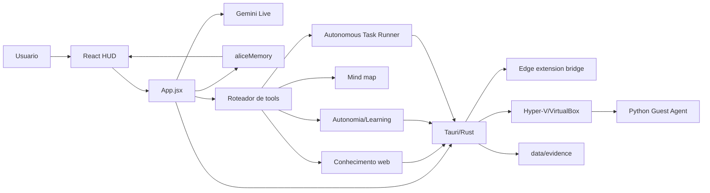

## 2. Inicializacao

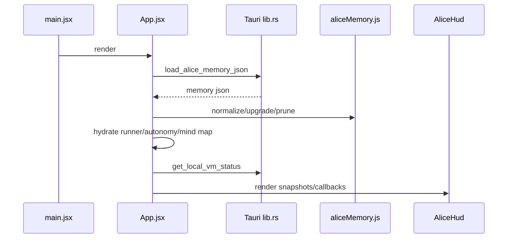

## 3. Conversa

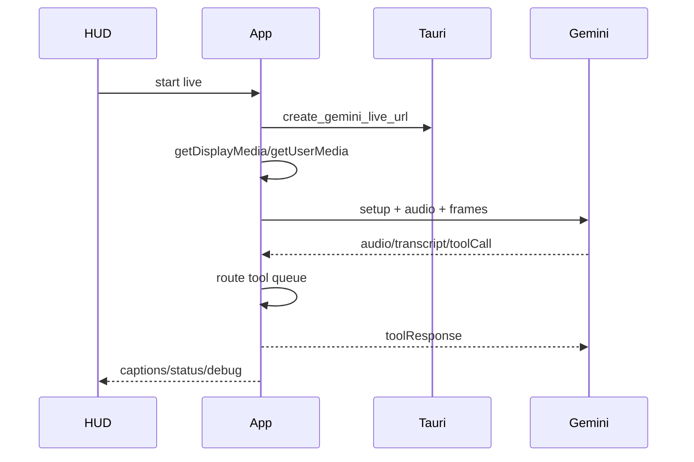

## 4. Tool call

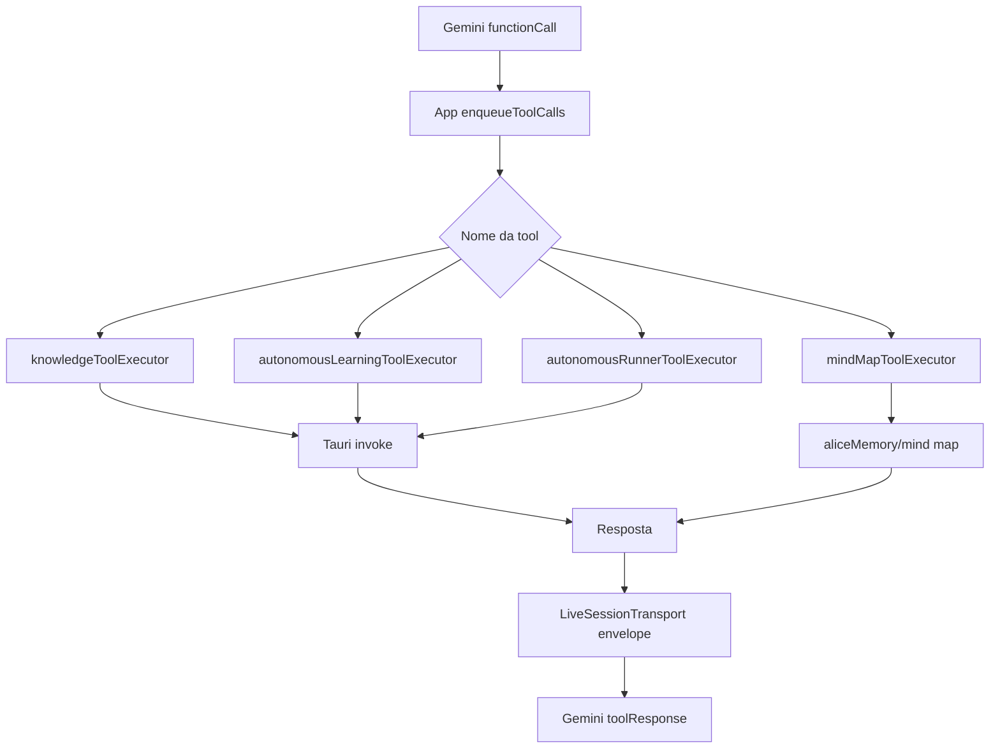

## 5. Autonomous Task Runner

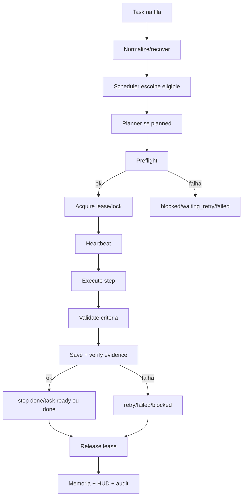

## 6. VM + guest agent

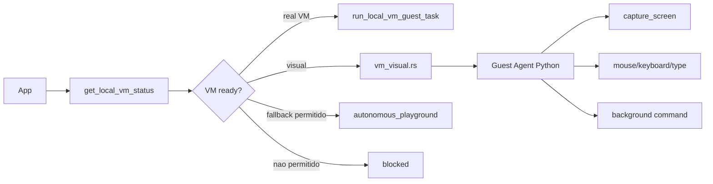

## 7. Evidencias

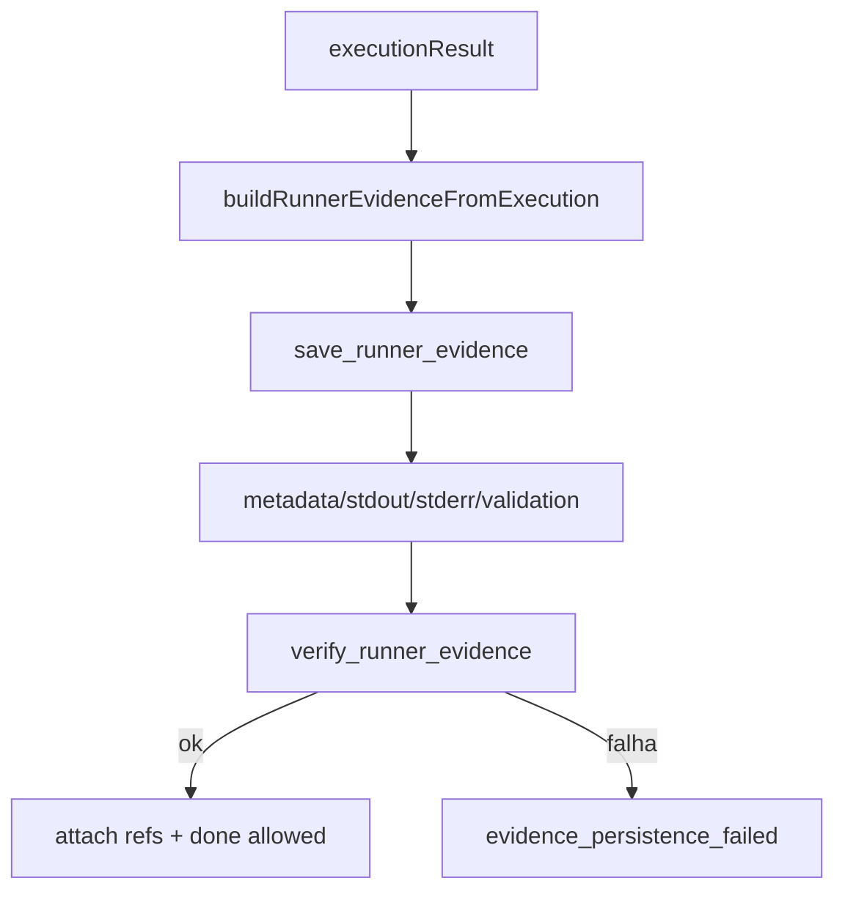

## 8. Memoria

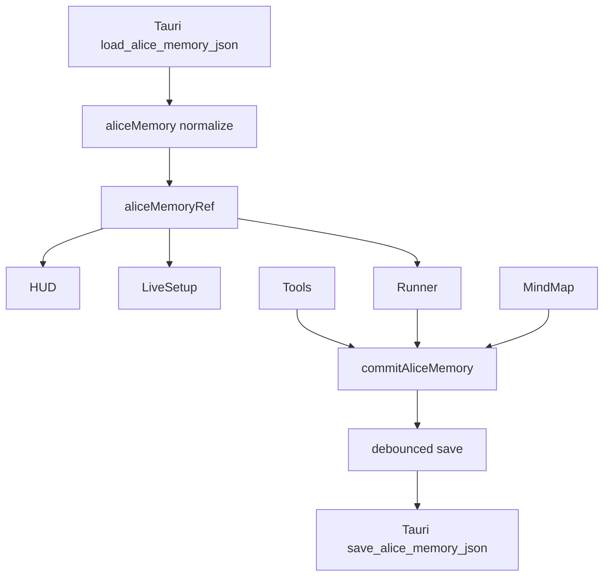

## 9. HUD

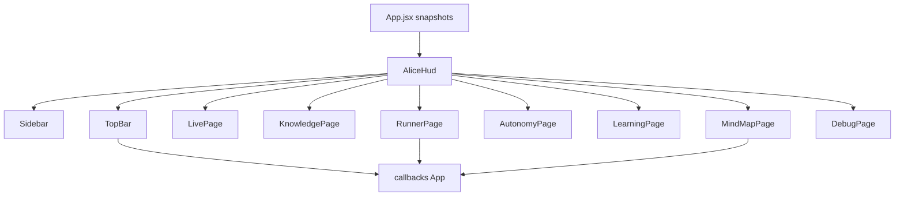

## 10. Mind map

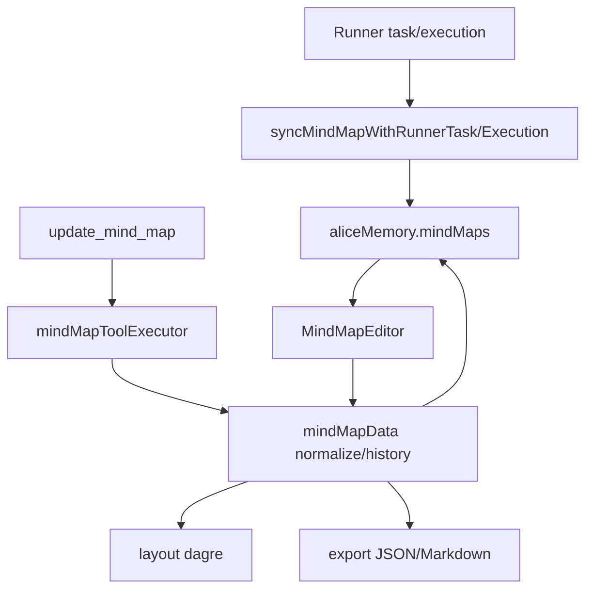

## 11. Frontend React x backend Tauri/Rust

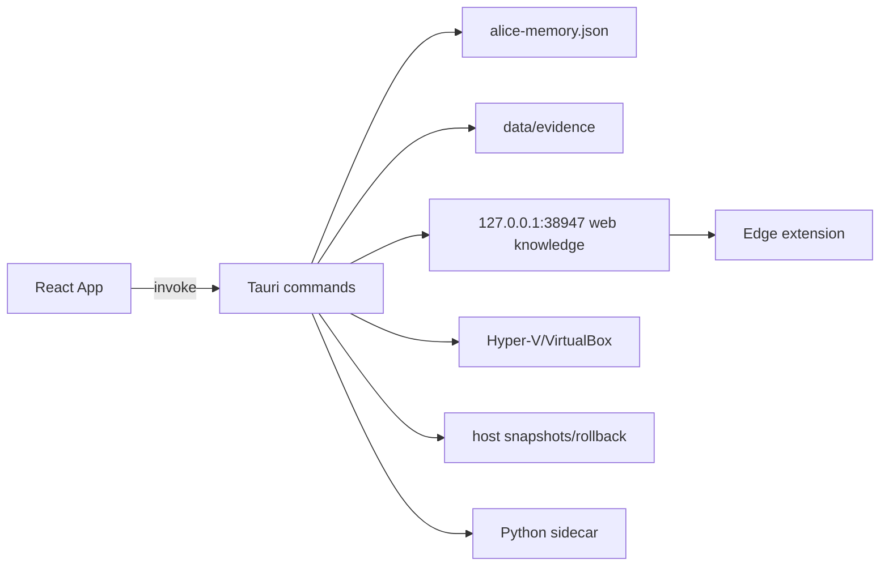

## 12. Dependencias criticas

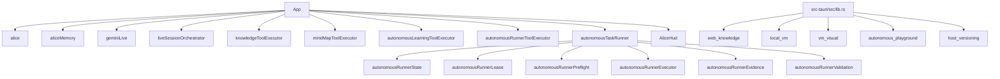

---

<!-- Arquivo de origem: 07-memoria-e-estado.md -->

# Memoria e estado

## O que e

A memoria persistente da Alice e um JSON versionado controlado por `src/aliceMemory.js` e salvo pelo Tauri como `alice-memory.json`. Ela funciona como banco local unico para fatos, contexto recente, projetos/tarefas, mind maps, auditoria autonoma, estado do Runner, learning planner, procedures aprendidas e estados de aprendizado/otimizacao.

## Arquivos responsaveis

- `src/aliceMemory.js`: contrato principal. Define `ALICE_MEMORY_SCHEMA_VERSION`, limite estimado, estado vazio, validacao, upgrade, prune, merge de fatos, mind maps, autonomia, Runner e helpers de storage.
- `src/aliceMemoryPersistence.js`: boundary de runtime. Decide quando carregar/salvar via Tauri e quando pular persistencia para evitar salvar antes da hidratacao.
- `src-tauri/src/lib.rs`: implementa `load_alice_memory_json` e `save_alice_memory_json`, valida payload vazio/tamanho e grava de forma atomica com arquivo temporario.
- `src/runnerAppDiagnostics.js`: escreve eventos de diagnostico do app no audit do Runner.
- `src/debugHud.js`: monta snapshot derivado para o HUD, sem ser fonte de verdade.
- `src/learningPlanner/learningPlannerRepository.js`: persiste planos dentro do subestado de aprendizado.

## Como carrega

1. `App.jsx` chama `loadAliceMemoryFromRuntimeBoundary({ invokeFn: invoke })`.
2. O boundary chama `invoke('load_alice_memory_json')`.
3. Rust resolve o app data e le `alice-memory.json`; ausencia vira memoria vazia no frontend.
4. `aliceMemory.js` valida, aplica defaults e normaliza subestruturas ausentes.
5. `App.jsx` grava em `aliceMemoryRef` e atualiza states derivados: mind map ativo, Runner, learning/autonomy e diagnosticos.

## Como salva

1. Qualquer mudanca relevante passa por `commitAliceMemory` ou helper que retorna nova memoria.
2. `commitAliceMemory` atualiza a ref, recalcula mind map/Runner e agenda save com debounce.
3. `flushAliceMemoryToRuntime` so salva se o runtime Tauri estiver disponivel e a memoria ja tiver sido hidratada.
4. Rust valida tamanho maximo, cria diretorio, grava `.tmp`, sincroniza, remove o antigo e renomeia.

## Partes da memoria

- Persona/fatos/projetos/tarefas: usados para contexto de conversa.
- `recentContextSummary`: resumo curto usado na rehidratacao e debug.
- `toolFacts` e `validatedProcedures`: conhecimento operacional consolidado.
- `mindMaps`: mapas persistentes, active id, nodes, edges e historico.
- `autonomousAudit` e `autonomousLearning`: logs, goals, gaps, candidates, procedures, VM state e planner.
- `autonomousRunner`: queue, tasks, steps, locks, audits e evidenceRefs.
- `autonomousOptimization` e `procedureReuseIndex`: otimizacao/reuso de procedures.

## Quem le e quem escreve

Leitores: `App.jsx`, setup Live, HUD/debug, Runner tick, learning loop, tool executors, mind map, learning planner e contexto operacional.

Escritores: conversa (`rememberAliceContext`), `mindMapToolExecutor`, `autonomousRunnerToolExecutor`, Runner tick, learning loop, observed learning, learning planner, diagnostics e callbacks do HUD.

## Riscos tecnicos

- Crescimento: audits, maps, plans e evidencias logicas podem aproximar a memoria do limite de 50 MiB.
- Corrupcao: JSON invalido pode levar a recovery para estado vazio; isso preserva app vivo, mas pode perder contexto.
- Concorrencia: timers de save, Runner e learning loop compartilham `aliceMemoryRef`.
- Inconsistencia: states derivados do React podem ficar defasados se algum fluxo alterar a ref sem recalcular.
- Compatibilidade: qualquer alteracao no schema precisa manter upgrade e testes de dados antigos.

## Como testar

Use `npm test -- aliceMemory`, `npm test -- aliceMemoryPersistence`, testes de Runner/learning planner e `cd src-tauri; cargo test` para validacao nativa de leitura/escrita. Para mudancas de schema, crie casos com memoria antiga, campos ausentes, dados excedentes e subestados parcialmente corrompidos.

---

<!-- Arquivo de origem: 08-autonomous-task-runner.md -->

# Autonomous Task Runner

## O que e

O Autonomous Task Runner e o executor oficial para tarefas longas, multistep ou de background. Ele combina fila, status, preflight, lease, lock, heartbeat, executor, validacao, evidencia fisica, retry, recovery, learning candidates, sincronizacao com mind map e HUD.

## Arquivos centrais

- `src/autonomousTaskRunner.js`: tick principal e orquestracao.
- `src/autonomousRunnerState.js`: schema, normalizacao, tasks, steps, status, transicoes e auditoria.
- `src/autonomousRunnerLease.js`: lock, lease, heartbeat e recovery de stale tasks.
- `src/autonomousRunnerScheduler.js`: elegibilidade, prioridade e intervalo dinamico.
- `src/autonomousRunnerPlanner.js`: planejamento automatico de tasks `planned`.
- `src/autonomousRunnerPreflight.js`: valida dependencias, VM/fallback, step executavel, criterios e evidencia esperada.
- `src/autonomousRunnerExecutor.js`: traduz step para comando Tauri.
- `src/autonomousRunnerEvidence.js`: cria refs de evidencia.
- `src/autonomousRunnerValidation.js`: valida completion criteria.
- `src/autonomousRunnerRecoveryPlanner.js`: planeja recovery e evita loops.
- `src/autonomousRunnerToolExecutor.js`: tool `manage_autonomous_runner`.
- `src/autonomousRunnerMindMap.js`: sincroniza Runner com mind map.
- `src/hud/pages/AutonomousRunnerHudPage.jsx` e `runnerHudViewModel.js`: exibicao no HUD.

## Estados e contratos

O estado fica em `aliceMemory.autonomousRunner`. Campos principais: `enabled`, `runnerState`, `queue`, `tasksById`, `activeTaskId`, `runnerLock`, `evidenceRefs`, `auditRefs`, `audits` e `settings`. Task tem `status`, `priority`, `riskLevel`, `requiresRealVm`, `allowWorkspaceFallback`, `steps`, `dependencies`, `executionHistory` e `evidenceRefs`. Step tem `type`, `action`, `completionCriteria`, `expectedEvidence`, `timeoutPolicy`, `retryPolicy`, `attempts`, `result` e `evidenceRefs`.

## Invariantes importantes

- Runner disabled ou paused nao executa task.
- Lock ativo impede tick concorrente.
- Transicao para `running` exige lease.
- Heartbeat atualiza prova de atividade durante execucao.
- Transicao para `done` exige execucao verificada, validacao passada e evidencia persistida.
- Falha de persistencia de evidencia invalida o sucesso.
- Runtime/VM indisponivel deve gerar blocked/failure honesto, nao sucesso.
- Workspace fallback nao pode ser tratado como VM real.

## Fluxo de execucao

Task entra na fila por tool, learning loop, planner/harness ou HUD. O timer em `App.jsx` chama `runAutonomousTaskRunnerTick`. O Runner normaliza, recupera stale tasks, consulta scheduler, planeja se necessario, roda preflight, adquire lease, inicia heartbeat, executa step, valida, salva/verifica evidencia, atualiza task/step, libera lease e calcula proximo intervalo.

## Estados finais

- `done`: todos os steps relevantes passaram com evidencia fisica.
- `failed`: validacao falhou, max attempts acabou ou erro nao recuperavel ocorreu.
- `blocked`: dependencia/VM/runtime/politica impedem execucao segura.
- `waiting_retry`: tentativa falhou mas ainda ha retry permitido.
- `cancelled`: usuario/tool cancelou task ou fila.

## Riscos

Relaxar transicoes pode criar falso sucesso. Tasks criadas por tool com criterio fraco podem ficar bloqueadas ou produzir evidencia inutil. Recovery precisa evitar loops. Como `App.jsx` controla timers, persistencia e wake-ups, falhas de orquestracao afetam todo o Runner.

## Como testar

`src/autonomousRunner.test.js` e o principal arquivo. Ele cobre estado, scheduler, preflight, lease, executor, evidencias, validacao e recovery. `src/dev/autonomousRunnerHarness.test.js` cobre harness. Ainda falta validacao end-to-end com Tauri real, VM real e filesystem de evidencia em ambiente controlado.

---

<!-- Arquivo de origem: 09-vm-guest-agent-e-evidencias.md -->

# VM, guest agent e evidencias

## VM real

`src-tauri/src/local_vm.rs` detecta Hyper-V e VirtualBox por comandos locais e variaveis de ambiente. Para executar comandos dentro do guest, Alice exige `ALICE_LOCAL_VM_PROVIDER`, `ALICE_LOCAL_VM_NAME`, usuario/senha (`ALICE_LOCAL_VM_USER` ou `ALICE_LOCAL_VM_USERNAME`, `ALICE_LOCAL_VM_PASSWORD`) e opt-in `ALICE_LOCAL_VM_ENABLE_GUEST_RUN=true`. VirtualBox tambem aceita `ALICE_VBOXMANAGE_PATH`.

Estados relevantes: `not_detected`, `detected`, `not_configured`, `configured_not_ready`, `ready`. O codigo retorna `guestCommandReady=false` e `requiresUserSetup=true` quando ainda nao e seguro executar. Smoke test de VM nao usa fallback local para fingir VM.

## Workspace fallback

`src-tauri/src/autonomous_playground.rs` cria workspace local controlado, copia arquivos ou escreve conteudo fornecido, valida paths relativos, comando, args e timeout, executa e coleta stdout/stderr/manifesto. Ele pode ser usado para tarefas permitidas de risco menor, mas nao oferece isolamento forte. O Runner/preflight deve bloquear fallback quando `requiresRealVm=true` ou quando a politica nao permitir.

## Guest Interaction Agent

`src-tauri/src/vm_visual.rs` copia e aciona o agente Python em `src-tauri/vm/guest_agent`. O agente tem modo CLI (`agent.py`) e servidor residente (`server.py`). `action_executor.py` executa acoes; `input_controller.py` controla mouse/teclado/texto; `screen_capture.py` captura screenshots; `visual_context.py` cria contexto visual; `background_runner.py` acompanha comandos longos; `ocr.py` e opcional.

Acoes suportadas inferidas do codigo: `capture_screen`, `get_active_window`, `move_mouse`, `click`, `double_click`, `right_click`, `type_text`, `press_key`, `hotkey`, `wait`, `run_command`, `start_background_command`, `get_background_command_status`, `cancel_background_command`, `get_status`.

## Evidencias fisicas

Runner cria refs logicas em `autonomousRunnerEvidence.js`. A persistencia real passa por `save_runner_evidence` em `src-tauri/src/lib.rs`, que grava `metadata.json`, `stdout.txt`, `stderr.txt` e `validation.json` em `data/evidence/<executionId>/`. Em seguida `verify_runner_evidence` confirma existencia e rejeita nomes fora da whitelist/path traversal.

## Conexao com Runner

`autonomousRunnerExecutor.js` chama comandos Tauri conforme modo de execucao. O resultado vira `executionResult`, depois validacao e evidencia. Sem evidencia fisica confirmada, a task nao deve virar `done`.

## Riscos

Credenciais em ambiente, comandos dentro de VM, instaladores com UAC/elevacao, screenshots sensiveis, status de background mal interpretado, dependencias externas do VirtualBox/Hyper-V e fallback local usado indevidamente. O projeto mitiga com opt-in, status honesto, timeouts, whitelists e validacao, mas esta continua sendo uma superficie critica.

---

<!-- Arquivo de origem: 10-hud-e-mind-map.md -->

# HUD e mind map

## HUD

`src/hud/AliceHud.jsx` renderiza o layout principal. Ele usa `Sidebar` para navegacao, `TopBar` para controle Live e paginas lazy para dominios pesados. Paginas existentes: `LiveHudPage`, `KnowledgeHudPage`, `MindMapHudPage`, `AutonomyHudPage`, `AutonomousLearningHudPage`, `AutonomousRunnerHudPage` e `DebugHudPage`.

O HUD recebe props de `App.jsx`: status Live, captions, diagnostics, debugHud, autonomousLearningState, autonomousRunnerState, activeMindMap, callbacks de navegacao, toggle Live, acoes de learning, acoes de Runner e alteracoes de mind map. Ele nao deve mutar a fonte de verdade diretamente.

## View models

`src/hud/hudViewModel.js` deriva atividade Live. `src/hud/pages/runnerHudViewModel.js` transforma Runner state em lista/contadores para HUD. `src/hud/pages/learningPlannerHudViewModel.js` e muito pequeno; pela leitura estatica, parece uma area ainda incipiente ou ponte minima.

## Mind map

Mapas ficam em `aliceMemory.mindMaps`. `MindMapEditor.jsx` usa React Flow; `mindMapData.js` normaliza nodes, edges, status, history e snapshots; `layout.js` aplica dagre; `export.js` gera JSON/Markdown; `storage.js` oferece utilidade local. `CustomNode.jsx` renderiza nos customizados.

## Tool e sincronizacao

`mindMapToolExecutor.js` implementa `update_mind_map` com operacoes como replace, add/remove node/edge, rename, layout, export, status, batch e rollback. `mindMapIntentInterpreter.js` tenta transformar linguagem natural em operacoes. `mindMapExecutionSync.js` e `autonomousRunnerMindMap.js` sincronizam execucao/Runner com nos do mapa.

## Riscos

Estado visual pode ficar stale se `App.jsx` nao atualizar states derivados apos `commitAliceMemory`. Sincronizacao por heuristica pode marcar no errado. Rollback/historico precisa preservar ids e status. O mapa pode sugerir progresso visual que ainda nao foi validado pelo Runner, se a integracao for relaxada.

## Testes

Cobertura existente: `AliceHud.test.jsx`, `hudViewModel.test.js`, `runnerHudViewModel.test.js`, `CustomNode.test.jsx`, `mindMapData.test.js`, `mindMapToolExecutor.test.js`, `mindMapIntentInterpreter.test.js`, `mindMapExecutionSync.test.js`. Lacuna: teste visual completo do React Flow em browser real.

---

<!-- Arquivo de origem: 11-ferramentas-tool-executors.md -->

# Ferramentas e tool executors

## Declaracao das tools

`src/alice.js` declara `ALICE_LIVE_TOOLS`. A lista inclui ferramentas de conhecimento web, mind map, status/autonomia, VM real, guest agent, tarefa operacional de VM, planejamento autonomo, snapshots/rollback do host, auto-melhoria, aprendizado validado, pesquisa, inspeção de projeto e controle do Runner.

## Roteamento

Gemini Live envia `functionCall`. `App.jsx` registra a chamada em debug, coloca na fila serial `toolQueueRef` e decide o executor por nome. O resultado vira envelope por `createFunctionResponseEnvelope` em `liveSessionTransport.js` e volta ao modelo como `toolResponse`.

## Executors

- `src/knowledgeToolExecutor.js`: executa tools de conhecimento web e chama `knowledgePipeline.js`.
- `src/knowledgePipeline.js`: decide escopo, refresh/inspect/search/fetch e monta resposta com fontes.
- `src/mindMapToolExecutor.js`: aplica operacoes no mapa ativo e retorna estado/export/status.
- `src/autonomousLearningToolExecutor.js`: executor amplo para autonomia, VM, guest agent, snapshots, propostas, learning, pesquisa e riscos.
- `src/autonomousRunnerToolExecutor.js`: status, enable/disable, pause/resume, enqueue, cancel, block, rerun e reorder do Runner.

## Validacao e tratamento de erro

O JSON schema em `alice.js` limita forma basica, mas a validacao real fica nos executores JS e no Rust. Operacoes perigosas devem cruzar `invoke` e passar por validacao nativa de paths, comandos, timeouts, providers e evidencias. Erros viram `ok=false`, diagnostico ou excecao capturada; `App.jsx` registra status de tool para HUD/debug.

## Conexoes

Ferramentas podem alterar memoria (`commitAliceMemory`), mind map, estado de autonomia, Runner, HUD e backend Tauri. Algumas retornam task iniciada/background, nao conclusao final. Isso e importante para nao declarar sucesso antes de evidencia.

## Riscos

Nomes string podem divergir entre declaracao e executor. `App.jsx` concentra o roteador. `autonomousLearningToolExecutor.js` tem fan-out alto e mistura muitos dominios. O modelo nao deve decidir seguranca: qualquer relaxamento nos validadores JS/Rust pode abrir execucao indevida ou falso sucesso.

---

<!-- Arquivo de origem: 12-backend-tauri-rust.md -->

# Backend Tauri/Rust

## Estrutura

`src-tauri/src/main.rs` chama `alice_virtual_lib::run()`. `src-tauri/src/lib.rs` inicializa Tauri, instala log em debug, inicia o bridge de conhecimento web, registra estado compartilhado e monta `invoke_handler`. Modulos: `web_knowledge`, `local_vm`, `vm_visual`, `autonomous_playground`, `host_versioning`, `python_sidecar` e `legacy_desktop_commands`.

## Comandos expostos

- Gemini/memoria: `create_gemini_live_url`, `load_alice_memory_json`, `save_alice_memory_json`.
- Dev runtime: `load_dev_runtime_requests`, `clear_dev_runtime_request`.
- Evidencias: `save_runner_evidence`, `verify_runner_evidence`.
- VM real: `get_local_vm_status`, `diagnose_local_vm_setup`, `run_local_vm_guest_task`, `run_local_vm_smoke_test`.
- Guest visual: `install_vm_guest_agent`, `diagnose_vm_guest_agent`, `start_vm_guest_agent_resident`, `run_vm_guest_agent_action`, `capture_vm_guest_screen`, `run_vm_visual_smoke_test`.
- Workspace fallback: `run_local_workspace_playground_task`, `cancel_autonomous_task`.
- Host versioning: snapshot, diff, checkpoint e restore.
- Web knowledge: refresh, navigation context, inspect, same-domain search, web search e fetch.
- Legado desktop/local: registrado apenas com feature `desktop-commands`.

## Modulos

`web_knowledge.rs` mantem snapshot da pagina, servidor HTTP/SSE local, parsing HTML e busca/fetch. `local_vm.rs` diagnostica Hyper-V/VirtualBox e executa comandos guest. `vm_visual.rs` instala e aciona o guest agent visual. `autonomous_playground.rs` executa fallback local controlado. `host_versioning.rs` cria snapshots, diffs, checkpoints e rollback com preservacao de conflitos. `python_sidecar.rs` gerencia processo Python host. `legacy_desktop_commands.rs` encapsula comandos antigos.

## Seguranca

O backend valida paths, bloqueia escopos sensiveis, rejeita wildcards, limita texto, saida e timeout, whitelista apps/hotkeys/nomes de evidencia, exige opt-in para VM guest e evita shell amplo no fallback. Ainda assim, e a camada mais sensivel porque acessa filesystem, rede, processos, VM e sidecars.

## Riscos

`lib.rs` e grande e concentra responsabilidades. `web_knowledge.rs` mistura bridge, estado, servidor e extracao. `local_vm.rs` e `vm_visual.rs` dependem fortemente de ambiente Windows/VM. Alteracoes de validacao nativa exigem `cargo test`, testes com feature quando aplicavel e revisao de seguranca.

## Testes

Ha testes Rust inline para URL Gemini, validacao de desktop/local action, memoria, evidencia, VM, workspace fallback, host versioning, sidecar e web knowledge. A lacuna principal e integracao viva com Tauri app, Edge extension e VM real configurada.

---

<!-- Arquivo de origem: 13-testes.md -->

# Testes

## Visao geral

Foram identificados 55 arquivos de teste/fixture textuais. A maior cobertura esta em modulos JS puros, Runner, learning planner, web knowledge, HUD view models, Rust inline tests e Python unittest.

## `edge-extension/captureEvents.test.js`

- Dominio: Testes.
- Protege: Teste/fixture que protege comportamento do dominio Testes.
- Imports/fixtures: `vitest`, `edge-extension/captureEvents.js`.
- Casos/simbolos identificados: `payload`, `parsed`, `tracker`.
- Garantia: valida contrato local descrito pelos casos e evita regressao do modulo alvo inferido pelo nome/imports.

## `scripts/alice-code-auditor.test.mjs`

- Dominio: Testes.
- Protege: Teste/fixture que protege comportamento do dominio Testes.
- Imports/fixtures: `vitest`, `scripts/alice-code-auditor.mjs`.
- Casos/simbolos identificados: `detectedError`, `detectedImprovement`, `result`, `first`, `second`.
- Garantia: valida contrato local descrito pelos casos e evita regressao do modulo alvo inferido pelo nome/imports.

## `src-tauri/python_sidecar/tests/test_sidecar.py`

- Dominio: Testes.
- Protege: Teste/fixture que protege comportamento do dominio Testes.
- Imports/fixtures: `__future__`, `io`, `json`, `sys`, `unittest`, `pathlib`, `unittest.mock`, `alice_window_sidecar`.
- Casos/simbolos identificados: `NormalizeAliasTests`, `test_normalizes_browser_alias`, `test_normalizes_file_explorer_alias`, `test_returns_none_for_unknown_alias`, `ProtocolTests`, `test_handle_request_returns_foreground_context`, `test_handle_request_normalizes_sidecar_error`, `test_sidecar_main_processes_jsonl_requests`, `ResolveTargetTests`, `test_resolve_target_interprets_json_payload`, `test_resolve_target_raises_for_not_found`.
- Garantia: valida contrato local descrito pelos casos e evita regressao do modulo alvo inferido pelo nome/imports.

## `src-tauri/tests/fixtures/web_knowledge/long_article.html`

- Dominio: Testes.
- Protege: Teste/fixture que protege comportamento do dominio Testes.
- Imports/fixtures: nenhum identificado estaticamente.
- Casos/simbolos identificados: nenhum identificado estaticamente.
- Garantia: valida contrato local descrito pelos casos e evita regressao do modulo alvo inferido pelo nome/imports.

## `src-tauri/tests/fixtures/web_knowledge/noisy_navigation_links.html`

- Dominio: Testes.
- Protege: Teste/fixture que protege comportamento do dominio Testes.
- Imports/fixtures: nenhum identificado estaticamente.
- Casos/simbolos identificados: nenhum identificado estaticamente.
- Garantia: valida contrato local descrito pelos casos e evita regressao do modulo alvo inferido pelo nome/imports.

## `src-tauri/tests/fixtures/web_knowledge/selected_text_page.html`

- Dominio: Testes.
- Protege: Teste/fixture que protege comportamento do dominio Testes.
- Imports/fixtures: nenhum identificado estaticamente.
- Casos/simbolos identificados: nenhum identificado estaticamente.
- Garantia: valida contrato local descrito pelos casos e evita regressao do modulo alvo inferido pelo nome/imports.

## `src-tauri/tests/fixtures/web_knowledge/tables_and_lists.html`

- Dominio: Testes.
- Protege: Teste/fixture que protege comportamento do dominio Testes.
- Imports/fixtures: nenhum identificado estaticamente.
- Casos/simbolos identificados: nenhum identificado estaticamente.
- Garantia: valida contrato local descrito pelos casos e evita regressao do modulo alvo inferido pelo nome/imports.

## `src-tauri/tests/fixtures/web_knowledge/technical_docs.html`

- Dominio: Testes.
- Protege: Teste/fixture que protege comportamento do dominio Testes.
- Imports/fixtures: nenhum identificado estaticamente.
- Casos/simbolos identificados: nenhum identificado estaticamente.
- Garantia: valida contrato local descrito pelos casos e evita regressao do modulo alvo inferido pelo nome/imports.

## `src-tauri/tests/fixtures/web_knowledge/thin_landing_page.html`

- Dominio: Testes.
- Protege: Teste/fixture que protege comportamento do dominio Testes.
- Imports/fixtures: nenhum identificado estaticamente.
- Casos/simbolos identificados: nenhum identificado estaticamente.
- Garantia: valida contrato local descrito pelos casos e evita regressao do modulo alvo inferido pelo nome/imports.

## `src-tauri/vm/guest_agent/tests/test_background_actions.py`

- Dominio: Testes.
- Protege: Teste/fixture que protege comportamento do dominio Testes.
- Imports/fixtures: `json`, `os`, `sys`, `tempfile`, `time`, `unittest`, `action_executor`.
- Casos/simbolos identificados: `BackgroundActionTests`, `test_background_command_lifecycle`, `test_background_status_requires_known_task`, `test_status_reports_elevation_capability`.
- Garantia: valida contrato local descrito pelos casos e evita regressao do modulo alvo inferido pelo nome/imports.

## `src-tauri/vm/guest_agent/tests/test_input_controller.py`

- Dominio: Testes.
- Protege: Teste/fixture que protege comportamento do dominio Testes.
- Imports/fixtures: `os`, `sys`, `unittest`, `input_controller`.
- Casos/simbolos identificados: `InputControllerTests`, `test_utf16_code_units_preserve_non_ascii_text`, `test_type_text_uses_unicode_sendinput_by_default`, `test_type_text_auto_falls_back_to_clipboard_when_unicode_fails`.
- Garantia: valida contrato local descrito pelos casos e evita regressao do modulo alvo inferido pelo nome/imports.

## `src-tauri/vm/guest_agent/tests/test_resident_server.py`

- Dominio: Testes.
- Protege: Teste/fixture que protege comportamento do dominio Testes.
- Imports/fixtures: `json`, `os`, `sys`, `threading`, `time`, `unittest`, `http.client`, `pathlib`, `server`.
- Casos/simbolos identificados: `ResidentServerTests`, `setUp`, `tearDown`, `request`, `test_health_requires_token_and_reports_online`, `test_action_uses_existing_protocol_shape`, `test_action_error_is_json_not_connection_failure`.
- Garantia: valida contrato local descrito pelos casos e evita regressao do modulo alvo inferido pelo nome/imports.

## `src/App.test.js`

- Dominio: Testes.
- Protege: Teste/fixture que protege comportamento do dominio Testes.
- Imports/fixtures: `vitest`, `src/liveDiagnostics.js`, `src/appUiState.js`.
- Casos/simbolos identificados: `buildLiveUiState`, `currentState`, `nextState`, `reconnectingState`.
- Garantia: valida contrato local descrito pelos casos e evita regressao do modulo alvo inferido pelo nome/imports.

## `src/alice.test.js`

- Dominio: Testes.
- Protege: Teste/fixture que protege comportamento do dominio Testes.
- Imports/fixtures: `vitest`, `src/alice.js`.
- Casos/simbolos identificados: `setup`, `memoryPrefixTurns`, `setupFromString`, `customSetup`.
- Garantia: valida contrato local descrito pelos casos e evita regressao do modulo alvo inferido pelo nome/imports.

## `src/aliceMemory.test.js`

- Dominio: Testes.
- Protege: Teste/fixture que protege comportamento do dominio Testes.
- Imports/fixtures: `vitest`, `src/aliceMemory.js`, `src/hud/mindMap/utils/mindMapData.js`.
- Casos/simbolos identificados: `memory`, `small`, `large`, `facts`, `baseMemory`, `merged`, `oversizedMemory`, `pruned`, `activeMindMap`, `firstMemory`, `secondMemory`, `activated`, `deleted`, `updated`, `rolledBack`, `activeBefore`, `goalMap`, `turns`, `legacyMemory`, `saveJson` (+1).
- Garantia: valida contrato local descrito pelos casos e evita regressao do modulo alvo inferido pelo nome/imports.

## `src/aliceMemoryPersistence.test.js`

- Dominio: Testes.
- Protege: Teste/fixture que protege comportamento do dominio Testes.
- Imports/fixtures: `vitest`, `src/aliceMemory.js`, `src/aliceMemoryPersistence.js`.
- Casos/simbolos identificados: `memory`, `readError`, `onSkipped`, `saveMemory`, `flushed`, `onSaved`, `savedMemory`.
- Garantia: valida contrato local descrito pelos casos e evita regressao do modulo alvo inferido pelo nome/imports.

## `src/autonomousContextRepair.test.js`

- Dominio: Testes.
- Protege: Teste/fixture que protege comportamento do dominio Testes.
- Imports/fixtures: `vitest`, `src/aliceMemory.js`, `src/autonomousCapabilityScanner.js`.
- Casos/simbolos identificados: `scan`, `memory`, `result`, `reviewGap`.
- Garantia: valida contrato local descrito pelos casos e evita regressao do modulo alvo inferido pelo nome/imports.

## `src/autonomousFailureSignatureBuilder.test.js`

- Dominio: Testes.
- Protege: Teste/fixture que protege comportamento do dominio Testes.
- Imports/fixtures: `vitest`, `src/autonomousFailureSignatureBuilder.js`.
- Casos/simbolos identificados: `signature`, `baseTask`, `first`, `second`.
- Garantia: valida contrato local descrito pelos casos e evita regressao do modulo alvo inferido pelo nome/imports.

## `src/autonomousLearning.test.js`

- Dominio: Testes.
- Protege: Teste/fixture que protege comportamento do dominio Testes.
- Imports/fixtures: `vitest`, `src/autonomousLearning/index.js`, `src/debugHud.js`, `src/aliceMemory.js`, `src/autonomousLearningToolExecutor.js`.
- Casos/simbolos identificados: `initialState`, `cancelCalls`, `result`, `decision`, `app`, `plan`, `explicitCommandPlan`, `summary`, `blocked`, `allowed`, `previousSteps`, `startDecision`, `pollDecision`, `replay`, `agent`, `directPlan`, `largePlan`, `vmStatus`, `selection`, `snapshot` (+26).
- Garantia: valida contrato local descrito pelos casos e evita regressao do modulo alvo inferido pelo nome/imports.

## `src/autonomousLearning/behaviorContext.test.js`

- Dominio: Testes.
- Protege: Teste/fixture que protege comportamento do dominio Testes.
- Imports/fixtures: `vitest`, `src/autonomousLearning/behaviorContext.js`, `src/autonomousLearning/state.js`, `src/autonomousLearning/../hud/mindMap/utils/mindMapData`.
- Casos/simbolos identificados: `context`.
- Garantia: valida contrato local descrito pelos casos e evita regressao do modulo alvo inferido pelo nome/imports.

## `src/autonomousLearning/decisionEngine.test.js`

- Dominio: Testes.
- Protege: Teste/fixture que protege comportamento do dominio Testes.
- Imports/fixtures: `vitest`, `src/autonomousLearning/decisionEngine.js`.
- Casos/simbolos identificados: `decision`.
- Garantia: valida contrato local descrito pelos casos e evita regressao do modulo alvo inferido pelo nome/imports.

## `src/autonomousLearning/vmTextInputDriver.test.js`

- Dominio: Testes.
- Protege: Teste/fixture que protege comportamento do dominio Testes.
- Imports/fixtures: `vitest`, `src/autonomousLearning/../autonomousRunnerTextInputDiagnostics`, `src/autonomousLearning/../autonomousRunnerValidation`, `src/autonomousLearning/vmTextInputDriver.js`.
- Casos/simbolos identificados: `script`, `expectedText`, `diagnostics`, `validation`.
- Garantia: valida contrato local descrito pelos casos e evita regressao do modulo alvo inferido pelo nome/imports.

## `src/autonomousLearningLoop.test.js`

- Dominio: Testes.
- Protege: Teste/fixture que protege comportamento do dominio Testes.
- Imports/fixtures: `vitest`, `src/aliceMemory.js`, `src/autonomousCapabilityScanner.js`, `src/autonomousLearningGoals.js`, `src/autonomousLearningPlanner.js`, `src/autonomousLearningLoop.js`, `src/autonomousLearningValidator.js`, `src/autonomousProcedurePromoter.js`, `src/autonomousScriptSynthesizer.js`, `src/autonomousLearningPolicy.js`, `src/autonomousProcedureReuseEngine.js`, `src/autonomousProcedureVersioning.js`, `src/autonomousRunnerLease.js`, `src/autonomousRunnerState.js`.
- Casos/simbolos identificados: `browserGap`, `appLaunchGap`, `fileManagementGap`, `appInstallGap`, `fieldInteractionGap`, `pageValidationGap`, `completeEvidenceRef`, `result`, `planned`, `runner`, `task`, `lease`, `scan`, `memory`, `goalResult`, `goalGaps`, `legacyGoal`, `stageGap`, `taskId`, `gap` (+52).
- Garantia: valida contrato local descrito pelos casos e evita regressao do modulo alvo inferido pelo nome/imports.

## `src/autonomousObservedLearning.test.js`

- Dominio: Testes.
- Protege: Teste/fixture que protege comportamento do dominio Testes.
- Imports/fixtures: `vitest`, `src/aliceMemory.js`, `src/autonomousObservedLearning.js`.
- Casos/simbolos identificados: `targets`, `now`, `first`, `second`, `learning`, `text`, `memory`, `result`.
- Garantia: valida contrato local descrito pelos casos e evita regressao do modulo alvo inferido pelo nome/imports.

## `src/autonomousProcedureOptimizer.test.js`

- Dominio: Testes.
- Protege: Teste/fixture que protege comportamento do dominio Testes.
- Imports/fixtures: `vitest`, `src/autonomousProcedureOptimizer.js`.
- Casos/simbolos identificados: `procedure`, `firstPlan`, `duplicatePlan`.
- Garantia: valida contrato local descrito pelos casos e evita regressao do modulo alvo inferido pelo nome/imports.

## `src/autonomousRunner.test.js`

- Dominio: Testes.
- Protege: Teste/fixture que protege comportamento do dominio Testes.
- Imports/fixtures: `vitest`, `src/aliceMemory.js`, `src/autonomousRunnerState.js`, `src/autonomousRunnerLease.js`, `src/autonomousRunnerScheduler.js`, `src/autonomousRunnerPreflight.js`, `src/autonomousTaskRunner.js`, `src/autonomousRunnerPlanner.js`, `src/autonomousRunnerRecoveryPlanner.js`, `src/autonomousRunnerMindMap.js`, `src/hud/mindMap/utils/mindMapData.js`, `src/autonomousRunnerToolExecutor.js`, `src/autonomousLearningToolExecutor.js`, `src/autonomousRunnerEvidence.js`, `src/autonomousRunnerValidation.js`.
- Casos/simbolos identificados: `executableStep`, `createReadyTask`, `createSuccessfulRunnerInvoke`, `task`, `longExecutionId`, `runner`, `malformedCommand`, `repairedCommand`, `staleCommand`, `result`, `taskResult`, `stepResult`, `lease`, `heartbeat`, `recovered`, `preflight`, `calls`, `smokeStep`, `verifyCall`, `step` (+35).
- Garantia: valida contrato local descrito pelos casos e evita regressao do modulo alvo inferido pelo nome/imports.

## `src/debugHud.test.js`

- Dominio: Testes.
- Protege: Teste/fixture que protege comportamento do dominio Testes.
- Imports/fixtures: `vitest`, `src/debugHud.js`.
- Casos/simbolos identificados: `snapshot`, `tasksById`.
- Garantia: valida contrato local descrito pelos casos e evita regressao do modulo alvo inferido pelo nome/imports.

## `src/dev/autonomousRunnerHarness.test.js`

- Dominio: Testes.
- Protege: Teste/fixture que protege comportamento do dominio Testes.
- Imports/fixtures: `node:fs`, `node:os`, `node:path`, `vitest`, `src/dev/../aliceMemory`, `src/dev/../autonomousRunnerState`, `src/dev/autonomousRunnerHarness.js`.
- Casos/simbolos identificados: `realTask`, `runner`, `task`, `seeded`, `recovered`, `recoveredTask`, `withRealRunner`, `withRealMemory`, `cleared`, `noisyRunner`, `memory`, `compacted`, `compactedRunner`, `safeState`, `snapshot`, `memoryPath`, `result`, `backupPath`, `seed`, `loadedAfterSeed` (+11).
- Garantia: valida contrato local descrito pelos casos e evita regressao do modulo alvo inferido pelo nome/imports.

## `src/dev/learningPlannerHarness.test.js`

- Dominio: Testes.
- Protege: Teste/fixture que protege comportamento do dominio Testes.
- Imports/fixtures: `node:fs`, `node:os`, `node:path`, `vitest`, `src/dev/../aliceMemory`, `src/dev/learningPlannerHarness.js`, `src/dev/autonomousRunnerHarness.js`.
- Casos/simbolos identificados: `runSeedAndPlan`, `seeded`, `generated`, `result`, `state`, `validation`, `compiled`, `runner`, `memoryPath`, `seed`, `requestId`, `planId`, `safeState`, `enqueued`, `realRequest`, `withRealPlan`, `cleared`, `learning`.
- Garantia: valida contrato local descrito pelos casos e evita regressao do modulo alvo inferido pelo nome/imports.

## `src/dev/runtimeHarnessBridge.test.js`

- Dominio: Testes.
- Protege: Teste/fixture que protege comportamento do dominio Testes.
- Imports/fixtures: `vitest`, `src/dev/../aliceMemory`, `src/dev/runtimeHarnessBridge.js`.
- Casos/simbolos identificados: `task`, `script`, `result`, `runner`, `request`, `first`, `second`.
- Garantia: valida contrato local descrito pelos casos e evita regressao do modulo alvo inferido pelo nome/imports.

## `src/filesystem/filesystemNameSanitizer.test.js`

- Dominio: Testes.
- Protege: Teste/fixture que protege comportamento do dominio Testes.
- Imports/fixtures: `vitest`, `src/filesystem/filesystemNameSanitizer.js`.
- Casos/simbolos identificados: `result`.
- Garantia: valida contrato local descrito pelos casos e evita regressao do modulo alvo inferido pelo nome/imports.

## `src/geminiLive.test.js`

- Dominio: Testes.
- Protege: Teste/fixture que protege comportamento do dominio Testes.
- Imports/fixtures: `vitest`, `src/geminiLive.js`.
- Casos/simbolos identificados: `url`, `event`, `callbackState`, `session`, `connectPromise`, `socket`, `closeReasons`, `errors`, `originalSetTimeout`, `FakeWebSocket`.
- Garantia: valida contrato local descrito pelos casos e evita regressao do modulo alvo inferido pelo nome/imports.

## `src/hud/AliceHud.test.jsx`

- Dominio: Testes.
- Protege: Teste/fixture que protege comportamento do dominio Testes.
- Imports/fixtures: `react-dom/server`, `vitest`, `src/hud/AliceHud.jsx`, `src/hud/mindMap/utils/mindMapData.js`, `src/hud/pages/KnowledgeHudPage.jsx`, `src/hud/pages/MindMapHudPage.jsx`, `src/hud/pages/AutonomyHudPage.jsx`, `src/hud/pages/AutonomousLearningHudPage.jsx`, `src/hud/pages/AutonomousRunnerHudPage.jsx`, `src/hud/pages/DebugHudPage.jsx`.
- Casos/simbolos identificados: `buildProps`, `modules`, `html`.
- Garantia: valida contrato local descrito pelos casos e evita regressao do modulo alvo inferido pelo nome/imports.

## `src/hud/hudViewModel.test.js`

- Dominio: Testes.
- Protege: Teste/fixture que protege comportamento do dominio Testes.
- Imports/fixtures: `vitest`, `src/hud/hudViewModel.js`.
- Casos/simbolos identificados: `groups`, `cards`.
- Garantia: valida contrato local descrito pelos casos e evita regressao do modulo alvo inferido pelo nome/imports.

## `src/hud/mindMap/CustomNode.test.jsx`

- Dominio: Testes.
- Protege: Teste/fixture que protege comportamento do dominio Testes.
- Imports/fixtures: `react-dom/server`, `vitest`, `src/hud/mindMap/CustomNode.jsx`.
- Casos/simbolos identificados: `html`.
- Garantia: valida contrato local descrito pelos casos e evita regressao do modulo alvo inferido pelo nome/imports.

## `src/hud/pages/AutonomousLearningHudPage.test.jsx`

- Dominio: Testes.
- Protege: Teste/fixture que protege comportamento do dominio Testes.
- Imports/fixtures: `react-dom/server`, `vitest`, `src/hud/pages/AutonomousLearningHudPage.jsx`, `src/hud/pages/learningPlannerHudViewModel.js`.
- Casos/simbolos identificados: `plan`, `renderPage`, `html`.
- Garantia: valida contrato local descrito pelos casos e evita regressao do modulo alvo inferido pelo nome/imports.

## `src/hud/pages/runnerHudViewModel.test.js`

- Dominio: Testes.
- Protege: Teste/fixture que protege comportamento do dominio Testes.
- Imports/fixtures: `vitest`, `src/hud/pages/runnerHudViewModel.js`.
- Casos/simbolos identificados: `task`, `sorted`, `tasks`, `doneTask`.
- Garantia: valida contrato local descrito pelos casos e evita regressao do modulo alvo inferido pelo nome/imports.

## `src/knowledgePipeline.test.js`

- Dominio: Testes.
- Protege: Teste/fixture que protege comportamento do dominio Testes.
- Imports/fixtures: `vitest`, `src/knowledgePipeline.js`, `src/webKnowledge.js`.
- Casos/simbolos identificados: `buildContext`, `buildPage`, `invokeTool`.
- Garantia: valida contrato local descrito pelos casos e evita regressao do modulo alvo inferido pelo nome/imports.

## `src/knowledgeToolExecutor.test.js`

- Dominio: Testes.
- Protege: Teste/fixture que protege comportamento do dominio Testes.
- Imports/fixtures: `vitest`, `src/knowledgeToolExecutor.js`.
- Casos/simbolos identificados: `response`, `invokeTool`, `result`.
- Garantia: valida contrato local descrito pelos casos e evita regressao do modulo alvo inferido pelo nome/imports.

## `src/learningPlanner/learningPlanner.test.js`

- Dominio: Testes.
- Protege: Teste/fixture que protege comportamento do dominio Testes.
- Imports/fixtures: `vitest`, `react`, `react-dom/server`, `src/learningPlanner/../aliceMemory`, `src/learningPlanner/../debugHud`, `src/learningPlanner/../dev/autonomousRunnerHarness`, `src/learningPlanner/../autonomousRunnerEvidence`, `src/learningPlanner/../autonomousRunnerPreflight`, `src/learningPlanner/../autonomousRunnerValidation`, `src/learningPlanner/../hud/pages/AutonomousLearningHudPage`, `src/learningPlanner/learningPlannerTypes.js`, `src/learningPlanner/learningPlanSchema.js`, `src/learningPlanner/learningPlannerClient.js`, `src/learningPlanner/fakeLearningPlannerModelClient.js`, `src/learningPlanner/learningPlannerService.js` (+7).
- Casos/simbolos identificados: `validPlan`, `validModelResponse`, `validExecutablePracticePlan`, `createRunnerInvoke`, `learningAttempt`, `runnerTaskForAttempt`, `runnerForAttempts`, `memoryWithConsolidationCandidate`, `attempts`, `plan`, `withPlanner`, `result`, `memory`, `validation`, `nextMemory`, `state`, `rejected`, `client`, `timeout`, `service` (+31).
- Garantia: valida contrato local descrito pelos casos e evita regressao do modulo alvo inferido pelo nome/imports.

## `src/liveAudio.test.js`

- Dominio: Testes.
- Protege: Teste/fixture que protege comportamento do dominio Testes.
- Imports/fixtures: `vitest`, `src/liveAudio.js`.
- Casos/simbolos identificados: `samples`, `encoded`, `decoded`.
- Garantia: valida contrato local descrito pelos casos e evita regressao do modulo alvo inferido pelo nome/imports.

## `src/liveDiagnostics.test.js`

- Dominio: Testes.
- Protege: Teste/fixture que protege comportamento do dominio Testes.
- Imports/fixtures: `vitest`, `src/liveDiagnostics.js`.
- Casos/simbolos identificados: `diagnostics`.
- Garantia: valida contrato local descrito pelos casos e evita regressao do modulo alvo inferido pelo nome/imports.

## `src/liveSessionOrchestrator.test.js`

- Dominio: Testes.
- Protege: Teste/fixture que protege comportamento do dominio Testes.
- Imports/fixtures: `vitest`, `src/geminiLive.js`, `src/liveSessionOrchestrator.js`.
- Casos/simbolos identificados: `buildSetupStub`, `setup`, `buildConnectError`, `error`, `createSessionFactory`, `sessions`, `createSession`, `behavior`, `session`, `sessionReady`, `orchestrator`, `reconnectGate`, `firstReconnect`, `secondReconnect`, `statusUpdates`, `memoryPrefixTurns`, `closeReasons`.
- Garantia: valida contrato local descrito pelos casos e evita regressao do modulo alvo inferido pelo nome/imports.

## `src/liveSessionRehydration.test.js`

- Dominio: Testes.
- Protege: Teste/fixture que protege comportamento do dominio Testes.
- Imports/fixtures: `vitest`, `src/liveSessionRehydration.js`.
- Casos/simbolos identificados: `trimmed`, `turns`.
- Garantia: valida contrato local descrito pelos casos e evita regressao do modulo alvo inferido pelo nome/imports.

## `src/liveSessionTransport.test.js`

- Dominio: Testes.
- Protege: Teste/fixture que protege comportamento do dominio Testes.
- Imports/fixtures: `vitest`, `src/liveSessionTransport.js`.
- Casos/simbolos identificados: `call`, `transport`, `session`, `previousSession`, `resumedSession`, `functionResponse`, `replayedResponses`, `recreatedSession`, `firstSession`, `result`.
- Garantia: valida contrato local descrito pelos casos e evita regressao do modulo alvo inferido pelo nome/imports.

## `src/mindMapData.test.js`

- Dominio: Testes.
- Protege: Teste/fixture que protege comportamento do dominio Testes.
- Imports/fixtures: `vitest`, `src/hud/mindMap/utils/mindMapData.js`.
- Casos/simbolos identificados: `upgraded`, `normalized`, `mindMap`.
- Garantia: valida contrato local descrito pelos casos e evita regressao do modulo alvo inferido pelo nome/imports.

## `src/mindMapExecutionSync.test.js`

- Dominio: Testes.
- Protege: Teste/fixture que protege comportamento do dominio Testes.
- Imports/fixtures: `vitest`, `src/hud/mindMap/utils/mindMapData.js`, `src/mindMapExecutionSync.js`.
- Casos/simbolos identificados: `createGoalMap`, `result`.
- Garantia: valida contrato local descrito pelos casos e evita regressao do modulo alvo inferido pelo nome/imports.

## `src/mindMapIntentInterpreter.test.js`

- Dominio: Testes.
- Protege: Teste/fixture que protege comportamento do dominio Testes.
- Imports/fixtures: `vitest`, `src/hud/mindMap/utils/mindMapData.js`, `src/mindMapIntentInterpreter.js`.
- Casos/simbolos identificados: `operations`, `mindMap`.
- Garantia: valida contrato local descrito pelos casos e evita regressao do modulo alvo inferido pelo nome/imports.

## `src/mindMapToolExecutor.test.js`

- Dominio: Testes.
- Protege: Teste/fixture que protege comportamento do dominio Testes.
- Imports/fixtures: `vitest`, `src/hud/mindMap/utils/mindMapData.js`, `src/mindMapToolExecutor.js`.
- Casos/simbolos identificados: `result`, `currentMindMap`, `renamed`, `exported`, `removed`, `mapA`, `mapB`, `updated`, `rolledBack`, `activeMap`.
- Garantia: valida contrato local descrito pelos casos e evita regressao do modulo alvo inferido pelo nome/imports.

## `src/operationalContext.test.js`

- Dominio: Testes.
- Protege: Teste/fixture que protege comportamento do dominio Testes.
- Imports/fixtures: `vitest`, `src/operationalContext.js`.
- Casos/simbolos identificados: `text`, `turns`, `snapshot`.
- Garantia: valida contrato local descrito pelos casos e evita regressao do modulo alvo inferido pelo nome/imports.

## `src/runnerAppDiagnostics.test.js`

- Dominio: Testes.
- Protege: Teste/fixture que protege comportamento do dominio Testes.
- Imports/fixtures: `vitest`, `src/aliceMemory.js`, `src/runnerAppDiagnostics.js`.
- Casos/simbolos identificados: `memory`, `audit`, `snapshot`, `metadata`.
- Garantia: valida contrato local descrito pelos casos e evita regressao do modulo alvo inferido pelo nome/imports.

## `src/screenFrameStreaming.test.js`

- Dominio: Testes.
- Protege: Teste/fixture que protege comportamento do dominio Testes.
- Imports/fixtures: `vitest`, `src/screenFrameStreaming.js`.
- Casos/simbolos identificados: `drawImage`, `video`, `canvas`, `frame`, `intervalIds`, `timerHost`, `onFrame`, `cleanup`.
- Garantia: valida contrato local descrito pelos casos e evita regressao do modulo alvo inferido pelo nome/imports.

## `src/screenGeometry.test.js`

- Dominio: Testes.
- Protege: Teste/fixture que protege comportamento do dominio Testes.
- Imports/fixtures: `vitest`, `src/screenGeometry.js`.
- Casos/simbolos identificados: nenhum identificado estaticamente.
- Garantia: valida contrato local descrito pelos casos e evita regressao do modulo alvo inferido pelo nome/imports.

## `src/tauriRuntime.test.js`

- Dominio: Testes.
- Protege: Teste/fixture que protege comportamento do dominio Testes.
- Imports/fixtures: `vitest`, `src/tauriRuntime.js`.
- Casos/simbolos identificados: nenhum identificado estaticamente.
- Garantia: valida contrato local descrito pelos casos e evita regressao do modulo alvo inferido pelo nome/imports.

## `src/webKnowledge.test.js`

- Dominio: Testes.
- Protege: Teste/fixture que protege comportamento do dominio Testes.
- Imports/fixtures: `vitest`, `src/webKnowledge.js`.
- Casos/simbolos identificados: `navigationContext`, `state`.
- Garantia: valida contrato local descrito pelos casos e evita regressao do modulo alvo inferido pelo nome/imports.

## Lacunas percebidas

- `App.jsx` tem teste pequeno perto do tamanho e da criticidade do orquestrador.
- Nao ha garantia end-to-end nesta analise para Gemini Live real, Tauri real, extensao Edge instalada e VM real.
- Guest agent tem unit tests, mas ambiente Windows/VM/Guest Additions/elevacao nao e coberto estaticamente.
- React Flow/mind map visual carece de teste de interacao em browser real.
- Persistencia fisica em `data/evidence` nao foi exercitada para respeitar a restricao de nao mexer em evidencias reais.

## Comandos de teste

```powershell
npm test
npm run lint
npm run build
cd src-tauri
cargo test
cargo test --features desktop-commands
cd ..
python -m unittest .\src-tauri\python_sidecar\tests\test_sidecar.py
python -m unittest discover .\src-tauri\vm\guest_agent\tests
```

---

<!-- Arquivo de origem: 14-scripts-configuracao-build.md -->

# Scripts, configuracao e build

            ## package.json

            Projeto privado ESM `alice-virtual`. Scripts:

            - `dev`: `vite`
- `dev:open`: `vite --host 127.0.0.1 --port 5174 --strictPort --open`
- `app`: `tauri dev`
- `app:log`: `powershell -NoProfile -ExecutionPolicy Bypass -File ./start-alice.ps1 -LogPath tauri-alice-run.log`
- `app:build`: `tauri build`
- `build`: `vite build`
- `lint`: `eslint .`
- `test`: `vitest run`
- `preview`: `vite preview`
- `audit:alice`: `node scripts/alice-code-auditor.mjs --once`
- `audit:alice:watch`: `node scripts/alice-code-auditor.mjs --watch`
- `runner:harness`: `node scripts/runner-harness.mjs`
- `learning:harness`: `node scripts/learning-planner-harness.mjs`

            ## Dependencias principais

            Runtime: `@tauri-apps/api`, `@xyflow/react`, `dagre`, `html-to-image`, `lucide-react`, `react`, `react-dom`, `uuid`. Dev: Tauri CLI, Vite, Vitest, ESLint, React plugin e globals.

            ## Vite/React

            `vite.config.js` usa React plugin, servidor em `127.0.0.1:5174`, strictPort, ignora `src-tauri/**` no watch e configura Vitest. `index.html` aponta para `src/main.jsx`.

            ## ESLint

            `eslint.config.js` usa `@eslint/js`, hooks, refresh e globals de browser. Ignora builds e backend Tauri.

            ## Tauri/Cargo

            `src-tauri/Cargo.toml` define dependencias Rust e feature `desktop-commands`. `src-tauri/tauri.conf.json` define produto, devUrl, beforeDevCommand, beforeBuildCommand, frontendDist e capabilities. `src-tauri/capabilities/default.json` lista permissoes Tauri.

            ## Scripts e docs existentes

            `start-alice.ps1` inicia app com log. `scripts/alice-code-auditor.mjs` gera auditoria de codigo. `scripts/runner-harness.mjs` e `scripts/learning-planner-harness.mjs` sobem harness via Vite. Docs existentes cobrem Runner hardening, dev harness, handoff de learning e learning planner map.

            ## Variaveis de ambiente mencionadas

            - Gemini: `GEMINI_API_KEY`, `GOOGLE_API_KEY`.
            - VM: `ALICE_LOCAL_VM_PROVIDER`, `ALICE_LOCAL_VM_NAME`, `ALICE_LOCAL_VM_USER`, `ALICE_LOCAL_VM_USERNAME`, `ALICE_LOCAL_VM_PASSWORD`, `ALICE_LOCAL_VM_ENABLE_GUEST_RUN`, `ALICE_VBOXMANAGE_PATH`, `ALICE_VM_GUEST_PYTHON`.
            - Sidecar/guest: `ALICE_PYTHON_SIDECAR_PATH`, `ALICE_PYTHON_BIN`, `ALICE_UI_TARGET`, `ALICE_GUEST_TASKS_DIR`.
            - Internas de execucao guest: `ALICE_VM_GUEST_ARGS_JSON`, `ALICE_VM_GUEST_COMMAND`.

            ## Comandos uteis

            ```powershell
            npm install
            npm run dev
            npm run app
            npm run app:log
            npm test
            npm run lint
            npm run build
            npm run app:build -- --no-bundle
            npm run runner:harness -- verify-safe-state
            npm run learning:harness
            cd src-tauri; cargo test
            ```

---

<!-- Arquivo de origem: 15-riscos-acoplamentos-e-pontos-fracos.md -->

# Riscos, acoplamentos e pontos fracos

            ## Arquivos centrais

            - `src/App.jsx`: altamente acoplado; controla Live, media, memoria, tools, Runner, learning loop, HUD, Tauri e timers.
            - `src/aliceMemory.js`: contrato persistente compartilhado por muitos dominios.
            - `src/alice.js`: persona/modelo/schema de ferramentas; divergencia quebra tool calls.
            - `src/autonomousTaskRunner.js` e `src/autonomousRunnerState.js`: invariantes de execucao/evidencia.
            - `src/autonomousLearningToolExecutor.js`: executor amplo e ramificado.
            - `src-tauri/src/lib.rs`: backend central e superficie sensivel.
            - `src-tauri/src/web_knowledge.rs`, `local_vm.rs`, `vm_visual.rs`, `host_versioning.rs`: integracoes externas e filesystem/processos.

            ## Arquivos com muitos dependentes estaticos

            - `src/autonomousLearning/contracts.js`: 22 dependente(s).
- `src/aliceMemory.js`: 15 dependente(s).
- `src/autonomousRunnerState.js`: 15 dependente(s).
- `src/hud/mindMap/utils/mindMapData.js`: 15 dependente(s).
- `src/autonomousLearningPolicy.js`: 12 dependente(s).
- `src/learningPlanner/learningPlannerTypes.js`: 11 dependente(s).
- `src/autonomousLearning/state.js`: 8 dependente(s).
- `src/autonomousRunnerLease.js`: 6 dependente(s).
- `src/autonomousLearning/index.js`: 5 dependente(s).
- `src/autonomousLearningGoals.js`: 5 dependente(s).

            ## Criticos/altos sem teste direto inferido pelo nome

            `package.json`, `src-tauri/Cargo.toml`, `src-tauri/src/autonomous_playground.rs`, `src-tauri/src/host_versioning.rs`, `src-tauri/src/legacy_desktop_commands.rs`, `src-tauri/src/lib.rs`, `src-tauri/src/local_vm.rs`, `src-tauri/src/main.rs`, `src-tauri/src/vm_visual.rs`, `src-tauri/tauri.conf.json`, `src-tauri/vm/guest_agent/action_executor.py`, `src-tauri/vm/guest_agent/background_runner.py`, `src-tauri/vm/guest_agent/element_recognition.py`, `src-tauri/vm/guest_agent/ocr.py`, `src-tauri/vm/guest_agent/protocol.py`, `src-tauri/vm/guest_agent/screen_capture.py`, `src-tauri/vm/guest_agent/validation.py`, `src-tauri/vm/guest_agent/visual_context.py`, `src/autonomousLearningToolExecutor.js`, `src/autonomousRunnerEvidence.js`, `src/autonomousRunnerExecutor.js`, `src/autonomousRunnerLease.js`, `src/autonomousRunnerPlanner.js`, `src/autonomousRunnerPreflight.js`, `src/autonomousRunnerRecoveryPlanner.js`, `src/autonomousRunnerScheduler.js`, `src/autonomousRunnerState.js`, `src/autonomousRunnerTextInputDiagnostics.js`, `src/autonomousRunnerToolExecutor.js`, `src/autonomousRunnerValidation.js`, `src/autonomousTaskRunner.js`

            ## Possivel legado ou duplicacao

            - `src/autonomousLearning/taskOrchestrator.js` e descrito no README como fluxo legado/simples, nao executor principal.
            - `legacy_desktop_commands.rs` existe atras de feature flag e nao e fluxo padrao.
            - Existem varias camadas de aprendizado: `autonomousLearning/**`, arquivos `autonomousLearning*.js`, `autonomousProcedure*.js`, `autonomousReuse*.js` e `learningPlanner/**`. Isso parece poderoso, mas tambem aumenta risco de duplicacao conceitual.
            - `alice-core/` parece crate auxiliar isolado, pouco conectado ao app principal.

            ## Pontos frageis

            - Timers/effects em `App.jsx` podem competir: hidratacao, save, runner tick, learning loop e harness poll.
            - Tool calls usam nomes string; schema, executor e testes precisam caminhar juntos.
            - Memoria e auditorias podem crescer muito.
            - VM/guest dependem de ambiente externo e credenciais.
            - Evidencia fisica e correta, mas falha de app data transforma execucao em falha.
            - HUD mostra snapshots; se commit/state derivado falhar, pode mostrar estado incorreto.

            ## Perigoso de alterar sem teste

            `App.jsx`, `aliceMemory.js`, `alice.js`, `autonomousTaskRunner.js`, `autonomousRunnerState.js`, `autonomousLearningToolExecutor.js`, `learningTaskCompiler.js`, `src-tauri/src/lib.rs`, `local_vm.rs`, `vm_visual.rs`, `host_versioning.rs`, `web_knowledge.rs`, guest agent e bridge Edge.

---

<!-- Arquivo de origem: 16-checklist-de-entendimento.md -->

# Checklist de entendimento

## Antes de alterar arquitetura

- [ ] Entendi se a mudanca toca frontend, Tauri, guest agent, extensao, memoria ou Runner.
- [ ] Li `src/App.jsx` se houver impacto em Live/tools/memoria/HUD/Runner.
- [ ] Verifiquei se ja existe modulo oficial para o dominio.
- [ ] Identifiquei tests existentes e lacunas.

## Memoria

- [ ] Usei helpers de `aliceMemory.js`.
- [ ] Preservei schema/version/defaults/prune.
- [ ] Considerei limite de tamanho e dados antigos.

## Tool calls

- [ ] Atualizei declaracao em `alice.js`, executor e testes juntos.
- [ ] Nao confundi task iniciada com task concluida.
- [ ] Mantive validacao deterministica fora do modelo.

## Runner

- [ ] Task tem action, completion criteria e expected evidence.
- [ ] `running` exige lease.
- [ ] `done` exige execucao, validacao e evidencia persistida.
- [ ] Runtime/VM indisponivel nao vira sucesso.

## VM/evidencias

- [ ] Fallback local nao e chamado de VM real.
- [ ] Comandos/paths/timeouts continuam validados.
- [ ] Evidencia fisica e verificada antes de concluir.

## HUD/mind map

- [ ] HUD continua snapshot + callbacks.
- [ ] State derivado e atualizado apos memoria mudar.
- [ ] Mind map preserva ids, nodes, edges, status e history.

## Validacao recomendada

- [ ] `npm test`.
- [ ] `npm run lint`.
- [ ] `npm run build`.
- [ ] `cd src-tauri; cargo test`.
- [ ] Python unittest quando sidecar/guest mudar.
- [ ] Teste manual Tauri/VM apenas se necessario e em ambiente controlado.
